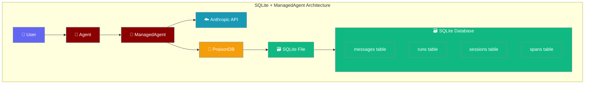

SQLite provides file-based persistence for ManagedAgent with zero external dependencies, making it perfect for local development and small-scale deployments.



## Quick Start

<Steps>
<Step title="Install Dependencies">
```bash
pip install praisonai anthropic
# SQLite is included with Python - no additional deps needed
```
</Step>

<Step title="Basic Example">
```python
from praisonai import Agent, ManagedAgent, ManagedConfig
from praisonaiagents import db

# Create managed agent with SQLite persistence
managed = ManagedAgent(
    config=ManagedConfig(
        name="SQLite Agent",
        model="claude-4o-mini",
        system="You are a helpful assistant with perfect memory.",
        tools=[{"type": "agent_toolset_20260401"}]
    ),
    db=db(database_url="sqlite:///agent_conversations.db")
)

# Use with Agent
agent = Agent(name="assistant", backend=managed)

# First interaction - teaching facts
result = agent.start("Remember these facts: My name is Alice, I'm a Python developer, and I love hiking.")
print(f"Agent: {result}")

print(f"Session ID: {managed.session_id}")
```
</Step>

<Step title="Database Verification">
```python
import sqlite3
import json

# Verify data was persisted
conn = sqlite3.connect("agent_conversations.db")
cursor = conn.cursor()

# Check tables exist
cursor.execute("SELECT name FROM sqlite_master WHERE type='table'")
tables = cursor.fetchall()
print(f"Tables: {[table[0] for table in tables]}")

# Check message count
cursor.execute("SELECT COUNT(*) FROM messages")
message_count = cursor.fetchone()[0]
print(f"Total messages: {message_count}")

# View recent messages
cursor.execute("""
    SELECT role, content, timestamp 
    FROM messages 
    ORDER BY timestamp DESC 
    LIMIT 5
""")
messages = cursor.fetchall()

print("\nRecent messages:")
for role, content, timestamp in messages:
    print(f"[{role}] {content[:50]}...")

conn.close()
```
</Step>

<Step title="Session Resume">
```python
# Save session ID and destroy instance
session_id = managed.session_id
del managed, agent

print(f"\n=== Resuming session {session_id} ===")

# Create new ManagedAgent instance
managed2 = ManagedAgent(
    config=ManagedConfig(
        model="claude-4o-mini",
        system="You are a helpful assistant with perfect memory."
    ),
    db=db(database_url="sqlite:///agent_conversations.db")
)

# Resume the previous session
managed2.resume_session(session_id)

# Create new Agent with resumed backend
agent2 = Agent(name="assistant", backend=managed2)

# Test memory recall
result = agent2.start("What's my name and what do I do for work?")
print(f"Agent: {result}")

# Should respond: "Your name is Alice and you're a Python developer"
```
</Step>
</Steps>

## Complete Example

```python
import sqlite3
import json
from datetime import datetime
from praisonai import Agent, ManagedAgent, ManagedConfig
from praisonaiagents import db

class SQLiteManagedExample:
    def __init__(self, db_path="managed_agent_memory.db"):
        self.db_path = db_path
        self.managed = None
        self.agent = None
        
    def setup_agent(self):
        """Initialize ManagedAgent with SQLite persistence."""
        self.managed = ManagedAgent(
            config=ManagedConfig(
                name="SQLite Memory Agent",
                model="claude-4o-mini",
                system="You are a personal assistant who remembers everything about our conversations.",
                tools=[{"type": "agent_toolset_20260401"}],
                packages={"pip": ["sqlite3"]}  # For database operations if needed
            ),
            db=db(database_url=f"sqlite:///{self.db_path}")
        )
        
        self.agent = Agent(
            name="personal_assistant", 
            backend=self.managed
        )
        
        print(f"✅ Agent created with SQLite DB: {self.db_path}")
        return self.managed.session_id
    
    def teach_facts(self):
        """Teach the agent some facts to remember."""
        facts = [
            "My favorite programming language is Python",
            "I work as a software engineer at TechCorp", 
            "My project deadline is next Friday",
            "I prefer morning meetings over afternoon ones"
        ]
        
        print("\n📚 Teaching facts to agent:")
        for i, fact in enumerate(facts, 1):
            result = self.agent.start(f"Remember this fact #{i}: {fact}")
            print(f"  {i}. Taught: {fact}")
            print(f"     Response: {result[:60]}...")
    
    def verify_database(self):
        """Verify data was persisted in SQLite."""
        print(f"\n🔍 Verifying SQLite database: {self.db_path}")
        
        conn = sqlite3.connect(self.db_path)
        cursor = conn.cursor()
        
        # Check schema
        cursor.execute("SELECT sql FROM sqlite_master WHERE type='table'")
        schemas = cursor.fetchall()
        print(f"📋 Database schema created with {len(schemas)} tables")
        
        # Check message count
        cursor.execute("SELECT COUNT(*) FROM messages")
        count = cursor.fetchone()[0]
        print(f"💬 Total messages persisted: {count}")
        
        # Show sample messages
        cursor.execute("""
            SELECT session_id, role, content, created_at
            FROM messages 
            WHERE role IN ('user', 'assistant')
            ORDER BY created_at DESC 
            LIMIT 3
        """)
        
        messages = cursor.fetchall()
        print(f"\n📝 Sample recent messages:")
        for session_id, role, content, created_at in messages:
            print(f"  [{role}] {content[:40]}...")
            
        conn.close()
        return count > 0
    
    def test_resume(self, session_id):
        """Test session resume with new instance."""
        print(f"\n🔄 Testing session resume...")
        
        # Destroy current instance
        del self.managed, self.agent
        
        # Create fresh instance
        managed2 = ManagedAgent(
            config=ManagedConfig(
                model="claude-4o-mini",
                system="You are a personal assistant who remembers everything about our conversations."
            ),
            db=db(database_url=f"sqlite:///{self.db_path}")
        )
        
        # Resume session
        managed2.resume_session(session_id)
        agent2 = Agent(name="personal_assistant", backend=managed2)
        
        # Test memory
        questions = [
            "What's my favorite programming language?",
            "Where do I work and what's my deadline?",
            "What's my meeting preference?"
        ]
        
        print(f"\n❓ Testing memory with questions:")
        for i, question in enumerate(questions, 1):
            result = agent2.start(question)
            print(f"  {i}. Q: {question}")
            print(f"     A: {result}")
            
        return managed2, agent2
    
    def run_example(self):
        """Run the complete SQLite + ManagedAgent example."""
        print("🚀 Starting SQLite + ManagedAgent Persistence Example")
        print("=" * 60)
        
        # Phase 1: Setup and teach
        session_id = self.setup_agent()
        self.teach_facts()
        
        # Phase 2: Verify persistence
        persistence_ok = self.verify_database()
        assert persistence_ok, "❌ Database persistence failed"
        
        # Phase 3: Test resume
        managed2, agent2 = self.test_resume(session_id)
        
        print(f"\n✅ Example completed successfully!")
        print(f"📊 Session ID: {session_id}")
        print(f"💾 Database: {self.db_path}")
        
        return managed2, agent2

if __name__ == "__main__":
    example = SQLiteManagedExample()
    managed, agent = example.run_example()
```

## Key Features

| Feature | Description | Implementation |
|---------|-------------|----------------|
| **Zero Dependencies** | No external database server required | Uses Python's built-in sqlite3 module |
| **File Persistence** | Data stored in single `.db` file | Portable across environments |
| **ACID Compliance** | Full transaction support | SQLite's built-in ACID guarantees |
| **Concurrent Access** | Multiple readers, single writer | SQLite's default locking mechanism |
| **Schema Migration** | Automatic table creation | PraisonDB handles schema setup |

## Configuration Options

```python
# Basic SQLite configuration
db_config = db(database_url="sqlite:///my_agent.db")

# SQLite with custom options
db_config = db(
    database_url="sqlite:///my_agent.db?timeout=20&check_same_thread=False",
    # Additional options
    pool_size=5,
    echo=False  # Set to True for SQL debugging
)

# In-memory SQLite (testing only)
db_config = db(database_url="sqlite:///:memory:")
```

## Production Considerations

<Note>
SQLite is perfect for development and small-scale production workloads with <100 concurrent users. For larger scales, consider PostgreSQL or MySQL.
</Note>

### Backup Strategy

```python
import shutil
from datetime import datetime

def backup_sqlite_db(db_path):
    """Create timestamped backup of SQLite database."""
    timestamp = datetime.now().strftime("%Y%m%d_%H%M%S")
    backup_path = f"{db_path}.backup_{timestamp}"
    shutil.copy2(db_path, backup_path)
    print(f"✅ Backup created: {backup_path}")
    return backup_path

# Usage
backup_path = backup_sqlite_db("agent_conversations.db")
```

### Monitoring

```python
def get_db_stats(db_path):
    """Get SQLite database statistics."""
    conn = sqlite3.connect(db_path)
    cursor = conn.cursor()
    
    stats = {}
    
    # Table sizes
    cursor.execute("""
        SELECT name, 
               COUNT(*) as row_count
        FROM sqlite_master 
        CROSS JOIN pragma_table_info(name) 
        WHERE type='table'
        GROUP BY name
    """)
    
    for table, count in cursor.fetchall():
        stats[f"{table}_rows"] = count
        
    # Database size
    cursor.execute("SELECT page_count * page_size as size FROM pragma_page_count(), pragma_page_size()")
    stats['db_size_bytes'] = cursor.fetchone()[0]
    
    conn.close()
    return stats

# Usage
stats = get_db_stats("agent_conversations.db")
print(f"Database stats: {stats}")
```

## Troubleshooting

<AccordionGroup>
<Accordion title="Database Locked Error">
```python
# If you get "database is locked" errors:
import sqlite3
import time

def safe_connect(db_path, retries=5):
    for i in range(retries):
        try:
            conn = sqlite3.connect(db_path, timeout=30)
            return conn
        except sqlite3.OperationalError as e:
            if "locked" in str(e) and i < retries - 1:
                time.sleep(1)
                continue
            raise
```
</Accordion>

<Accordion title="File Permission Issues">
```python
import os
import stat

def setup_db_permissions(db_path):
    """Ensure proper file permissions for SQLite database."""
    if os.path.exists(db_path):
        # Make sure file is readable and writable
        os.chmod(db_path, stat.S_IRUSR | stat.S_IWUSR | stat.S_IRGRP | stat.S_IROTH)
        print(f"✅ Set permissions for {db_path}")
```
</Accordion>

<Accordion title="Corrupt Database Recovery">
```python
def check_db_integrity(db_path):
    """Check SQLite database integrity."""
    conn = sqlite3.connect(db_path)
    cursor = conn.cursor()
    
    cursor.execute("PRAGMA integrity_check")
    result = cursor.fetchone()[0]
    
    if result == "ok":
        print("✅ Database integrity OK")
    else:
        print(f"❌ Database corruption detected: {result}")
        
    conn.close()
    return result == "ok"
```
</Accordion>
</AccordionGroup>