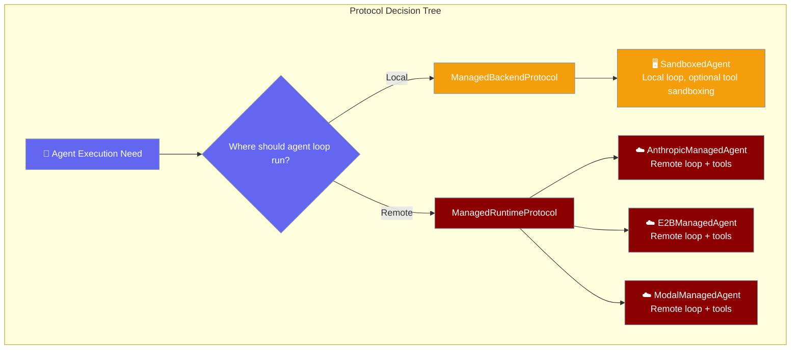
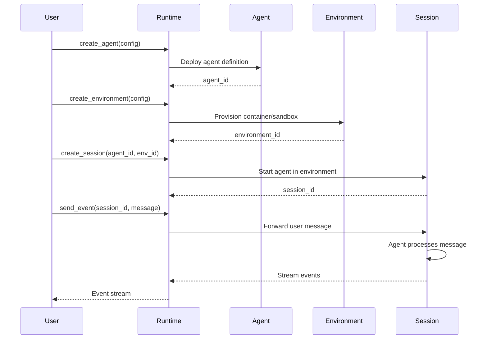

Managed Runtime Protocol defines the interface for remote agent execution where the entire agent loop runs on provider infrastructure.



## Quick Start

<Steps>
<Step title="Basic Lifecycle">
Create agent, environment, session, then send events and stream responses.

```python
from praisonai import AnthropicManagedAgent, ManagedConfig

runtime = AnthropicManagedAgent(config=ManagedConfig(
    model="claude-sonnet-4-6",
    system="You are a coding assistant.",
))

# Create infrastructure
agent_id = await runtime.create_agent(config)
env_id = await runtime.create_environment(config)
session_id = await runtime.create_session(agent_id, env_id)

# Send message and stream responses
await runtime.send_event(session_id, {
    "type": "user.message",
    "content": [{"type": "text", "text": "Hello!"}]
})

async for event in runtime.stream_events(session_id):
    if event["type"] == "agent.message":
        print(event["content"])
```
</Step>

<Step title="With Advanced Configuration">
Full configuration with packages, networking, and vaults.

```python
from praisonai import AnthropicManagedAgent, ManagedConfig, NetworkingConfig, PackagesConfig

runtime = AnthropicManagedAgent(config=ManagedConfig(
    model="claude-sonnet-4-6",
    system="You are a data analysis expert.",
    packages=PackagesConfig(
        pip=["pandas", "numpy", "matplotlib"],
        npm=["express"]
    ),
    networking=NetworkingConfig(
        type="limited",
        allowed_hosts=["api.example.com"],
        allow_mcp_servers=True
    ),
    vault_ids=["vault_github_123"]  # OAuth credentials
))

# Full lifecycle with session management
agent_id = await runtime.create_agent(config)
env_id = await runtime.create_environment(config) 
session_id = await runtime.create_session(agent_id, env_id)

await runtime.send_event(session_id, {
    "type": "user.message",
    "content": [{"type": "text", "text": "Analyze sales data from GitHub repo"}]
})

# Handle events
async for event in runtime.stream_events(session_id):
    if event["type"] == "agent.message":
        print(f"Agent: {event['content']}")
    elif event["type"] == "session.status_idle":
        break
```
</Step>
</Steps>

---

## How It Works



| Component | Responsibility | Location |
|-----------|---------------|----------|
| **Agent** | Model, system prompt, tool definitions | Remote provider |
| **Environment** | Runtime container, packages, networking | Remote provider |
| **Session** | Running instance of agent-in-environment | Remote provider |
| **Runtime** | Protocol implementation, API client | Local (your code) |

---

## Protocol Methods

### Agent Management

| Method | Purpose | Returns |
|--------|---------|---------|
| `create_agent(config)` | Deploy agent definition | `agent_id: str` |
| `retrieve_agent(agent_id)` | Get agent metadata | `Dict[str, Any]` |
| `list_agents(**filters)` | List all agents | `List[Dict[str, Any]]` |
| `archive_agent(agent_id)` | Mark agent inactive | `None` |

### Environment Management

| Method | Purpose | Returns |
|--------|---------|---------|
| `create_environment(config)` | Provision sandbox | `environment_id: str` |
| `retrieve_environment(env_id)` | Get environment metadata | `Dict[str, Any]` |
| `list_environments(**filters)` | List all environments | `List[Dict[str, Any]]` |
| `archive_environment(env_id)` | Mark environment inactive | `None` |
| `delete_environment(env_id)` | Destroy environment | `None` |

### Session Management

| Method | Purpose | Returns |
|--------|---------|---------|
| `create_session(agent_id, env_id)` | Start agent session | `session_id: str` |
| `retrieve_session(session_id)` | Get session status | `Dict[str, Any]` |
| `list_sessions(**filters)` | List all sessions | `List[Dict[str, Any]]` |
| `archive_session(session_id)` | Mark session inactive | `None` |
| `delete_session(session_id)` | Delete session data | `None` |

### Event Handling

| Method | Purpose | Returns |
|--------|---------|---------|
| `send_event(session_id, event)` | Send message to session | `None` |
| `stream_events(session_id)` | Stream responses | `AsyncIterator[Dict[str, Any]]` |
| `interrupt(session_id)` | Stop current processing | `None` |

---

## Common Patterns

### Multi-Turn Conversation

```python
# Create infrastructure once
agent_id = await runtime.create_agent(config)
env_id = await runtime.create_environment(config)
session_id = await runtime.create_session(agent_id, env_id)

# Multiple turns
for user_input in conversation:
    await runtime.send_event(session_id, {
        "type": "user.message",
        "content": [{"type": "text", "text": user_input}]
    })
    
    async for event in runtime.stream_events(session_id):
        if event["type"] == "agent.message":
            print(event["content"])
        elif event["type"] == "session.status_idle":
            break  # Ready for next input
```

### Agent Version Pinning

```python
# Pin to specific agent version
runtime = AnthropicManagedAgent(config=config)
runtime.agent_version = 5  # Use version 5

# Session will use pinned version
session_id = await runtime.create_session(agent_id, env_id)
```

### Session Cleanup

```python
# Archive preserves data but marks inactive
await runtime.archive_session(session_id)

# Delete removes all data permanently
await runtime.delete_session(session_id)

# List sessions with filters
active_sessions = await runtime.list_sessions(status="active")
archived_sessions = await runtime.list_sessions(status="archived")
```

---

## Best Practices

<AccordionGroup>
<Accordion title="Resource Management">
Create agents and environments once, reuse across sessions:

```python
# Create once
agent_id = await runtime.create_agent(config)
env_id = await runtime.create_environment(config)

# Reuse for multiple sessions
session1 = await runtime.create_session(agent_id, env_id)
session2 = await runtime.create_session(agent_id, env_id)
```
</Accordion>

<Accordion title="Error Handling">
Handle network failures and provider errors gracefully:

```python
try:
    await runtime.send_event(session_id, event)
except Exception as e:
    # Check if session still exists
    try:
        session = await runtime.retrieve_session(session_id)
        # Session exists, retry
    except:
        # Session lost, recreate
        session_id = await runtime.create_session(agent_id, env_id)
```
</Accordion>

<Accordion title="Event Processing">
Handle different event types appropriately:

```python
async for event in runtime.stream_events(session_id):
    match event["type"]:
        case "agent.message":
            handle_message(event["content"])
        case "agent.tool_use":
            handle_tool_call(event)
        case "session.status_idle":
            break  # Agent finished processing
        case "session.error":
            handle_error(event)
```
</Accordion>

<Accordion title="Performance Optimization">
- Reuse agent/environment definitions across sessions
- Use appropriate session cleanup (archive vs delete)
- Pin agent versions for consistent behavior
- Filter list operations to reduce API calls
</Accordion>
</AccordionGroup>

---

## Related

<CardGroup cols={2}>
<Card title="Sandboxed Agent" icon="sandbox" href="/docs/features/sandboxed-agent">
  Local agent loop with optional tool sandboxing
</Card>
<Card title="Managed Agent Lifecycle" icon="recycle" href="/docs/features/managed-agent-lifecycle">
  Complete CRUD operations for agents, environments, sessions
</Card>
</CardGroup>