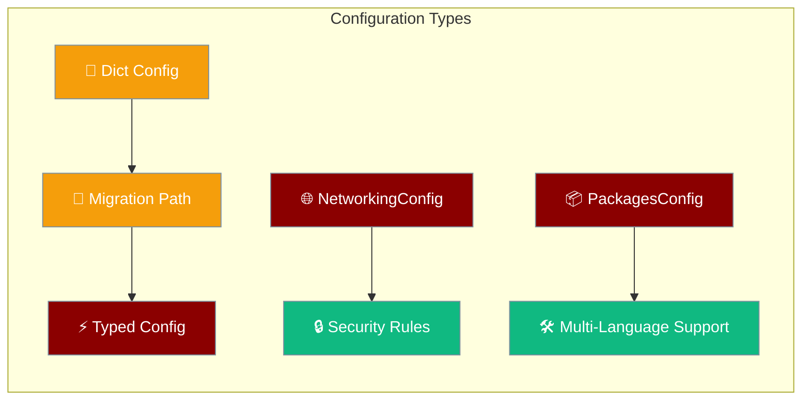
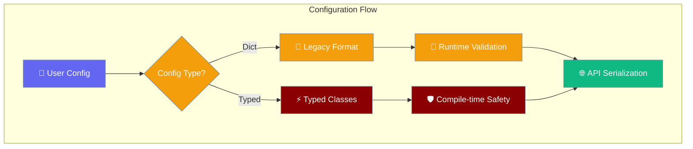

Typed configuration classes provide type safety and validation for networking and package management in managed environments.



## Quick Start

<Steps>
<Step title="NetworkingConfig Usage">
Configure network access with type safety.

```python
from praisonai import ManagedConfig, NetworkingConfig, NetworkingType

# Unrestricted networking (default)
config = ManagedConfig(
    networking=NetworkingConfig(
        type=NetworkingType.UNRESTRICTED
    )
)

# Limited networking with allowed hosts
config = ManagedConfig(
    networking=NetworkingConfig(
        type=NetworkingType.LIMITED,
        allowed_hosts=["api.openai.com", "github.com"],
        allow_mcp_servers=True,
        allow_package_managers=False
    )
)
```
</Step>

<Step title="PackagesConfig Usage">
Configure package dependencies for all supported managers.

```python
from praisonai import ManagedConfig, PackagesConfig

config = ManagedConfig(
    packages=PackagesConfig(
        pip=["pandas", "numpy", "matplotlib"],
        npm=["express", "lodash"],
        apt=["curl", "git", "vim"],
        cargo=["serde", "tokio"],
        gem=["rails", "sinatra"],
        go=["github.com/gin-gonic/gin"]
    )
)

# Convert to dict for API serialization
packages_dict = config.packages.to_dict()
# Result: {"pip": ["pandas", "numpy", "matplotlib"], "npm": ["express", "lodash"], ...}
```
</Step>
</Steps>

---

## How It Works



---

## NetworkingConfig

### Configuration Options

| Option | Type | Default | Description |
|--------|------|---------|-------------|
| `type` | `NetworkingType` | `UNRESTRICTED` | Network access level |
| `allowed_hosts` | `Optional[List[str]]` | `None` | Permitted hostnames for LIMITED type |
| `allow_mcp_servers` | `bool` | `True` | Allow MCP server connections |
| `allow_package_managers` | `bool` | `True` | Allow package manager access |

### NetworkingType Enum

```python
from praisonai import NetworkingType

# Available types
NetworkingType.UNRESTRICTED  # Full internet access
NetworkingType.LIMITED       # Restricted to allowed_hosts
```

### Examples

```python
# Unrestricted networking
net = NetworkingConfig(type=NetworkingType.UNRESTRICTED)

# Production-safe limited networking  
net = NetworkingConfig(
    type=NetworkingType.LIMITED,
    allowed_hosts=[
        "api.openai.com",
        "api.anthropic.com", 
        "github.com",
        "pypi.org"
    ],
    allow_mcp_servers=True,
    allow_package_managers=True
)

# Minimal networking (MCP and packages only)
net = NetworkingConfig(
    type=NetworkingType.LIMITED,
    allowed_hosts=[],
    allow_mcp_servers=True,
    allow_package_managers=True
)
```

---

## PackagesConfig

### Configuration Options

| Package Manager | Type | Default | Description |
|----------------|------|---------|-------------|
| `pip` | `Optional[List[str]]` | `None` | Python packages |
| `npm` | `Optional[List[str]]` | `None` | Node.js packages |
| `apt` | `Optional[List[str]]` | `None` | Debian/Ubuntu system packages |
| `cargo` | `Optional[List[str]]` | `None` | Rust packages |
| `gem` | `Optional[List[str]]` | `None` | Ruby packages |
| `go` | `Optional[List[str]]` | `None` | Go modules |

### Examples

```python
# Data science environment
pkg = PackagesConfig(
    pip=["pandas", "numpy", "scikit-learn", "jupyter"],
    apt=["build-essential", "git"]
)

# Full-stack development
pkg = PackagesConfig(
    pip=["flask", "requests"],
    npm=["express", "react", "typescript"],
    apt=["curl", "git", "nginx"]
)

# Multi-language project
pkg = PackagesConfig(
    pip=["requests"],
    npm=["lodash"],
    cargo=["serde"],
    gem=["rails"],
    go=["github.com/gin-gonic/gin"],
    apt=["git", "build-essential"]
)

# Serialize for API
api_dict = pkg.to_dict()
```

---

## Common Patterns

### Migration from Dict Config

```python
# Old dict-based config (still works)
config_old = ManagedConfig(
    networking={"type": "limited", "allowed_hosts": ["api.openai.com"]},
    packages={"pip": ["pandas"], "npm": ["express"]}
)

# New typed config (recommended)
config_new = ManagedConfig(
    networking=NetworkingConfig(
        type=NetworkingType.LIMITED,
        allowed_hosts=["api.openai.com"]
    ),
    packages=PackagesConfig(
        pip=["pandas"],
        npm=["express"]
    )
)
```

### Environment-Specific Configurations

```python
def get_networking_config(env: str) -> NetworkingConfig:
    if env == "production":
        return NetworkingConfig(
            type=NetworkingType.LIMITED,
            allowed_hosts=["api.company.com"],
            allow_mcp_servers=False
        )
    elif env == "staging":
        return NetworkingConfig(
            type=NetworkingType.LIMITED,
            allowed_hosts=["api.company.com", "staging.api.com"],
            allow_mcp_servers=True
        )
    else:  # development
        return NetworkingConfig(type=NetworkingType.UNRESTRICTED)

# Use in config
config = ManagedConfig(
    networking=get_networking_config("production")
)
```

### Package Templates

```python
class PackageTemplates:
    @staticmethod
    def data_science() -> PackagesConfig:
        return PackagesConfig(
            pip=["pandas", "numpy", "matplotlib", "seaborn", "jupyter"],
            apt=["build-essential"]
        )
    
    @staticmethod
    def web_development() -> PackagesConfig:
        return PackagesConfig(
            npm=["express", "react", "typescript"],
            pip=["flask", "requests"],
            apt=["nginx", "curl"]
        )
    
    @staticmethod
    def machine_learning() -> PackagesConfig:
        return PackagesConfig(
            pip=["torch", "transformers", "scikit-learn", "datasets"],
            apt=["build-essential", "git-lfs"]
        )

# Use templates
config = ManagedConfig(
    packages=PackageTemplates.data_science()
)
```

---

## Best Practices

<AccordionGroup>
<Accordion title="Security Configuration">
Use LIMITED networking in production environments:

```python
# Production: Restrictive networking
prod_net = NetworkingConfig(
    type=NetworkingType.LIMITED,
    allowed_hosts=["essential-api.com"],
    allow_mcp_servers=False,  # Disable if not needed
    allow_package_managers=True  # Keep for dependency installation
)
```
</Accordion>

<Accordion title="Package Management">
Organize packages logically and minimize dependencies:

```python
# Good: Minimal, specific packages
pkg = PackagesConfig(
    pip=["requests", "pydantic"],  # Only what's needed
    apt=["git"]  # Essential tools only
)

# Avoid: Large, unfocused package lists
# pkg = PackagesConfig(pip=["pandas", "torch", "flask", ...])  # Too broad
```
</Accordion>

<Accordion title="Backward Compatibility">
Both dict and typed configs work seamlessly:

```python
# Legacy dict format still supported
config = ManagedConfig(
    networking={"type": "unrestricted"},
    packages={"pip": ["pandas"]}
)

# Typed format provides better IDE support and validation
config = ManagedConfig(
    networking=NetworkingConfig(type=NetworkingType.UNRESTRICTED),
    packages=PackagesConfig(pip=["pandas"])
)
```
</Accordion>

<Accordion title="Type Safety Benefits">
- **IDE Support**: Auto-completion and type checking
- **Runtime Validation**: Early error detection
- **API Compatibility**: Seamless serialization with `to_dict()`
- **Documentation**: Self-documenting configuration structure
</Accordion>
</AccordionGroup>

---

## Related

<CardGroup cols={2}>
<Card title="Managed Vault" icon="key" href="/docs/features/managed-vault">
  OAuth credentials management for managed agents
</Card>
<Card title="Sandboxed Agent" icon="sandbox" href="/docs/features/sandboxed-agent">
  Local agent loop with configurable tool sandboxing
</Card>
</CardGroup>