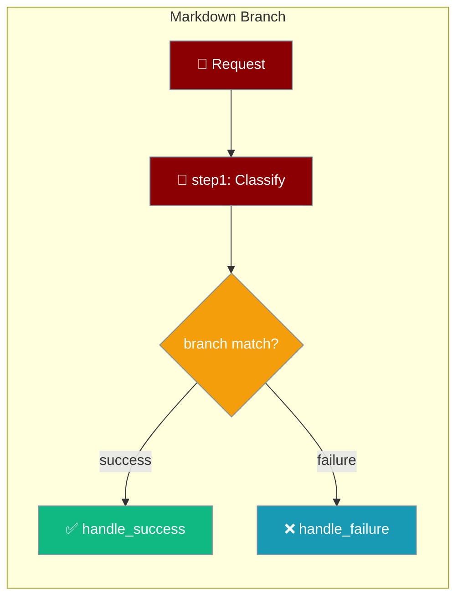
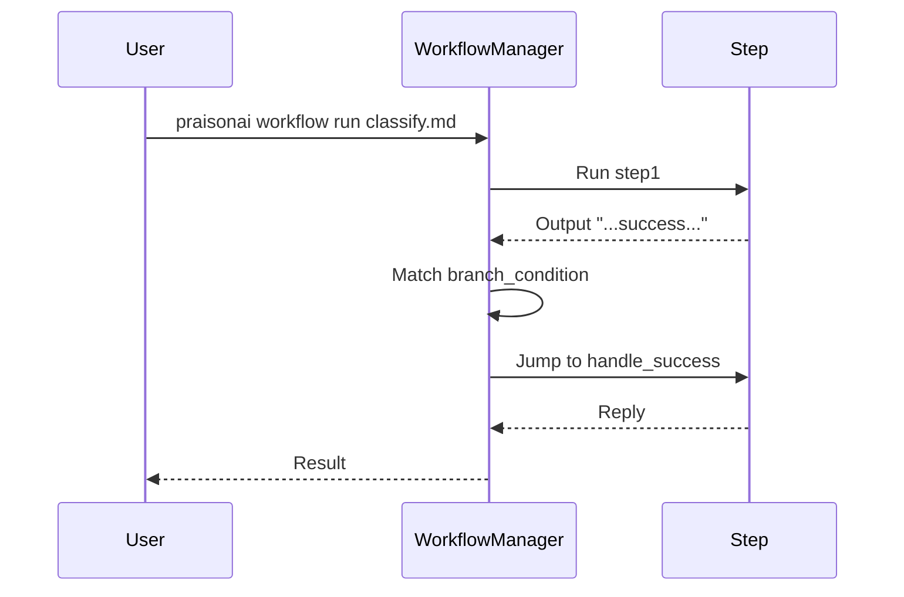

Markdown workflows branch on any step's output — jump to a labelled step instead of running linearly.



## Quick Start

<Steps>
<Step title="Write a branching workflow">

````markdown .praisonai/workflows/classify.md
---
name: classify
---

## step1
Classify the request as success or failure.

```branch
success: [handle_success]
failure: [handle_failure]
```

## handle_failure
Escalate the request.

## handle_success
Reply to the request.
````

</Step>

<Step title="Run it">

```bash
praisonai workflow run .praisonai/workflows/classify.md
```

When `step1`'s output contains `success`, execution jumps to `handle_success` and skips `handle_failure`.

</Step>
</Steps>

---

## How It Works

`WorkflowManager` evaluates each step's `branch_condition` against that step's output, then jumps to the first matching next step.



| Concept | Where it lives | Behavior |
|---------|----------------|----------|
| `branch` block | Fenced block under a step | Maps a match value → `[next_steps]` |
| `next_steps` | Frontmatter key | Steps to run if no branch matches |
| Match rule | Step output | First key found in the output wins |

---

## Configuration Options

| Option | Form | Description |
|--------|------|-------------|
| ` ```branch ` | Fenced block | Dict of `match: [next_steps]` |
| `next_steps:` | Frontmatter key | Fallback next steps if no branch matches |
| `Task(routing=...)` | Python | Equivalent via `TaskRoutingConfig(branches=..., next_steps=...)` |

**Equivalent Python:**

```python
from praisonaiagents import Task
from praisonaiagents.workflows.workflow_configs import TaskRoutingConfig

Task(
    name="step1",
    description="Classify the request",
    routing=TaskRoutingConfig(
        branches={"success": ["handle_success"], "failure": ["handle_failure"]},
    ),
)
```

---

## Common Patterns

**Success/failure classifier** — jump to a handler based on outcome:

````markdown
## step1
Classify as success or failure.

```branch
success: [handle_success]
failure: [handle_failure]
```
````

**Score-based fanout** — route on a threshold match in the output:

````markdown
## score
Score the submission and state "premium" or "standard".

```branch
premium: [premium_path]
standard: [standard_path]
```
````

**No-op fallback** — when nothing matches, execution continues linearly to the next step, so a missing branch never stalls the workflow.

---

## Best Practices

<AccordionGroup>
<Accordion title="Name branch targets after real steps">
Every value in a `branch` block must reference an existing `## step`. Undefined targets are skipped.
</Accordion>

<Accordion title="Make the match value explicit in step output">
Instruct the step to state the match keyword clearly ("Reply with success or failure") so the branch matches reliably.
</Accordion>

<Accordion title="Keep one branch block per step">
Use a single `branch` block per step for a clear one-to-many jump. Use `next_steps` frontmatter for the default path.
</Accordion>
</AccordionGroup>

---

## Related

<CardGroup cols={2}>
  <Card title="Conditional Execution" icon="code-branch" href="/features/conditions">
    Task when / then_task / else_task syntax
  </Card>
  <Card title="YAML Workflows" icon="file-code" href="/features/yaml-workflows">
    Full YAML workflow reference
  </Card>
  <Card title="Workflow Routing" icon="diagram-project" href="/features/workflow-routing">
    Python AgentFlow routing
  </Card>
  <Card title="Tasks" icon="list-check" href="/concepts/tasks">
    Task fields reference
  </Card>
</CardGroup>
