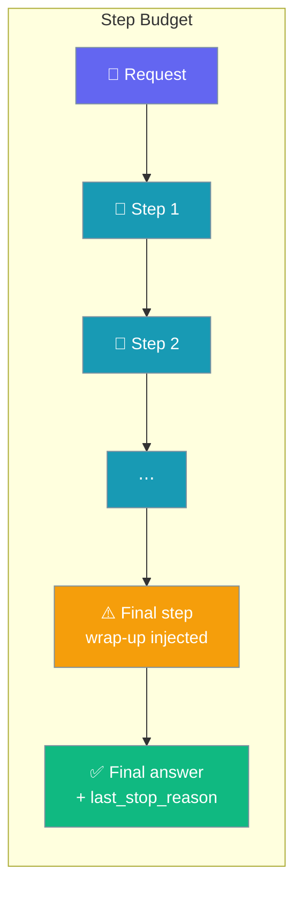
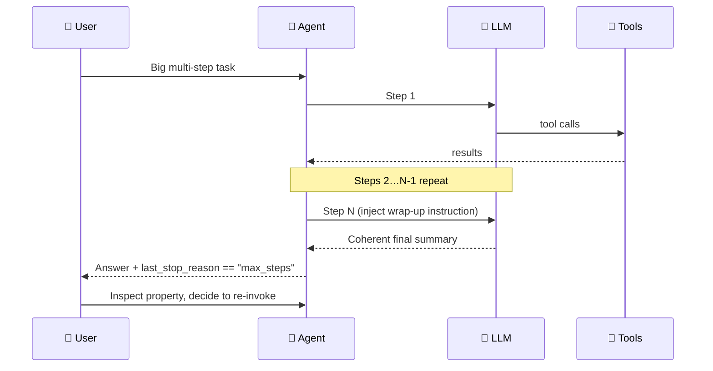
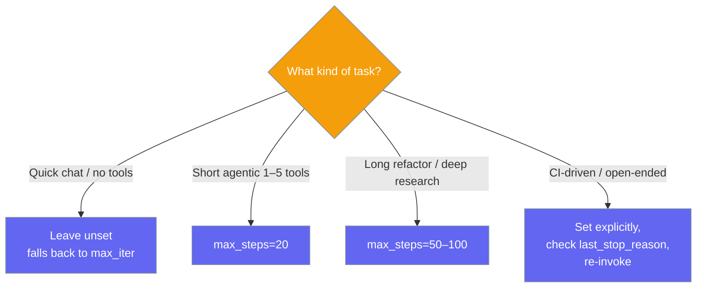

Cap how many tool-use steps an agent may take before wrapping up with its best final answer.



`max_steps` is the unified outer-loop step budget honoured identically by both tool-execution loops (OpenAI-native and LiteLLM). On the final permitted step the model is asked to wrap up, so you get a coherent answer instead of a hard cut.

## Quick Start

<Steps>
<Step title="Raise the budget with a scalar">

```python
from praisonaiagents import Agent, ExecutionConfig

agent = Agent(
    name="coder",
    instructions="You are a coding assistant.",
    execution=ExecutionConfig(max_steps=50),
)

result = agent.start("Refactor the auth module across all files")
```

</Step>

<Step title="Detect truncation with last_stop_reason">

```python
from praisonaiagents import Agent, ExecutionConfig

agent = Agent(
    name="coder",
    instructions="You are a coding assistant.",
    execution=ExecutionConfig(max_steps=50),
)

result = agent.start("Refactor the auth module across all files")

if agent.last_stop_reason == "max_steps":
    # Truncated — the wrap-up answer summarises progress. Re-invoke to continue.
    print("Run truncated, continuing…")
    result = agent.start("Continue from where you left off.")
elif agent.last_stop_reason == "completed":
    print("Done:", result)
```

</Step>
</Steps>

---

## How It Works



On the final permitted step both loops inject an internal user-role message so the model produces a coherent final answer:

> "You are approaching the maximum number of tool-use steps for this task. Stop calling tools now and provide your best final answer, summarising the work completed so far and clearly noting anything left incomplete."

The wrap-up message works on a local copy of the conversation, so it never leaks into the caller's history.

| `last_stop_reason` | Meaning |
|---|---|
| `"completed"` | Task finished normally (also the default before the first run) |
| `"max_steps"` | The `max_steps` budget was reached and the run was truncated |
| `"error"` | The loop stopped because of an error |

---

## Choosing a Value



---

## Configuration Options

<Card icon="code" href="/docs/sdk/reference/python/ExecutionConfig">
  Full list of options, types, and defaults — `ExecutionConfig`
</Card>

| Option | Type | Default | Description |
|---|---|---|---|
| `max_steps` | `Optional[int]` | `None` | Unified outer-loop step budget honoured by both tool-execution loops. `None` → fall back to `max_iter`. Must be `>= 1` when set. |
| `max_iter` | `int` | `20` | Legacy per-loop iteration cap. Still used when `max_steps` is unset. |
| `max_tool_calls_per_turn` | `int` | `10` | Cap on tool calls within a **single** LLM response (parallel-tool guardrail). Independent of `max_steps`. |

Two helpers resolve the effective values:

| Helper | Returns |
|---|---|
| `ExecutionConfig.resolved_max_steps()` | `max_steps` when set, else `max_iter` |
| `ExecutionConfig.resolved_max_tool_calls()` | `max_tool_calls_per_turn` (independent of `max_steps`) |

### How it relates to `max_tool_calls_per_turn`

`max_steps` bounds **outer-loop iterations** — one LLM round-trip each. `max_tool_calls_per_turn` caps **how many tool calls the model can fire inside one response**. They are independent on purpose: if they were coupled, a single parallel-tool response could exhaust the whole step budget (e.g. `max_steps=5` truncating after one round of 5 parallel calls). Set them separately when you need both a long overall budget and a small per-turn burst.

<Note>
Safe to read on any agent, including LiteLLM-only ones — reading `agent.last_stop_reason` never lazily creates the OpenAI client. Returns `"completed"` by default when no run has finished yet.
</Note>

---

## Common Patterns

### Pattern 1 — Raise the budget for long runs

```python
from praisonaiagents import Agent, ExecutionConfig

agent = Agent(
    name="coder",
    instructions="Refactor the auth module across all files",
    execution=ExecutionConfig(max_steps=50),
)
result = agent.start("Refactor the auth module across all files")
```

### Pattern 2 — Detect and continue after truncation

```python
from praisonaiagents import Agent, ExecutionConfig

agent = Agent(
    name="coder",
    instructions="You are a coding assistant.",
    execution=ExecutionConfig(max_steps=50),
)

result = agent.start("Refactor the auth module across all files")

while agent.last_stop_reason == "max_steps":
    result = agent.start("Continue from where you left off.")

print(result)
```

### Pattern 3 — Independent per-turn guardrail

```python
from praisonaiagents import Agent, ExecutionConfig

agent = Agent(
    name="researcher",
    execution=ExecutionConfig(
        max_steps=50,              # outer-loop budget
        max_tool_calls_per_turn=5, # parallel-tool guardrail per LLM response
    ),
)
```

---

## Best Practices

<AccordionGroup>
<Accordion title="Set an explicit budget for long agentic runs">
The default (20, via `max_iter`) is fine for short tasks but truncates deep refactors and multi-step research. Raise `max_steps` to `50–100` for those.
</Accordion>

<Accordion title="Branch on last_stop_reason, not on message content">
Check `agent.last_stop_reason == "max_steps"` instead of parsing the answer text. The old magic `"Tool call limit reached"` string is now suppressed when a genuine final answer exists.
</Accordion>

<Accordion title="Keep max_tool_calls_per_turn independent">
`max_steps` and `max_tool_calls_per_turn` govern different things — a per-turn cap of 5 does not halve your step budget. Coupling them would let one parallel-tool response exhaust the whole budget.
</Accordion>

<Accordion title="max_steps is validated at construction">
`max_steps` must be `>= 1` when set, otherwise `ExecutionConfig` raises `ValueError`. Catch it in config-driven setups.
</Accordion>
</AccordionGroup>

---

## Related

<CardGroup cols={2}>
<Card title="Execution" icon="play" href="/docs/features/execution">
  Iteration limits, retries, rate limiting, and code execution
</Card>
<Card title="Error Handling" icon="shield-alert" href="/docs/features/error-handling">
  Catch and recover from agent, tool, and LLM errors
</Card>
<Card title="Turn Completion Notes" icon="flag" href="/features/turn-completion-notes">
  Surface the reason to chat users when a turn hits the step limit
</Card>
</CardGroup>
