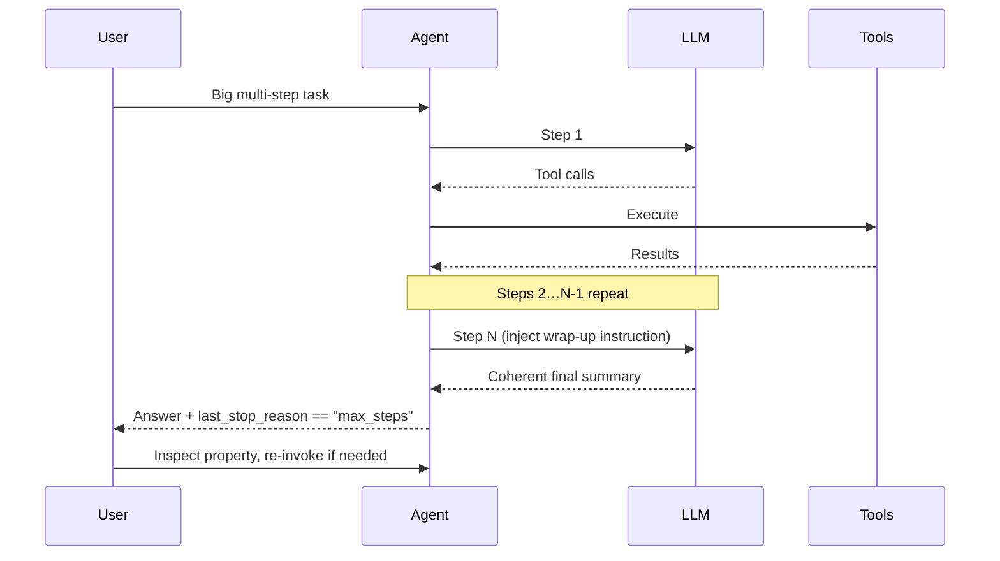
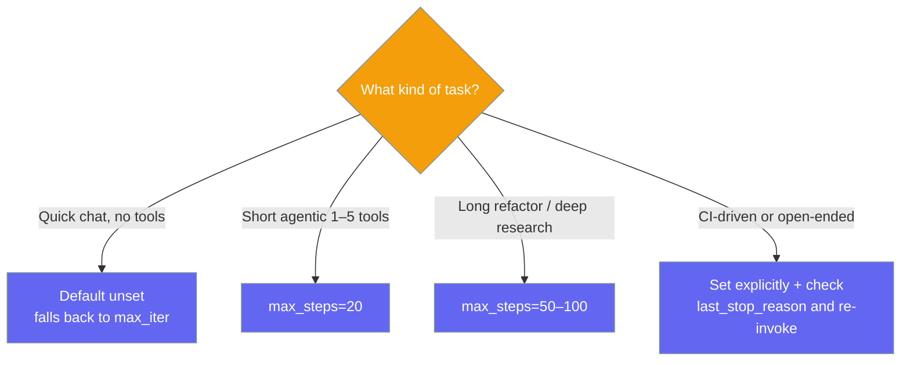

Cap how many tool-use steps an agent may take before wrapping up with its best final answer.


`max_steps` is a single, unified knob honoured identically by both tool-execution loops (OpenAI-native and LiteLLM). On the final permitted step the agent asks the model to wrap up, so you always get a coherent answer instead of a hard cut.

## Quick Start

<Steps>
<Step title="Raise the budget">
```python
from praisonaiagents import Agent, ExecutionConfig

agent = Agent(
    name="coder",
    instructions="Refactor the auth module across all files",
    execution=ExecutionConfig(max_steps=50),
)

result = agent.start("Refactor the auth module across all files")
```
</Step>

<Step title="Detect truncation">
```python
from praisonaiagents import Agent, ExecutionConfig

agent = Agent(
    name="coder",
    instructions="You are a coding assistant.",
    execution=ExecutionConfig(max_steps=50),
)

result = agent.start("Refactor the auth module across all files")

if agent.last_stop_reason == "max_steps":
    print("Run truncated, continuing…")
    result = agent.start("Continue from where you left off.")
elif agent.last_stop_reason == "completed":
    print("Done:", result)
```
</Step>
</Steps>

---

## How It Works

On the final permitted step, the agent injects an internal wrap-up instruction so the model returns a coherent summary rather than being hard-cut. This message works on a local copy of the conversation, so it never leaks into your history.



`agent.last_stop_reason` returns a structured value so you branch on truncation instead of parsing text:

| Value | Meaning |
|---|---|
| `"completed"` | Task finished normally (also the default before the first run). |
| `"max_steps"` | The `max_steps` budget was reached and the run was truncated. |
| `"error"` | The loop stopped because of an error. |

---

## Choosing a Value



---

## Configuration Options

| Option | Type | Default | Description |
|---|---|---|---|
| `max_steps` | `Optional[int]` | `None` | Unified outer-loop step budget honoured by both tool-execution loops. `None` → fall back to `max_iter`. Must be `>= 1` when set. |
| `max_iter` | `int` | `20` | Legacy per-loop iteration cap. Still used when `max_steps` is unset. |
| `max_tool_calls_per_turn` | `int` | `10` | Cap on tool calls within a **single** LLM response (parallel-tool guardrail). Independent of `max_steps`. |

`ExecutionConfig` provides two resolver helpers: `resolved_max_steps()` returns `max_steps` when set, else `max_iter`; `resolved_max_tool_calls()` returns the per-turn guardrail, which stays independent of the step budget.

---

## Common Patterns

### Simple — raise the budget
```python
from praisonaiagents import Agent, ExecutionConfig

agent = Agent(
    name="coder",
    instructions="Refactor the auth module across all files",
    execution=ExecutionConfig(max_steps=50),
)
agent.start("Refactor the auth module across all files")
```

### Detect and continue a truncated run
```python
from praisonaiagents import Agent, ExecutionConfig

agent = Agent(
    name="coder",
    instructions="You are a coding assistant.",
    execution=ExecutionConfig(max_steps=50),
)

result = agent.start("Refactor the auth module across all files")

while agent.last_stop_reason == "max_steps":
    result = agent.start("Continue from where you left off.")

print(result)
```

### Independent per-turn guardrail
```python
from praisonaiagents import Agent, ExecutionConfig

agent = Agent(
    name="researcher",
    execution=ExecutionConfig(
        max_steps=50,              # outer-loop budget
        max_tool_calls_per_turn=5, # parallel-tool guardrail per LLM response
    ),
)
```

---

## Best Practices

<AccordionGroup>
<Accordion title="Set an explicit budget for long agentic runs">
The default (`20`) is fine for short tasks but truncates deep refactors and long research. Set `max_steps=50–100` for those.
</Accordion>

<Accordion title="Branch on last_stop_reason, not message content">
Check `agent.last_stop_reason == "max_steps"` to detect truncation. The wrap-up now produces a genuine final answer, so string-matching magic phrases is unreliable.
</Accordion>

<Accordion title="Keep max_tool_calls_per_turn independent">
`max_steps` bounds outer-loop iterations; `max_tool_calls_per_turn` caps parallel tool calls within one LLM response. A per-turn cap of `5` does **not** halve your step budget.
</Accordion>

<Accordion title="max_steps is validated at construction">
`max_steps` must be `>= 1` when set, otherwise `ExecutionConfig` raises `ValueError`. Catch it in config-driven setups where the value comes from user input.
</Accordion>
</AccordionGroup>

---

## Related

<CardGroup cols={2}>
<Card icon="play" href="/docs/features/execution">
  Execution — iteration limits, retries, and rate limiting
</Card>
<Card icon="triangle-exclamation" href="/docs/features/error-handling">
  Error Handling — detect and recover from failures
</Card>
</CardGroup>
