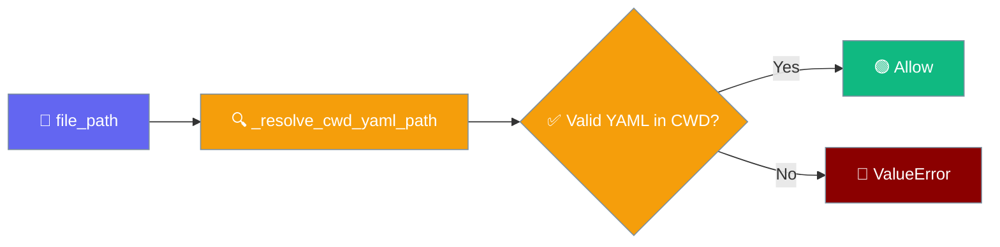
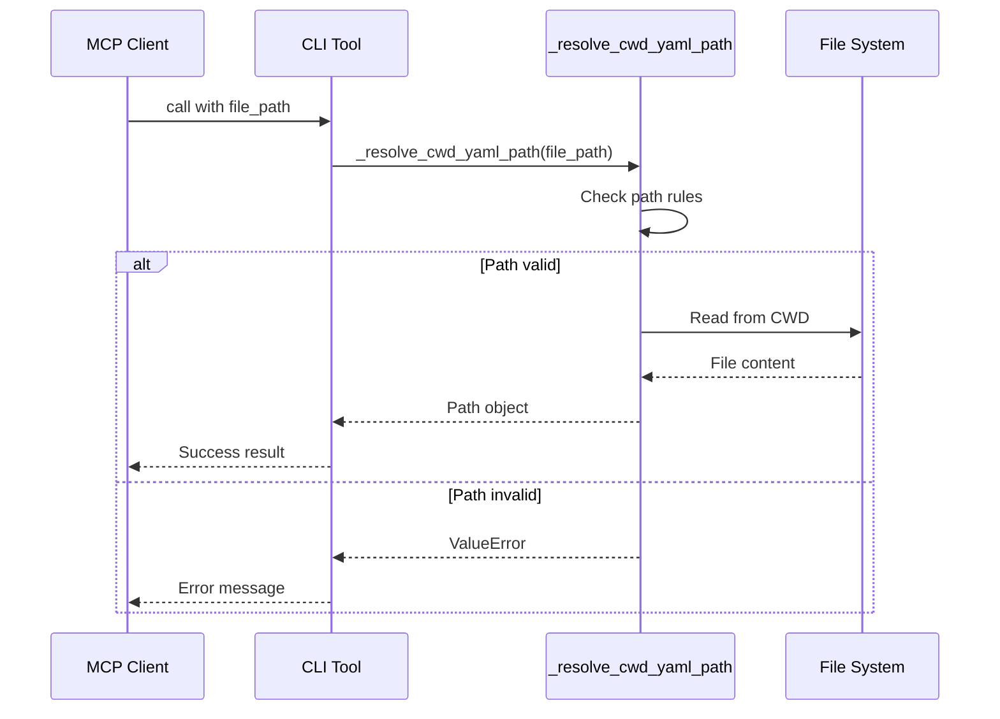

```python
from praisonaiagents import Agent

agent = Agent(name="safe-agent", instructions="Use MCP tools with path safety checks.")
agent.start("Read the file at /home/user/docs/report.txt safely.")
```


Workflow and deploy MCP tools accept only YAML files inside the current working directory for security.



## Quick Start

<Steps>
<Step title="Valid Usage">
```python
# MCP tools accept bare YAML filenames
workflow_validate("project.yaml")  # ✅ Works
workflow_show("config.yml")        # ✅ Works
deploy_validate("deploy.yaml")     # ✅ Works
```
</Step>

<Step title="Rejected Usage">
```python
# These paths are rejected for security
workflow_validate("../config.yaml")     # ❌ ValueError
workflow_validate("/etc/passwd")        # ❌ ValueError
workflow_validate("subdir/file.yaml")   # ❌ ValueError
```
</Step>
</Steps>

---

## How It Works

Three MCP tools now enforce strict path validation:

| Tool | Purpose | Path Requirement |
|------|---------|-----------------|
| `workflow_validate` | Validate workflow YAML | Bare filename in CWD |
| `workflow_show` | Display workflow content | Bare filename in CWD |
| `deploy_validate` | Validate deployment config | Bare filename in CWD |



---

## What Gets Refused

<Warning>
**Breaking Change**: Absolute paths and outside-CWD paths that previously worked are now rejected.
</Warning>

| Path Pattern | Example | Error Message |
|-------------|---------|---------------|
| Contains `/` or `\` | `subdir/file.yaml` | `invalid file_path: 'subdir/file.yaml'` |
| Contains NUL byte | `file\x00.yaml` | `invalid file_path: 'file\x00.yaml'` |
| Starts with `.` | `.hidden.yaml` | `invalid file_path: '.hidden.yaml'` |
| Not YAML extension | `config.json` | `file_path must be a .yaml or .yml file` |
| Absolute path | `/etc/passwd` | `invalid file_path: '/etc/passwd'` |
| Parent directory | `../config.yaml` | `invalid file_path: '../config.yaml'` |
| Resolves outside CWD | `symlink.yaml` → `../outside.yaml` | `invalid file_path: 'symlink.yaml'` |

---

## Migration

If you previously used these MCP tools with absolute paths or subdirectory paths:

<Steps>
<Step title="Move Files to CWD">
```bash
# Before (worked previously)
workflow_validate("/home/user/project/workflows/main.yaml")
workflow_validate("workflows/deploy.yaml")

# After (required now)
cp /home/user/project/workflows/main.yaml ./main.yaml
cp workflows/deploy.yaml ./deploy.yaml
workflow_validate("main.yaml")
workflow_validate("deploy.yaml")
```
</Step>

<Step title="Update Tool Calls">
```python
# Before
deploy_validate("configs/production.yaml")

# After  
deploy_validate("production.yaml")  # file must be in CWD
```
</Step>
</Steps>

---

## Common Patterns

### Workflow Management

```python
# Validate workflow in current directory
result = workflow_validate("workflow.yaml")
if "valid" in result:
    content = workflow_show("workflow.yaml")
    print(content)
```

### Deployment Validation

```python
# Check deployment config
result = deploy_validate("deploy.yml") 
if "valid" in result:
    print("Deployment config is valid")
else:
    print(f"Validation failed: {result}")
```

### Error Handling

```python
try:
    content = workflow_show("../outside.yaml")
except Exception as e:
    print(f"Error: {e}")
    # Error: invalid file_path: '../outside.yaml'
```

---

## Best Practices

<AccordionGroup>
<Accordion title="Keep YAML Files in Project Root">
Place workflow and deployment YAML files in the project root directory, not in subdirectories. This matches the MCP security model.
</Accordion>

<Accordion title="Use Descriptive Filenames">
Since you can't use paths, use descriptive filenames like `production-deploy.yaml` instead of `deploy/production.yaml`.
</Accordion>

<Accordion title="Validate Before Use">
Always call the validation tools before processing YAML files to catch configuration errors early.
</Accordion>

<Accordion title="Handle Errors Gracefully">
Check for ValueError exceptions and provide helpful error messages to users when paths are rejected.
</Accordion>
</AccordionGroup>

---

## Related

<CardGroup cols={2}>
  <Card title="MCP Integration" icon="plug" href="/docs/features/load-mcp-tools">
    Learn about MCP protocol support
  </Card>
  <Card title="CLI Tools" icon="terminal" href="/docs/cli/cli">
    PraisonAI CLI command reference
  </Card>
</CardGroup>