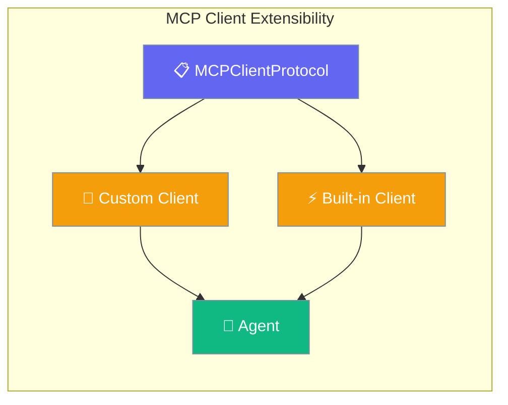
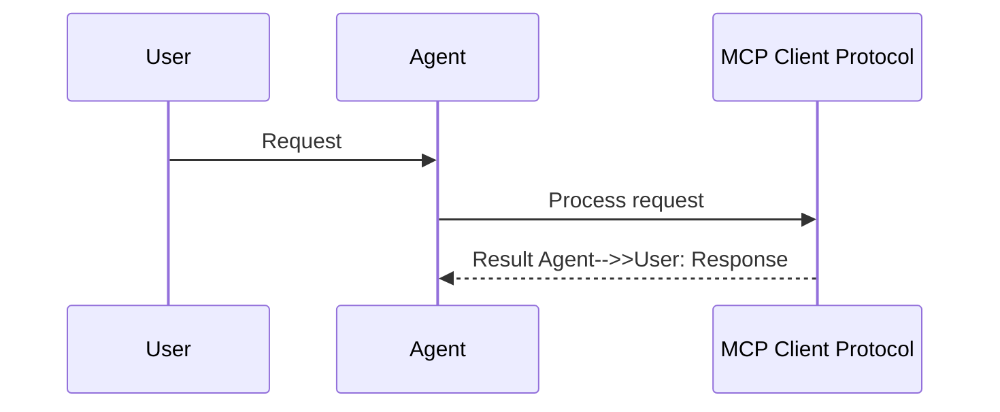

The `MCPClientProtocol` interface enables custom MCP client implementations while maintaining compatibility with the PraisonAI agent system.

```python
from praisonaiagents import Agent

agent = Agent(name="Custom MCP", instructions="Use tools from a custom MCP client implementation.")
agent.start("List available tools and call the safest read-only one.")
```

The user plugs in a custom MCP client; the agent discovers and calls tools through the protocol contract.



## How It Works




## Quick Start

<Steps>
<Step title="Implement Protocol">
Create a custom MCP client that follows the protocol:
```python
from praisonaiagents.mcp import MCPClientProtocol
from typing import Any, Dict, List

class MyCustomMCPClient:
    def list_tools(self) -> List[Dict[str, Any]]:
        return [
            {
                "name": "my_tool",
                "description": "Custom tool implementation",
                "inputSchema": {
                    "type": "object",
                    "properties": {
                        "message": {"type": "string"}
                    },
                    "required": ["message"]
                }
            }
        ]
    
    def get_tools(self) -> List[Dict[str, Any]]:
        return self.list_tools()
    
    def call_tool(self, name: str, args: Dict[str, Any]) -> Any:
        if name == "my_tool":
            return f"Custom response: {args.get('message', '')}"
        raise ValueError(f"Unknown tool: {name}")
    
    def shutdown(self) -> None:
        print("Custom client shutting down")

# Verify protocol compliance
assert isinstance(MyCustomMCPClient(), MCPClientProtocol)
```
</Step>

<Step title="Use with Agent">
Wire your custom client into an agent:
```python
from praisonaiagents import Agent

custom_client = MyCustomMCPClient()
agent = Agent(
    name="custom-client-test",
    instructions="Use the custom MCP client",
    tools=custom_client
)

agent.start("Use my_tool to say hello")
```
</Step>
</Steps>

---

## Protocol Methods

| Method | Sync | Async | Description |
|--------|------|-------|-------------|
| `list_tools()` | ✅ | ✅ (`async_list_tools`) | List available tools from the server |
| `get_tools()` | ✅ | ✅ (`async_get_tools`) | Alias for `list_tools()` (backward compatibility) |
| `call_tool(name, args)` | ✅ | ✅ (`async_call_tool`) | Execute a tool with given arguments |
| `shutdown()` | ✅ | ✅ (`async_shutdown`) | Clean up resources and connections |

---

## Implementation Example

### HTTP-based MCP Client

```python
import httpx
from typing import Any, Dict, List
from praisonaiagents.mcp import MCPClientProtocol

class HTTPMCPClient:
    def __init__(self, base_url: str, headers: Dict[str, str] = None):
        self.base_url = base_url.rstrip('/')
        self.headers = headers or {}
        self.client = httpx.Client(headers=self.headers)
    
    def list_tools(self) -> List[Dict[str, Any]]:
        response = self.client.get(f"{self.base_url}/tools")
        response.raise_for_status()
        return response.json()["tools"]
    
    def get_tools(self) -> List[Dict[str, Any]]:
        return self.list_tools()
    
    def call_tool(self, name: str, args: Dict[str, Any]) -> Any:
        response = self.client.post(
            f"{self.base_url}/tools/{name}",
            json={"arguments": args}
        )
        response.raise_for_status()
        return response.json()["result"]
    
    def shutdown(self) -> None:
        self.client.close()
    
    # Async versions
    async def async_list_tools(self) -> List[Dict[str, Any]]:
        async with httpx.AsyncClient(headers=self.headers) as client:
            response = await client.get(f"{self.base_url}/tools")
            response.raise_for_status()
            return response.json()["tools"]
    
    async def async_get_tools(self) -> List[Dict[str, Any]]:
        return await self.async_list_tools()
    
    async def async_call_tool(self, name: str, args: Dict[str, Any]) -> Any:
        async with httpx.AsyncClient(headers=self.headers) as client:
            response = await client.post(
                f"{self.base_url}/tools/{name}",
                json={"arguments": args}
            )
            response.raise_for_status()
            return response.json()["result"]
    
    async def async_shutdown(self) -> None:
        # Cleanup async resources if needed
        pass

# Usage
client = HTTPMCPClient("https://api.example.com/mcp")
agent = Agent(name="http-mcp", tools=client)
```

---

## Protocol Compliance

The protocol interface provides runtime type checking:

```python
from praisonaiagents.mcp import MCPClientProtocol

# Check if your implementation follows the protocol
def validate_client(client):
    if isinstance(client, MCPClientProtocol):
        print("✅ Client follows MCPClientProtocol")
        return True
    else:
        print("❌ Client does not implement required methods")
        return False

# Test your implementation
my_client = MyCustomMCPClient()
validate_client(my_client)  # ✅ Client follows MCPClientProtocol
```

### Required Methods

Every MCP client implementation must provide:

```python
class MinimalMCPClient:
    def list_tools(self) -> List[Dict[str, Any]]: ...
    def get_tools(self) -> List[Dict[str, Any]]: ...  
    def call_tool(self, name: str, args: Dict[str, Any]) -> Any: ...
    def shutdown(self) -> None: ...
    
    # Async versions (if supporting async)
    async def async_list_tools(self) -> List[Dict[str, Any]]: ...
    async def async_get_tools(self) -> List[Dict[str, Any]]: ...
    async def async_call_tool(self, name: str, args: Dict[str, Any]) -> Any: ...
    async def async_shutdown(self) -> None: ...
```

---

## Common Use Cases

### Database MCP Client

Connect to databases directly without external servers:

```python
import sqlite3
from typing import Any, Dict, List

class DatabaseMCPClient:
    def __init__(self, database_path: str):
        self.db_path = database_path
    
    def list_tools(self) -> List[Dict[str, Any]]:
        return [
            {
                "name": "query_database",
                "description": "Execute SQL query on database",
                "inputSchema": {
                    "type": "object", 
                    "properties": {
                        "sql": {"type": "string"}
                    },
                    "required": ["sql"]
                }
            }
        ]
    
    def call_tool(self, name: str, args: Dict[str, Any]) -> Any:
        if name == "query_database":
            with sqlite3.connect(self.db_path) as conn:
                cursor = conn.cursor()
                cursor.execute(args["sql"])
                return cursor.fetchall()
```

### Mock MCP Client (Testing)

Create predictable responses for testing:

```python
class MockMCPClient:
    def __init__(self, mock_tools: Dict[str, Any]):
        self.mock_tools = mock_tools
    
    def list_tools(self) -> List[Dict[str, Any]]:
        return [
            {"name": name, "description": f"Mock tool {name}"}
            for name in self.mock_tools.keys()
        ]
    
    def call_tool(self, name: str, args: Dict[str, Any]) -> Any:
        return self.mock_tools.get(name, f"Mock result for {name}")

# Usage in tests
mock_client = MockMCPClient({
    "test_tool": "Expected test result",
    "calculate": 42
})
```

---

## Best Practices

<AccordionGroup>
<Accordion title="Implement Both Sync and Async">
While not strictly required, providing both sync and async versions of methods ensures compatibility with different agent execution modes.
</Accordion>

<Accordion title="Handle Errors Gracefully">
Implement proper error handling in `call_tool()`. Raise descriptive exceptions that help with debugging and user feedback.
</Accordion>

<Accordion title="Resource Cleanup">
Always implement `shutdown()` to clean up connections, files, or other resources. This prevents resource leaks in long-running applications.
</Accordion>

<Accordion title="Validate Tool Schemas">
Return proper JSON schemas in `list_tools()` to enable agent tool validation and better error messages.
</Accordion>
</AccordionGroup>

---

## Related

<CardGroup cols={2}>
<Card title="Load MCP Tools" icon="plug" href="/docs/features/load-mcp-tools">
  Wire configured MCP servers into agents with one line
</Card>
<Card title="MCP Tool Filtering" icon="filter" href="/docs/features/mcp-tool-filtering">
  Restrict which MCP tools an agent can see and call
</Card>
</CardGroup>