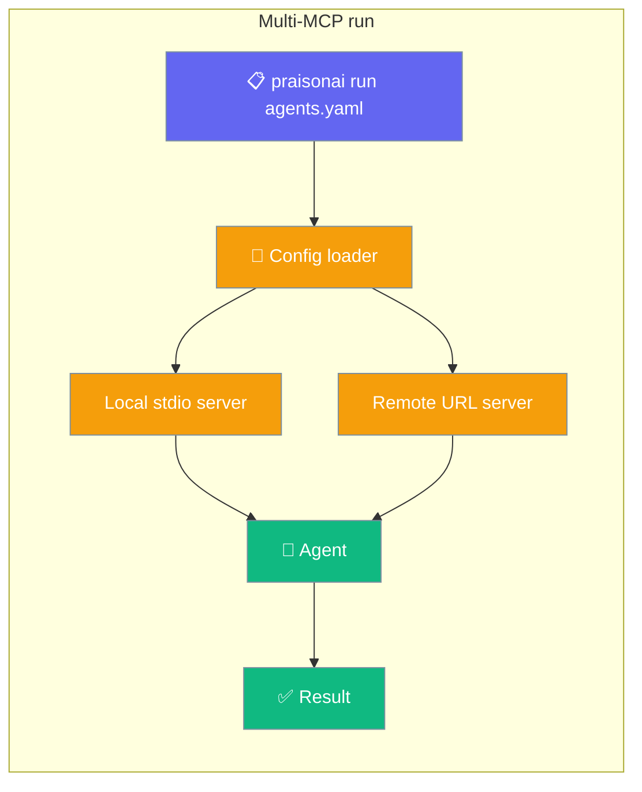

Declare any number of MCP servers in `.praisonai/config.yaml` and every enabled one is wired automatically when you run `praisonai run`.



## Quick Start

<Steps>
<Step title="Create .praisonai/config.yaml in your project">
```yaml
mcp:
  servers:
    filesystem:
      command: "npx"
      args: ["-y", "@modelcontextprotocol/server-filesystem", "."]
      enabled: true
```
</Step>

<Step title="Run — the MCP server is wired automatically">
```bash
praisonai run "List the files in src/"
```

No `--mcp` flag needed. All `enabled: true` servers from config are attached.
</Step>

<Step title="Add a remote server alongside it">
```yaml
mcp:
  servers:
    filesystem:
      command: "npx"
      args: ["-y", "@modelcontextprotocol/server-filesystem", "."]
      enabled: true
    notion:
      type: remote
      url: "https://mcp.notion.com/v1/sse"
      headers:
        Authorization: "Bearer ${NOTION_TOKEN}"
      enabled: true
```

Both servers are wired on the next run.
</Step>
</Steps>

---

## Config Schema

```yaml
mcp:
  servers:
    <server-name>:            # arbitrary name — used in logs
      # ── Local stdio server ──────────────────────────────────
      command: "npx"          # executable (must be in allowed list)
      args: ["-y", "@modelcontextprotocol/server-filesystem", "/tmp"]
      env:
        FOO: "bar"            # injected into the server process
      timeout: 30000          # milliseconds (converted to seconds internally)
      enabled: true           # omit or set false to skip

      # ── Remote URL server ───────────────────────────────────
      type: remote            # or omit and just provide 'url'
      url: "https://mcp.example.com/v1/sse"
      headers:
        Authorization: "Bearer ${MY_TOKEN}"
      timeout: 60000
      enabled: true
```

### Full example

```yaml
mcp:
  servers:
    filesystem:
      command: "npx"
      args: ["-y", "@modelcontextprotocol/server-filesystem", "/tmp"]
      env:
        FOO: "bar"
      timeout: 30000
      enabled: true
    notion:
      type: remote
      url: "https://mcp.notion.com/v1/sse"
      headers:
        Authorization: "Bearer ${NOTION_TOKEN}"
      timeout: 60000
      enabled: true
    github:
      command: "npx"
      args: ["-y", "@modelcontextprotocol/server-github"]
      env:
        GITHUB_TOKEN: "${GITHUB_TOKEN}"
      enabled: true
    disabled_server:
      command: "npx"
      args: ["-y", "@some/mcp-server"]
      enabled: false          # skipped entirely
```

---

## Server Types

### Local stdio server

Spawns a subprocess and communicates over stdin/stdout.

```yaml
filesystem:
  command: "npx"                          # required
  args: ["-y", "@modelcontextprotocol/server-filesystem", "."]
  env:
    API_KEY: "${MY_KEY}"                  # optional env vars
  timeout: 30000                          # ms; default 30 s
  enabled: true
```

**Allowed executables:** `npx`, `node`, `python`, `python3`, `uvx`, `uv`, `docker`, `deno`, `bun`, `pipx`.

Inline code-execution flags (`python -c`, `node -e`, `deno eval`) are blocked for security.

### Remote URL server

Connects to an MCP server over HTTP-stream, SSE, or WebSocket.

```yaml
notion:
  type: remote                            # or omit — just provide 'url'
  url: "https://mcp.notion.com/v1/sse"
  headers:
    Authorization: "Bearer ${NOTION_TOKEN}"
  timeout: 60000
  enabled: true
```

<Note>
Custom `headers` are not forwarded for legacy SSE URLs ending in `/sse`. The CLI prints a warning if headers are declared for such a URL.
</Note>

---

## Mixing Config Servers and `--mcp`

An explicit `--mcp` flag on the command line **merges alongside** config servers — it does not replace them.

```bash
# Config has two servers; this run adds a third on the fly
praisonai run "do X" --mcp "npx -y @another/mcp-server"
```

---

## Behaviour Reference

| Property | Behaviour |
|---|---|
| **All enabled servers** | Both local stdio and remote URL servers are wired |
| **disabled servers** | `enabled: false` skips the server entirely |
| **`--mcp` flag** | Merged alongside config servers, not replaced |
| **Timeout** | Config value is in ms; internally converted to seconds |
| **Security** | Stdio commands are validated against the executable allowlist |

---

## Best Practices

<AccordionGroup>

<Accordion title="Use environment variable references for secrets">
Store tokens in env vars (`${NOTION_TOKEN}`) rather than hardcoding them in config. The config file is often committed to git.
</Accordion>

<Accordion title="Set enabled: false to temporarily disable a server">
Comment-free way to switch a server off without deleting its config. Flip back to `true` when you need it.
</Accordion>

<Accordion title="Name servers descriptively">
The name appears in log output. `notion` is easier to debug than `server1`.
</Accordion>

<Accordion title="Tune timeouts per server">
Remote servers that do heavy processing may need a longer timeout (`timeout: 120000`). Local stdio servers usually work fine with the 30 s default.
</Accordion>

</AccordionGroup>

---

## Related

<CardGroup cols={2}>
<Card title="MCP CLI" icon="terminal" href="/docs/cli/mcp">
Ad-hoc `--mcp` flag and MCP CLI commands.
</Card>
<Card title="Run Command" icon="play" href="/docs/cli/run">
`praisonai run` flags and project config integration.
</Card>
<Card title="MCP Feature" icon="plug" href="/docs/concepts/mcp">
MCP protocol overview and SDK integration.
</Card>
<Card title="MCP YAML Config" icon="file-code" href="/docs/features/mcp-yaml-config">
YAML-based MCP configuration for agent files.
</Card>
</CardGroup>
