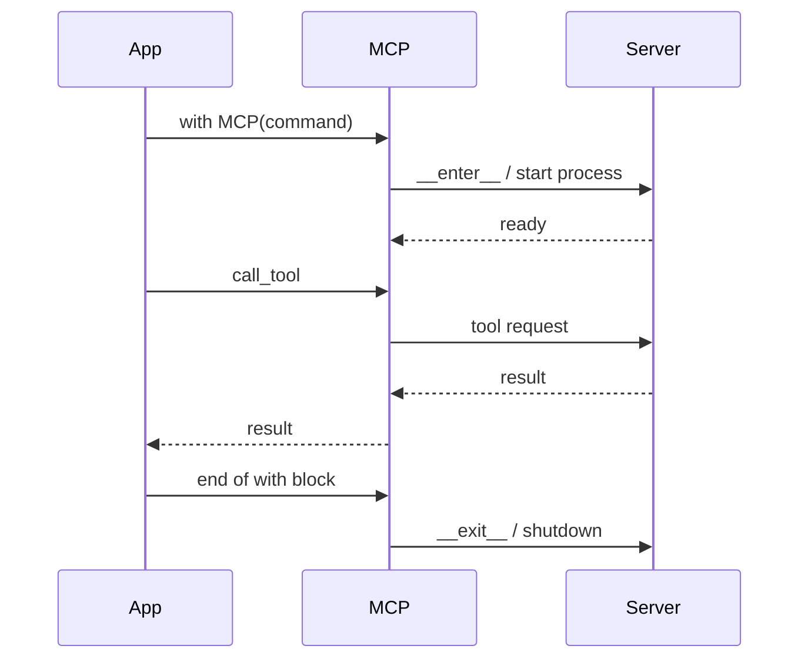

```mermaid
graph LR
    subgraph "MCP Lifecycle"
        A[🚀 with MCP] --> B[🔌 __enter__]
        B --> C[🤖 Agent + tools]
        C --> D[💬 work]
        D --> E[🧹 __exit__ / shutdown]
    end

    classDef start fill:#8B0000,stroke:#7C90A0,color:#fff
    classDef lifecycle fill:#189AB4,stroke:#7C90A0,color:#fff
    classDef work fill:#6366F1,stroke:#7C90A0,color:#fff
    classDef end fill:#10B981,stroke:#7C90A0,color:#fff

    class A start
    class B,E lifecycle
    class C,D work
    class E end
```

PraisonAI Agents v0.5.0+ includes improved lifecycle management for MCP (Model Context Protocol) connections with context manager support and explicit cleanup.

## Quick Start

<Steps>
<Step title="Use MCP as a context manager">
```python
from praisonaiagents import Agent, MCP

with MCP("uvx mcp-server-time") as mcp:
    agent = Agent(
        name="TimeAgent",
        instructions="Get the current time",
        tools=mcp
    )
    response = agent.chat("What time is it?")
    print(response)
# MCP connection automatically closed here
```
</Step>

<Step title="Multiple MCP servers">
```python
with MCP("uvx mcp-server-time") as time_mcp:
    with MCP("uvx mcp-server-fetch") as fetch_mcp:
        agent = Agent(name="MultiMCP", tools=[time_mcp, fetch_mcp])
        agent.chat("Get time and fetch a URL")
# Both cleaned up properly
```
</Step>
</Steps>

---

## How It Works



---

## Context Manager Support

## Manual Cleanup

For cases where context manager isn't suitable:

```python
from praisonaiagents import MCP

mcp = MCP("uvx mcp-server-time")

try:
    # Use MCP
    tools = mcp.get_tools()
    # ... do work ...
finally:
    # Explicit cleanup
    mcp.shutdown()
```

## Lifecycle Methods

### Authenticating the HTTP transport

When `api_key` is configured on the MCP HTTP-stream server, **all** of GET, POST, and DELETE require:

```
Authorization: Bearer <key>
```

Comparison uses constant-time `hmac.compare_digest` (timing-attack resistant). Missing or wrong tokens return `401 Unauthorized` with `{"error": "Unauthorized"}`. DELETE returning 401 instead of 405 prevents information disclosure about whether sessions exist.

```bash
curl -H "Authorization: Bearer your-key" https://localhost:8080/mcp
```

---

### `__enter__` / `__exit__`

Context manager protocol for automatic resource management:

```python
with MCP(command) as mcp:
    # MCP is initialized and ready
    pass
# __exit__ calls shutdown() automatically
```

### `shutdown()`

Explicitly close all connections and cleanup resources:

```python
mcp = MCP("uvx mcp-server-time")
# ... use mcp ...
mcp.shutdown()  # Clean up
```

### `__del__`

Destructor ensures cleanup even if shutdown() wasn't called:

```python
mcp = MCP("uvx mcp-server-time")
del mcp  # __del__ calls shutdown()
```

## Connection Types

MCP supports multiple connection types, all with proper cleanup:

### Stdio (Command-based)

```python
with MCP("uvx mcp-server-time") as mcp:
    # Subprocess is managed
    pass
# Process terminated on exit
```

### SSE (Server-Sent Events)

```python
with MCP("http://localhost:8080/sse") as mcp:
    # SSE connection managed
    pass
# Connection closed on exit
```

### HTTP Stream

```python
with MCP("http://localhost:8080") as mcp:
    # HTTP stream managed
    pass
# Stream closed on exit
```

### WebSocket

```python
with MCP("ws://localhost:8080") as mcp:
    # WebSocket managed
    pass
# WebSocket closed on exit
```

## Best Practices

<AccordionGroup>
<Accordion title="Always use the context manager">
Prefer `with MCP(command) as mcp:` over manual `shutdown()` calls, which are easy to forget.
</Accordion>

<Accordion title="Handle exceptions inside the with block">
The context manager calls `shutdown()` even when exceptions occur, so cleanup is always guaranteed.

```python
try:
    with MCP("uvx mcp-server-time") as mcp:
        result = mcp.call_tool("get_time", {})
except Exception as e:
    print(f"Error: {e}")
```
</Accordion>

<Accordion title="Pass env vars for API keys">
```python
with MCP("npx", args=["-y", "@modelcontextprotocol/server-brave-search"],
         env={"BRAVE_API_KEY": os.environ["BRAVE_API_KEY"]}) as mcp:
    agent = Agent(tools=mcp)
```
</Accordion>

<Accordion title="Set timeouts for slow servers">
```python
with MCP("uvx mcp-server-time", timeout=30) as mcp:
    result = mcp.call_tool("get_time", {})
```
</Accordion>
</AccordionGroup>

---

## Related

<CardGroup cols={2}>
<Card title="MCP Module" icon="plug" href="/sdk/praisonaiagents/mcp/mcp">
  MCP class API reference
</Card>
<Card title="MCP Transports" icon="network-wired" href="/mcp/transports">
  Stdio, SSE, HTTP Stream, WebSocket transports
</Card>
</CardGroup>

---

## Environment Variables

Pass environment variables to MCP servers:

```python
import os

with MCP(
    command="npx",
    args=["-y", "@modelcontextprotocol/server-brave-search"],
    env={"BRAVE_API_KEY": os.environ.get("BRAVE_API_KEY")}
) as mcp:
    agent = Agent(tools=mcp)
    agent.chat("Search for Python tutorials")
```

## Timeout Configuration

Set timeouts for MCP operations:

```python
with MCP("uvx mcp-server-time", timeout=30) as mcp:
    # Operations timeout after 30 seconds
    result = mcp.call_tool("get_time", {})
```

## Related

- [MCP CLI](/docs/cli/mcp)
- [MCP Module](/docs/sdk/praisonaiagents/mcp/mcp)
- [MCP Transports](/docs/mcp/transports)
