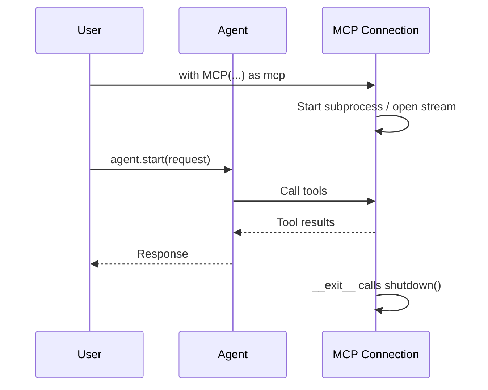
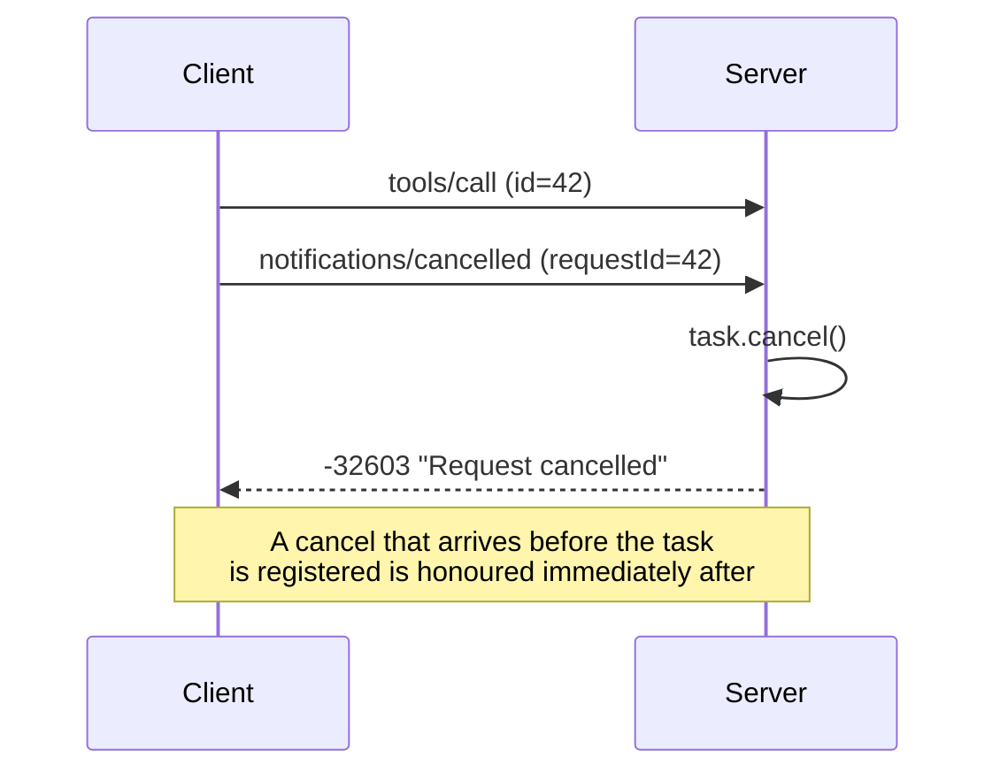

MCP connections in PraisonAI Agents support context managers and explicit `shutdown()` so subprocesses, streams, and sockets close reliably.

```python
from praisonaiagents import Agent, MCP

with MCP("uvx mcp-server-time") as mcp:
    agent = Agent(name="TimeAgent", instructions="Report the current time.", tools=mcp)
    agent.start("What time is it in UTC?")
```

The user runs an agent inside an MCP context manager; connections shut down cleanly when the session ends.


## Quick Start

<Steps>

<Step title="Simple Usage">

```python
from praisonaiagents import Agent, MCP

with MCP("uvx mcp-server-time") as mcp:
    agent = Agent(
        name="TimeAgent",
        instructions="Get the current time",
        tools=mcp
    )
    print(agent.start("What time is it?"))
# Connection closed automatically
```

</Step>

<Step title="With Configuration">

```python
import os
from praisonaiagents import Agent, MCP

with MCP(
    command="npx",
    args=["-y", "@modelcontextprotocol/server-brave-search"],
    env={"BRAVE_API_KEY": os.getenv("BRAVE_API_KEY")},
    timeout=30
) as mcp:
    agent = Agent(name="SearchAgent", tools=mcp)
    agent.start("Search for Python tutorials")
```

</Step>

</Steps>

## How It Works



| Phase | What happens |
|---|---|
| 1. Enter | The `with` block opens the MCP connection |
| 2. Use | The agent calls MCP-provided tools |
| 3. Exit | `shutdown()` closes subprocesses, streams, and sockets |

## Agent-Managed Cleanup

When you pass an MCP client through the constructor (`tools=[MCP(...)]`), `agent.close()` and `agent.aclose()` now walk the agent's tools and shut down anything exposing `.shutdown()` / `.aclose()` — so the MCP subprocess and its background thread are cleaned up with the agent.

```python
from praisonaiagents import Agent
from praisonaiagents.mcp import MCP

agent = Agent(
    name="Coder",
    tools=[MCP("uvx some-mcp-server")],
    instructions="Use MCP tools",
)
try:
    agent.start("do work")
finally:
    agent.close()   # now correctly shuts down MCP subprocesses/threads
                    # (async: `await agent.aclose()`)
```

<Note>
Constructor-pattern MCP clients (`tools=[MCP(...)]`) are now auto-shut-down by `agent.close()` / `agent.aclose()` — you don't need `remove_mcp_server()` any more just for cleanup. `aclose()` prefers a tool's `aclose()` and falls back to `shutdown()`.
</Note>

## Manual Cleanup

For cases where a context manager is not suitable:

```python
from praisonaiagents import MCP

mcp = MCP("uvx mcp-server-time")

try:
    tools = mcp.get_tools()
finally:
    mcp.shutdown()
```

## Request Cancellation

An MCP client can abort an in-flight request by sending a `notifications/cancelled` notification naming the `requestId` it wants to stop.



<Steps>
<Step title="Send the request">
The client calls a tool with a JSON-RPC id it can reference later.

```json
{ "jsonrpc": "2.0", "id": 42, "method": "tools/call", "params": { "name": "search" } }
```
</Step>

<Step title="Cancel it">
The client sends a cancellation notification with the same id as `requestId`.

```json
{ "jsonrpc": "2.0", "method": "notifications/cancelled", "params": { "requestId": 42 } }
```
</Step>

<Step title="Receive the cancelled response">
The server cancels the running task and replies with a JSON-RPC error.

```json
{ "jsonrpc": "2.0", "id": 42, "error": { "code": -32603, "message": "Request cancelled" } }
```
</Step>
</Steps>

| Behaviour | What happens |
|---|---|
| Response | Cancelled id-bearing requests return `-32603` `"Request cancelled"`; notifications receive nothing |
| Ordering | A cancel that arrives before the task is registered is stashed and applied immediately after registration |
| Overflow | Up to 10,000 pending cancel ids are kept in FIFO order — the oldest are evicted first, so a burst never drops the newest cancel |

<Note>
Only id-bearing requests can be cancelled. Fire-and-forget notifications have no id to reference and return nothing.
</Note>

## Lifecycle Methods

### Authenticating the HTTP transport

When `api_key` is configured on the MCP HTTP-stream server, **all** of GET, POST, and DELETE require:

```
Authorization: Bearer <key>
```

Comparison uses constant-time `hmac.compare_digest` (timing-attack resistant). Missing or wrong tokens return `401 Unauthorized` with `{"error": "Unauthorized"}`. DELETE returning 401 instead of 405 prevents information disclosure about whether sessions exist.

```bash
curl -H "Authorization: Bearer ${MCP_API_KEY:?Set MCP_API_KEY}" https://localhost:8080/mcp
```

### `__enter__` / `__exit__`

Context manager protocol for automatic resource management:

```python
with MCP(command) as mcp:
    pass
# __exit__ calls shutdown() automatically
```

### `shutdown()`

Explicitly close all connections and cleanup resources:

```python
mcp = MCP("uvx mcp-server-time")
mcp.shutdown()
```

### `__del__`

Destructor ensures cleanup even if `shutdown()` was not called:

```python
mcp = MCP("uvx mcp-server-time")
del mcp  # __del__ calls shutdown()
```

## Connection Types

MCP supports multiple connection types, all with proper cleanup:

```python
# Stdio
with MCP("uvx mcp-server-time") as mcp: ...

# SSE
with MCP("http://localhost:8080/sse") as mcp: ...

# HTTP Stream — pass the full endpoint URL your server exposes (e.g. /mcp)
with MCP("http://localhost:8080/mcp") as mcp: ...

# WebSocket
with MCP("ws://localhost:8080") as mcp: ...
```

## Best Practices

<AccordionGroup>

<Accordion title="Always use a context manager">
Prefer `with MCP(...) as mcp:` — cleanup runs even when an exception is raised.
</Accordion>

<Accordion title="Handle exceptions inside the block">
Wrap tool calls in `try/except` inside the `with` block; `__exit__` still closes the connection.
</Accordion>

<Accordion title="Nest multiple MCP instances carefully">
Open each MCP in its own `with` block or nest them — both instances shut down in reverse order.
</Accordion>

<Accordion title="Pass secrets via env, not inline">
Use the `env=` parameter with `os.getenv(...)` rather than hard-coding API keys in recipe files.
</Accordion>

</AccordionGroup>

## Related

<CardGroup cols={2}>
  <Card title="MCP CLI" icon="terminal" href="/docs/cli/mcp">
    Run and inspect MCP servers from the terminal
  </Card>
  <Card title="MCP Transports" icon="plug" href="/docs/mcp/transports">
    Stdio, SSE, HTTP stream, and WebSocket options
  </Card>
</CardGroup>
