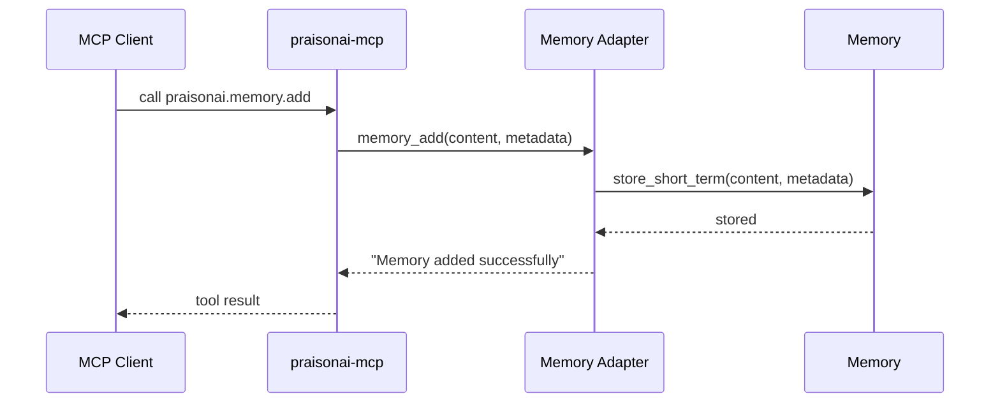
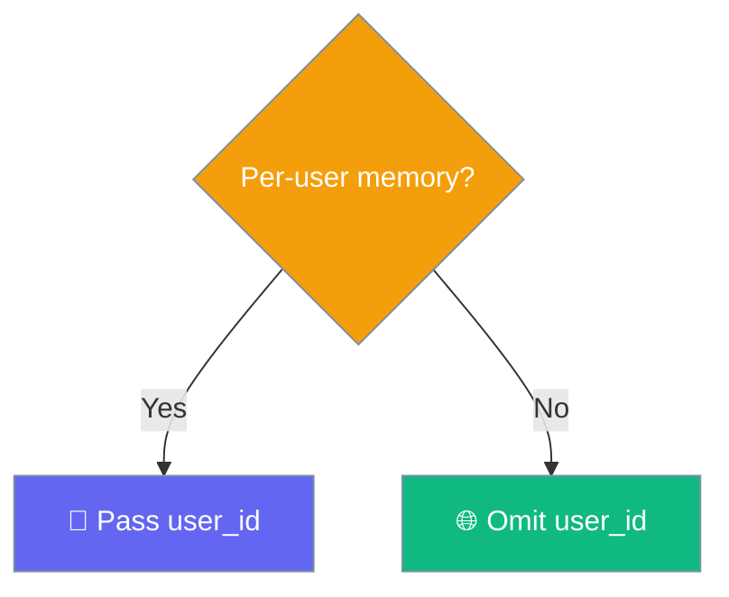

Every `praisonai-mcp` host exposes four memory tools your MCP client can call directly — no PraisonAI code required on the client side.


## Quick Start

<Steps>
<Step title="Serve">

Start the host over STDIO and point your MCP client at it.

```bash
praisonai-mcp serve --transport stdio
```

The host registers the four memory tools at startup — see the [praisonai-mcp Package](/docs/features/praisonai-mcp-package) guide.

</Step>
<Step title="Call praisonai.memory.add">

Store a fact from your MCP client with a JSON args payload.

```json
{ "content": "User prefers concise answers" }
```

</Step>
<Step title="Call praisonai.memory.search">

Retrieve it later by meaning, not exact text.

```json
{ "query": "user preferences", "limit": 5 }
```

</Step>
</Steps>

---

## How It Works

Each tool call spins up a `Memory()` instance, runs one core method, and returns a string result.



Memory is process-local and shared across all four tools — each call constructs a single `Memory()` instance against the same store.

---

## Tools Reference

Four tools, mapped one-to-one onto the core `Memory` API.

| Tool | Arguments | Returns | Core method |
|------|-----------|---------|-------------|
| `praisonai.memory.show` | `user_id: str = None` | All stored memories as a string, filtered by `user_id` when given | `get_all_memories()` |
| `praisonai.memory.add` | `content: str`, `metadata: str = None` (JSON string) | `"Memory added successfully"` | `store_short_term(content, metadata=…)` |
| `praisonai.memory.search` | `query: str`, `limit: int = 10`, `user_id: str = None` | Matching memories as a string | `search(query, user_id=…, limit=…)` |
| `praisonai.memory.clear` | _(none)_ | `"All memory cleared"` | `reset_all()` |

Every tool imports `praisonaiagents.memory.Memory` lazily and returns `"Error: Memory module not available"` when the core package is missing, or `"Error: <exc>"` on any other failure.

---

## user_id Filtering

Pass `user_id` to keep each person's memories separate; omit it for a shared global store.

`add` stashes `user_id` inside the JSON `metadata`, while `search` and `show` read it back through the metadata filter.

```json
// add for a specific user
{ "content": "Alice ships on Fridays", "metadata": "{\"user_id\": \"alice\"}" }
```

```json
// search only Alice's memories
{ "query": "ship schedule", "user_id": "alice" }
```



---

## Common Patterns

Three workflows, shown as the JSON args your MCP client sends.

**Persist a preference across chats** — save once, recall in any later session.

```json
// praisonai.memory.add
{ "content": "User prefers concise answers" }
```

```json
// praisonai.memory.search
{ "query": "answer style", "limit": 3 }
```

**Per-user isolation** — tag on write, filter on read.

```json
// praisonai.memory.add
{ "content": "Bob works in Pacific time", "metadata": "{\"user_id\": \"bob\"}" }
```

```json
// praisonai.memory.search
{ "query": "timezone", "user_id": "bob" }
```

**Wipe memory between demos** — reset the whole store in one call.

```json
// praisonai.memory.clear
{}
```

<Warning>
`clear` is irreversible and resets **both** short-term and long-term memory (`Memory.reset_all()`). Reserve it for demo resets, not per-session cleanup.
</Warning>

---

## Migration (Breaking Rename)

[PraisonAI PR #3531](https://github.com/MervinPraison/praisonai/pull/3531) rebound the adapter to the real core API, renaming the tools your MCP client sees.

| Before PR #3531 | After PR #3531 |
| --- | --- |
| `praisonai.memory.get_all` | **`praisonai.memory.show`** (also accepts `user_id`) |
| `praisonai.memory.clear_all` | **`praisonai.memory.clear`** |
| `praisonai.memory.add` | `praisonai.memory.add` (now takes optional `metadata` JSON) |
| `praisonai.memory.get_session`, `clear_session`, `list_sessions` | **Removed** — no `session_id` concept in the new adapter |
| _(none)_ | **`praisonai.memory.search`** — new |

<Note>
The old tool names were always broken — they bound to methods that never existed on core, so every call returned an `"Error: …"` string. The rename fixes them rather than removing working surface.
</Note>

---

## Best Practices

<AccordionGroup>
  <Accordion title="Use user_id when multiple people share the host">
    Without it, `show` and `search` see everyone's memories. Pass `user_id` on both `add` (inside `metadata`) and `search`/`show` to keep people isolated.
  </Accordion>
  <Accordion title="metadata is a JSON string, not a dict">
    The `add` tool signature takes `metadata: str` — a JSON string, not an object. Encode it with `JSON.stringify` on the client side before sending.
  </Accordion>
  <Accordion title="clear resets short-term AND long-term">
    `clear` calls `Memory.reset_all()`, wiping both stores. Reserve it for demo resets, not per-session cleanup.
  </Accordion>
  <Accordion title="Errors are strings, not raises">
    Every tool returns `"Error: …"` on failure, so your MCP client sees a normal tool-result envelope. Check the string prefix — don't rely on an exception.
  </Accordion>
</AccordionGroup>

---

## Related

<CardGroup cols={2}>
  <Card title="praisonai-mcp Package" icon="box" href="/docs/features/praisonai-mcp-package">
    The host that serves these tools.
  </Card>
  <Card title="Serve Agents" icon="server" href="/docs/features/serve-agents">
    Expose agents over MCP alongside memory.
  </Card>
  <Card title="Memory" icon="brain" href="/docs/features/memory">
    Give agents persistent memory across sessions.
  </Card>
  <Card title="The Three MCP Layers" icon="layer-group" href="/docs/features/mcp-three-layers">
    Client vs light server vs heavy host.
  </Card>
</CardGroup>
