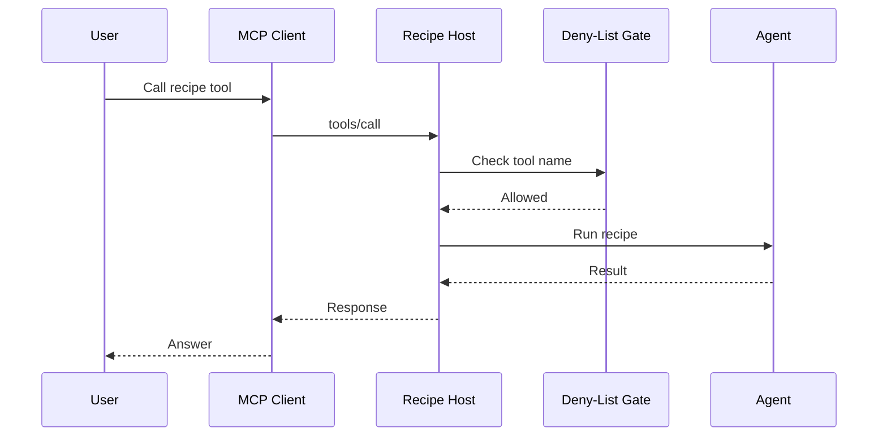
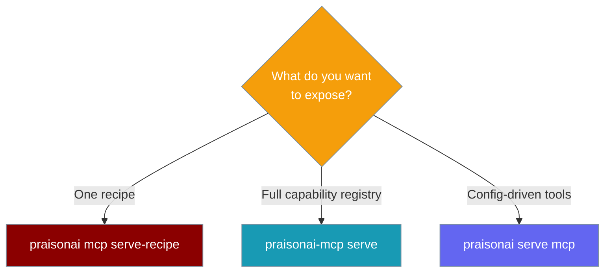

Serve any recipe as its own MCP server, so an MCP client sees exactly one recipe's tools, prompts, and resources — safe-mode on by default.


## Quick Start

<Steps>
<Step title="Build an agent recipe">

```python
from praisonaiagents import Agent

agent = Agent(
    name="support-reply",
    instructions="Draft a friendly reply to a customer support ticket.",
)
agent.start("Customer says their order is late.")
```

Save the recipe as `support-reply` so the bridge can find it by name.

</Step>
<Step title="Serve the recipe as an MCP server">

```bash
praisonai mcp serve-recipe support-reply --transport stdio
```

Only this recipe's tools and prompts are exposed — nothing else.

</Step>
<Step title="Point your MCP client at it">

```bash
praisonai mcp config-generate-recipe support-reply --client claude-desktop
```

Paste the printed block into your Claude Desktop config and the recipe appears as a tool.

</Step>
</Steps>

---

## How It Works

A recipe maps to MCP primitives: agent tools become MCP tools, agent instructions become MCP prompts, and the recipe config becomes MCP resources — all behind a deny-list gate.



| Recipe part | Becomes | Example |
|-------------|---------|---------|
| Recipe run | MCP tool | `support-reply.run` |
| Agent tool | MCP tool (namespaced) | `support-reply.agent.tool` |
| Recipe config | MCP resource | `recipe://support-reply/config` |
| Config schema | MCP resource | `recipe://support-reply/schema` |
| Recipe description | MCP prompt | `support-reply-description` |
| Agent instructions | MCP prompt | `support-reply-agent-instructions` |

---

## CLI Commands

Four commands turn a recipe into an MCP server. Each works as `praisonai mcp <command>` inside the full stack, or `praisonai-mcp <command>` standalone.

### serve-recipe

Turn a recipe into a scoped MCP server.

```bash
praisonai mcp serve-recipe support-reply --transport stdio
praisonai-mcp serve-recipe support-reply --transport http-stream --port 8080
```

| Flag | Default | Description |
|------|---------|-------------|
| `--transport` | `stdio` | `stdio` or `http-stream` |
| `--host` | `127.0.0.1` | HTTP host (http-stream only) |
| `--port` | `8080` | HTTP port (http-stream only) |
| `--endpoint` | `/mcp` | HTTP endpoint path |
| `--api-key` | `None` | Bearer token for HTTP auth |
| `--safe-mode` / `--no-safe-mode` | enabled | Apply the deny-list gate |
| `--expose-tools` / `--no-expose-tools` | enabled | Expose agent tools |
| `--expose-prompts` / `--no-expose-prompts` | enabled | Expose prompts |
| `--session-ttl` | `3600` | Session TTL in seconds |
| `--log-level` | `warning` | `debug`, `info`, `warning`, or `error` |
| `--json` | off | JSON output |

### validate-recipe

Check a recipe is safe to host before serving it.

```bash
praisonai mcp validate-recipe support-reply
```

| Flag | Default | Description |
|------|---------|-------------|
| `--json` | off | JSON output |

Warnings flag recipes with no tools or with shell/exec tools.

### inspect-recipe

Show the tools, resources, and prompts a recipe would expose.

```bash
praisonai mcp inspect-recipe support-reply --tools
```

| Flag | Default | Description |
|------|---------|-------------|
| `--tools` | off | Show tools |
| `--resources` | off | Show resources |
| `--prompts` | off | Show prompts |
| `--metadata` | off | Show recipe metadata |
| `--json` | off | JSON output |

With no flags, it shows everything.

### config-generate-recipe

Emit a client config block that points at this recipe.

```bash
praisonai mcp config-generate-recipe support-reply --client claude-desktop
```

| Flag | Default | Description |
|------|---------|-------------|
| `--client` | `claude-desktop` | `claude-desktop`, `cursor`, `vscode`, `windsurf`, or `generic` |
| `--transport` | `stdio` | `stdio` or `http-stream` |
| `--host` | `127.0.0.1` | HTTP host (http-stream only) |
| `--port` | `8080` | HTTP port (http-stream only) |
| `--output` | `None` | Write config to a file instead of stdout |

---

## Which Serve Command

Three commands serve MCP — pick the one that matches your scope.



| Command | Serves | Use it for |
|---------|--------|-----------|
| `praisonai mcp serve-recipe` | One recipe, scoped | Ship a single recipe to a client |
| `praisonai-mcp serve` | Full capability registry | Expose the whole heavy host |
| `praisonai serve mcp` | Config-driven tools | Light server from shared config |

---

## Allow / Deny Lists and Safe Mode

Safe mode is on by default and filters every tool through a deny-list before it reaches a client.

<Warning>
Safe mode blocks destructive tools by default. Only disable it with `--no-safe-mode` when you fully trust the recipe.
</Warning>

**Default denied tools** (from `DEFAULT_DENIED_TOOLS` in the adapter):

| Denied tool | Denied tool | Denied tool |
|-------------|-------------|-------------|
| `shell.exec` | `shell.run` | `shell_tool` |
| `file.write` | `file.delete` | `fs.write` |
| `fs.delete` | `network.unrestricted` | `db.write` |
| `db.delete` | `execute_command` | `os.system` |
| `subprocess.run` | `eval` | `exec` |

A tool is blocked when a denied name matches part of the tool name in either direction. Set an allow-list and only those tools pass; leave it empty and the deny-list applies.

```python
from praisonai_mcp.mcp_server import RecipeMCPConfig

# Allow-list: only these tools pass
config = RecipeMCPConfig(
    recipe_name="support-reply",
    tool_allowlist=["search", "summarize"],
)

# Deny-list: extend the defaults
config = RecipeMCPConfig(
    recipe_name="support-reply",
    tool_denylist=["shell.exec", "file.delete", "my.custom.tool"],
)
```

<Note>
Setting `tool_denylist` replaces the defaults — copy in the entries you still want to block.
</Note>

---

## Python API

Load a recipe and run it as an MCP server in three lines.

```python
from praisonai_mcp.mcp_server import RecipeMCPAdapter

adapter = RecipeMCPAdapter("support-reply")
adapter.load()
adapter.to_mcp_server().run(transport="stdio")
```

### RecipeMCPAdapter

| Method | Signature | Returns |
|--------|-----------|---------|
| `__init__` | `RecipeMCPAdapter(recipe_name, config=None)` | adapter |
| `load` | `load()` | `None` — loads recipe, builds registries |
| `to_mcp_server` | `to_mcp_server()` | `MCPServer` ready to run |
| `get_recipe_info` | `get_recipe_info()` | metadata dict |
| `get_tool_registry` | `get_tool_registry()` | tool registry |
| `get_resource_registry` | `get_resource_registry()` | resource registry |
| `get_prompt_registry` | `get_prompt_registry()` | prompt registry |

| `__init__` param | Type | Default | Description |
|------------------|------|---------|-------------|
| `recipe_name` | `str` | required | Recipe to adapt |
| `config` | `RecipeMCPConfig` | `None` | Config (defaults applied if omitted) |

### RecipeMCPConfig

| Option | Type | Default | Description |
|--------|------|---------|-------------|
| `recipe_name` | `str` | required | Recipe name |
| `expose_agent_tools` | `bool` | `True` | Expose agent tools |
| `expose_run_tool` | `bool` | `True` | Expose the `recipe.run` meta-tool |
| `tool_namespace` | `str` | `"prefixed"` | `flat`, `nested`, or `prefixed` |
| `expose_config` | `bool` | `True` | Expose recipe config as a resource |
| `expose_outputs` | `bool` | `True` | Expose output definitions |
| `expose_prompts` | `bool` | `True` | Expose prompts |
| `expose_agent_instructions` | `bool` | `True` | Expose agent instructions as prompts |
| `safe_mode` | `bool` | `True` | Apply the deny-list gate |
| `tool_allowlist` | `List[str]` | `None` | Only these tools pass |
| `tool_denylist` | `List[str]` | `None` | Blocked tools (defaults if `None`) |
| `workspace_path` | `str` | `None` | Workspace root for the recipe |
| `allow_network` | `bool` | `False` | Allow network access |
| `env_allowlist` | `List[str]` | `None` | Environment variables to pass through |
| `server_name` | `str` | `None` | Server name (defaults to recipe name) |
| `server_version` | `str` | `"1.0.0"` | Server version |
| `server_description` | `str` | `None` | Server description |
| `server_icon` | `str` | `None` | Server icon |
| `session_ttl` | `int` | `3600` | Session TTL in seconds |
| `max_concurrent_runs` | `int` | `5` | Concurrent recipe runs |

---

## End-to-End Example

Go from an agent recipe to a working Claude Desktop tool in three steps.

<Steps>
<Step title="Write the recipe">

```python
from praisonaiagents import Agent

agent = Agent(
    name="support-reply",
    instructions="Draft a friendly reply to a customer support ticket.",
)
```

</Step>
<Step title="Serve it">

```bash
praisonai mcp serve-recipe support-reply --transport stdio
```

</Step>
<Step title="Generate the client config">

```bash
praisonai mcp config-generate-recipe support-reply --client claude-desktop
```

```json
{
  "mcpServers": {
    "support-reply": {
      "command": "praisonai",
      "args": ["mcp", "serve-recipe", "support-reply", "--transport", "stdio"]
    }
  }
}
```

</Step>
</Steps>

Paste that block into Claude Desktop's config and the `support-reply` recipe appears as a tool.

---

## Best Practices

<AccordionGroup>
  <Accordion title="Validate before you serve">
    Run `praisonai mcp validate-recipe <name>` to catch missing tools or shell/exec warnings before a client connects.
  </Accordion>
  <Accordion title="Inspect what you expose">
    `praisonai mcp inspect-recipe <name>` shows the exact tools, resources, and prompts a client will see.
  </Accordion>
  <Accordion title="Keep safe mode on">
    Safe mode blocks destructive tools like `shell.exec` and `file.delete`. Only use `--no-safe-mode` for recipes you fully trust.
  </Accordion>
  <Accordion title="Prefer an allow-list for production">
    An allow-list exposes only the tools you name, which is tighter than extending the deny-list.
  </Accordion>
</AccordionGroup>

---

## Related

<CardGroup cols={2}>
  <Card title="PraisonAI MCP Server" icon="server" href="/docs/mcp/praisonai-mcp-server">
    Heavy MCP host reference and client setup.
  </Card>
  <Card title="praisonai-mcp Package" icon="plug" href="/docs/features/praisonai-mcp-package">
    Package install and CLI guide.
  </Card>
  <Card title="The Three MCP Layers" icon="layer-group" href="/docs/features/mcp-three-layers">
    Client vs light server vs heavy host.
  </Card>
  <Card title="Package Tiers" icon="layer-group" href="/docs/features/architecture-tiers">
    Where praisonai-mcp sits in the stack.
  </Card>
</CardGroup>
