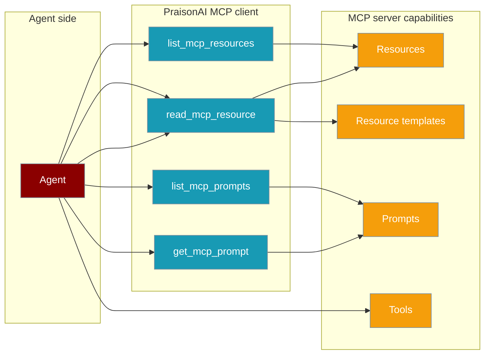
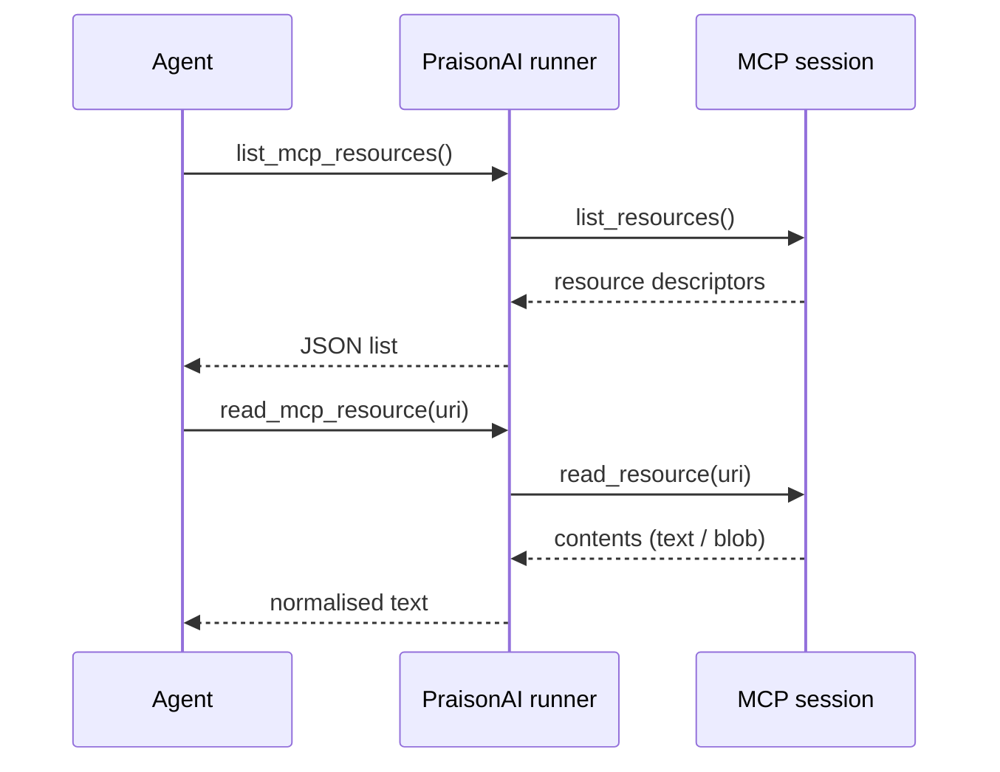

Some MCP servers ship files and prompt templates, not just tools. PraisonAI surfaces both as agent-callable tools automatically — no extra config.



## Quick Start

<Steps>
<Step title="Read a resource">
An agent connects to a resource server and reads a file — no extra setup.

```python
from praisonaiagents import Agent
from praisonaiagents.mcp import MCP

agent = Agent(
    name="Docs assistant",
    instructions="Answer questions using the docs available on the MCP server.",
    tools=MCP("uvx some-resource-server"),
)

agent.start("Show me what docs are available, then read the intro one.")
```

`list_mcp_resources` and `read_mcp_resource` were auto-registered because the server advertises resources.
</Step>

<Step title="Run a prompt">
Servers that ship prompt templates expose `list_mcp_prompts` and `get_mcp_prompt`.

```python
from praisonaiagents import Agent
from praisonaiagents.mcp import MCP

agent = Agent(
    name="Prompt-pack agent",
    instructions="Use the server's prompt library to answer.",
    tools=MCP("uvx some-prompt-server"),
)

agent.start("List the available prompts, then run the 'summarise' one on this text: ...")
```
</Step>

<Step title="Namespace with a prefix (optional)">
Add a per-server prefix when combining multiple servers on one agent.

```python
from praisonaiagents import Agent
from praisonaiagents.mcp import MCP

mcp = MCP("uvx some-server")
mcp.with_tool_prefix("docs")  # -> docs_list_mcp_resources, docs_read_mcp_resource, ...

agent = Agent(name="Namespaced", instructions="...", tools=mcp)
```
</Step>
</Steps>

---

## How It Works

Resources and prompts are looked up during connect, then routed through synthetic tools the agent can call.



Synthetic tools are **capability-gated** — they only appear when the server advertises them.

| Synthetic tool | Purpose | Registered when |
|---|---|---|
| `list_mcp_resources` | List concrete resources on the server | server exposes resources or resource templates |
| `list_mcp_resource_templates` | List URI templates the server can materialise | server exposes resources or resource templates |
| `read_mcp_resource(uri)` | Fetch a resource by URI (returns normalised text) | server exposes resources or resource templates |
| `list_mcp_prompts` | List prompt templates | server exposes prompts |
| `get_mcp_prompt(name, arguments={})` | Render a prompt with arguments | server exposes prompts |

Resources are looked up during connect via `list_resources()`, `list_resource_templates()`, and `list_prompts()`. Each is a best-effort call — tools-only servers still initialise cleanly.

### User interaction flow

A real run stitches the synthetic tools together automatically.

> **User:** "What's the tallest mountain?"
> **Agent** → `list_mcp_resources()` (finds `docs://mountains.md`) → `read_mcp_resource("docs://mountains.md")` → composes the final answer.

---

## Configuration Options

No config class is required — behaviour is capability-gated automatically. Two knobs let you shape what the agent sees.

| Option | Type | Default | Description |
|--------|------|---------|-------------|
| `allowed_tools` | `List[str]` | `None` | Include whitelist — only these tool names are kept (applies to synthetic tools too) |
| `disabled_tools` | `List[str]` | `None` | Exclude blacklist — these tool names are filtered out |
| `with_tool_prefix("<name>")` | method | none | Namespace tool names as `<name>_<tool>` to avoid collisions across servers |

```python
from praisonaiagents import Agent
from praisonaiagents.mcp import MCP

agent = Agent(
    name="Tight agent",
    instructions="Read docs but never browse prompt packs.",
    tools=MCP("uvx some-server", disabled_tools=["list_mcp_prompts"]),
)
```

### Introspection API

Inspect capability without invoking any tool.

```python
from praisonaiagents.mcp import MCP

mcp = MCP("uvx some-server")

mcp.get_resources()  # -> List[dict]
mcp.get_prompts()    # -> List[dict]
```

`MCP.get_resources()` returns resource and resource-template dicts:

```python
# resource
{"uri": "docs://intro.md", "name": "Intro", "description": "...", "mimeType": "text/markdown"}
# resource template
{"uriTemplate": "docs://{slug}.md", "name": "Doc", "description": "...", "mimeType": "text/markdown"}
```

`MCP.get_prompts()` returns prompt dicts with argument hints:

```python
{
    "name": "summarise",
    "description": "Summarise the given text",
    "arguments": [
        {"name": "text", "description": "Text to summarise", "required": True}
    ],
}
```

### Payload guard

Content is normalised before it reaches the agent, capped by `MAX_INLINE_BYTES = 100_000`.

- Text over the limit is truncated with a `...[truncated, N chars total]` marker.
- Binary payloads never inline — they become `[binary resource: <mimeType>, <N> bytes]`.

---

## Common Patterns

**Combine tools + resources on one agent.** A research server offering both a `search` tool and a corpus of resources feeds one agent — the tool searches, the resources get read.

```python
from praisonaiagents import Agent
from praisonaiagents.mcp import MCP

agent = Agent(
    name="Researcher",
    instructions="Search, then read the most relevant resource.",
    tools=MCP("uvx research-server"),
)
```

**Multiple MCP servers with prefixes.** A docs server and a prompts server sit side by side, each namespaced to keep tool names distinct.

```python
from praisonaiagents import Agent
from praisonaiagents.mcp import MCP

docs = MCP("uvx docs-server")
docs.with_tool_prefix("docs")

prompts = MCP("uvx prompt-server")
prompts.with_tool_prefix("prompts")

agent = Agent(name="Combined", instructions="...", tools=[docs, prompts])
```

**Introspect before calling.** Log or gate what the agent can see at wire-up time.

```python
from praisonaiagents.mcp import MCP

mcp = MCP("uvx some-server")
for resource in mcp.get_resources():
    print(resource["uri"], resource["mimeType"])
```

---

## Best Practices

<AccordionGroup>
<Accordion title="Prefer smaller resources">
Servers that expose very large files hand agents truncated content once past `MAX_INLINE_BYTES = 100_000`. Split resources or add a search tool so the agent fetches only what it needs.
</Accordion>

<Accordion title="Use with_tool_prefix when combining servers">
Two servers advertising `read_mcp_resource` otherwise show up with the same name and confuse the model. Prefix each server so names stay distinct.
</Accordion>

<Accordion title="Filter with disabled_tools for tighter agents">
If an agent shouldn't browse prompt packs, drop `list_mcp_prompts` explicitly via `disabled_tools`. Synthetic tools go through the same filters as server tools.
</Accordion>

<Accordion title="A server tool of the same name always wins">
If the server registers a real `read_mcp_resource`, the synthetic version is skipped by design so the callable and its schema stay consistent. Don't rely on the synthetic tool when the server exposes its own.
</Accordion>
</AccordionGroup>

---

## Related

<CardGroup cols={2}>
<Card title="MCP Tools" icon="wrench" href="/docs/mcp/mcp-tools">
  MCP module basics and tool usage
</Card>
<Card title="MCP Transports" icon="plug" href="/docs/mcp/transports">
  How PraisonAI connects to MCP servers
</Card>
</CardGroup>
