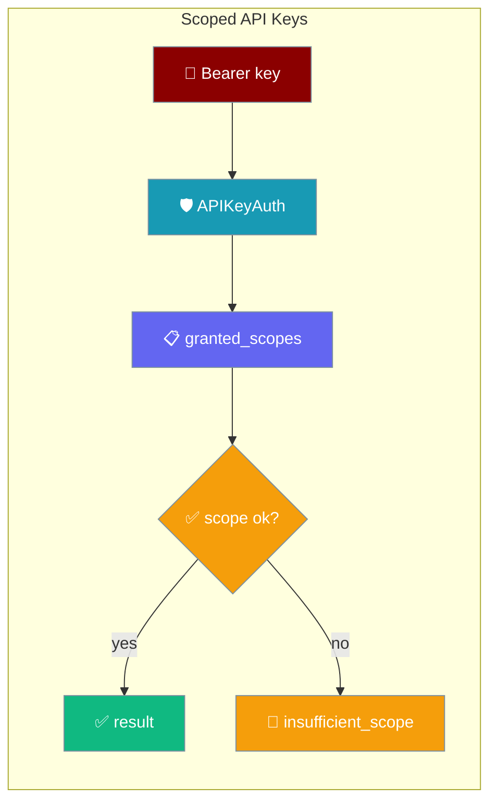
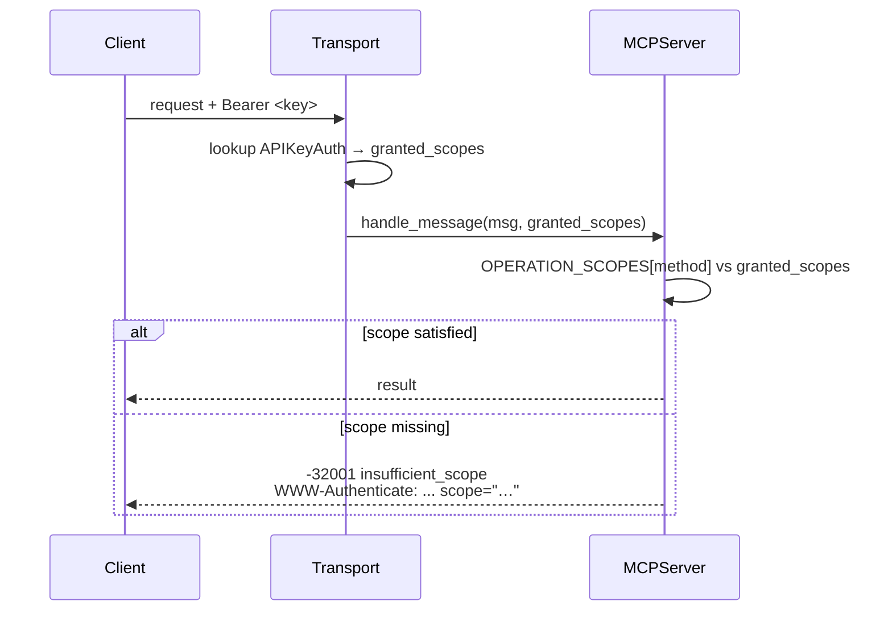
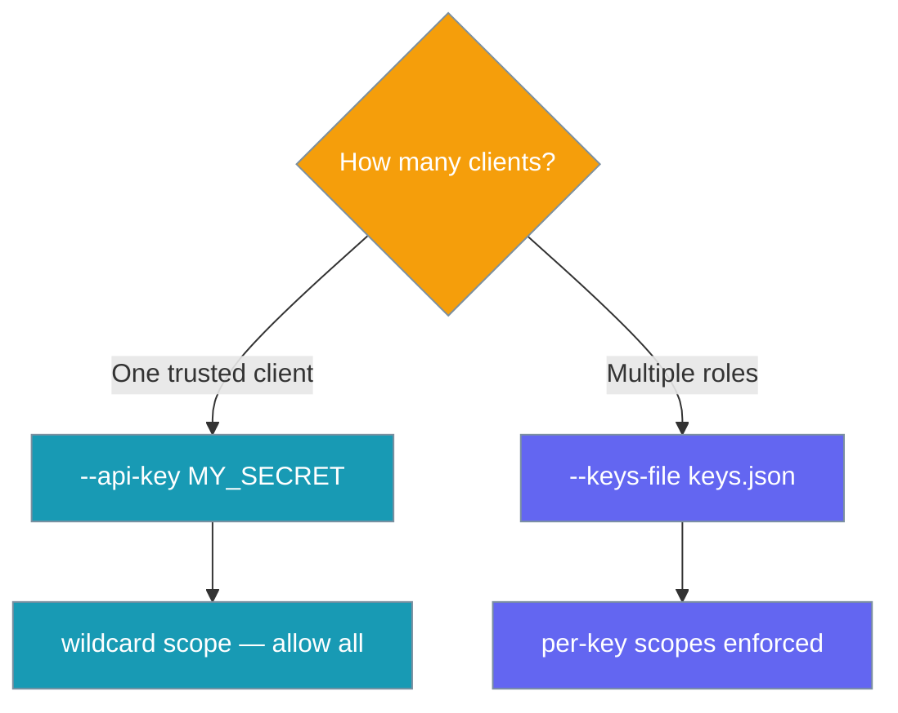

Give different MCP clients different API keys, each with different powers — `reader` can list tools, `agent-bot` can call them, `admin` can do everything.

<Note>
**No auth configured? Nothing changes.** With no keys set, `granted_scopes` is `None` and every method is allowed. Scoped keys are 100% opt-in — existing setups keep working untouched.
</Note>



## Quick Start

<Steps>
<Step title="Create a keys file">
Give each client a key and a list of scopes. `*` means "all scopes".

```json keys.json
{
  "keys": [
    { "key": "reader-abc", "scopes": ["tools:read", "resources:read"] },
    { "key": "agent-def",  "scopes": ["tools:call", "tools:read"] },
    { "key": "admin-ghi",  "scopes": ["*"] }
  ]
}
```
</Step>

<Step title="Serve with the keys file">
```bash
praisonai mcp serve --transport http-stream --port 8080 --keys-file ./keys.json
```

Each request sends its key as a Bearer token. The server looks up the key, resolves its scopes, and enforces them per method.
</Step>

<Step title="Single key (unchanged)">
A single scalar key still works and gets wildcard (`*`) scope — every method allowed.

```bash
praisonai mcp serve --transport http-stream --api-key MY_SECRET
```
</Step>
</Steps>

---

## How It Works

Each method has a required scope. The transport resolves the caller's key to `granted_scopes` and the server checks it before running the handler.



| Step | What happens |
|------|--------------|
| Lookup | Transport matches the Bearer key to an `APIKeyAuth` entry |
| Resolve | The key's `scopes` become `granted_scopes` |
| Check | The method's required scope is compared against `granted_scopes` |
| Allow / Deny | Match → run handler; miss → `-32001 insufficient_scope` |

<Note>
When no key store is configured, `granted_scopes` is `None` and the check is skipped — **allow all**.
</Note>

---

## Two Ways to Configure

Pick the shortest path for your setup.



### A) Single key (wildcard)

```bash
praisonai mcp serve --transport http-stream --api-key MY_SECRET
```

Behaviour is unchanged. The scalar `--api-key` is wrapped as a single key with wildcard (`*`) scope, so it satisfies every method — the scalar path and the multi-key path share the same enforcement.

### B) Multiple scoped keys

```bash
praisonai mcp serve --transport http-stream --keys-file ./keys.json
```

```json keys.json
{
  "keys": [
    { "key": "reader-abc", "scopes": ["tools:read", "resources:read"] },
    { "key": "agent-def",  "scopes": ["tools:call", "tools:read"] },
    { "key": "admin-ghi",  "scopes": ["*"] }
  ]
}
```

| Field | Type | Description |
|-------|------|-------------|
| `key` | `string` | The Bearer token the client sends |
| `scopes` | `string[]` | Scopes this key grants. `"*"` satisfies every requirement |

---

## Scopes and Methods

Each MCP method maps to a required scope in `OPERATION_SCOPES`.

| Method | Required scope |
|--------|----------------|
| `tools/list` | `tools:read` |
| `tools/call` | `tools:call` |
| `resources/list` | `resources:read` |
| `resources/read` | `resources:read` |
| `resources/subscribe` | `resources:subscribe` |
| `prompts/list` | `prompts:read` |
| `prompts/get` | `prompts:read` |
| `sampling/createMessage` | `sampling:create` |
| `tasks/create` | `tasks:write` |
| `tasks/get` | `tasks:read` |
| `tasks/list` | `tasks:read` |
| `tasks/cancel` | `tasks:write` |
| `logging/setLevel` | `admin` |

Runtime log-level changes are administrative, so `logging/setLevel` sits behind the `admin` scope — a client cannot quiet or verbose the server's logging without an admin key.

Available scopes:

| Scope | Grants |
|-------|--------|
| `tools:read` | Read tool definitions |
| `tools:call` | Execute tools |
| `resources:read` | Read resources |
| `resources:subscribe` | Subscribe to resource changes |
| `prompts:read` | Read prompts |
| `prompts:execute` | Execute prompts |
| `sampling:create` | Create sampling requests |
| `tasks:read` | Read tasks |
| `tasks:write` | Create and manage tasks |
| `admin` | Administrative access (implies all) |
| `*` | Wildcard — satisfies every requirement |

<Note>
Scopes are hierarchical: `tools:call` implies `tools:read`, `resources:subscribe` implies `resources:read`, `tasks:write` implies `tasks:read`, and `admin` implies everything.
</Note>

---

## Error Response

A request without the required scope returns a JSON-RPC error with code `-32001`.

```json
{
  "jsonrpc": "2.0",
  "id": 1,
  "error": {
    "code": -32001,
    "message": "insufficient_scope",
    "data": { "required": "tools:call" }
  }
}
```

Over HTTP the response also carries a challenge header naming the missing scope:

```http
WWW-Authenticate: Bearer realm="mcp", scope="tools:call", error="insufficient_scope"
```

The client can read `scope="…"` to know exactly which grant to request next.

---

## Common Patterns

Match a key's scopes to what each client actually needs.

<Tabs>
<Tab title="Read-only monitor">
A monitoring bot that only lists tools and reads status — no execution.

```json
{ "key": "monitor-key", "scopes": ["tools:read", "resources:read"] }
```
</Tab>

<Tab title="Agent caller">
An agent that runs tools but should not touch resources.

```json
{ "key": "agent-key", "scopes": ["tools:call"] }
```

`tools:call` implies `tools:read`, so listing tools works too.
</Tab>

<Tab title="Admin">
A maintenance key with full access.

```json
{ "key": "admin-key", "scopes": ["*"] }
```
</Tab>

<Tab title="Rotate a key">
Rotation is a pure JSON edit — add the new key, drain traffic to it, then remove the old one.

```json
{
  "keys": [
    { "key": "agent-old", "scopes": ["tools:call"] },
    { "key": "agent-new", "scopes": ["tools:call"] }
  ]
}
```
</Tab>
</Tabs>

---

## Best Practices

<AccordionGroup>
<Accordion title="Grant the narrowest scopes that work">
Start from `tools:read` and add only what a client needs. Reserve `*` and `admin` for maintenance keys, not day-to-day clients.
</Accordion>

<Accordion title="One key per client role">
Give each bot or service its own key so you can rotate or revoke it without affecting others. Name keys by role (`reader`, `agent-bot`, `admin`).
</Accordion>

<Accordion title="Rotate without downtime">
Add the replacement key alongside the old one, point clients at the new key, then delete the old entry. No restart of clients is forced mid-rotation.
</Accordion>

<Accordion title="Keep the keys file out of version control">
Treat `keys.json` like any secret — store it outside the repo and restrict file permissions. Never commit real keys.
</Accordion>
</AccordionGroup>

---

## Related

<CardGroup cols={2}>
<Card title="PraisonAI MCP Server" icon="server" href="/docs/mcp/praisonai-mcp-server">
  Run PraisonAI as an MCP server over STDIO or HTTP Stream.
</Card>
<Card title="MCP Authentication" icon="lock" href="/docs/mcp/mcp-auth">
  API key and OAuth options for securing MCP.
</Card>
</CardGroup>
