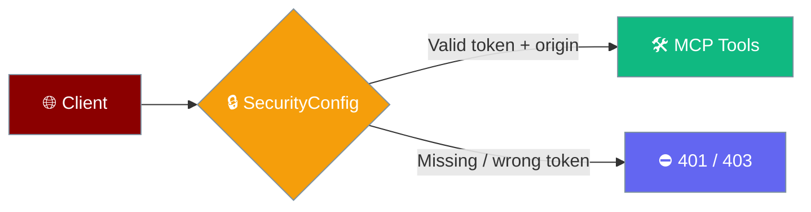
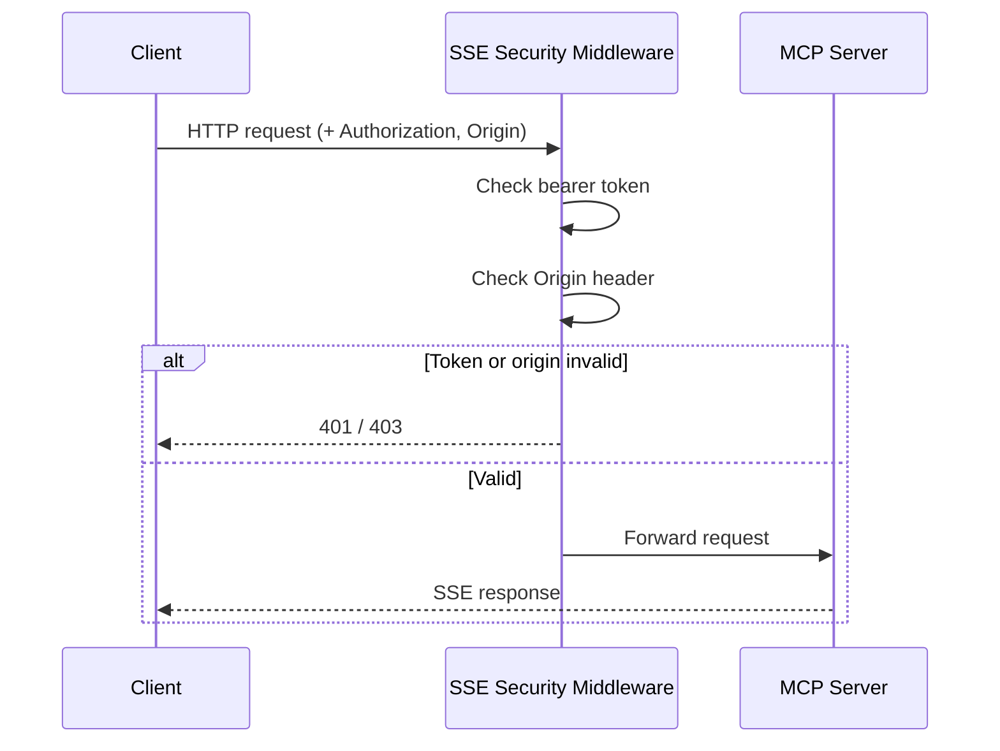
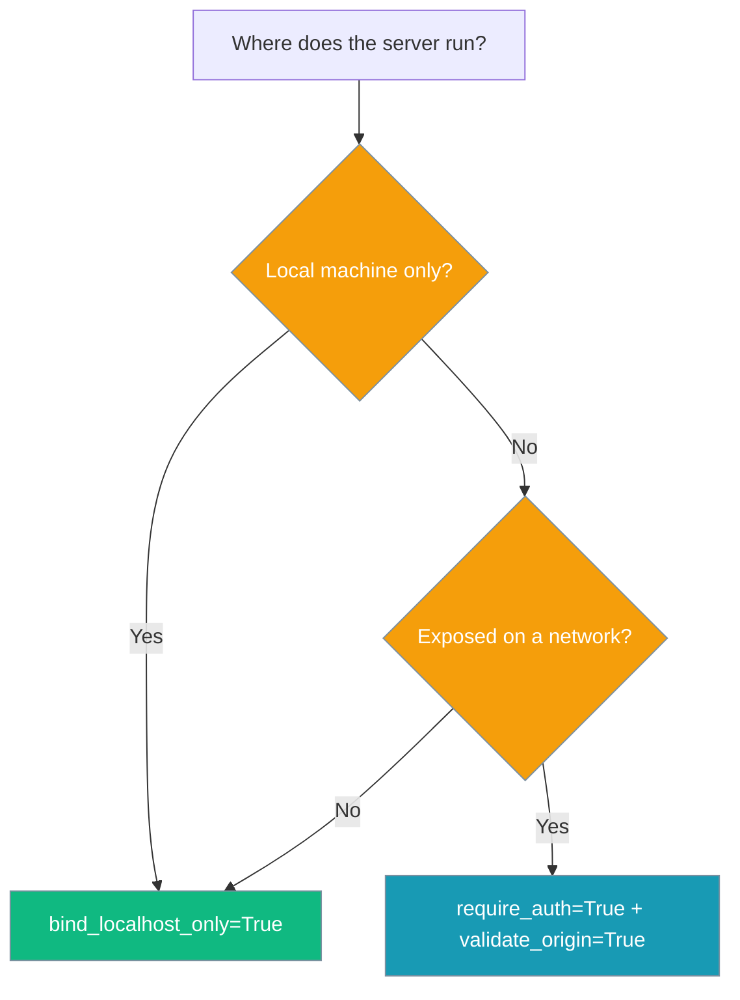

`SecurityConfig` locks down an MCP SSE server with localhost-only binding, bearer-token authentication, and Origin validation.



## Quick Start

<Steps>
<Step title="Bind to localhost only">

`SecurityConfig` defaults to `bind_localhost_only=True`. Pass its recommended bind address to `run_sse`.

```python
from praisonaiagents.mcp import ToolsMCPServer
from praisonaiagents.mcp.mcp_security import SecurityConfig

def search(query: str) -> str:
    """Search the web."""
    return f"Results for {query}"

server = ToolsMCPServer(name="local-tools", tools=[search])

security = SecurityConfig(bind_localhost_only=True)
server.run_sse(host=security.get_bind_address(), port=8080, security=security)
```

</Step>

<Step title="Require a bearer token">

Set `require_auth=True` and provide the token via `MCP_SSE_AUTH_TOKEN`. Requests without a matching `Authorization: Bearer …` header get a `401`.

```python
import os
from praisonaiagents.mcp import ToolsMCPServer
from praisonaiagents.mcp.mcp_security import SecurityConfig

os.environ["MCP_SSE_AUTH_TOKEN"] = "local-dev-token"

def search(query: str) -> str:
    """Search the web."""
    return f"Results for {query}"

server = ToolsMCPServer(name="local-tools", tools=[search])
security = SecurityConfig(require_auth=True, bind_localhost_only=True)

server.run_sse(host=security.get_bind_address(), port=8080, security=security)
```

</Step>
</Steps>

---

## How It Works

`run_sse` wraps the Starlette app with security middleware when a `SecurityConfig` requires auth or origin validation.



| Step | Behavior |
|------|----------|
| Bind address | `get_bind_address()` returns `127.0.0.1` when `bind_localhost_only=True`, else `0.0.0.0` |
| Token check | When `require_auth=True`, a `Bearer` token matching `MCP_SSE_AUTH_TOKEN` (or `MCP_AUTH_TOKEN`) is required, else `401` |
| Origin check | When `validate_origin=True`, the `Origin` header must be in `allowed_origins`, else `403` |
| No config | When `security=None`, `run_sse` reads `MCP_SSE_*` env vars; middleware is skipped if neither auth nor origin validation is active |

---

## Configuration Options

Extracted from `SecurityConfig` in `praisonaiagents/mcp/mcp_security.py`.

| Option | Type | Default | Description |
|--------|------|---------|-------------|
| `validate_origin` | `bool` | `True` | Validate the `Origin` header on each request |
| `allow_missing_origin` | `bool` | `False` | Allow requests with no `Origin` header |
| `allowed_origins` | `List[str]` | `["localhost", "127.0.0.1"]` | Hosts permitted in the `Origin` header |
| `require_auth` | `bool` | `False` | Require a bearer token on every request |
| `bind_localhost_only` | `bool` | `True` | Recommend binding to `127.0.0.1` via `get_bind_address()` |

Token and origin overrides can also come from the environment:

| Variable | Purpose |
|----------|---------|
| `MCP_SSE_AUTH_TOKEN` / `MCP_AUTH_TOKEN` | Expected bearer token when `require_auth=True` |
| `MCP_SSE_ALLOWED_ORIGINS` | Comma-separated allowed origins |

---

## Common Patterns

Choose a hardening level based on where the server runs.



Localhost-only, no token — trusted single-machine use:

```python
from praisonaiagents.mcp import ToolsMCPServer
from praisonaiagents.mcp.mcp_security import SecurityConfig

def search(query: str) -> str:
    """Search the web."""
    return f"Results for {query}"

server = ToolsMCPServer(name="local-tools", tools=[search])
security = SecurityConfig(bind_localhost_only=True, require_auth=False)
server.run_sse(host=security.get_bind_address(), port=8080, security=security)
```

Token plus restricted origins — a shared or networked server:

```python
import os
from praisonaiagents.mcp import ToolsMCPServer
from praisonaiagents.mcp.mcp_security import SecurityConfig

os.environ["MCP_SSE_AUTH_TOKEN"] = "shared-team-token"

def search(query: str) -> str:
    """Search the web."""
    return f"Results for {query}"

server = ToolsMCPServer(name="team-tools", tools=[search])
security = SecurityConfig(
    require_auth=True,
    validate_origin=True,
    allowed_origins=["localhost", "127.0.0.1", "app.internal"],
    bind_localhost_only=False,
)
server.run_sse(host=security.get_bind_address(), port=8080, security=security)
```

---

## Best Practices

<AccordionGroup>
<Accordion title="Keep localhost binding on for local tools">
Leave `bind_localhost_only=True` (the default) for any server that only serves the local machine — it keeps `127.0.0.1` off the network.
</Accordion>
<Accordion title="Require a token before exposing on a network">
Set `require_auth=True` and provide `MCP_SSE_AUTH_TOKEN` whenever the server is reachable beyond localhost.
</Accordion>
<Accordion title="Restrict allowed origins">
Narrow `allowed_origins` to the exact hosts that should call the server instead of leaving the defaults when exposing it more widely.
</Accordion>
<Accordion title="Store tokens in the environment">
Read the token from `MCP_SSE_AUTH_TOKEN` rather than hard-coding it, so secrets stay out of source.
</Accordion>
</AccordionGroup>

---

## Related

<CardGroup cols={2}>
<Card title="MCP" icon="plug" href="/docs/features/mcp">
  Connect agents to MCP tool servers
</Card>
<Card title="Permission Modes" icon="shield-check" href="/docs/features/permission-modes">
  Control how agents handle tool approval
</Card>
</CardGroup>
