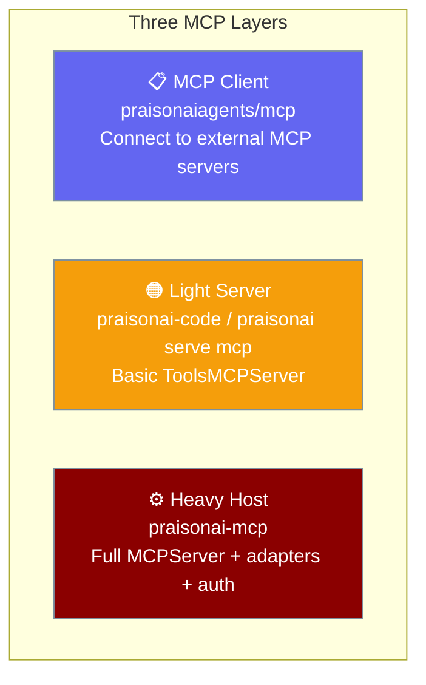
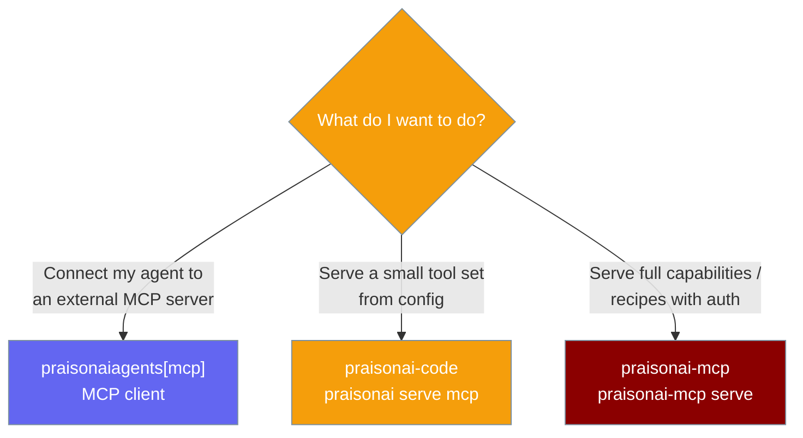

PraisonAI has three distinct MCP roles across three packages — connecting to servers, serving a small tool set, and hosting the full capability registry.

```python
from praisonaiagents import Agent, MCP

agent = Agent(
    name="assistant",
    instructions="Use connected tools to help the user.",
    tools=MCP("npx -y @modelcontextprotocol/server-filesystem /tmp"),
)
agent.start("List files in /tmp.")
```

The snippet above is the **client** layer. Serving your own agents uses the light or heavy layer instead.



## Which Layer Do I Need?



## The Layers

Each layer maps to one package and one job.

| Layer | Package | Install | Role |
|-------|---------|---------|------|
| Client | `praisonaiagents/mcp/` | `pip install "praisonaiagents[mcp]"` | Connect agents to external MCP servers |
| Light server | `praisonai-code` | `pip install praisonai-code` | Config-driven basic tool hosting (`ToolsMCPServer`) |
| Heavy host | `praisonai-mcp` | `pip install "praisonai-mcp[all]"` | Full `MCPServer`, adapters, recipe bridge, HTTP-stream auth |

### Client

Connect an agent to any external MCP server and use its tools.

```python
from praisonaiagents import Agent, MCP

agent = Agent(
    instructions="You can read and write files.",
    tools=MCP("npx -y @modelcontextprotocol/server-filesystem /tmp"),
)
agent.start("Create notes.txt with 'Hello World'.")
```

### Light server

Serve a small, config-driven tool set from the terminal CLI.

```bash
pip install praisonai-code
praisonai serve mcp
```

### Heavy host

Serve the full PraisonAI capability registry, recipes, and auth.

```bash
pip install "praisonai-mcp[all]"
praisonai-mcp serve --transport stdio
```

---

## Best Practices

<AccordionGroup>
  <Accordion title="Client for consuming, host for serving">
    Use the agents-tier `MCP` class to consume external tools. Use `praisonai-mcp` to expose your own agents to MCP clients.
  </Accordion>
  <Accordion title="Light server for a fixed tool set">
    `praisonai serve mcp` is the lightest way to publish a handful of config-driven tools without the heavy host.
  </Accordion>
  <Accordion title="Heavy host for auth and recipes">
    Reach for `praisonai-mcp` when you need OAuth 2.1 / OIDC, HTTP-stream transport, or recipe serving.
  </Accordion>
</AccordionGroup>

---

## Related

<CardGroup cols={2}>
  <Card title="praisonai-mcp Package" icon="plug" href="/docs/features/praisonai-mcp-package">
    Standalone heavy-host package guide.
  </Card>
  <Card title="MCP Integration" icon="plug" href="/docs/features/mcp">
    Connect agents to external MCP servers.
  </Card>
  <Card title="PraisonAI MCP Server" icon="server" href="/docs/mcp/praisonai-mcp-server">
    Heavy MCP host reference.
  </Card>
  <Card title="Package Tiers" icon="layer-group" href="/docs/features/architecture-tiers">
    How the seven packages stack.
  </Card>
</CardGroup>
