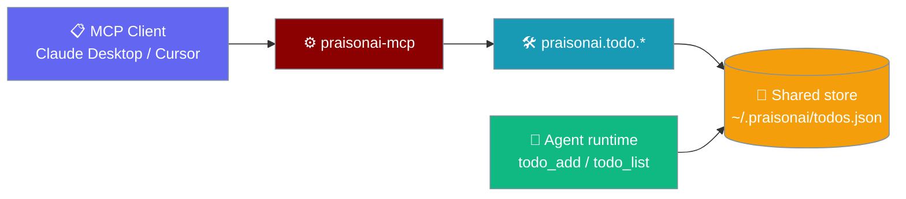
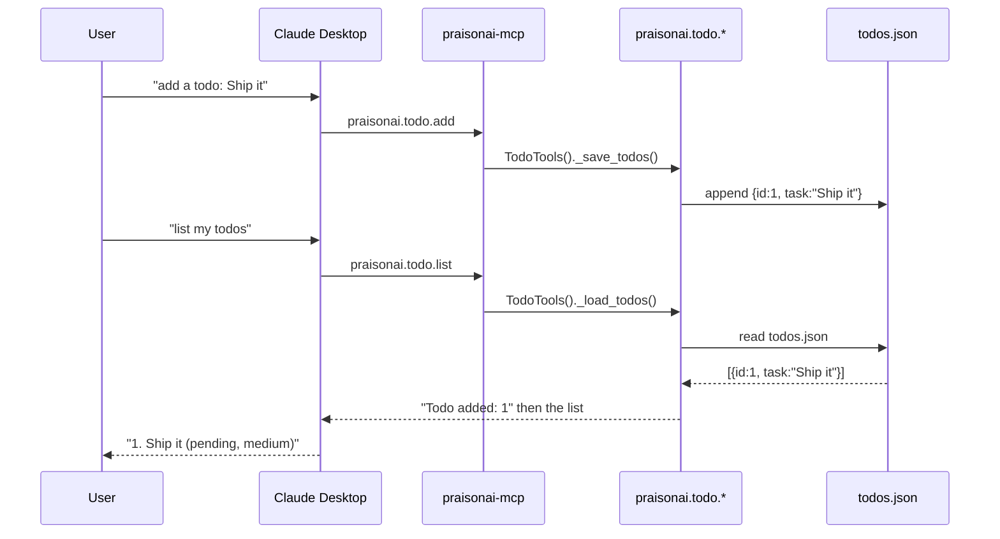

The `praisonai-mcp` host exposes four MCP tools that read and write the **same** todo store as the agent runtime (`todo_add` / `todo_list` / `todo_update`) — a todo added in Claude Desktop is visible to the runtime on the same machine, and vice versa.

```python
from praisonaiagents import Agent

agent = Agent(name="Planner", instructions="Break work into small todos.")
agent.start("Plan a REST API")
```

Run `praisonai-mcp serve --transport stdio`, point Claude Desktop at it, and the assistant can list, add, complete, and delete the same todos.



## Quick Start

<Steps>
  <Step title="Serve the host">
    ```bash
    praisonai-mcp serve --transport stdio
    ```
  </Step>
  <Step title="Add a todo from an agent run">
    ```python
    from praisonaiagents import Agent

    agent = Agent(name="Planner", instructions="Break work into small todos.")
    agent.start("Plan the release")
    ```
  </Step>
  <Step title="Read it back from your client">
    In Claude Desktop:
    > List my todos.

    The assistant calls `praisonai.todo.list` and sees the todo the runtime wrote.
  </Step>
</Steps>

---

## Tools

Four tools share the runtime's store and record schema (`id` int, `task`, `priority`, `category`, `status`).

| Tool | Arguments | Description |
|------|-----------|-------------|
| `praisonai.todo.list` | — | List every todo. Returns `"No todos found"` when the store is empty. |
| `praisonai.todo.add` | `content` (str), `priority` (str, default `"medium"`) | Append a todo. Returns `"Todo added: <id>"` where `id` is `max(existing) + 1` (starts at `1`). |
| `praisonai.todo.complete` | `todo_id` (str) | Mark the matching todo `completed`. `todo_id` is compared to the runtime's integer id as a string, so both `"1"` and `1` match. Returns `"Todo completed: <id>"`, or `"Todo not found: <id>"` if no match. |
| `praisonai.todo.delete` | `todo_id` (str) | Delete the matching todo. Returns `"Todo deleted: <id>"`, or `"Todo not found: <id>"` when nothing matched — a real error, not the silent no-op of the old code. |

<Note>
The four tools were rebound to the runtime store in PraisonAI PR [#4962](https://github.com/MervinPraison/PraisonAI/pull/4962). Before that fix they wrote to `~/.praison/todo.json` in an incompatible schema (`id` as a UUID string, field name `content`) and were completely invisible to the runtime. If your workflow depended on the old path, migrate any records into `~/.praisonai/todos.json` (or your workspace's `todos.json`).
</Note>

---

## Record Shape

The store is a JSON array — each todo carries an integer `id` and a `task` field.

```json
[
  {
    "id": 1,
    "task": "Ship the release",
    "priority": "high",
    "category": "general",
    "status": "pending",
    "created_at": "2026-09-08T15:00:00Z"
  }
]
```

Same shape the agent runtime writes — MCP-created and runtime-created todos read each other's records field-for-field.

---

## Store Location

The MCP tools resolve the same file path as `praisonaiagents.tools.todo_tools.TodoTools._get_todo_file()`.

| When | Path |
|------|------|
| A workspace is active | `<workspace>/todos.json` |
| No workspace | `~/.praisonai/todos.json` |

Never `~/.praison/todo.json` — that was the old wrong path and is no longer read or written by any surface.

---

## End-to-End Flow



---

## Best Practices

<AccordionGroup>
  <Accordion title="Workspace switches the visible list">
    A todo added inside `~/code/api-service/` writes to `~/code/api-service/todos.json`. Switching directories switches the visible list — useful for keeping unrelated todos apart.
  </Accordion>
  <Accordion title="Ids are integers under the hood">
    The public MCP surface accepts strings, but the underlying id is an integer. `str(id)` is safe; parse ids back as `int`.
  </Accordion>
  <Accordion title="Delete is safe to retry">
    `praisonai.todo.delete` returns `"Todo not found: <id>"` when nothing matched, so a client can repeat a delete without failing hard.
  </Accordion>
  <Accordion title="Migrate off the old path">
    Any tooling that reads `~/.praison/todo.json` is looking at the pre-#4962 layout, which is no longer written. Migrate to `~/.praisonai/todos.json` or the workspace `todos.json`.
  </Accordion>
</AccordionGroup>

---

## Related

<CardGroup cols={2}>
  <Card title="Todo CLI" icon="terminal" href="/cli/todo">
    Manage todos from the shell.
  </Card>
  <Card title="MCP Memory Tools" icon="brain" href="/features/mcp-memory-tools">
    Four memory tools this host also exposes.
  </Card>
  <Card title="praisonai-mcp Package" icon="plug" href="/features/praisonai-mcp-package">
    The heavy MCP host that registers these tools.
  </Card>
  <Card title="Server: PraisonAI MCP" icon="server" href="/deploy/servers/praisonai-mcp">
    Deploying the full MCP host.
  </Card>
</CardGroup>
