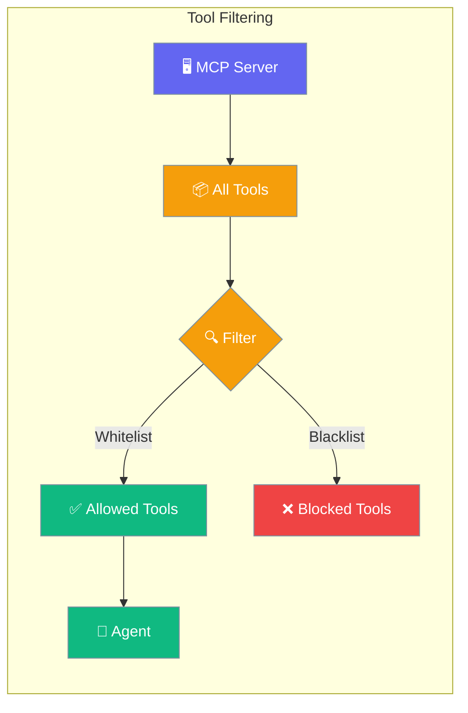
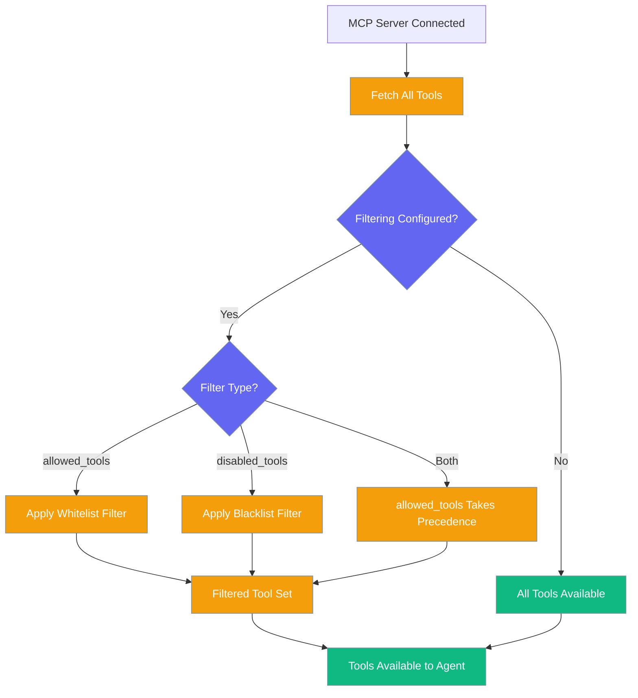
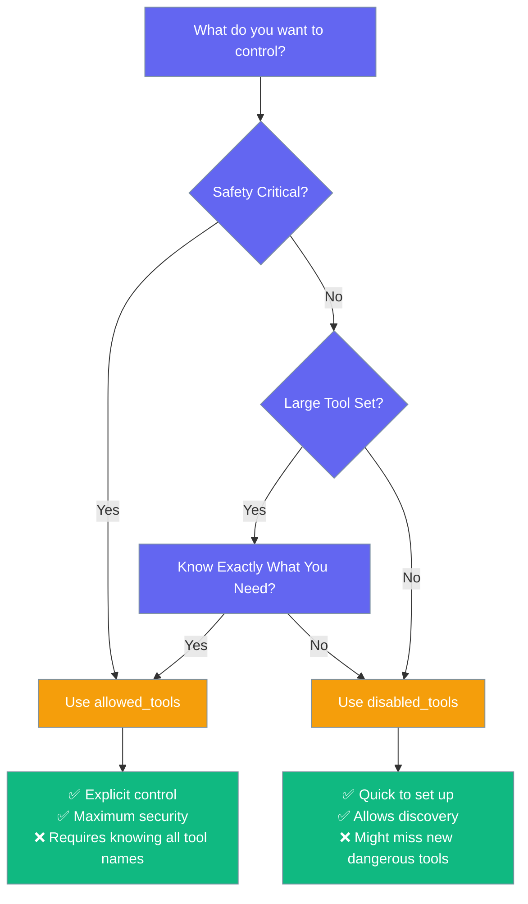

Filter MCP tools to control which capabilities agents have access to, improving security and reducing complexity.



## Quick Start

<Steps>
<Step title="Whitelist Specific Tools">
Only allow safe file operations:
```python
from praisonaiagents import Agent
from praisonaiagents.mcp import MCP

agent = Agent(
    name="safe-fs",
    instructions="Read files when asked",
    tools=MCP(
        "npx -y @modelcontextprotocol/server-filesystem /tmp",
        allowed_tools=["read_file", "list_directory"],
    ),
)
agent.start("What files are in /tmp?")
```
</Step>

<Step title="Blacklist Dangerous Tools">
Block destructive operations:
```python
from praisonaiagents import Agent
from praisonaiagents.mcp import MCP

agent = Agent(
    name="no-destructive",
    instructions="Help with GitHub tasks safely",
    tools=MCP(
        "npx -y @modelcontextprotocol/server-github",
        disabled_tools=["delete_repository", "delete_issue"],
    ),
)
```
</Step>
</Steps>

---

## How It Works



**Precedence Rule:** If both `allowed_tools` and `disabled_tools` are specified, **`allowed_tools` wins** (include takes precedence over exclude).

---

## Configuration Options

| Option | Type | Default | Description |
|--------|------|---------|-------------|
| `allowed_tools` | `List[str]` | `None` | Whitelist — only these tools exposed to the agent (None = all tools) |
| `disabled_tools` | `List[str]` | `None` | Blacklist — these tools filtered out (None = no exclusions) |

---

## Common Patterns

### Safety-First Agent

Restrict to read-only operations:

```python
from praisonaiagents import Agent
from praisonaiagents.mcp import MCP

# File system - read only
safe_agent = Agent(
    name="reader",
    instructions="Help users understand file contents",
    tools=MCP(
        "npx -y @modelcontextprotocol/server-filesystem /workspace",
        allowed_tools=["read_file", "list_directory"]
    )
)
```

### Remove Dangerous Operations

Block specific risky tools:

```python
from praisonaiagents import Agent
from praisonaiagents.mcp import MCP

# GitHub without destructive actions
github_agent = Agent(
    name="github-safe",
    instructions="Help with GitHub tasks safely",
    tools=MCP(
        "npx -y @modelcontextprotocol/server-github", 
        disabled_tools=[
            "delete_repository",
            "delete_issue", 
            "delete_pull_request",
            "force_push"
        ]
    )
)
```

### Multi-Server Filtering

Apply different filters to different servers:

```python
from praisonaiagents import Agent
from praisonaiagents.mcp import MCP

# Combine filtered servers
agent = Agent(
    name="secure-developer",
    tools=[
        # Filesystem - read only
        MCP(
            "npx -y @modelcontextprotocol/server-filesystem .",
            allowed_tools=["read_file", "list_directory"]
        ),
        # GitHub - no deletions
        MCP(
            "npx -y @modelcontextprotocol/server-github",
            disabled_tools=["delete_repository", "delete_issue"]
        )
    ]
)
```

---

## When to Use Which Filter



**Use `allowed_tools` when:**
- Security is critical
- You know exactly which tools you need
- Working with untrusted or powerful servers

**Use `disabled_tools` when:**
- You want most tools but need to block a few
- Rapid prototyping with tool discovery
- Working with generally safe servers

---

## Best Practices

<AccordionGroup>
<Accordion title="Start with Whitelist for Security">
For security-sensitive applications, use `allowed_tools` to explicitly control capabilities. It's safer to add tools as needed than to discover dangerous ones later.
</Accordion>

<Accordion title="Document Your Filtering Decisions">
When using filters, comment why specific tools are allowed or blocked. This helps with maintenance and team understanding.
</Accordion>

<Accordion title="Test Tool Availability">
Before deploying, verify that your filtered tool set provides the capabilities your agent needs. Use `praisonai mcp test` to inspect available tools.
</Accordion>

<Accordion title="Consider Tool Dependencies">
Some tools might depend on others. When whitelisting, ensure you include all necessary tools for complete workflows.
</Accordion>
</AccordionGroup>

---

## Related

<CardGroup cols={2}>
<Card title="Load MCP Tools" icon="plug" href="/features/load-mcp-tools">
  Wire configured MCP servers into agents with one line
</Card>
<Card title="MCP Client Protocol" icon="code" href="/features/mcp-client-protocol">
  Protocol interface for MCP client implementations
</Card>
</CardGroup>