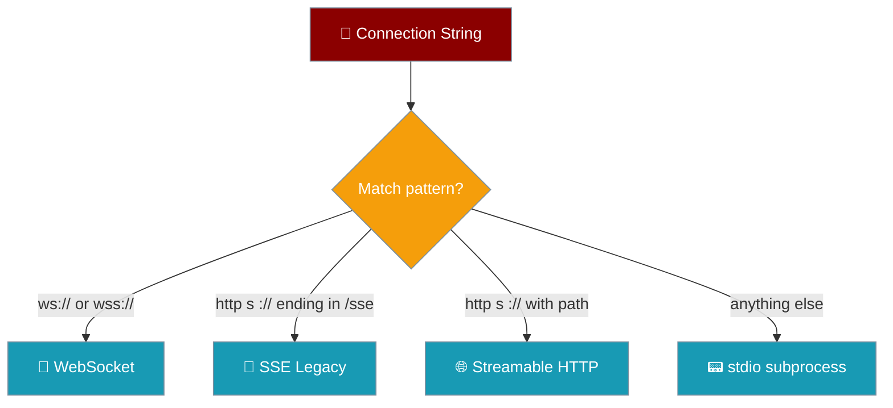
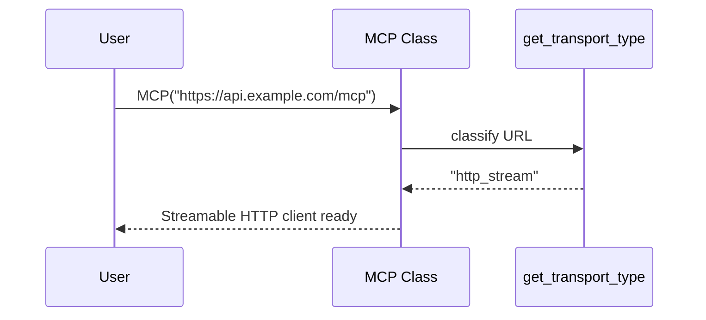

The `MCP` class reads your connection string and picks the right transport automatically — you never set a transport flag.

```python
from praisonaiagents import Agent, MCP

agent = Agent(
    name="Assistant",
    instructions="You help users with external tools.",
    tools=MCP("https://api.example.com/mcp"),  # transport auto-detected
)

agent.start("Use the available tools to help me.")
```

The user passes one URL; the agent connects over Streamable HTTP because the URL is `http(s)://` with a path.



## Quick Start

<Steps>

<Step title="Streamable HTTP (path required)">
```python
from praisonaiagents import Agent, MCP

agent = Agent(
    tools=MCP("https://api.example.com/mcp")
)
```
</Step>

<Step title="stdio, SSE, or WebSocket">
```python
from praisonaiagents import Agent, MCP

# stdio subprocess
agent = Agent(tools=MCP("npx @modelcontextprotocol/server-memory"))

# Legacy SSE (URL ends in /sse)
agent = Agent(tools=MCP("http://localhost:8080/sse"))

# WebSocket
agent = Agent(tools=MCP("wss://api.example.com/mcp"))
```
</Step>

</Steps>

---

## Detection Rules

The `MCP` class routes URL classification through a single helper, `get_transport_type`, so every transport follows the same rules.

| URL Pattern | Transport | Example |
|-------------|-----------|---------|
| `ws://` or `wss://` | WebSocket | `ws://localhost:8080/mcp` |
| `http(s)://...` ending in `/sse` | SSE (Legacy) | `http://localhost:8080/sse` |
| `http(s)://<host><path>` (path required) | Streamable HTTP | `https://api.example.com/mcp` |
| Command string | stdio | `npx @mcp/server-memory` |

<Note>
For Streamable HTTP, the URL is used verbatim — include the endpoint path your server exposes (commonly `/mcp`). A bare-host URL will POST to `/` and fail with `Session terminated`. See [PraisonAI #3032](https://github.com/MervinPraison/PraisonAI/issues/3032).
</Note>

---

## How It Works

The helper checks the URL scheme and suffix in order, then defaults to stdio for anything that is not a URL.



| Check | Result |
|-------|--------|
| Matches `wss?://` | `websocket` |
| Matches `https?://` and ends in `/sse` | `sse` |
| Matches `https?://` with any other path | `http_stream` |
| Anything else | `stdio` |

---

## Common Patterns

Override auto-detection only when you must — pass a URL that already fits the transport you want.

```python
from praisonaiagents import Agent, MCP

# Force legacy SSE by using a /sse URL
agent = Agent(tools=MCP("http://localhost:8080/sse"))

# Force Streamable HTTP by including a path
agent = Agent(tools=MCP("https://api.example.com/mcp"))
```

---

## Best Practices

<AccordionGroup>
  <Accordion title="Always include a path for HTTP servers">
    A bare `https://host` POSTs to `/` and fails with `Session terminated`. Pass the full endpoint, commonly `/mcp`.
  </Accordion>

  <Accordion title="Use /sse only for legacy servers">
    URLs ending in `/sse` select the deprecated SSE transport. Prefer Streamable HTTP for new servers.
  </Accordion>

  <Accordion title="Use ws:// or wss:// for real-time">
    WebSocket is auto-detected from the scheme and suits long-lived, bidirectional connections.
  </Accordion>

  <Accordion title="Command strings default to stdio">
    Anything that is not a URL runs as a local subprocess over stdio.
  </Accordion>
</AccordionGroup>

---

## Related

<CardGroup cols={2}>
  <Card title="MCP Transports" icon="network-wired" href="/mcp/transports">
    Full guide to each transport
  </Card>
  <Card title="MCP Integration" icon="plug" href="/features/mcp">
    Connect agents to MCP servers
  </Card>
</CardGroup>
