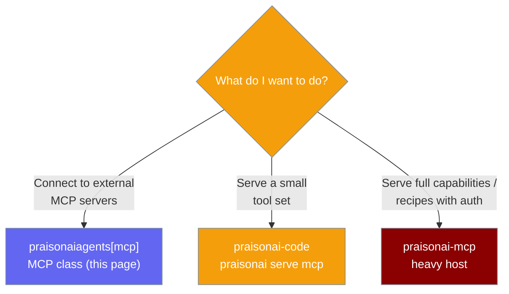
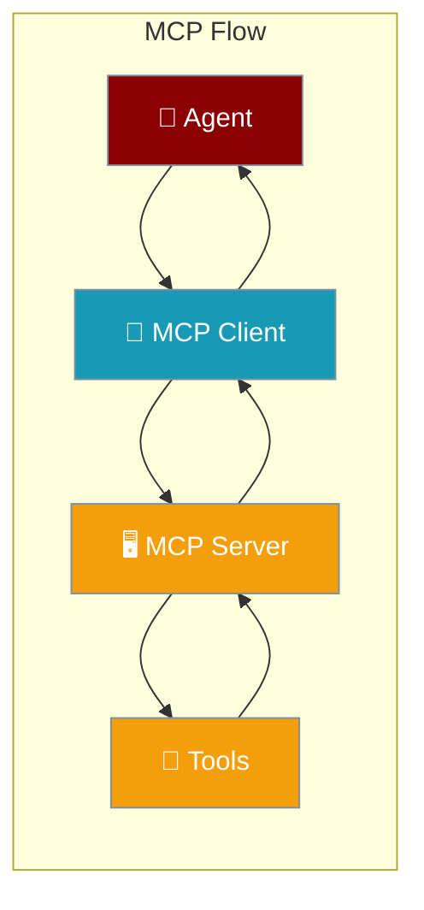
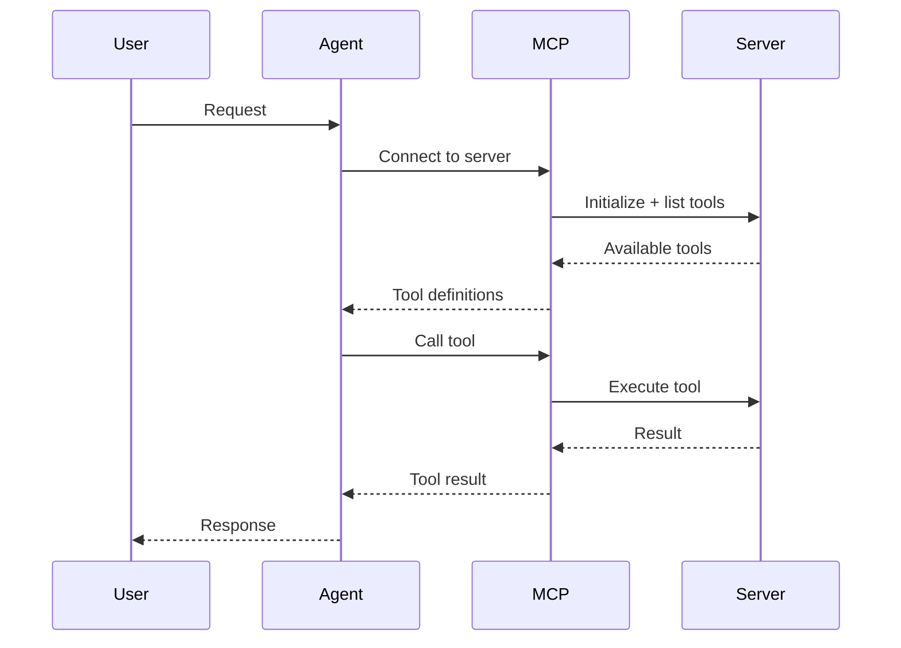
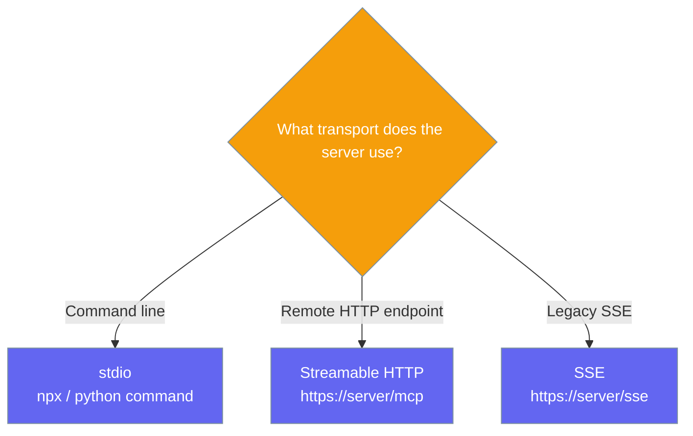
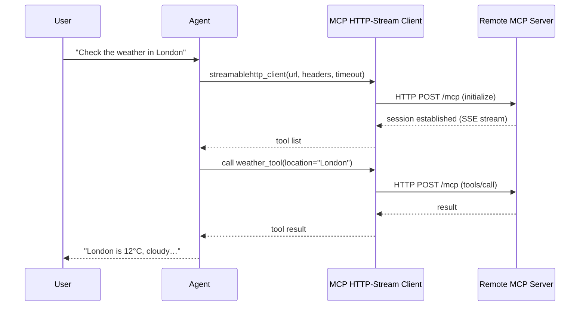

MCP (Model Context Protocol) lets agents connect to external tool servers, instantly adding file system access, database queries, API integrations, and more.

```python
from praisonaiagents import Agent, MCP

agent = Agent(
    name="FileAgent",
    instructions="You help users manage their files.",
    tools=MCP("npx -y @modelcontextprotocol/server-filesystem /tmp"),
)

agent.start("List all files in the /tmp directory.")
```

The user asks to inspect the filesystem; the agent calls MCP tools on the connected server.

## Which MCP package do I need?

Three packages cover three MCP roles — connecting, light serving, and full hosting.



This page covers the **client** layer. To serve your own agents, see the [praisonai-mcp Package](/docs/features/praisonai-mcp-package) and [The Three MCP Layers](/docs/features/mcp-three-layers).



## Quick Start

<Steps>
<Step title="Connect to an MCP server">
```python
from praisonaiagents import Agent, MCP

agent = Agent(
    instructions="You can read and write files.",
    tools=MCP("npx -y @modelcontextprotocol/server-filesystem /tmp"),
)
agent.start("Create a file called notes.txt with the text 'Hello World'.")
```
</Step>

<Step title="SSE-based MCP server">
```python
from praisonaiagents import Agent, MCP

agent = Agent(
    instructions="You can search and retrieve web content.",
    tools=MCP("https://mcp.example.com/sse"),
)
agent.start("Search for the latest news about AI.")
```
</Step>

<Step title="Streamable HTTP MCP server">
```python
from praisonaiagents import Agent, MCP

# Streamable HTTP endpoint — auto-detected from the URL
agent = Agent(
    name="RemoteToolAgent",
    instructions="Use the remote MCP tools to answer the user.",
    tools=MCP(
        "https://api.example.com/mcp",
        headers={"Authorization": "Bearer YOUR_TOKEN"},
        timeout=60,
    ),
)

agent.start("List the tools you have and use them to check the current weather in London.")
```

Requires an up-to-date `mcp` package (`pip install -U 'mcp'`). The transport is powered by the official SDK's `streamablehttp_client`.

Pass the full endpoint URL your server exposes. Bare-host URLs are no longer rewritten to `/mcp` (see [PraisonAI #3032](https://github.com/MervinPraison/PraisonAI/issues/3032)).
</Step>

<Step title="Multiple MCP servers">
```python
from praisonaiagents import Agent, MCP

filesystem_tools = MCP("npx -y @modelcontextprotocol/server-filesystem /home/user")
database_tools = MCP("npx -y @modelcontextprotocol/server-sqlite /db/app.sqlite")

agent = Agent(
    instructions="You manage files and database records.",
    tools=[*filesystem_tools, *database_tools],
)
agent.start("Read the config file and update the database with its settings.")
```
</Step>
</Steps>

---

## How It Works



| Phase | What happens |
|---|---|
| 1. Connect | MCP client connects to the server on first use |
| 2. Discover | Server reports its available tools |
| 3. Execute | Agent calls tools via the MCP protocol |
| 4. Return | Results flow back through the MCP client to the agent |

---

## MCP Server Types



Remote Streamable HTTP servers connect through the official MCP SDK client.



---

## Common Patterns

### Pattern 1 — File management agent
```python
from praisonaiagents import Agent, MCP

agent = Agent(
    name="FileManager",
    instructions="You help users organize and manage their files efficiently.",
    tools=MCP("npx -y @modelcontextprotocol/server-filesystem /home/user/documents"),
)
response = agent.start("Find all PDF files and create a summary list.")
print(response)
```

### Pattern 2 — Database agent
```python
from praisonaiagents import Agent, MCP

agent = Agent(
    name="DBAgent",
    instructions="You query and analyze database records.",
    tools=MCP("npx -y @modelcontextprotocol/server-sqlite /path/to/database.sqlite"),
)
agent.start("Show me all users who signed up in the last 30 days.")
```

### Pattern 3 — GitHub integration
```python
from praisonaiagents import Agent, MCP
import os

agent = Agent(
    name="GitHubAgent",
    instructions="You help manage GitHub repositories and issues.",
    tools=MCP(
        "npx -y @modelcontextprotocol/server-github",
        env={"GITHUB_PERSONAL_ACCESS_TOKEN": os.environ["GITHUB_TOKEN"]},
    ),
)
agent.start("List the 5 most recent open issues in my repository.")
```

---

## Best Practices

<AccordionGroup>
<Accordion title="Use official MCP servers">
Start with the official `@modelcontextprotocol` npm packages for common integrations (filesystem, SQLite, GitHub, etc.). They're well-tested and actively maintained.
</Accordion>

<Accordion title="Scope filesystem access">
When using the filesystem MCP server, pass the narrowest directory path you need. Giving access to `/` or `/home` when you only need `/app/data` creates unnecessary risk.
</Accordion>

<Accordion title="Environment variables for credentials">
Never hardcode API keys or tokens in your code. Pass them as environment variables to the MCP server via the `env` parameter, and source them from your environment or secrets manager.
</Accordion>

<Accordion title="Combine multiple servers">
Agents can use tools from multiple MCP servers simultaneously. Unpack each server's tools with `*MCP(...)` and combine them into a single `tools` list for maximum capability. Loading via [`load_mcp_tools`](/docs/features/load-mcp-tools) auto-namespaces each server's tools (e.g. `filesystem_search`, `github_search`) so overlapping names never collide.
</Accordion>
</AccordionGroup>

---

## Related

<CardGroup cols={2}>
<Card icon="wrench" href="/docs/features/tools">
  Tools — built-in tools and custom tool functions
</Card>
<Card icon="plug" href="/docs/features/mcp-tool-filtering">
  MCP Tool Filtering — filter which tools to expose per agent
</Card>
</CardGroup>
