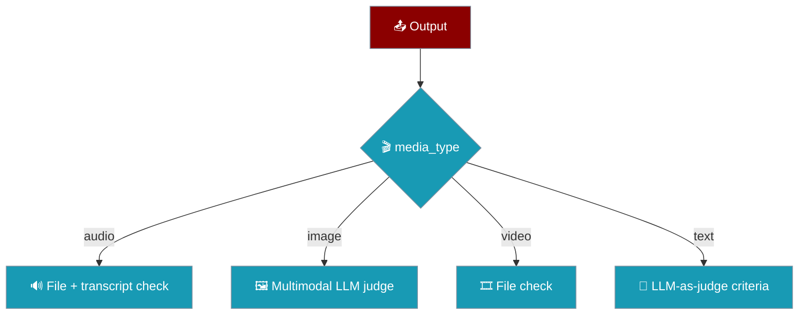

Media Evaluator scores audio, image, video, and text outputs from specialised agent pipelines, using multimodal LLM-as-judge for images and text and file checks for audio and video.


## Quick Start

<Steps>
<Step title="Grade an agent's text output">

Run an agent, then score its output against a text criteria — no file needed:

```python
from praisonaiagents import Agent
from praisonaiagents.eval import MediaEvaluator

agent = Agent(instructions="You are a friendly greeter")
output = agent.start("Greet a new user")

evaluator = MediaEvaluator(
    media_type="text",
    criteria="Greeting is warm and welcoming",
)
result = evaluator.run(output=output, print_summary=True)
print(result.score, result.passed)
```

</Step>

<Step title="Evaluate an image">

Score a generated image against a criteria with a multimodal model:

```python
from praisonaiagents.eval import MediaEvaluator

evaluator = MediaEvaluator(
    media_type="image",
    criteria="Image shows a red bicycle on a city street",
)
result = evaluator.run(output="https://example.com/bicycle.png")
print(result.score, result.reasoning)
```

</Step>

<Step title="Evaluate audio against expected text">

Transcribe a TTS file and compare it to an expected transcript:

```python
from praisonaiagents.eval import MediaEvaluator

evaluator = MediaEvaluator(
    media_type="audio",
    expected_text="Hello world",
)
result = evaluator.run(file_path="/tmp/output.mp3")
print(result.score, result.metadata)
```

</Step>

<Step title="Auto-detect from a file extension">

Let the evaluator pick the branch from the file extension:

```python
from praisonaiagents.eval import MediaEvaluator

evaluator = MediaEvaluator(media_type="auto")
result = evaluator.run(output="/tmp/render.mp4", print_summary=True)
print(result.media_type, result.passed)
```

</Step>
</Steps>

---

## How It Works

The evaluator routes the output to one of four branches, either from `media_type` or by auto-detection.



| Branch | What it checks |
|--------|----------------|
| **audio** | File exists and is above `min_file_size`. With `expected_text`, transcribes and scores word-overlap similarity (passes at ≥ 0.7). |
| **image** | Extracts the image URL. With `criteria` or `expected_content`, a multimodal model scores it (passes at ≥ 7.0); otherwise confirms the image was generated. |
| **video** | File exists and is above `min_file_size`, or a video URL is present. |
| **text** | With `criteria`, an LLM scores the text (passes at ≥ 7.0); otherwise confirms non-empty output. |

Auto-detection reads the file extension (`.mp3`/`.wav`/`.ogg`/`.flac`/`.m4a` → audio, `.png`/`.jpg`/`.jpeg`/`.gif`/`.webp` → image, `.mp4`/`.avi`/`.mov`/`.webm` → video) and the LiteLLM response class (`ImageResponse`, `HttpxBinaryResponseContent`, `VideoResponse`), falling back to text.

---

## Configuration Options

Every field on `MediaEvaluator`:

| Option | Type | Default | Description |
|--------|------|---------|-------------|
| `media_type` | `Literal["audio","image","video","text","auto"]` | `"auto"` | Which branch to run. `auto` detects from file extension or LiteLLM response class. |
| `criteria` | `Optional[str]` | `None` | Custom criteria for LLM-as-judge (image and text branches). |
| `expected_text` | `Optional[str]` | `None` | Reference transcript for audio comparison. |
| `expected_content` | `Optional[str]` | `None` | Reference description for image/video comparison. |
| `min_file_size` | `int` | `100` | Minimum acceptable file size in bytes. |
| `model` | `Optional[str]` | `None` (→ `OPENAI_MODEL_NAME` or `gpt-4o-mini`) | LLM for text/image judging. |
| `verbose` | `bool` | `False` | Enable verbose logging. |
| `name` | `Optional[str]` | `None` | Evaluation name. |
| `save_results_path` | `Optional[str]` | `None` | Path to persist the result JSON. |

**Methods**

| Method | Returns | Purpose |
|--------|---------|---------|
| `run(output=None, file_path=None, print_summary=False)` | `MediaEvaluationResult` | Routes to the branch and returns the result. |
| `evaluate(output, file_path=None)` | `MediaEvaluationResult` | Same routing without the summary print. |

<Card title="Eval Module Reference" icon="code" href="/docs/sdk/reference/praisonaiagents/modules/eval">
  Full Python API for the eval package
</Card>

---

## MediaEvaluationResult

`run()` returns a `MediaEvaluationResult` with these fields:

| Field | Type | Description |
|-------|------|-------------|
| `media_type` | `str` | Branch that ran (`audio`, `image`, `video`, or `text`). |
| `passed` | `bool` | Whether the output met the branch's pass condition. |
| `score` | `float` | Quality score on a 1–10 scale. |
| `reasoning` | `str` | Explanation for the score. |
| `file_path` | `Optional[str]` | Path of the evaluated file, when applicable. |
| `file_size` | `Optional[int]` | Size of the evaluated file in bytes, when applicable. |
| `metadata` | `Dict[str, Any]` | Branch-specific extras (e.g. transcription, image URL). |

---

## Response Format

The image and text branches ask the model for a `SCORE:` / `REASONING:` response and parse it into `score` and `reasoning`. See the [Judge response format](/docs/eval/judge#response-format) note for the full rules.

---

## Common Patterns

Gate an image-generation agent so only on-brief renders pass:

```python
from praisonaiagents.eval import MediaEvaluator

evaluator = MediaEvaluator(
    media_type="image",
    expected_content="A minimalist logo with a blue circle",
)
result = evaluator.run(output=image_response)
assert result.passed
```

Auto-detect a mixed pipeline that emits either audio or video:

```python
from praisonaiagents.eval import MediaEvaluator

evaluator = MediaEvaluator(media_type="auto", min_file_size=1024)
result = evaluator.run(output=pipeline_output_path)
```

Add media checks to an `EvalSuite` run:

```python
from praisonaiagents.eval import MediaEvaluator, EvalSuite

evaluator = MediaEvaluator(
    media_type="text",
    criteria="Summary is concise and accurate",
    name="summary_quality",
)
report = EvalSuite(evaluators=[evaluator], name="media_suite").run(print_summary=True)
```

---

## Best Practices

<AccordionGroup>
<Accordion title="Use expected_text for TTS regression, criteria for subjective checks">
Set `expected_text` when you have a known transcript — the audio branch transcribes and scores word-overlap similarity. Use `criteria` for image and text branches when the check is subjective ("looks professional", "reads clearly").
</Accordion>
<Accordion title="Set min_file_size above your codec's empty-file threshold">
A codec that writes headers still produces a tiny file on failure. Raise `min_file_size` above that threshold so silent or blank renders fail the file check instead of passing.
</Accordion>
<Accordion title="Pass media_type explicitly when the extension is ambiguous">
Auto-detection reads by file extension and by LiteLLM response class (`ImageResponse`, `HttpxBinaryResponseContent`, `VideoResponse`). When an output has no extension or an unusual one, set `media_type` explicitly to pick the right branch.
</Accordion>
<Accordion title="Scores are on a 1–10 scale like the other evaluators">
The image and text branches score 1–10 and pass at ≥ 7.0, matching the threshold used across the eval framework, so mixed suites compare cleanly.
</Accordion>
</AccordionGroup>

---

## Related

<CardGroup cols={2}>
  <Card title="Judge" icon="gavel" href="/docs/eval/judge">
    LLM-as-judge for evaluating outputs
  </Card>
  <Card title="Harness Evaluator" icon="flask" href="/docs/features/harness-evaluator">
    Score harness traces into an EvalSuite report
  </Card>
  <Card title="Context Evaluator" icon="shuffle" href="/docs/features/context-evaluator">
    Score multi-agent handoff fidelity
  </Card>
  <Card title="Evaluation" icon="chart-line" href="/docs/concepts/evaluation">
    Evaluators, suites, and reports
  </Card>
</CardGroup>
