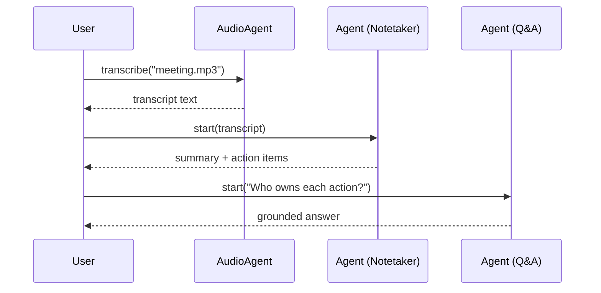
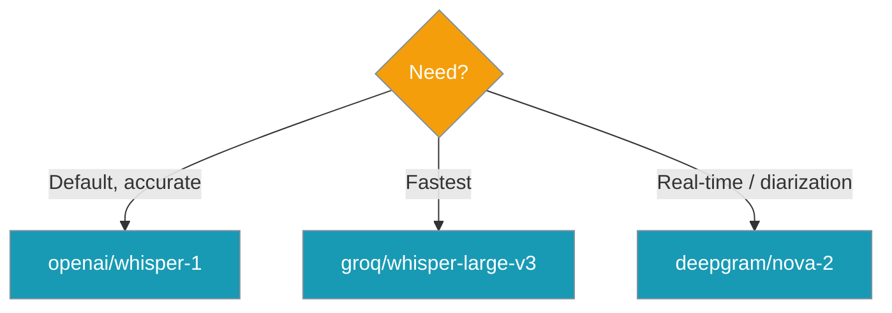

Turn a meeting recording into a concise summary, action items, and a follow-up Q&A agent using three stock primitives.


## Quick Start

<Steps>
<Step title="Simple Usage">
Transcribe a recording, then produce notes.

```python
from praisonaiagents import Agent, AudioAgent

transcript = AudioAgent(llm="openai/whisper-1").transcribe("meeting.mp3")

notes = Agent(
    name="Meeting Notetaker",
    instructions="Produce a concise summary, key decisions, and action items with owners.",
).start(f"Transcript:\n\n{transcript}")

print(notes)
```
</Step>

<Step title="Add Q&A">
Save the transcript to disk and index it so an agent can answer follow-up questions.

```python
with open("meeting_transcript.txt", "w") as f:
    f.write(transcript)

qa = Agent(
    name="Meeting Q&A",
    instructions="Answer using only the indexed meeting transcript. Cite what was said.",
    knowledge=["meeting_transcript.txt"],
)
print(qa.start("What were the action items and who owns them?"))
```
</Step>
</Steps>

---

## How It Works

Three primitives run in sequence: transcribe, summarise, then answer questions.



| Stage | Primitive | Purpose |
|-------|-----------|---------|
| Transcribe | `AudioAgent.transcribe()` | Convert audio to text (Whisper / any LiteLLM STT provider) |
| Summarise | `Agent(...).start()` | Extract summary, decisions, action items |
| Q&A | `Agent(knowledge=[...])` | RAG over the transcript for follow-up questions |

---

## User Interaction Flow

Drop a recording into the folder, run the script, read the notes, then keep asking questions.

```python
from praisonaiagents import Agent, AudioAgent

transcript = AudioAgent(llm="openai/whisper-1").transcribe("meeting.mp3")

with open("meeting_transcript.txt", "w") as f:
    f.write(transcript)

qa = Agent(
    name="Meeting Q&A",
    instructions="Answer using only the indexed meeting transcript.",
    knowledge=["meeting_transcript.txt"],
)

while True:
    question = input("\nAsk about the meeting (or 'quit'): ")
    if question.strip().lower() in {"quit", "exit"}:
        break
    print(qa.start(question))
```

---

## Full Example

The complete script composes all three primitives end to end.

<Tabs>
<Tab title="Full script">
```python
from praisonaiagents import Agent, AudioAgent

TRANSCRIPT_PATH = "meeting_transcript.txt"


def transcribe_meeting(audio_path: str) -> str:
    """Convert a meeting recording to text with Whisper."""
    audio = AudioAgent(llm="openai/whisper-1")
    return audio.transcribe(audio_path)


def write_notes(transcript: str) -> str:
    """Summarise the transcript into notes and action items."""
    notetaker = Agent(
        name="Meeting Notetaker",
        instructions=(
            "Produce a concise summary, key decisions, and action items with "
            "owners and due dates. Only use what is in the transcript."
        ),
    )
    return notetaker.start(f"Transcript:\n\n{transcript}")


def build_qa_agent(transcript: str) -> Agent:
    """Index the transcript so an agent can answer follow-up questions."""
    with open(TRANSCRIPT_PATH, "w") as f:
        f.write(transcript)

    return Agent(
        name="Meeting Q&A",
        instructions="Answer using only the indexed meeting transcript. Cite what was said.",
        knowledge=[TRANSCRIPT_PATH],
    )


def main():
    transcript = transcribe_meeting("meeting.mp3")

    print("=== Notes ===")
    print(write_notes(transcript))

    qa = build_qa_agent(transcript)
    print("\n=== Q&A ===")
    print(qa.start("What were the action items and who owns them?"))


if __name__ == "__main__":
    main()
```
</Tab>

<Tab title="Shortened">
```python
from praisonaiagents import Agent, AudioAgent

transcript = AudioAgent(llm="openai/whisper-1").transcribe("meeting.mp3")

print(Agent(
    name="Meeting Notetaker",
    instructions="Summarise decisions and action items with owners.",
).start(f"Transcript:\n\n{transcript}"))

with open("meeting_transcript.txt", "w") as f:
    f.write(transcript)

qa = Agent(name="Meeting Q&A", knowledge=["meeting_transcript.txt"])
print(qa.start("What were the action items and who owns them?"))
```
</Tab>
</Tabs>

---

## Choosing an STT Provider

Pass the provider string to `AudioAgent(llm=...)`. Start with Whisper, switch for speed or accuracy.



See [Audio Overview](/audio/overview), [Groq](/audio/groq), and [Deepgram](/audio/deepgram) for setup and exact model strings.

---

## Common Patterns

Save notes, batch a folder, or persist memory across meetings.

<Tabs>
<Tab title="Save to Markdown">
```python
from praisonaiagents import Agent, AudioAgent

transcript = AudioAgent(llm="openai/whisper-1").transcribe("meeting.mp3")
notes = Agent(
    name="Meeting Notetaker",
    instructions="Summarise decisions and action items with owners.",
).start(f"Transcript:\n\n{transcript}")

with open("notes.md", "w") as f:
    f.write(notes)
```
</Tab>

<Tab title="Batch a directory">
```python
import glob
from praisonaiagents import Agent, AudioAgent

audio = AudioAgent(llm="openai/whisper-1")

for path in glob.glob("recordings/*.mp3"):
    transcript = audio.transcribe(path)
    transcript_file = path.replace(".mp3", ".txt")
    with open(transcript_file, "w") as f:
        f.write(transcript)

    qa = Agent(name="Meeting Q&A", knowledge=[transcript_file])
    print(path, "->", qa.start("Summarise the action items."))
```
</Tab>

<Tab title="Persist with Memory">
```python
from praisonaiagents import Agent, AudioAgent

transcript = AudioAgent(llm="openai/whisper-1").transcribe("meeting.mp3")

with open("meeting_transcript.txt", "w") as f:
    f.write(transcript)

qa = Agent(
    name="Meeting Q&A",
    instructions="Answer from the transcript and remember past meetings.",
    knowledge=["meeting_transcript.txt"],
    memory=True,
)
print(qa.start("How does this meeting compare to last week's?"))
```
</Tab>
</Tabs>

See [Memory](/concepts/memory) to persist context across meetings.

---

## Best Practices

<AccordionGroup>
<Accordion title="Keep the transcript on disk">
`knowledge=[...]` indexes files by path, so write the transcript to disk before passing it.
</Accordion>

<Accordion title="Match the model to the task">
Use a cheaper LLM for summarising long transcripts and a stronger one for Q&A accuracy.
</Accordion>

<Accordion title="Redact PII before persisting">
Meeting audio often contains personal data — strip sensitive details before saving transcripts.
</Accordion>

<Accordion title="Instruct the notetaker clearly">
Tell the notetaker to use only the transcript so it does not invent action items.
</Accordion>
</AccordionGroup>

---

## Related

<CardGroup cols={2}>
<Card title="Knowledge" icon="book" href="/concepts/knowledge">
  Index files for retrieval-augmented Q&A.
</Card>
<Card title="Audio Overview" icon="microphone" href="/audio/overview">
  Speech-to-text providers and setup.
</Card>
<Card title="Meeting Minutes Action Items" icon="clipboard-list" href="/examples/recipe-examples/meeting-minutes-action-items">
  Text-transcript recipe variant.
</Card>
<Card title="Memory" icon="brain" href="/concepts/memory">
  Persist context across meetings.
</Card>
</CardGroup>
