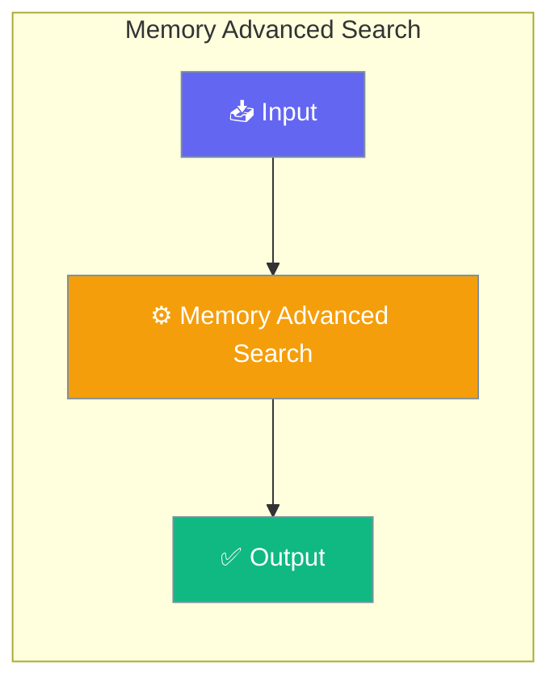

Memory search in PraisonAI Agents provides advanced parameters for better control over search results, including reranking for improved relevance and cutoff thresholds for quality control.




## Quick Start


<Steps>
<Step title="Simple Usage">
<CodeGroup>
```python Agent with Advanced Search
from praisonaiagents import Agent

# Agent with memory for advanced search
agent = Agent(
    instructions="Search and retrieve with quality filtering.",
    memory={
        "backend": "rag",
        "use_embedding": True
    }
)

# Chat stores to memory automatically
agent.start("Paris is the capital of France")
agent.start("Tokyo is the capital of Japan")

# Subsequent queries use memory with relevance filtering
response = agent.start("What is the capital of France?")
```
</Step>

<Step title="With Configuration">
```python Direct Memory API
from praisonaiagents import Memory

# Initialize memory with ChromaDB (local storage)
memory = Memory(config={
    "provider": "rag",
    "use_embedding": True,
    "rag_db_path": ".praison/memory_db"
})

# Store information
memory.store_long_term("Paris is the capital of France")

# Search with relevance cutoff
results = memory.search_long_term(
    "What is the capital of France?",
    relevance_cutoff=0.7,
    limit=5
)
```
</CodeGroup>
</Step>
</Steps>


## Best Practices

<AccordionGroup>
  <Accordion title="Start simple">
    Enable the feature with a single parameter before adding configuration. Verify it works, then layer in options.
  </Accordion>
  <Accordion title="Use environment variables for secrets">
    Never hardcode API keys or tokens. Use `os.getenv("KEY_NAME")` to read from environment variables.
  </Accordion>
  <Accordion title="Test with minimal examples first">
    Copy the Quick Start example, run it, then extend it. This confirms your environment is set up correctly.
  </Accordion>
  <Accordion title="Check the logs">
    Set `verbose=True` on your agent to see detailed execution logs when debugging unexpected behavior.
  </Accordion>
</AccordionGroup>

## Related

<CardGroup cols={2}>
  <Card title="Features Overview" icon="grid-2" href="/docs/features">
    Browse all PraisonAI features
  </Card>
  <Card title="Quick Start" icon="rocket" href="/docs/introduction">
    Get started with PraisonAI agents
  </Card>
</CardGroup>
