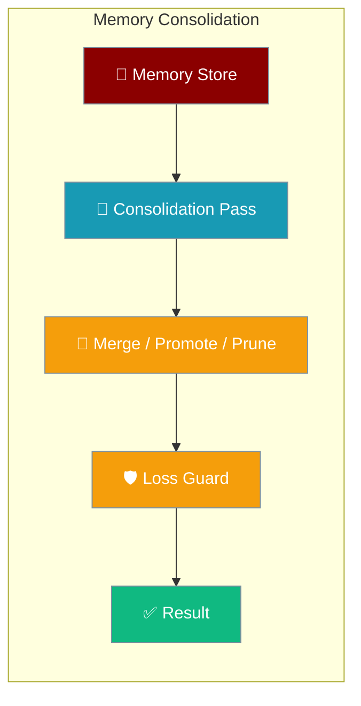
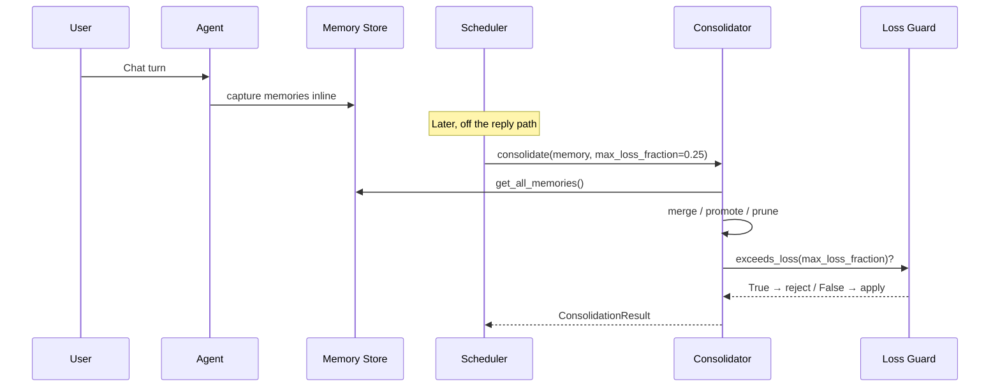
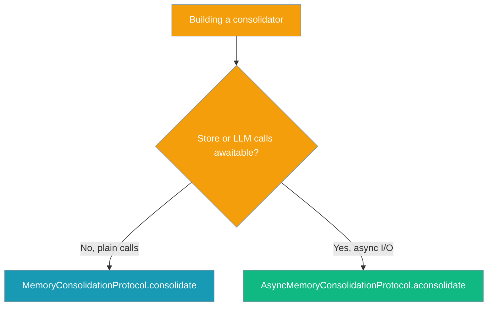

Memory consolidation runs a scheduled, off-hot-path pass that merges duplicate memories, promotes durable facts, and prunes stale entries — refusing any rewrite that would drop more than a set fraction of your store.



Long-lived agents capture memories inline during a turn, so the store accretes near-duplicate, never-pruned entries that degrade recall and grow token cost. Consolidation is the background maintenance pass that cleans it up safely.

<Note>
Today the **core SDK exposes the protocol and loss-guard contract only** — the `MemoryConsolidationProtocol` interface plus the `ConsolidationResult` math. The heavy LLM consolidation pass and its scheduling ship in `praisonai-plugins`. Until that plugin lands, you implement the protocol yourself and run it behind your own scheduler.
</Note>

## Quick Start

<Steps>
<Step title="Check a result under the loss guard">
Construct a `ConsolidationResult`, read `loss_fraction`, and ask the guard whether a pass drops too much.

```python
from praisonaiagents.memory import ConsolidationResult

result = ConsolidationResult(entries_before=100, entries_after=60)

print(result.loss_fraction)        # 0.4
print(result.exceeds_loss(0.25))   # True  → too lossy, reject it
print(result.exceeds_loss(0.5))    # False → within budget
```
</Step>

<Step title="Wire a consolidator to an Agent">
Implement `MemoryConsolidationProtocol` and hand it your agent's memory on a schedule — the agent keeps chatting while consolidation runs in the background.

```python
from praisonaiagents import Agent
from praisonaiagents.memory import ConsolidationResult, MemoryConsolidationProtocol

class MyConsolidator:
    def consolidate(self, memory, *, max_loss_fraction=0.25):
        before = memory.get_all_memories()
        # merge/promote/prune here, tracking surviving originals as `retained`
        after, retained = before, len(before)
        result = ConsolidationResult(
            entries_before=len(before),
            entries_after=len(after),
            retained_originals=retained,
        )
        if result.exceeds_loss(max_loss_fraction):
            result.rejected = True
            result.reason = "loss guard tripped"
            return result          # store left untouched
        return result

agent = Agent(name="Support", instructions="Help the user.", memory=True)

# Later, off the reply path (e.g. a nightly job):
consolidator = MyConsolidator()
result = consolidator.consolidate(agent._memory_instance)
print(result.merged, result.pruned, result.rejected)
```
</Step>
</Steps>

---

## How It Works

Consolidation is background maintenance: the user never invokes it mid-conversation — a scheduler runs it off-turn, and the loss guard decides whether the rewrite is applied.



The protocols are `@runtime_checkable`, so `isinstance` works at runtime, and both `consolidate` and `aconsolidate` carry a resolvable `ConsolidationResult` return annotation for introspection.

| Piece | Role |
|-------|------|
| `MemoryConsolidationProtocol` | Sync interface — implement `consolidate(memory, *, max_loss_fraction=0.25)`. |
| `AsyncMemoryConsolidationProtocol` | Async interface — implement `aconsolidate(...)`. |
| `ConsolidationResult` | Structured outcome plus the loss-guard math. |
| Scheduler | Runs the pass off the hot path (lives in `praisonai-plugins`). |

---

## Configuration Options

`ConsolidationResult` reports what a pass did and carries the loss-guard math. No `feature_configs.py` entry exists — this is a protocol, not a config class — so these are the fields the dataclass exposes.

| Field | Type | Default | Description |
|-------|------|---------|-------------|
| `entries_before` | `int` | `0` | Number of memory entries before the pass. |
| `entries_after` | `int` | `0` | Number of memory entries after the pass. |
| `merged` | `int` | `0` | How many entries were merged/deduplicated. |
| `promoted` | `int` | `0` | How many entries were promoted into a curated tier. |
| `pruned` | `int` | `0` | How many entries were pruned as stale/low-value. |
| `rejected` | `bool` | `False` | `True` if the loss guard tripped and the store was left untouched. |
| `reason` | `Optional[str]` | `None` | Human-readable explanation when `rejected=True`. |
| `retained_originals` | `Optional[int]` | `None` | How many original entries survived the rewrite; when set, `loss_fraction` is measured against this. |
| `context` | `Optional[Dict[str, Any]]` | `None` (→ `{}`) | Implementation-defined telemetry; defaults to `{}` via `__post_init__`. |

**Methods:**

| Member | Kind | Description |
|--------|------|-------------|
| `loss_fraction` | property | Fraction of *original* entries removed. Uses `retained_originals` when set, else net entry-count change. Returns `0.0` on an empty store and never goes negative. |
| `exceeds_loss(max_loss_fraction)` | method | `True` if the pass drops more than the allowed fraction. Fails closed — raises `ValueError` on a non-finite, out-of-range, or non-numeric threshold. |

---

## Loss-Guard Semantics

The loss guard is the invariant that keeps a bad rewrite from wiping your memory.

**Originals-based vs net-count loss.** `loss_fraction` normally divides the drop in entries by `entries_before`. When you set `retained_originals`, it instead measures how many *original* entries survived — which catches destructive rewrites that keep the count the same.

```python
from praisonaiagents.memory import ConsolidationResult

# Net-count loss: 100 → 60 removes 40%.
ConsolidationResult(entries_before=100, entries_after=60).loss_fraction  # 0.4

# Equal-size but destructive: 100 in, 100 out, but zero originals kept → 100% loss.
r = ConsolidationResult(entries_before=100, entries_after=100, retained_originals=0)
r.loss_fraction        # 1.0
r.exceeds_loss(0.25)   # True

# Partial retention: 100 → 90, 80 originals survive → 20% loss.
r = ConsolidationResult(entries_before=100, entries_after=90, retained_originals=80)
r.loss_fraction        # 0.2
r.exceeds_loss(0.25)   # False
```

**Empty-store safety.** An empty store reports `0.0`, never a divide-by-zero, and growth never reports negative loss.

```python
ConsolidationResult(entries_before=0, entries_after=0).loss_fraction    # 0.0
ConsolidationResult(entries_before=10, entries_after=15).loss_fraction  # 0.0
```

**Fail-closed threshold validation.** An invalid threshold can never silently permit a destructive rewrite — `exceeds_loss` raises `ValueError` on `NaN`, `inf`, out-of-range, or non-numeric input.

```python
result = ConsolidationResult(entries_before=100, entries_after=60)

for bad in (float("nan"), float("inf"), -0.1, 1.5, True, "x"):
    try:
        result.exceeds_loss(bad)
    except ValueError as e:
        print("rejected:", bad)
```

---

## Common Patterns

Implement the sync protocol and reject rewrites that trip the guard:

```python
from praisonaiagents.memory import ConsolidationResult

class SyncConsolidator:
    def consolidate(self, memory, *, max_loss_fraction=0.25):
        before = memory.get_all_memories()
        after, retained = merge_and_prune(before)   # your logic
        result = ConsolidationResult(
            entries_before=len(before),
            entries_after=len(after),
            retained_originals=retained,
        )
        if result.exceeds_loss(max_loss_fraction):
            result.rejected = True
            result.reason = "loss guard tripped"
            return result
        apply(after)                                 # persist the rewrite
        return result
```

Use the async protocol when your store or LLM calls are awaitable:

```python
from praisonaiagents.memory import ConsolidationResult

class AsyncConsolidator:
    async def aconsolidate(self, memory, *, max_loss_fraction=0.25):
        before = await memory.aget_all_memories()
        after, retained = await amerge_and_prune(before)
        result = ConsolidationResult(
            entries_before=len(before),
            entries_after=len(after),
            retained_originals=retained,
        )
        if result.exceeds_loss(max_loss_fraction):
            result.rejected = True
            result.reason = "loss guard tripped"
            return result
        await aapply(after)
        return result
```

Run consolidation off the hot path behind a scheduler — the actual scheduler wiring lives in `praisonai-plugins`:

```python
# Pseudo-code — praisonai-plugins wires this to a cron like "0 3 * * *".
def nightly_consolidation(agent, consolidator):
    result = consolidator.consolidate(
        agent._memory_instance,
        max_loss_fraction=0.25,
    )
    log.info("consolidation", extra=result.context)
    return result
```

Verify structural typing at runtime — both protocols are `@runtime_checkable`:

```python
from praisonaiagents.memory import (
    MemoryConsolidationProtocol,
    AsyncMemoryConsolidationProtocol,
)

isinstance(SyncConsolidator(), MemoryConsolidationProtocol)        # True
isinstance(AsyncConsolidator(), AsyncMemoryConsolidationProtocol)  # True
```

---

## Sync vs Async

Pick the protocol that matches how your memory store and consolidation logic run.



---

## Layering

Consolidation is built in three layers so the core stays dependency-free.

| Layer | Package | What it provides |
|-------|---------|------------------|
| Core | `praisonaiagents` | The protocol, `ConsolidationResult`, and loss-guard math **only** — no LLM turn, scheduler, or `agent.py` changes. |
| Plugin | `praisonai-plugins` | The heavy LLM consolidation pass and its scheduling (typically a cron like `"0 3 * * *"`), off the reply path. |
| YAML/wrapper | `praisonai` | Intended `memory.consolidation: { enabled, cron, max_loss_fraction }` surface — available once the plugin ships. |

---

## Best Practices

<AccordionGroup>
<Accordion title="Start with a conservative max_loss_fraction">
The `0.25` default is a sane starting point — it lets a pass merge and prune meaningfully while blocking anything that would gut a quarter of your store. Lower it if your memories are high-value and irreplaceable.
</Accordion>

<Accordion title="Always set retained_originals when you can compute it">
Net entry-count loss misses destructive equal-size rewrites. If your implementation knows how many original entries survived, set `retained_originals` so the guard measures real loss, not just the change in count.
</Accordion>

<Accordion title="Never run consolidation on the reply path">
Consolidation is a heavy background pass — schedule it (nightly cron, idle window) so it never adds latency to a user turn. The plugin layer wires this for you.
</Accordion>

<Accordion title="Emit telemetry via context">
Populate `context` with counts and timings so you can observe merge/prune/reject rates over time and tune `max_loss_fraction`.
</Accordion>
</AccordionGroup>

---

## Related

<CardGroup cols={2}>
<Card title="Memory Lifecycle Hooks" icon="webhook" href="/features/memory-lifecycle-hooks">
  React to compression, session switches, writes, and delegation from inside your memory backend.
</Card>
<Card title="Pre-Compaction Memory Flush" icon="database-backup" href="/features/pre-compaction-memory-flush">
  Save durable facts to long-term memory before compaction discards them.
</Card>
</CardGroup>
