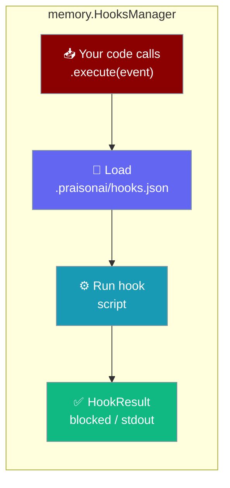
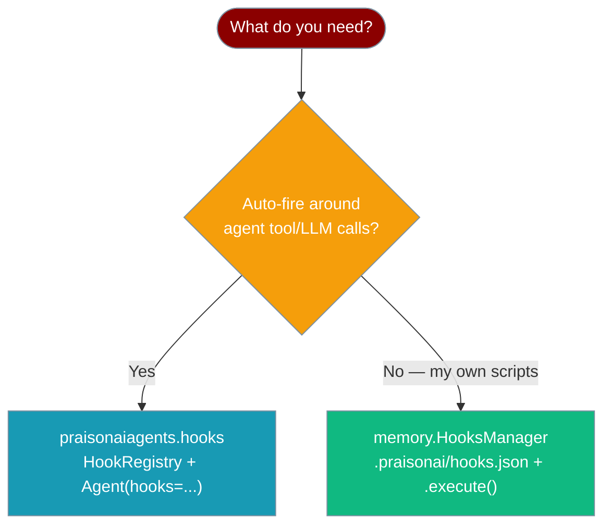
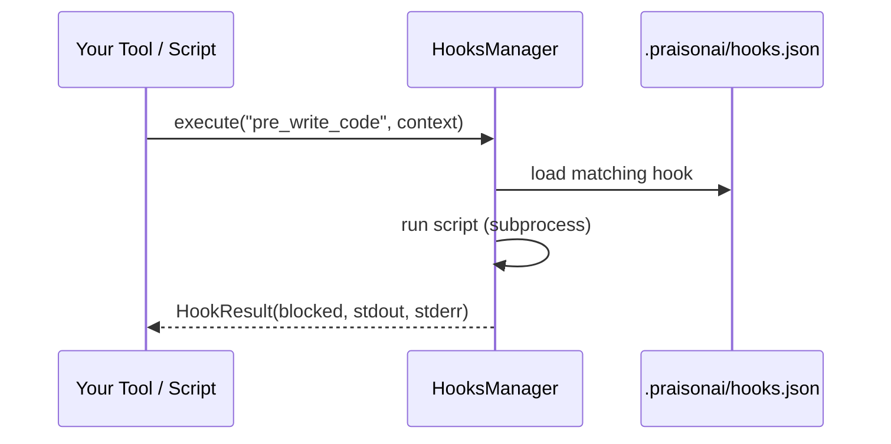

`memory.HooksManager` runs pre/post scripts from `.praisonai/hooks.json` when *you* call `.execute()` — it does not fire automatically inside an Agent.

<Warning>
**This is a standalone, opt-in utility.** `memory.HooksManager` is **NOT** auto-wired into the agent/tool execution pipeline. It only runs when you construct it and call `HooksManager.execute()` yourself (e.g. inside a custom tool or wrapper). For hooks that fire automatically around an Agent's tool/LLM calls, use the live [`praisonaiagents.hooks`](/features/hooks) package instead.
</Warning>



## Two Hook Systems

PraisonAI has two hook systems with the same short name. Pick the right one.

| System | Import | Auto-fires around agent tool/LLM calls? | Purpose |
|--------|--------|------------------------------------------|---------|
| Live agent hooks | `from praisonaiagents.hooks import HookRegistry, HookEvent, add_hook` | ✅ Yes — wired into `Agent` via `hooks=` | Security gates, redaction, observability around the agent loop |
| Standalone `memory.HooksManager` | `from praisonaiagents.memory import HooksManager, create_hooks_manager` | ❌ No — you call `.execute()` yourself | `.praisonai/hooks.json`-driven scripts; backs the `praisonai hooks` CLI |



## Quick Start

<Steps>
<Step title="Create the manager">
Use the correct import from `praisonaiagents.memory`:

```python
from praisonaiagents.memory import HooksManager

hooks = HooksManager(workspace_path=".")
```
</Step>

<Step title="Call .execute() yourself">
Nothing calls this for you — invoke it from your own code:

```python
result = hooks.execute("pre_write_code", context={"file_path": "main.py"})

if result.blocked:
    raise RuntimeError(result.stderr or "Blocked by hook")
```
</Step>
</Steps>

---

## How It Works

The "event" is triggered by whoever calls `.execute()` — not by the Agent lifecycle.



| Step | What happens |
|------|--------------|
| You call `.execute()` | The only trigger — the Agent never calls this |
| Config loads | Reads `.praisonai/hooks.json` (lazy, on first use) |
| Script runs | Executes the mapped command with context env vars |
| Result returns | `HookResult` tells you if the operation was `blocked` |

---

## Hook Events

All ten events from the `HookEvent` type in `praisonaiagents/memory/hooks.py`:

| Event | When you'd call it |
|-------|--------------------|
| `pre_read_code` | Before reading a file |
| `post_read_code` | After reading a file |
| `pre_write_code` | Before writing to a file |
| `post_write_code` | After writing to a file |
| `pre_run_command` | Before running a terminal command |
| `post_run_command` | After running a terminal command |
| `pre_user_prompt` | Before processing a user prompt |
| `post_user_prompt` | After processing a user prompt |
| `pre_mcp_tool_use` | Before an MCP tool call |
| `post_mcp_tool_use` | After an MCP tool call |

### HookResult

`execute()` returns a `HookResult` dataclass:

| Field | Type | Default | Description |
|-------|------|---------|-------------|
| `success` | `bool` | — | Whether all hooks ran without error |
| `exit_code` | `int` | `0` | Exit code of the last script hook |
| `stdout` | `str` | `""` | Combined script stdout |
| `stderr` | `str` | `""` | Combined script stderr |
| `blocked` | `bool` | `False` | If `True`, block the operation |
| `modified_input` | `str \| None` | `None` | Replacement input, if a hook emitted one |

### HookConfig

Each configured hook loads into a `HookConfig`:

| Field | Type | Default | Description |
|-------|------|---------|-------------|
| `event` | `HookEvent` | — | The event this hook responds to |
| `command` | `str` | — | Script/command to run |
| `timeout` | `int` | `30` | Per-hook timeout in seconds |
| `enabled` | `bool` | `True` | Skip the hook when `False` |
| `block_on_failure` | `bool` | `False` | Set `blocked=True` when the script fails |
| `pass_input` | `bool` | `True` | Pass context as `PRAISON_HOOK_*` env vars |

---

## Configuration File

Configure scripts in `.praisonai/hooks.json`:

```json
{
  "enabled": true,
  "timeout": 30,
  "hooks": {
    "pre_write_code": "./scripts/lint.sh",
    "post_write_code": "./scripts/format.sh",
    "pre_run_command": "./scripts/validate.sh"
  }
}
```

Generate one programmatically with `create_config`:

```python
from praisonaiagents.memory import HooksManager

hooks = HooksManager(workspace_path=".")
hooks.create_config(
    hooks={"post_write_code": "./scripts/format.sh"},
    timeout=30,
    enabled=True,
)
```

The `praisonai hooks list`, `praisonai hooks stats`, and `praisonai hooks init` CLI commands read this same file — see [CLI Hooks](/cli/hooks).

---

## Common Patterns

### Gate a write inside your own tool

The way to make `HooksManager` "gate" an operation is to call `.execute()` inside your tool — the Agent framework will not do it for you.

```python
from praisonaiagents import Agent
from praisonaiagents.memory import HooksManager

hooks = HooksManager(workspace_path=".")

def safe_write(file_path: str, content: str) -> str:
    """Write a file, gated by pre_write_code hooks."""
    result = hooks.execute("pre_write_code", context={"file_path": file_path})
    if result.blocked:
        return f"Blocked: {result.stderr}"
    with open(file_path, "w") as f:
        f.write(content)
    return f"Wrote {file_path}"

agent = Agent(
    name="Writer",
    instructions="Write files using the safe_write tool.",
    tools=[safe_write],
)

agent.start("Create main.py with a hello world function")
```

### Register a Python callable

```python
from praisonaiagents.memory import HooksManager

hooks = HooksManager(workspace_path=".")
hooks.register("pre_write_code", lambda ctx: print(f"Writing {ctx['file_path']}"))

hooks.execute("pre_write_code", context={"file_path": "main.py"})
```

---

## Best Practices

<AccordionGroup>
<Accordion title="Use the live hooks package for automatic gating">
If you want a hook to fire automatically before every tool call, use [`praisonaiagents.hooks`](/features/hooks) with `Agent(hooks=registry)`. `memory.HooksManager` never runs on its own.
</Accordion>

<Accordion title="Call .execute() at the exact point you want to gate">
Put the `.execute()` call inside the tool or wrapper that performs the operation, so the hook runs at the right moment with the right context.
</Accordion>

<Accordion title="Keep hook scripts fast">
Scripts run inline via `subprocess` with a per-hook `timeout` (default 30s). Slow scripts delay your own code.
</Accordion>

<Accordion title="Handle blocked results explicitly">
Check `result.blocked` and stop the operation yourself — nothing downstream enforces it.
</Accordion>
</AccordionGroup>

---

## Related

<CardGroup cols={2}>
  <Card title="Live Agent Hooks" icon="webhook" href="/features/hooks">
    Hooks that fire automatically around Agent tool and LLM calls.
  </Card>
  <Card title="Hooks CLI" icon="terminal" href="/cli/hooks">
    List, inspect, and initialize `.praisonai/hooks.json`.
  </Card>
</CardGroup>
