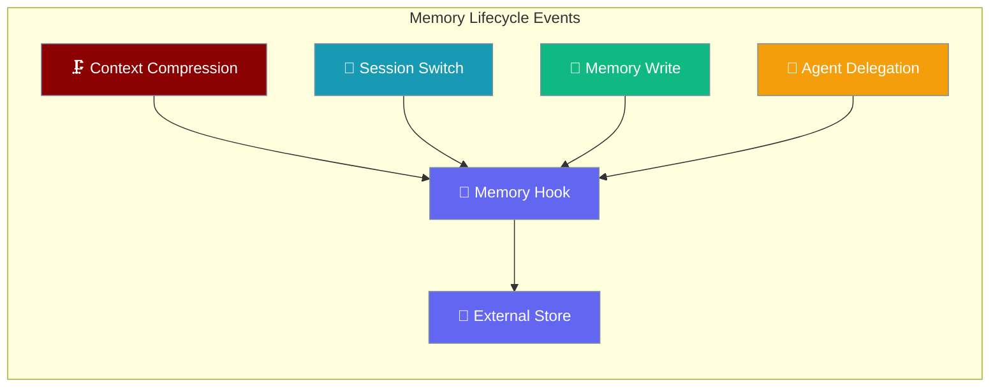
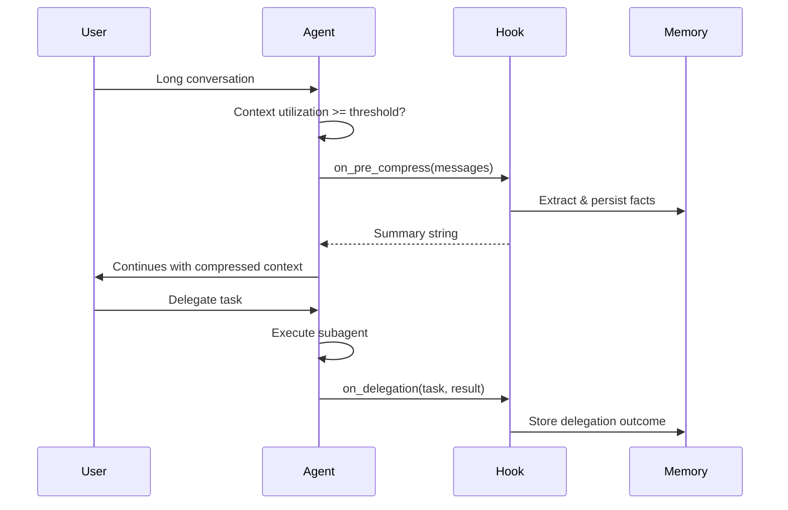

Memory lifecycle hooks let your memory backend react when the agent compresses context, switches sessions, writes to memory, or delegates to a subagent.

```python
from praisonaiagents import Agent, Memory

class MyMemory(Memory):
    def on_pre_compress(self, messages):
        return "User prefers concise answers"

agent = Agent(
    name="Assistant",
    instructions="Help the user.",
    memory=MyMemory(),
)

agent.start("Tell me about Mars")
```



## Quick Start

<Steps>
<Step title="Simplest">
Override just one hook to get started:

```python
from praisonaiagents import Agent
from praisonaiagents import Memory

class MyMemory(Memory):
    def on_pre_compress(self, messages):
        print(f"About to discard {len(messages)} messages")
        return "User prefers concise answers"

agent = Agent(
    name="Assistant",
    instructions="Help the user",
    memory=MyMemory(),
)

agent.start("Tell me about Mars")
```
</Step>

<Step title="All Four Hooks">
Implement all lifecycle hooks for full control:

```python
from praisonaiagents import Agent
from praisonaiagents import Memory

class FullHooksMemory(Memory):
    def on_pre_compress(self, messages):
        # Extract facts before compression
        facts = [msg['content'] for msg in messages if 'fact:' in msg.get('content', '')]
        for fact in facts:
            self.store_long_term(fact)
        return f"Preserved {len(facts)} facts"

    def on_session_switch(self, new_session_id, *, parent_session_id="", reset=False):
        if reset:
            print(f"Starting fresh conversation: {new_session_id}")
        else:
            print(f"Continuing from {parent_session_id} to {new_session_id}")

    def on_memory_write(self, action, target, content, metadata=None):
        print(f"Memory {action}: {content[:50]}... -> {target}")

    def on_delegation(self, task, result, *, agent_name="", metadata=None):
        # Store subagent results in knowledge base
        self.store_long_term(f"Task: {task} | Result: {result} | Agent: {agent_name}")

agent = Agent(name="Assistant", memory=FullHooksMemory())
```
</Step>
</Steps>

---

## How It Works



| Event | Call Site | When It Fires |
|-------|-----------|---------------|
| `on_pre_compress` | `chat_mixin.py:_apply_context_management` | Context utilization ≥ `compact_threshold` |
| `on_memory_write` | `agent.py:store_memory` | After successful memory storage |
| `on_delegation` | `handoff.py` (3 paths) | After subagent task completion |
| `on_session_switch` | *Not yet wired* | Reserved for future session rotation |

---

## The Four Hooks

### on_pre_compress

Called before context compression discards messages.

```python
def on_pre_compress(self, messages: list[dict]) -> str:
    """Extract facts before messages are discarded."""
    pass

# Async version
async def aon_pre_compress(self, messages: list[dict]) -> str:
    """Async version for async agent contexts."""
    pass
```

**When does this fire?** When context utilization exceeds `compact_threshold` and the agent needs to discard older messages.

**Example:**
```python
def on_pre_compress(self, messages):
    # Extract structured facts before compression
    facts = []
    for msg in messages:
        if msg.get('role') == 'user' and 'preference:' in msg.get('content', ''):
            facts.append(msg['content'])
    
    # Store in external graph database
    for fact in facts:
        self.graph_db.store(fact)
    
    return f"Extracted {len(facts)} preferences"
```

### on_session_switch

Called when the active session ID changes.

```python
def on_session_switch(self, new_session_id: str, *, parent_session_id: str = "", reset: bool = False) -> None:
    """Update routing for new session."""
    pass

# Async version  
async def aon_session_switch(self, new_session_id: str, *, parent_session_id: str = "", reset: bool = False) -> None:
    """Async version for async agent contexts."""
    pass
```

**When does this fire?** Currently defined but not yet called - reserved for future session rotation features.

**Example:**
```python
def on_session_switch(self, new_session_id, *, parent_session_id="", reset=False):
    if reset:
        # Fresh conversation - clear session-specific cache
        self.session_cache.clear()
    else:
        # Session continuation - migrate cache
        self.session_cache[new_session_id] = self.session_cache.pop(parent_session_id, {})
    
    self.current_session = new_session_id
```

### on_memory_write

Called after successful memory storage operations.

```python
def on_memory_write(self, action: str, target: str, content: str, metadata: dict = None) -> None:
    """Mirror memory writes to external store."""
    pass

# Async version
async def aon_memory_write(self, action: str, target: str, content: str, metadata: dict = None) -> None:
    """Async version for async agent contexts."""
    pass
```

**When does this fire?** After `Agent.store_memory()` successfully writes to built-in memory.

**Example:**
```python
def on_memory_write(self, action, target, content, metadata=None):
    # Mirror all writes to external vector store
    if action == "add":
        self.vector_store.add(content, tags=[target])
    elif action == "replace":
        self.vector_store.update(content, tags=[target])
    elif action == "remove":
        self.vector_store.delete(content, tags=[target])
```

### on_delegation

Called after a subagent completes a delegated task.

```python
def on_delegation(self, task: str, result: str, *, agent_name: str = "", metadata: dict = None) -> None:
    """Store delegation results."""
    pass

# Async version
async def aon_delegation(self, task: str, result: str, *, agent_name: str = "", metadata: dict = None) -> None:
    """Async version for async agent contexts."""
    pass
```

**When does this fire?** After subagent execution completes in handoff operations.

**Example:**
```python
def on_delegation(self, task, result, *, agent_name="", metadata=None):
    # Build knowledge graph from delegation results
    entry = {
        "task": task,
        "result": result, 
        "agent": agent_name,
        "timestamp": time.time()
    }
    self.knowledge_graph.add_delegation(entry)
```

---

## Sync vs Async Selection

```mermaid
graph TB
    A[Hook Called] --> B{Running in async context?}
    B -->|Yes| C{Provider has aon_* method?}
    B -->|No| E[Call sync on_* method]
    C -->|Yes| D[Schedule async aon_* as fire-and-forget task]
    C -->|No| E[Call sync on_* method]
    
    classDef decision fill:#F59E0B,stroke:#7C90A0,color:#fff
    classDef sync fill:#189AB4,stroke:#7C90A0,color:#fff
    classDef async fill:#10B981,stroke:#7C90A0,color:#fff
    
    class A,B,C decision
    class E sync  
    class D async
```

The agent automatically detects the execution context. If you're in an async context and provide both sync and async versions, the async version runs as a fire-and-forget task for better performance.

---

## The New Action Parameter

`Agent.store_memory()` now accepts an `action` parameter:

```python
# Add new memory (default)
agent.store_memory("User likes coffee", action="add")

# Replace existing memory
agent.store_memory("User prefers tea", action="replace") 

# Remove memory
agent.store_memory("User likes coffee", action="remove")
```

| Action | Requirements | Description |
|--------|-------------|-------------|
| `"add"` | Default behavior | Stores new content |
| `"replace"` | Provider must have `replace_<type>` or `update_<type>` method | Updates existing content |
| `"remove"` | Provider must have `remove_<type>` or `delete_<type>` method | Deletes content |

The memory provider must support the requested action or a `ValueError` is raised.

---

## Configuration Options

All four hooks are optional with no-op defaults. The protocol uses `runtime_checkable` so your memory class only needs to implement the hooks you need.

| Hook | Arguments | Return Type | When It Fires |
|------|-----------|-------------|---------------|
| `on_pre_compress` | `messages: list[dict]` | `str` | Context utilization ≥ threshold |
| `on_session_switch` | `new_session_id: str`, `parent_session_id: str`, `reset: bool` | `None` | Session ID changes (not yet called) |
| `on_memory_write` | `action: str`, `target: str`, `content: str`, `metadata: dict` | `None` | After `store_memory()` success |
| `on_delegation` | `task: str`, `result: str`, `agent_name: str`, `metadata: dict` | `None` | After subagent completion |

---

## Common Patterns

**Mirror writes to external vector store:**
```python
def on_memory_write(self, action, target, content, metadata=None):
    if action == "add":
        self.pinecone.upsert([{
            "id": str(uuid.uuid4()),
            "values": self.embed(content),
            "metadata": {"type": target, **metadata}
        }])
```

**Persist subagent results in knowledge graph:**
```python
def on_delegation(self, task, result, *, agent_name="", metadata=None):
    self.neo4j.run("""
        CREATE (d:Delegation {
            task: $task, 
            result: $result, 
            agent: $agent_name,
            timestamp: timestamp()
        })
    """, task=task, result=result, agent_name=agent_name)
```

**Summarize discarded turns before compression:**
```python
def on_pre_compress(self, messages):
    turns = [msg for msg in messages if msg.get('role') in ['user', 'assistant']]
    summary = self.summarizer.summarize(turns)
    self.store_long_term(f"Conversation summary: {summary}")
    return "Key points preserved"
```

---

## Best Practices

<AccordionGroup>
<Accordion title="Keep hooks fast">
Hooks run on the agent thread and can block execution. Keep operations lightweight or delegate to background workers for heavy processing like vector embeddings or API calls.
</Accordion>

<Accordion title="Never raise from hooks">
Hook failures are caught and logged at warning level. They should never break the agent loop. Always wrap your hook logic in try-catch and log errors appropriately.
</Accordion>

<Accordion title="Use async variants for I/O">
If your memory provider does network I/O (database calls, API requests), implement the `aon_*` async variants. The agent will automatically schedule them as fire-and-forget tasks in async contexts.
</Accordion>

<Accordion title="Implement only what you need">
All hooks are optional. Only implement the lifecycle events that matter for your use case. Empty implementations have zero performance impact.
</Accordion>
</AccordionGroup>

---

## Related

<CardGroup cols={2}>
<Card title="Memory" icon="brain" href="/docs/features/advanced-memory">
  Core memory concepts and storage types
</Card>
<Card title="Advanced Memory" icon="database" href="/docs/features/advanced-memory">
  Custom backends and advanced patterns
</Card>
<Card title="Context Compression" icon="compress" href="/docs/features/context-compression">
  How context compression triggers hooks
</Card>
<Card title="Handoffs" icon="handshake" href="/docs/features/handoffs">
  Agent delegation and subagent patterns
</Card>
</CardGroup>