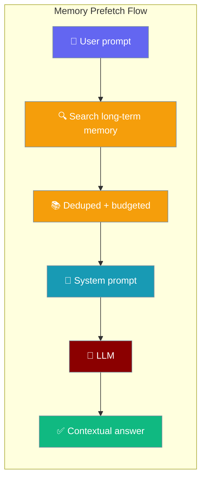
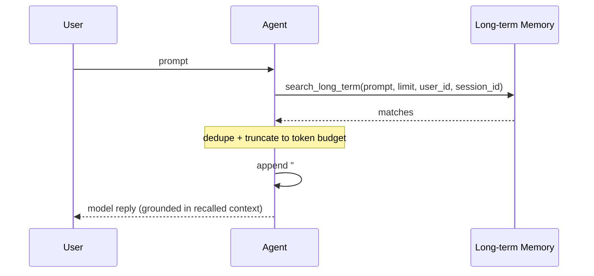

Prefetch pulls relevant long-term memories into the system prompt at the start of every turn — the agent answers with context it never had to ask for.



## Quick Start

<Steps>
<Step title="Enable with three lines">

Set `prefetch=True` on `MemoryConfig` and the agent recalls relevant memories before its first model call.

```python
from praisonaiagents import Agent, MemoryConfig

agent = Agent(
    name="assistant",
    instructions="Answer using recalled memories when relevant.",
    memory=MemoryConfig(
        user_id="alice",
        prefetch=True,   # that's it
    ),
)

agent.start("What did I say about my preferences?")
```
</Step>

<Step title="Tune the budget">

Cap how many memories are injected and how large the block can grow.

```python
from praisonaiagents import Agent, MemoryConfig

agent = Agent(
    name="assistant",
    instructions="Answer using recalled memories when relevant.",
    memory=MemoryConfig(
        user_id="alice",
        prefetch=True,
        prefetch_limit=3,           # inject at most 3 memories
        prefetch_token_budget=200,  # estimated-token cap; truncates with "…"
    ),
)

agent.start("What are my UI preferences?")
```
</Step>

<Step title="Cross-agent recall">

Store facts with one agent and recall them in another by sharing the same backend and `user_id`.

```python
from praisonaiagents import Agent, MemoryConfig

shared = MemoryConfig(backend="sqlite", user_id="alice")

writer = Agent(name="writer", instructions="Store facts.", memory=shared)
writer.memory.remember("Launch date is Nov 15.")

reader = Agent(
    name="reader",
    instructions="Answer using recalled context.",
    memory=MemoryConfig(**{**shared.to_dict(), "prefetch": True}),
)
print(reader.start("When do we launch?"))
```
</Step>
</Steps>

---

## How It Works

Prefetch searches long-term memory with the user prompt, dedupes and budgets the matches, then appends them to the system prompt before the first LLM call.



| Phase | What happens |
|---|---|
| 1. Query | The user prompt drives a `search_long_term` call, scoped by `user_id` / `session_id` |
| 2. Shape | Matches are deduplicated by text, then truncated to the token budget with a trailing `…` |
| 3. Inject | The result is appended under `## Recalled memories` in the system prompt |

<Note>
Prefetch is default-off. When `prefetch` is `False` (or there is no memory instance), the backend is never queried and the prompt is unchanged. Backend errors are swallowed at debug level — the turn continues without recalled context.
</Note>

---

## Configuration Options

<Card icon="code" href="/sdk/reference/praisonaiagents/modules/feature_configs">
  Full list of options, types, and defaults — `MemoryConfig`
</Card>

| Option | Type | Default | Description |
|---|---|---|---|
| `prefetch` | `bool` | `False` | Master switch. Off = zero backend calls. |
| `prefetch_limit` | `int` | `5` | Max memories injected per turn. |
| `prefetch_token_budget` | `int` | `512` | Estimated-token cap for the injected block. Overflow is truncated with `…`. |

Identity scoping (`user_id`, `session_id`) is inherited from the same `MemoryConfig`.

---

## Common Patterns

### Pattern 1 — Personal assistant with recalled preferences
```python
from praisonaiagents import Agent, MemoryConfig

agent = Agent(
    name="assistant",
    instructions="Answer using recalled preferences.",
    memory=MemoryConfig(user_id="alice", prefetch=True),
)
agent.memory.remember("Alice prefers metric units and dark mode.")
print(agent.start("How should I format my dashboard?"))
```

### Pattern 2 — Tight budget for cost control
```python
from praisonaiagents import Agent, MemoryConfig

agent = Agent(
    name="assistant",
    instructions="Answer concisely using recalled context.",
    memory=MemoryConfig(
        user_id="alice",
        prefetch=True,
        prefetch_limit=2,
        prefetch_token_budget=128,
    ),
)
print(agent.start("Remind me what I asked for last time."))
```

---

## Best Practices

<AccordionGroup>
<Accordion title="Default-off is intentional">
Enable prefetch per agent, not globally, so you pay the backend query only on the turns that benefit from recalled context.
</Accordion>

<Accordion title="Pair with user_id">
Without `user_id`, prefetch searches the per-instance store — a fresh `agent-<uuid>` on every process. Set `user_id` so recalled memories persist across runs.
</Accordion>

<Accordion title="Keep the token budget small">
`prefetch_token_budget=512` is the ceiling, not the target. Large recalled blocks push out user context — start small and raise only when needed.
</Accordion>

<Accordion title="Async works out of the box">
The async path awaits async backends; sync backends are offloaded off the event loop. No extra configuration required.
</Accordion>

<Accordion title="Backend failures never break the turn">
Any backend error is logged at debug level and the agent proceeds without recalled context — prefetch never fails a turn.
</Accordion>
</AccordionGroup>

---

## Related

<CardGroup cols={2}>
<Card title="Memory" icon="brain" href="/features/memory">
  Memory backends and the remember/recall API
</Card>
<Card title="Knowledge" icon="book" href="/features/knowledge">
  Add documents and URLs as agent knowledge
</Card>
</CardGroup>
