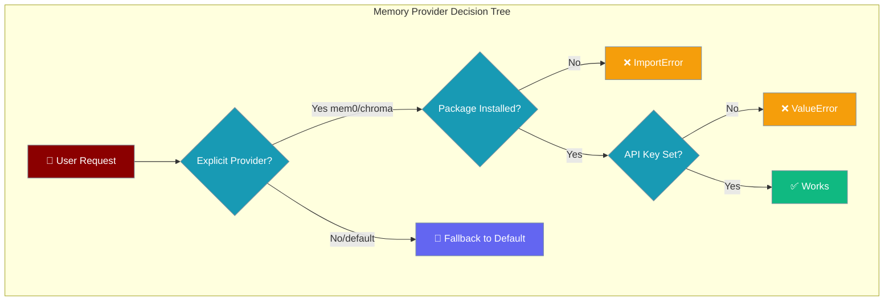
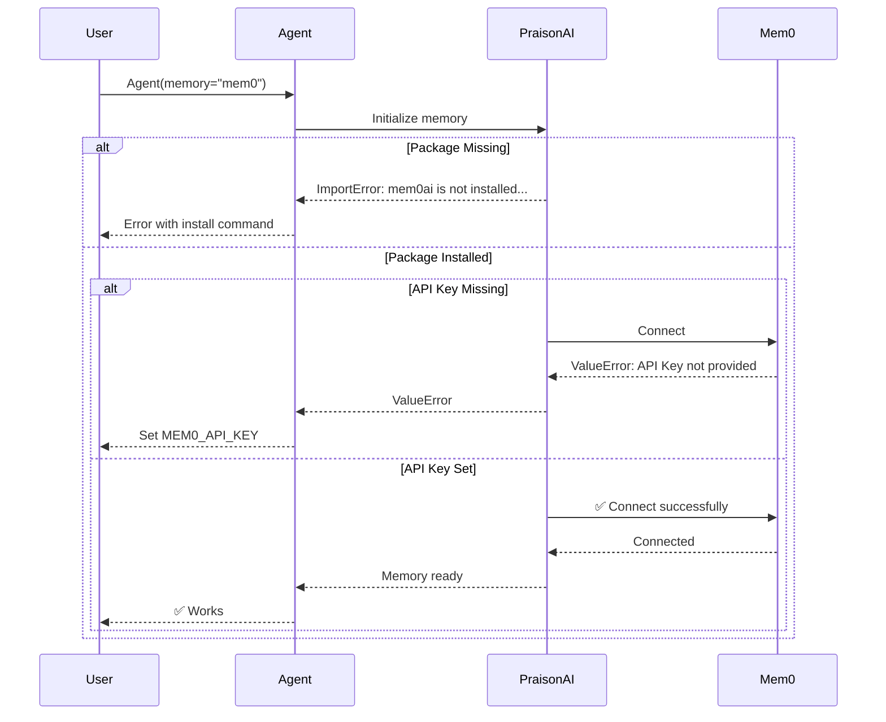

Memory troubleshooting helps resolve common errors when configuring memory providers and debugging memory-related issues in PraisonAI agents.



## Quick Start

<Steps>
<Step title="Default (No Extras) — Works Out of the Box">
```python
from praisonaiagents import Agent

agent = Agent(
    name="Assistant",
    instructions="Help the user remember things",
    memory=True  # Uses built-in file storage
)
```
</Step>

<Step title="Switch to Real Provider — Install Extras First">
```bash
pip install "praisonaiagents[memory]"
```

```python
from praisonaiagents import Agent

agent = Agent(
    name="Assistant",
    instructions="Help the user remember things",
    memory="mem0"  # Now uses Mem0 cloud service
)
```
</Step>
</Steps>

---

## Why am I seeing `ImportError: mem0ai is not installed...`?

This error occurs when you explicitly request a memory provider that requires optional dependencies. The new behavior ensures you get clear feedback instead of silent fallbacks.

### The Problem

```python
# This will fail if mem0ai package is not installed
agent = Agent(memory="mem0")
```

### The Solution

Install the required extras package:

```bash
pip install "praisonaiagents[memory]"
```

### Explicit vs Default Behavior

| Configuration | mem0ai installed? | Result |
|--------------|-------------------|--------|
| `memory=True` (default) | ❌ | ✅ Falls back to file storage |
| `memory="mem0"` | ❌ | ❌ `ImportError: mem0ai is not installed. Run: pip install 'praisonaiagents[memory]'` |
| `memory="mem0"` | ✅ | ✅ Uses Mem0 (if API key set) |

---

## Why am I seeing `ValueError: Mem0 API Key not provided`?

This occurs when the mem0ai package is installed but the API key is missing.

### Set the API Key

<Tabs>
  <Tab title="Environment Variable">
    ```bash
    export MEM0_API_KEY="your-mem0-api-key"
    ```
  </Tab>
  
  <Tab title="Direct Configuration">
    ```python
    from praisonaiagents import Agent
    
    agent = Agent(
        name="Assistant", 
        memory={
            "provider": "mem0",
            "config": {
                "api_key": "your-mem0-api-key"
            }
        }
    )
    ```
  </Tab>
</Tabs>

---

## Common Error Scenarios

### User Interaction Flow



### Step-by-Step Resolution

1. **User runs** `Agent(memory="mem0")` without extras
2. **PraisonAI raises** `ImportError: mem0ai is not installed. Run: pip install 'praisonaiagents[memory]'`
3. **User runs** the suggested install command
4. **User re-runs** the agent code — either works or shows next error (missing API key)
5. **User sets** `MEM0_API_KEY` environment variable
6. **Agent works** successfully

---

## SQLite memory: errors after upgrade

### ValueError: Invalid table name

<Warning>
**Symptom:** `ValueError: Invalid table name: … Allowed tables: long_term, short_term`

**Cause:** Custom code called an internal SQLite helper with a table name other than `short_term` or `long_term`.

**Fix:** Use the public API — `search_short_term()` and `search_long_term()` — instead of private `_search_sqlite*` methods.
</Warning>

### AttributeError: missing connection helper

<Warning>
**Symptom:** `AttributeError: … has no attribute '_get_stm_conn'` (or `_get_ltm_conn'`)

**Cause:** Previously this returned an empty list silently; it now surfaces. The memory object lacks the SQLite connection mixin.

**Fix:** Use `Memory(provider="sqlite", …)` rather than instantiating mixins directly. Subclasses must implement `_get_stm_conn` and `_get_ltm_conn`.
</Warning>

---

## Best Practices

<AccordionGroup>
  <Accordion title="Start with the default, upgrade later">
    Begin with `memory=True` for prototyping, then switch to `memory="mem0"` for production when you need advanced features.
  </Accordion>
  
  <Accordion title="Pin extras in your project">
    Add `"praisonaiagents[memory]"` to your requirements.txt or pyproject.toml to ensure consistent environments.
  </Accordion>
  
  <Accordion title="Set keys via environment variables in production">
    Use `MEM0_API_KEY` environment variables rather than hardcoding API keys in your source code.
  </Accordion>
  
  <Accordion title="Use memory=True for prototypes">
    The default file-based memory works great for development and doesn't require any external dependencies or API keys.
  </Accordion>
</AccordionGroup>

---

## Related

<CardGroup cols={2}>
  <Card title="Memory Concepts" icon="brain" href="/docs/features/advanced-memory">
    Understanding different types of memory and storage options
  </Card>
  <Card title="Advanced Memory" icon="gear" href="/docs/features/advanced-memory">
    Multi-tiered memory with quality scoring and graph support
  </Card>
</CardGroup>