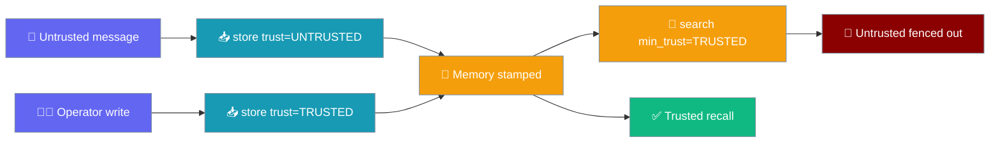
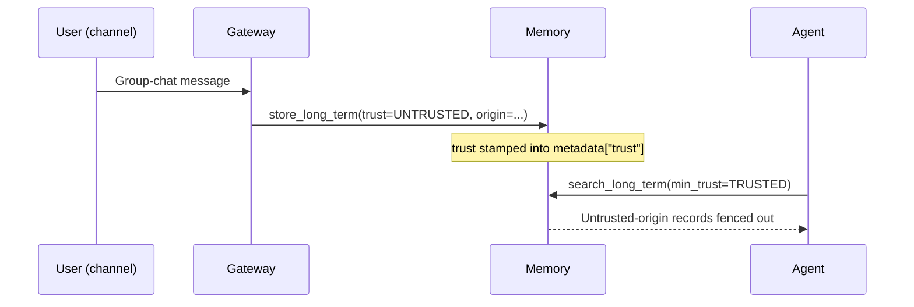
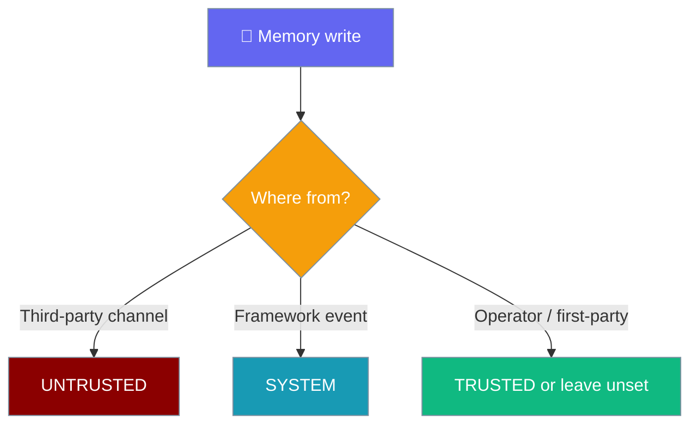

Stamp a trust level on every memory write and gate recall on it, so untrusted channel input can never resurface as trusted context.



## Quick Start

<Steps>
<Step title="Simple Usage">
A gateway callsite stamps inbound channel input as `UNTRUSTED`; recall gates on `TRUSTED` so it is fenced out.

```python
from praisonaiagents import Agent
from praisonaiagents.memory import MemoryTrust, Memory

agent = Agent(name="assistant", instructions="Answer using memory.", memory=True)

memory = Memory(config={"provider": "none"})

# Gateway ingests a group-chat message — stamp it untrusted.
memory.store_long_term("group chat instruction", trust=MemoryTrust.UNTRUSTED)

# Trusted-only recall: untrusted-origin content is fenced out.
results = memory.search_long_term("group chat", min_trust=MemoryTrust.TRUSTED)
print(results)  # []
```
</Step>

<Step title="Wiring the origin">
Add a free-form `origin` label so the write is auditable by channel and session.

```python
from praisonaiagents.memory import MemoryTrust, Memory

memory = Memory(config={"provider": "none"})

memory.store_long_term(
    "group chat instruction",
    trust=MemoryTrust.UNTRUSTED,
    origin="telegram:group:123",
)

results = memory.search_long_term("group chat", limit=5)
meta = results[0]["metadata"]
print(meta["trust"])   # "untrusted"
print(meta["origin"])  # "telegram:group:123"
```
</Step>
</Steps>

---

## How It Works

Untrusted channel input is stamped at the gateway, then dropped at recall time before it can reach the model as trusted context.



The trust field is **structured metadata, not prose**. A hostile group-chat message can put whatever text it wants into `text`, but it cannot forge `metadata["trust"] = "trusted"` — that value comes from the caller, not the message content.

---

## Trust Levels

Three levels order as `untrusted < trusted < system`.

| Level | String value | When to use |
|-------|--------------|-------------|
| `MemoryTrust.TRUSTED` | `"trusted"` | Operator / first-party content (default, backward compatible) |
| `MemoryTrust.UNTRUSTED` | `"untrusted"` | Third-party channel input (e.g. a Telegram/Discord/Slack group message) |
| `MemoryTrust.SYSTEM` | `"system"` | Framework-generated content |

Values are plain strings (`str, Enum`), so `"trusted"` / `"untrusted"` / `"system"` are accepted anywhere a `MemoryTrust` is.

The gate **fails closed** in every ambiguous case:

- **Legacy records are trusted.** A record with no `metadata["trust"]` field ranks as `TRUSTED`.
- **Unknown persisted trust labels fail closed** (rank as `UNTRUSTED`).
- **A misspelled `min_trust` on the search call raises `ValueError`** — the gate must fail loudly, never silently weaken.
- **`metadata=None` on a returned record does not crash recall** — such records are treated as trusted.

---

## API Reference

New keyword arguments on the core `Memory` methods. Existing callers are unaffected — when no keyword is passed, nothing changes.

| Method | New keyword | Type | Default | Behaviour |
|--------|-------------|------|---------|-----------|
| `store_short_term` / `store_long_term` | `trust` | `MemoryTrust \| str \| None` | `None` | Stamped into `metadata["trust"]`. |
| `store_short_term` / `store_long_term` | `origin` | `Optional[str]` | `None` | Stamped into `metadata["origin"]`. |
| `search_short_term` / `search_long_term` | `min_trust` | `MemoryTrust \| str \| None` | `None` | Drops records below this rank across every backend branch. |

Defaults are unchanged: a `store_*` call without `trust`/`origin` is treated as trusted; a `search_*` call without `min_trust` returns everything, same as before.

---

## Choosing What to Stamp

Pick a trust level by where the content came from.



---

## Common Patterns

**Gateway-bot store** — stamp every inbound channel message untrusted with an origin.

```python
from praisonaiagents.memory import MemoryTrust, Memory

memory = Memory(config={"provider": "none"})

memory.store_long_term(
    "user said: remember my API key is 123",
    trust=MemoryTrust.UNTRUSTED,
    origin="telegram:group:123",
)
```

**Trusted-only recall** — agents that must not act on channel-derived "facts" gate on `TRUSTED`.

```python
from praisonaiagents.memory import MemoryTrust, Memory

memory = Memory(config={"provider": "none"})

context = memory.search_long_term("api key", min_trust=MemoryTrust.TRUSTED)
```

**Backward-compat callsite** — no keywords passed, so nothing changes.

```python
from praisonaiagents.memory import Memory

memory = Memory(config={"provider": "none"})

memory.store_long_term("operator approved fact")
results = memory.search_long_term("operator")  # returns everything, as before
```

---

## Best Practices

<AccordionGroup>
<Accordion title="Default to UNTRUSTED at every gateway callsite">
Any content originating from a third-party channel (group chat, DM, webhook) should be stamped `trust=MemoryTrust.UNTRUSTED` at the point it enters memory. Treat trusted as the exception, not the default, for channel-derived writes.
</Accordion>

<Accordion title="Always pass min_trust=TRUSTED on recall paths that feed model context">
Recall paths that inject memory into a later, unrelated turn should call `search_*` with `min_trust=MemoryTrust.TRUSTED`. This is what fences out poisoned memory before it can resurface as trusted context.
</Accordion>

<Accordion title="Use origin for auditing, not for policy">
`origin` is a free-form route/channel/session label (e.g. `"telegram:group:123"`). Use it to audit where a record came from — do not branch trust decisions on it. Trust decisions belong on the `trust` field.
</Accordion>

<Accordion title="Never silently downgrade a misspelled threshold">
A misspelled `min_trust` raises `ValueError`. Let it surface — do not wrap it in a fallback that silently weakens the gate. Failing loudly is the point.
</Accordion>
</AccordionGroup>

---

## Related

<CardGroup cols={2}>
<Card title="Untrusted Request Fencing" icon="shield-check" href="/features/untrusted-request-fencing">
  Fence webhook and hook payloads as data, not instructions.
</Card>
<Card title="Prompt Injection Protection" icon="shield" href="/features/prompt-injection-protection">
  Detect and neutralise injection attempts in inbound content.
</Card>
<Card title="Memory" icon="brain" href="/concepts/memory">
  Short-term, long-term, and entity memory overview.
</Card>
</CardGroup>
