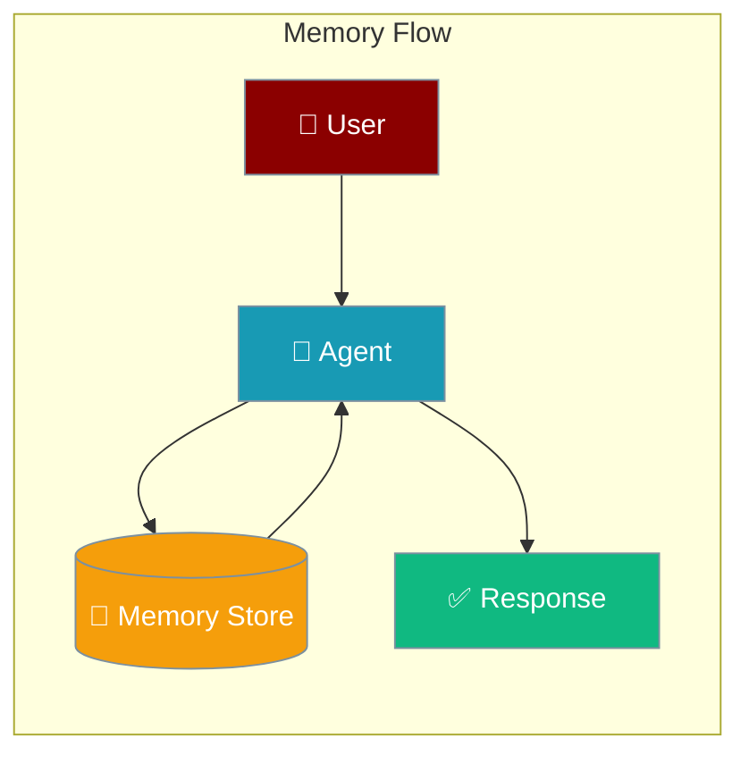
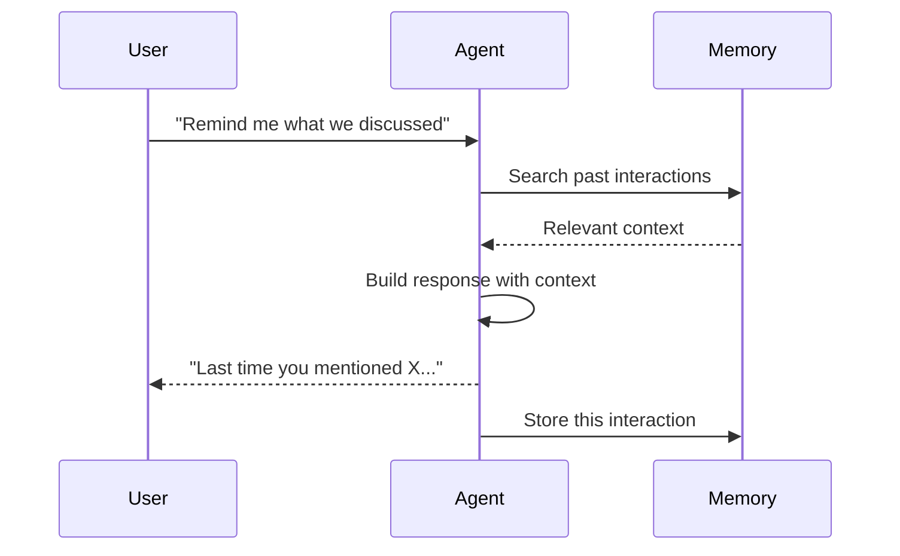
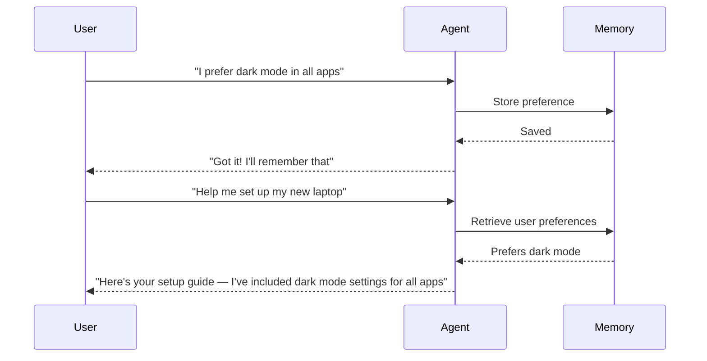

Memory gives agents the ability to remember past conversations, learn user preferences, and maintain context across sessions.



## Quick Start

<Steps>
<Step title="Enable Memory">
Add `memory=True` to give your agent persistent memory:

```python
from praisonaiagents import Agent

agent = Agent(
    name="Assistant",
    instructions="You are a helpful personal assistant",
    memory=True
)

agent.start("My name is Alice and I prefer concise answers")
# Next conversation:
agent.start("What's my name?")  # Agent remembers: "Alice"
```
</Step>

<Step title="With Backend">
Choose a storage backend for production use:

```python
from praisonaiagents import Agent, MemoryConfig

agent = Agent(
    name="Assistant",
    instructions="You are a helpful personal assistant",
    memory=MemoryConfig(
        backend="sqlite",
        user_id="user_alice",
        session_id="session_001",
    )
)

agent.start("Remember that I always want bullet-point summaries")
```
</Step>

<Step title="With Learning">
Enable continuous learning to capture user preferences automatically:

```python
from praisonaiagents import Agent, MemoryConfig, LearnConfig

agent = Agent(
    name="Assistant",
    instructions="You are a helpful personal assistant",
    memory=MemoryConfig(
        backend="sqlite",
        user_id="user_alice",
        learn=LearnConfig(
            persona=True,
            insights=True,
            mode="agentic",
        )
    )
)

agent.start("Help me write a professional email to a client")
```
</Step>
</Steps>

---

## How It Works



| Stage | What happens |
|-------|-------------|
| **Retrieve** | Agent searches memory for relevant past context |
| **Inject** | Context is added to the agent's prompt |
| **Respond** | Agent uses context to give personalised answers |
| **Store** | New interaction is saved to memory |

---

## User Interaction Flow



---

## Configuration Options

### MemoryConfig

| Option | Type | Default | Description |
|--------|------|---------|-------------|
| `backend` | `str` | `"file"` | Storage backend: `file`, `sqlite`, `redis`, `postgres`, `mem0`, `mongodb` |
| `user_id` | `str` | `None` | User identifier for scoped memory |
| `session_id` | `str` | `None` | Session identifier |
| `auto_memory` | `bool` | `False` | Automatically extract and store key facts |
| `claude_memory` | `bool` | `False` | Use Anthropic's native memory (Claude models only) |
| `history` | `bool` | `False` | Inject session history into agent context |
| `history_limit` | `int` | `10` | Number of past messages to inject |
| `auto_save` | `str` | `None` | Auto-save session with this name |
| `learn` | `bool \| LearnConfig` | `None` | Enable continuous learning |

### LearnConfig

| Option | Type | Default | Description |
|--------|------|---------|-------------|
| `persona` | `bool` | `True` | Learn user preferences and profile |
| `insights` | `bool` | `True` | Learn observations and facts |
| `thread` | `bool` | `True` | Track session/conversation context |
| `patterns` | `bool` | `False` | Learn reusable knowledge patterns |
| `mode` | `str` | `"disabled"` | Learning mode: `disabled`, `agentic` |
| `scope` | `str` | `"private"` | Data scope: `private` or `shared` |
| `backend` | `str` | `"file"` | Learning storage: `file`, `sqlite`, `redis`, `mongodb` |

### Precedence Ladder

```python
# Level 1: Bool (simplest)
agent = Agent(memory=True)

# Level 2: String (backend name)
agent = Agent(memory="redis")

# Level 3: Config class
agent = Agent(memory=MemoryConfig(backend="sqlite", user_id="alice"))

# Level 4: Full config with learning
agent = Agent(memory=MemoryConfig(
    backend="sqlite",
    user_id="alice",
    learn=LearnConfig(mode="agentic")
))
```

---

## Common Patterns

### Session History Injection

```python
from praisonaiagents import Agent, MemoryConfig

agent = Agent(
    name="Support Agent",
    instructions="Help users with technical support",
    memory=MemoryConfig(
        history=True,
        history_limit=20,
        user_id="user_001",
    )
)

agent.start("What was the error I mentioned before?")
```

### Redis-Backed Memory for Production

```python
from praisonaiagents import Agent, MemoryConfig

agent = Agent(
    name="Production Assistant",
    instructions="You are a helpful assistant",
    memory=MemoryConfig(
        backend="redis",
        user_id="user_001",
        auto_memory=True,
    )
)

agent.start("Help me with my project")
```

### Auto-Learning Agent

```python
from praisonaiagents import Agent, MemoryConfig, LearnConfig

agent = Agent(
    name="Personal Assistant",
    instructions="You are a personalised assistant that learns your preferences",
    memory=MemoryConfig(
        user_id="alice",
        learn=LearnConfig(
            persona=True,
            insights=True,
            patterns=True,
            mode="agentic",
        )
    )
)

agent.start("I prefer short, bullet-pointed answers with examples")
```

---

## Best Practices

<AccordionGroup>
<Accordion title="Always set user_id for multi-user deployments">
Without `user_id`, all users share the same memory pool. Set a unique identifier per user.

```python
agent = Agent(
    memory=MemoryConfig(user_id=f"user_{current_user.id}")
)
```
</Accordion>

<Accordion title="Choose the right backend for your scale">
- `file`: Development and single-user scripts
- `sqlite`: Small teams, local deployments
- `redis` / `postgres`: Production, multi-user, high-traffic
- `mem0`: Managed memory-as-a-service

```python
agent = Agent(memory=MemoryConfig(backend="redis"))
```
</Accordion>

<Accordion title="Use session_id to isolate conversations">
Each chat session can be scoped with `session_id` so memory from different sessions doesn't bleed.

```python
agent = Agent(
    memory=MemoryConfig(
        user_id="alice",
        session_id=f"session_{uuid4()}"
    )
)
```
</Accordion>

<Accordion title="Enable learning for personalised agents">
Agentic learning mode automatically captures user preferences without any extra code.

```python
agent = Agent(
    memory=MemoryConfig(
        learn=LearnConfig(mode="agentic", persona=True)
    )
)
```
</Accordion>
</AccordionGroup>

---

## Related

<CardGroup cols={2}>
<Card title="Knowledge" icon="book" href="/docs/features/knowledge">
  Add documents and files as agent knowledge
</Card>
<Card title="Sessions" icon="clock" href="/docs/features/sessions">
  Manage and persist agent sessions
</Card>
<Card title="Advanced Memory" icon="database" href="/docs/features/advanced-memory">
  Vector stores and semantic search
</Card>
<Card title="Self-Improve" icon="trending-up" href="/docs/features/self-improve">
  Agents that improve over time
</Card>
</CardGroup>
