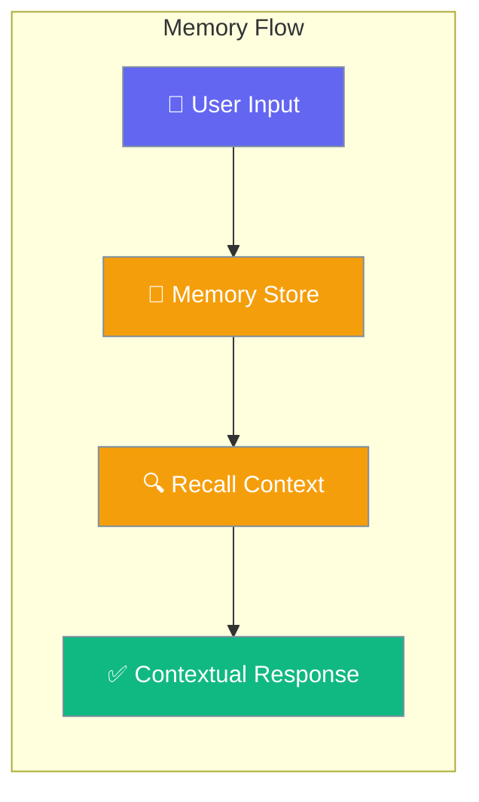
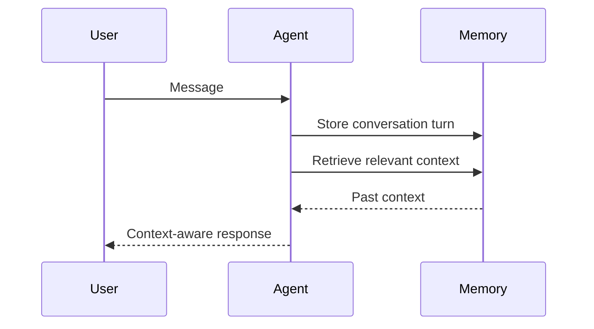
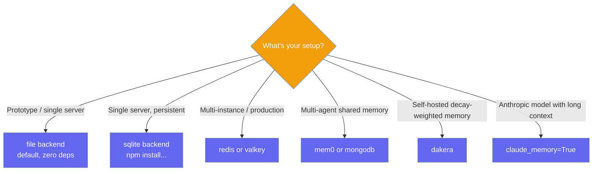

Memory lets agents remember past conversations, user preferences, and context across sessions.

```python
from praisonaiagents import Agent

agent = Agent(
    name="Assistant",
    instructions="You are a helpful personal assistant.",
    memory=True,
)

agent.start("My name is Alice and I prefer concise answers.")
```

The user shares preferences in chat; the agent recalls them in later sessions via the configured memory backend.



## Quick Start

<Steps>
<Step title="Simple Usage">
```python
from praisonaiagents import Agent

agent = Agent(instructions="You are a helpful assistant.", memory=True)
agent.start("Remember that I work in software engineering.")
```
</Step>

<Step title="With Configuration">
```python
from praisonaiagents import Agent, MemoryConfig

agent = Agent(
    instructions="You are a helpful assistant.",
    memory=MemoryConfig(
        backend="sqlite",
        user_id="alice",
        auto_memory=True,
    ),
)
agent.start("What do you know about my preferences?")
```
</Step>

<Step title="With Learning">
```python
from praisonaiagents import Agent, MemoryConfig, LearnConfig

agent = Agent(
    instructions="You are a helpful assistant.",
    memory=MemoryConfig(
        backend="redis",
        user_id="alice",
        learn=LearnConfig(persona=True, insights=True, mode="agentic"),
    ),
)
agent.start("I always want answers formatted as bullet points.")
```
</Step>
</Steps>

---

## How It Works



| Phase | What happens |
|---|---|
| 1. Store | Each conversation turn is saved to the memory backend |
| 2. Retrieve | Relevant past context is recalled before responding |
| 3. Respond | Agent answers with full historical context available |

---

## Which Backend to Choose?



---

## Configuration Options

<Card icon="code" href="/docs/sdk/reference/python/MemoryConfig">
  Full list of options, types, and defaults — `MemoryConfig`
</Card>

| Option | Type | Default | Description |
|---|---|---|---|
| `backend` | `str` | `"file"` | Storage backend: `file`, `sqlite`, `redis`, `valkey`, `postgres`, `mem0`, `mongodb`, `dakera` |
| `user_id` | `str \| None` | `None` | User identifier for scoped memory |
| `session_id` | `str \| None` | `None` | Session identifier |
| `auto_memory` | `bool` | `False` | Auto-extract and store key facts |
| `claude_memory` | `bool` | `False` | Anthropic-native memory (Claude models only) |
| `config` | `dict \| None` | `None` | Provider-specific configuration dict |
| `learn` | `bool \| LearnConfig \| None` | `None` | Enable continuous learning |
| `history` | `bool` | `False` | Auto-inject session history into context |
| `history_limit` | `int` | `10` | Max history turns to inject |
| `auto_save` | `str \| None` | `None` | Auto-save session with this name |

---

## Common Patterns

### Pattern 1 — User-scoped memory
```python
from praisonaiagents import Agent, MemoryConfig

agent = Agent(
    instructions="You are a personal assistant.",
    memory=MemoryConfig(user_id="user_alice", backend="sqlite"),
)
response = agent.start("What have I told you about my work preferences?")
print(response)
```

### Pattern 2 — History injection for conversation continuity
```python
from praisonaiagents import Agent, MemoryConfig

agent = Agent(
    instructions="You are a support agent.",
    memory=MemoryConfig(history=True, history_limit=5),
)
agent.start("Continue from where we left off.")
```

---

## Best Practices

<AccordionGroup>
<Accordion title="Always set user_id for multi-user apps">
Without `user_id`, all users share the same memory store. Set `user_id` to a unique identifier per user to keep memories properly scoped and private.
</Accordion>

<Accordion title="Use auto_memory for fact extraction">
Enable `auto_memory=True` to have the agent automatically identify and store important facts from each conversation — names, preferences, decisions — without extra code.
</Accordion>

<Accordion title="Combine memory with learning">
Set `learn=True` inside `MemoryConfig` to enable continuous learning alongside session memory. This gives agents both short-term context (memory) and long-term pattern recognition (learn).
</Accordion>

<Accordion title="Backend scaling path">
Start with `file`, move to `sqlite` when you need durability, then `redis` when you deploy multiple agent instances that share memory.
</Accordion>
</AccordionGroup>

---

## Related

<CardGroup cols={2}>
<Card title="Learn" icon="graduation-cap" href="/docs/features/learn">
  Learn — continuous learning from conversations
</Card>
<Card title="Knowledge" icon="book" href="/docs/features/knowledge">
  Knowledge — add documents and URLs as agent knowledge
</Card>
</CardGroup>
