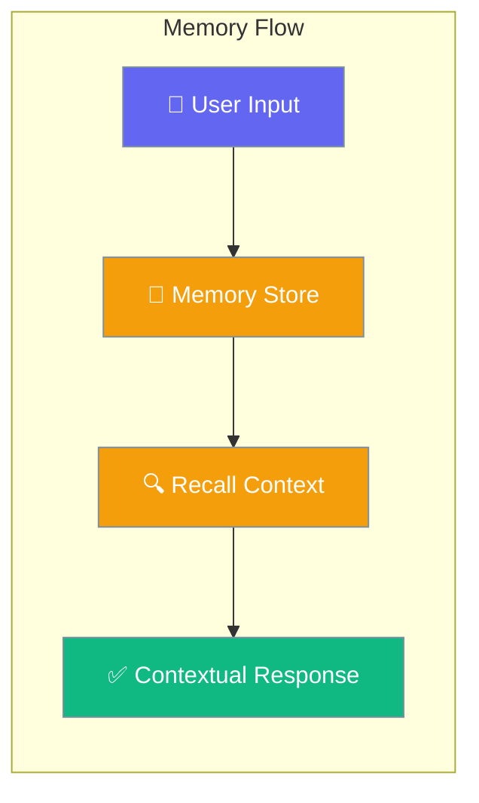
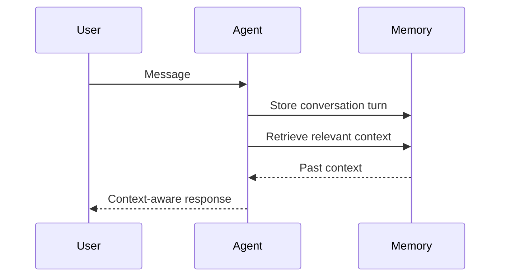
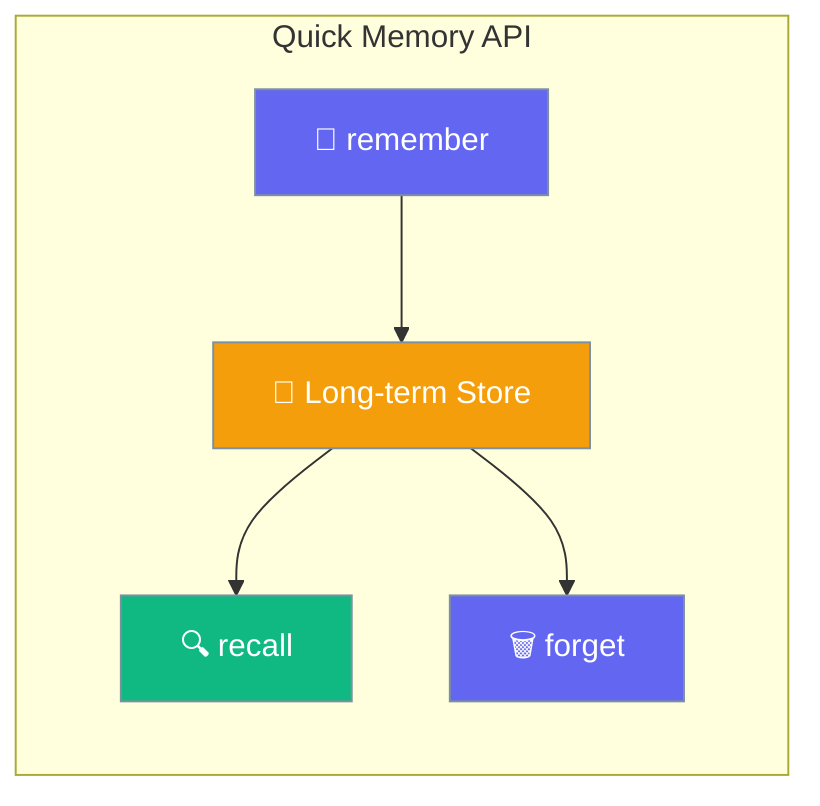
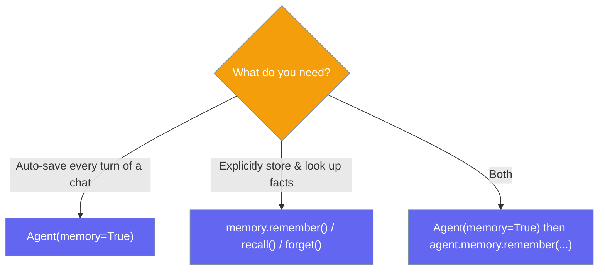
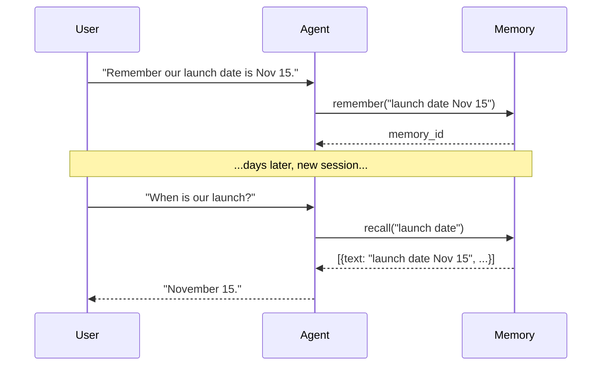
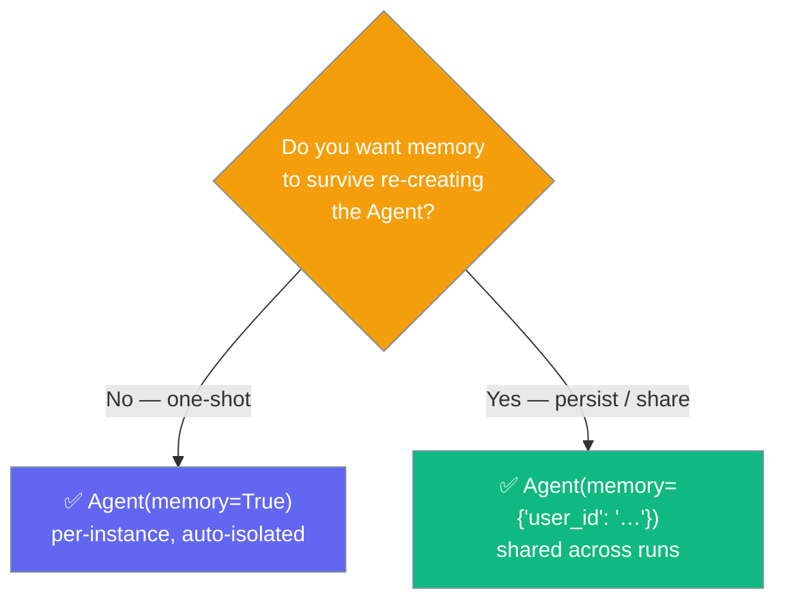

Memory lets agents remember past conversations, user preferences, and context across sessions.

<Note>
A subset of `Memory` is now callable directly over MCP — see [MCP Memory Tools](/features/mcp-memory-tools).
</Note>

<Note>
Replaces the deprecated `auto_save="name"` kwarg — see [Legacy Agent Parameters](/features/agent-legacy-params).
</Note>

## Grow memory autonomously

With `self_improve="background"` **and** `memory=True`, the same guarded post-turn review that autonomously grows skills can also autonomously persist durable facts and preferences via `store_memory` — off the hot path, with zero cost to reply latency and zero context pollution during the live turn. See [Self-Improving Agents](/features/self-improve).

```python
from praisonaiagents import Agent

agent = Agent(
    name="Assistant",
    instructions="You are a helpful personal assistant.",
    memory=True,  # memory is isolated per instance — pass user_id="…" to share/persist across runs
)

agent.start("My name is Alice and I prefer concise answers.")
```

The user shares preferences in chat; the agent recalls them in later sessions via the configured memory backend.


```mermaid
graph LR
    subgraph "Memory Flow"
        Input[💬 User Input] --> Store[💾 Memory Store]
        Store --> Recall[🔍 Recall Context]
        Recall --> Response[✅ Contextual Response]
    end

    classDef input fill:#6366F1,stroke:#7C90A0,color:#fff
    classDef process fill:#F59E0B,stroke:#7C90A0,color:#fff
    classDef output fill:#10B981,stroke:#7C90A0,color:#fff

    class Input input
    class Store,Recall process
    class Response output
```

<Warning>
**Breaking change: `backend` no longer accepts `redis`/`postgres`/`valkey`.**

`MemoryConfig(backend="redis")`, `backend="postgres"`, and `backend="valkey"` now raise a `ValueError` instead of silently substituting a local file store. Earlier releases *accepted* these values but stored data locally — so any code that "worked" was already not reaching Redis/Postgres.

Valid backends: `file`, `sqlite`, `chroma`, `mem0`, `mongodb`, `dakera`, `in_memory`.

**Two supported ways to use Redis / Postgres:**

1. **Recommended — pass a live `db()` store:**
   ```python
   from praisonaiagents import Agent, MemoryConfig, db

   agent = Agent(
       name="Assistant",
       instructions="You are a helpful assistant.",
       memory=MemoryConfig(db=db(url="redis://localhost:6379/0")),
   )
   ```

2. **Advanced — register a custom adapter:**
   ```python
   from praisonaiagents.memory.adapters import register_memory_adapter

   register_memory_adapter("redis", MyRedisAdapter)
   agent = Agent(memory=MemoryConfig(backend="redis"))  # now accepted
   ```

See [Redis persistence](/features/persistence-redis) for the full `db(url=...)` guide.
</Warning>

## Quick Start

<Steps>
<Step title="Level 1 — Bool (simplest)">

Turn on memory with a single flag — the agent remembers across turns using the default file backend.

```python
from praisonaiagents import Agent

agent = Agent(
    name="Assistant",
    instructions="You are a helpful assistant.",
    memory=True,  # memory is isolated per instance — pass user_id="…" to share/persist across runs
)
agent.start("Remember that I work in software engineering.")
```

<Tip>
`memory=True` and `memory="file"` are truly zero-dependency — the agent skips importing the heavier `Memory` module on this path, so `Agent(memory=True)` starts as fast as an agent with no memory. Heavier backends (`sqlite`, `chroma`, `mem0`, `mongodb`, `dakera`, or `learn=True`) load their dependencies lazily and raise a friendly `ImportError` if the `praisonaiagents[memory]` extra isn't installed.
</Tip>
</Step>

<Step title="Level 2 — String (pick a backend)">

Pass a backend name to choose where memories are stored.

```python
from praisonaiagents import Agent

agent = Agent(
    name="Assistant",
    instructions="You are a helpful assistant.",
    memory="sqlite",
)
agent.start("Remember that I prefer concise answers.")
```
</Step>

<Step title="Level 3 — Config class (full control)">

Use `MemoryConfig` to scope memory per user and auto-extract facts.

```python
from praisonaiagents import Agent, MemoryConfig

agent = Agent(
    name="Assistant",
    instructions="You are a helpful assistant.",
    memory=MemoryConfig(
        backend="sqlite",
        user_id="alice",
        auto_memory=True,
    ),
)
agent.start("What do you know about my preferences?")
```
</Step>

<Step title="Level 4 — Config with continuous learning">

Add `LearnConfig` to build a long-term persona alongside session memory.

```python
from praisonaiagents import Agent, MemoryConfig, LearnConfig

agent = Agent(
    name="Assistant",
    instructions="You are a helpful assistant.",
    memory=MemoryConfig(
        backend="sqlite",
        user_id="alice",
        learn=LearnConfig(persona=True, insights=True, mode="agentic"),
    ),
)
agent.start("I always want answers formatted as bullet points.")
```
</Step>
</Steps>

---

## How It Works


```mermaid
sequenceDiagram
    participant User
    participant Agent
    participant Memory

    User->>Agent: Message
    Agent->>Memory: Store conversation turn
    Agent->>Memory: Retrieve relevant context
    Memory-->>Agent: Past context
    Agent-->>User: Context-aware response
```

| Phase | What happens |
|---|---|
| 1. Store | Each conversation turn is saved to the memory backend |
| 2. Retrieve | Relevant past context is recalled before responding |
| 3. Respond | Agent answers with full historical context available |

<Tip>
Turn on `prefetch=True` on `MemoryConfig` to have relevant long-term memories injected into the system prompt at the start of every turn — no explicit `recall()` call required.
</Tip>

---

## Which Backend to Choose?

```mermaid
graph TB
    Q{What's your setup?}
    Q -->|Prototype / single server| F[file backend\ndefault, zero deps]
    Q -->|Single server, persistent| S[sqlite backend]
    Q -->|Vector search / RAG| C2[chroma backend]
    Q -->|Multi-agent shared memory| M[mem0 or mongodb]
    Q -->|Self-hosted decay-weighted memory| D[dakera]
    Q -->|Redis / Postgres| DB[use db\(url=...\)]
    Q -->|Anthropic model with long context| C[claude_memory=True]

    classDef decision fill:#F59E0B,stroke:#7C90A0,color:#fff
    classDef backend fill:#6366F1,stroke:#7C90A0,color:#fff

    class Q decision
    class F,S,C2,M,D,DB,C backend
```

---

## Configuration Options

<Card icon="code" href="/sdk/reference/praisonaiagents/modules/feature_configs">
  Full list of options, types, and defaults — `MemoryConfig`
</Card>

The most common options at a glance:

| Option | Type | Default | Description |
|---|---|---|---|
| `backend` | `str` | `"file"` | Storage backend: `file`, `sqlite`, `chroma`, `mem0`, `mongodb`, `dakera`, `in_memory`. Aliases: `chromadb`/`rag` → `chroma`, `none` → `in_memory`. |
| `user_id` | `str \| None` | `None` | User identifier for scoped memory. Leaving it `None` now yields a per-instance `agent-<uuid>` id (not a shared `"default"`) — set it to share/persist across runs |
| `auto_memory` | `bool` | `False` | Auto-extract and store key facts |
| `learn` | `bool \| LearnConfig \| None` | `None` | Enable continuous learning |
| `history` | `bool` | `False` | Auto-inject session history into context |
| `prefetch` | `bool` | `False` | Opt-in: at turn start, recall long-term memories relevant to the user prompt and inject them into the system context |
| `prefetch_limit` | `int` | `5` | Max number of memories injected per turn |
| `prefetch_token_budget` | `int` | `512` | Estimated-token cap for the injected memory block (truncated with `…` if exceeded) |

<Note>
Turn on `prefetch=True` on `MemoryConfig` to have relevant long-term memories injected into the system prompt at the start of every turn — no explicit `recall()` call required. See [Memory Prefetch](/features/memory-prefetch) for the full guide.
</Note>

---

## Common Patterns

### Pattern 1 — User-scoped memory
```python
from praisonaiagents import Agent, MemoryConfig

agent = Agent(
    instructions="You are a personal assistant.",
    memory=MemoryConfig(user_id="user_alice", backend="sqlite"),
)
response = agent.start("What have I told you about my work preferences?")
print(response)
```

### Pattern 2 — History injection for conversation continuity
```python
from praisonaiagents import Agent, MemoryConfig

agent = Agent(
    instructions="You are a support agent.",
    memory=MemoryConfig(history=True, history_limit=5),
)
agent.start("Continue from where we left off.")
```

<Note>
  Default sessions are **workspace-scoped** — the same agent name in a different project is a different session. See [Where sessions live](/docs/memory/features#where-sessions-live) for details and the `PRAISONAI_GLOBAL_SESSIONS` opt-out.
</Note>

### Pattern 3 — Recalled context at turn start
```python
from praisonaiagents import Agent, MemoryConfig

writer = Agent(
    name="writer",
    instructions="Store user facts.",
    memory=MemoryConfig(backend="file", user_id="alice"),
)
writer.memory.remember("User prefers metric units and dark mode.")

reader = Agent(
    name="reader",
    instructions="Answer using recalled context.",
    memory=MemoryConfig(
        backend="file",
        user_id="alice",
        prefetch=True,          # inject long-term memories at turn start
        prefetch_limit=5,
        prefetch_token_budget=512,
    ),
)

reader.start("What are my UI preferences?")
```

The agent sees a `## Recalled memories` block in its system prompt before the first model call — no extra tool call needed.

---

## Quick API — `remember`, `recall`, `forget`

Three verbs give you explicit control over long-term facts — store, look up, and delete.


```mermaid
graph LR
    subgraph "Quick Memory API"
        R[📝 remember] --> S[💾 Long-term Store]
        S --> C[🔍 recall]
        S --> F[🗑️ forget]
    end

    classDef verb fill:#6366F1,stroke:#7C90A0,color:#fff
    classDef store fill:#F59E0B,stroke:#7C90A0,color:#fff
    classDef out fill:#10B981,stroke:#7C90A0,color:#fff

    class R,F verb
    class S store
    class C out
```

An agent with `memory=True` exposes its memory instance directly, so you can store and recall facts on demand.

```python
from praisonaiagents import Agent

agent = Agent(
    name="Note Taker",
    instructions="Save and recall project facts on request.",
    memory=True,
)

# The agent's memory instance is available directly
agent.memory.remember("Sprint 42 ships on Friday")
matches = agent.memory.recall("When does sprint 42 ship?")
```

Use `Memory()` standalone in a plain script — no config, no agent required.

```python
from praisonaiagents.memory import Memory

mem = Memory()  # no config needed — uses local SQLite
mem.remember("API rate limit is 1000 req/min")
for m in mem.recall("rate limit"):
    print(m["text"])
mem.forget(query="rate limit")
```

### Parameters

| Method | Parameter | Type | Default | Description |
|---|---|---|---|---|
| `Memory()` | `config` | `dict \| None` | `None` | Backend config. Optional — omit for the default local backend. |
| `Memory()` | `verbose` | `int` | `0` | Verbosity level. |
| `remember` | `content` | `str` | *(required)* | Fact to store in long-term memory. |
| `remember` | `metadata` | `dict \| None` | `None` | Keyword-only. Extra metadata stored with the record. |
| `remember` *(returns)* | — | `str` | — | The generated memory id. |
| `recall` | `query` | `str` | *(required)* | Search string. |
| `recall` | `limit` | `int` | `5` | Keyword-only. Max results returned. |
| `recall` *(returns)* | — | `list[dict]` | — | Matching records, each with at least a `text` field. |
| `forget` | `memory_id` | `str \| None` | `None` | Keyword-only. Delete by exact id. |
| `forget` | `query` | `str \| None` | `None` | Keyword-only. Delete long-term records matching this query. |
| `forget` *(returns)* | — | `int` | — | Count of records deleted. |

<Note>
`remember()` and `recall()` operate on **long-term** memory only, and `forget(query=...)` is scoped to long-term memory to match. `forget()` requires **exactly one** of `memory_id` or `query` — passing neither, both, or an empty query raises `ValueError`.
</Note>

### Which memory API?


```mermaid
graph TB
    Q{What do you need?}
    Q -->|Auto-save every turn of a chat| A["Agent(memory=True)"]
    Q -->|Explicitly store & look up facts| B["memory.remember() / recall() / forget()"]
    Q -->|Both| C["Agent(memory=True) then agent.memory.remember(...)"]

    classDef q fill:#F59E0B,stroke:#7C90A0,color:#fff
    classDef opt fill:#6366F1,stroke:#7C90A0,color:#fff
    class Q q
    class A,B,C opt
```

### Interaction flow


```mermaid
sequenceDiagram
    participant User
    participant Agent
    participant Memory

    User->>Agent: "Remember our launch date is Nov 15."
    Agent->>Memory: remember("launch date Nov 15")
    Memory-->>Agent: memory_id

    Note over User,Memory: ...days later, new session...

    User->>Agent: "When is our launch?"
    Agent->>Memory: recall("launch date")
    Memory-->>Agent: [{text: "launch date Nov 15", ...}]
    Agent-->>User: "November 15."
```

---

## Best Practices

<AccordionGroup>
<Accordion title="Always set user_id when you want memory to persist or be shared">
As of PraisonAI PR #3614, `Agent(memory=True)` **without** a `user_id` generates a fresh per-instance identifier (`agent-<uuid>`) and logs a warning. Memory is **isolated per Agent object** by default — safe, but **not** what you want if you re-create the agent between requests and expect it to remember the last conversation.

Pass `user_id="alice"` (or `"tenant-42"`, `"project-climate"`, etc.) to opt into a shared / persistent store that survives across processes.


```mermaid
graph TB
    Q{Do you want memory<br/>to survive re-creating<br/>the Agent?} -->|No — one-shot| Iso["✅ Agent(memory=True)<br/>per-instance, auto-isolated"]
    Q -->|Yes — persist / share| Named["✅ Agent(memory={'user_id': '…'})<br/>shared across runs"]

    classDef q fill:#F59E0B,stroke:#7C90A0,color:#fff
    classDef iso fill:#6366F1,stroke:#7C90A0,color:#fff
    classDef named fill:#10B981,stroke:#7C90A0,color:#fff
    class Q q
    class Iso iso
    class Named named
```
</Accordion>

<Accordion title="Use auto_memory for fact extraction">
Enable `auto_memory=True` to have the agent automatically identify and store important facts from each conversation — names, preferences, decisions — without extra code.
</Accordion>

<Accordion title="Combine memory with learning">
Set `learn=True` inside `MemoryConfig` to enable continuous learning alongside session memory. This gives agents both short-term context (memory) and long-term pattern recognition (learn).
</Accordion>

<Accordion title="Backend scaling path">
Start with `file`, move to `sqlite` when you need durability, then `mongodb` (or `chroma` for vector search) when you deploy multiple agent instances that share memory. For Redis or Postgres, use `memory=MemoryConfig(db=db(url=...))` — see [Redis persistence](/features/persistence-redis).
</Accordion>

<Accordion title="Choose remember/recall for facts, memory=True for conversation history">
`Agent(memory=True)` auto-captures every conversation turn. `remember()` / `recall()` / `forget()` give you **explicit** control for fact storage — use them for structured knowledge you want to look up later. Both share the same long-term store when the agent's `memory` instance is used.
</Accordion>
</AccordionGroup>

---

## Related

<CardGroup cols={2}>
<Card title="Learn" icon="graduation-cap" href="/features/learn">
  Learn — continuous learning from conversations
</Card>
<Card title="Knowledge" icon="book" href="/features/knowledge">
  Knowledge — add documents and URLs as agent knowledge
</Card>
<Card title="Memory Flush on Compaction" icon="database-backup" href="/features/pre-compaction-memory-flush">
  Preserve facts before compaction — save durable facts before older messages are dropped
</Card>
</CardGroup>
