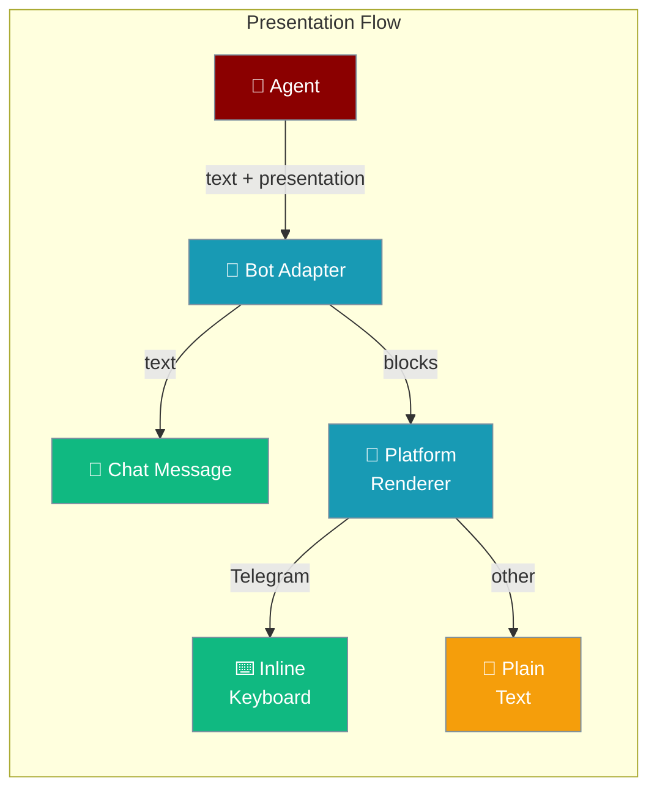
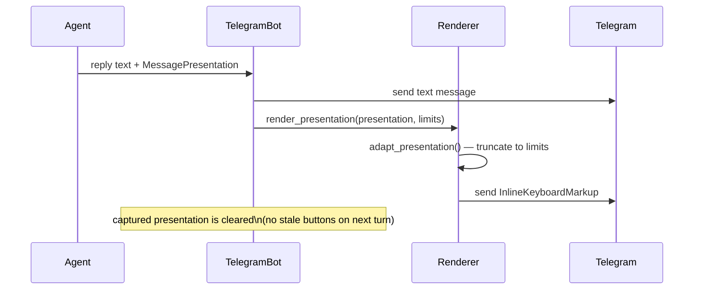

Agents can return a `MessagePresentation` alongside their reply text — Telegram renders it as a native inline keyboard; other platforms fall back to plain text until their renderer is wired.

```python
from praisonaiagents import Agent

agent = Agent(
    name="Survey Bot",
    instructions="Ask one multiple-choice question and attach button choices.",
)
agent.start("Which topic should we cover next: memory, tools, or workflows?")
```

The user receives a reply with inline buttons; their tap sends the choice back as the next message.



## Quick Start

<Steps>
<Step title="Quick-Reply Buttons">
The simplest way to add buttons — each tapped choice feeds the value back to the agent as the next user message:

```python
from praisonaiagents import Agent
from praisonaiagents.bots import MessagePresentation, PresentationBlock

agent = Agent(
    name="Survey Bot",
    instructions="""
    Ask a single multiple-choice question.
    Return your reply as text, then attach a presentation with buttons
    for the choices using PresentationBlock.quick_replies().
    """,
)

presentation = MessagePresentation(
    blocks=[
        PresentationBlock.make_text("How would you rate your experience?"),
        PresentationBlock.quick_replies([
            ("⭐ Excellent", "excellent"),
            ("👍 Good", "good"),
            ("👎 Poor", "poor"),
        ]),
    ]
)
```
</Step>

<Step title="Inline Keyboard with Callbacks">
Full control over button appearance and callback data:

```python
from praisonaiagents.bots import (
    MessagePresentation,
    PresentationBlock,
    PresentationButton,
    PresentationAction,
    ButtonStyle,
)

presentation = MessagePresentation(
    blocks=[
        PresentationBlock.make_text("Choose an action:"),
        PresentationBlock.make_buttons([
            PresentationButton(
                label="✅ Approve",
                action=PresentationAction.callback("approve:req-42"),
                style=ButtonStyle.PRIMARY,
                priority=10,
            ),
            PresentationButton(
                label="❌ Deny",
                action=PresentationAction.callback("deny:req-42"),
                style=ButtonStyle.DANGER,
                priority=9,
            ),
            PresentationButton(
                label="🔗 Open Details",
                action=PresentationAction.open_url("https://example.com/req/42"),
                priority=8,
            ),
        ]),
    ]
)
```
</Step>

<Step title="Use with an Agent and Telegram Bot">
```python
import asyncio
from praisonaiagents import Agent
from praisonaiagents.bots import (
    MessagePresentation, PresentationBlock, PresentationButton,
    PresentationAction, ButtonStyle,
)
from praisonai.bots import TelegramBot

agent = Agent(
    name="Action Bot",
    instructions="Help users take actions.",
)

bot = TelegramBot(token="YOUR_TOKEN", agent=agent)

presentation = MessagePresentation(
    blocks=[
        PresentationBlock.make_text("What would you like to do?"),
        PresentationBlock.quick_replies([("Start", "start"), ("Help", "help")]),
    ]
)

async def main():
    await bot.start()

asyncio.run(main())
```
</Step>
</Steps>

---

## How It Works



The `adapt_presentation()` function runs a channel-agnostic adaptation pass before rendering: it truncates buttons to platform limits, degrades select menus to button rows when unsupported, and degrades `web_app` actions to URLs on channels without mini-app support.

---

## Block Types

| Block type | Method | Description |
|------------|--------|-------------|
| `text` | `PresentationBlock.make_text(content)` | Plain or markdown text |
| `buttons` | `PresentationBlock.make_buttons(items)` | Row of clickable buttons |
| `quick_replies` | `PresentationBlock.quick_replies(choices)` | Shortcut for reply-action buttons |
| `select` | `PresentationBlock.make_select(options)` | Dropdown menu (degraded to buttons on Telegram) |
| `divider` | `PresentationBlock.make_divider()` | Visual separator |
| `context` | `PresentationBlock.make_context(content)` | Smaller contextual text |

---

## Action Types

| Action | Factory | Description |
|--------|---------|-------------|
| `callback` | `PresentationAction.callback(value)` | Opaque callback data for your handler |
| `reply` | `PresentationAction.reply(value)` | Feed value back as next agent input |
| `command` | `PresentationAction.command("/cmd")` | Trigger a slash command |
| `url` | `PresentationAction.open_url(url)` | Open a URL |
| `web_app` | `PresentationAction(type="web_app", web_app_url=url)` | Open a mini-app (Telegram only) |

---

## Platform Support & Limits

| Platform | Presentation support | Notes |
|----------|---------------------|-------|
| Telegram | ✅ Native inline keyboard | Wired in PR #2483 |
| Slack | 🔜 Planned | Falls back to plain text |
| Discord | 🔜 Planned | Falls back to plain text |
| WhatsApp | ✅ Native interactive (reply buttons + list messages) | Delivered via Cloud API `interactive` payloads (`button` / `list`) — see [Bot Presentations](/docs/features/bot-presentations) |

### Telegram Limits

| Limit | Value |
|-------|-------|
| `max_buttons` per row/message | 8 |
| `max_button_rows` | 100 |
| `max_button_label` | 64 characters |
| `callback_data` | **64 UTF-8 bytes** |
| `max_text_length` | 4096 characters |
| Native select menu | ❌ (degraded to buttons) |
| Web app (`web_app_url`) | ✅ |

<Warning>
**Callback data is capped at 64 UTF-8 bytes** (Telegram platform limit). `callback_data` values that exceed this are truncated at the UTF-8 byte boundary. For non-ASCII payloads this means fewer than 64 characters may be kept. Use short, ASCII-safe identifiers as callback values.
</Warning>

### WhatsApp Limits

| Limit | Value |
|-------|-------|
| `max_buttons` (list rows) | 10 |
| Reply buttons per message | 3 |
| `max_button_rows` | 1 |
| `max_button_label` (list row) | 24 characters |
| Reply-button title | 20 characters |
| `max_options` (list rows) | 10 |
| `max_option_label` | 24 characters |
| `max_text_length` (text / list body) | 4096 characters |
| Reply-button message body | 1024 characters |
| Reply / list-row `id` | 256 characters |
| Native select menu | ✅ (rendered as a list message) |
| Markdown | ❌ |
| Web app (`web_app_url`) | ❌ (degraded via `adapt_presentation`) |

<Warning>
WhatsApp uses **split caps**: reply-button titles are capped at 20 chars while list-row titles allow 24. Reply-button message bodies cap at 1024 chars (vs 4096 for text and list bodies). Every reply/list-row `id` is capped at 256 chars (Cloud API limit).
</Warning>

---

## Button Priorities

When more buttons are defined than the platform limit allows, the adaptation pass keeps the highest-`priority` buttons and drops the rest:

```python
PresentationButton(label="Critical", action=..., priority=10)  # kept first
PresentationButton(label="Secondary", action=..., priority=5)   # dropped if cap hit
PresentationButton(label="Optional", action=..., priority=1)    # dropped first
```

---

## Best Practices

<AccordionGroup>
<Accordion title="Use reply actions for simple choices">
`PresentationAction.reply(value)` feeds the chosen value back directly as the user's next message — your agent sees it as normal input without needing any callback handler.
</Accordion>

<Accordion title="Keep callback values short and ASCII">
Telegram's 64-byte callback cap is measured in UTF-8 bytes. Emoji, CJK, or long UUIDs can exhaust the budget quickly. Use compact IDs (e.g. `"approve:42"`) as callback payloads.
</Accordion>

<Accordion title="Presentations are cleared after each turn">
The captured presentation is popped after `chat()` in both streaming and non-streaming paths, so cancelling or returning never leaves stale buttons visible.
</Accordion>

<Accordion title="Test with adapt_presentation()">
Call `adapt_presentation(presentation, PresentationLimits.telegram())` before sending to preview which buttons survive the Telegram limit and how select menus are degraded. Use `PresentationLimits.whatsapp()`, `.slack()`, or `.discord()` to preview the other channels.
</Accordion>
</AccordionGroup>

---

## Related

<CardGroup cols={2}>
<Card title="Approval Secure Backend" icon="shield" href="/docs/features/approval-secure-backend">
  Durable approval buttons with actor authorisation
</Card>
<Card title="Bot Presentations" icon="layout-grid" href="/docs/features/bot-presentations">
  Overview of bot presentation capabilities
</Card>
<Card title="Interactive Bot Actions" icon="mouse-pointer" href="/docs/features/interactive-bot-actions">
  Handling button taps and callbacks
</Card>
<Card title="Channel Capabilities" icon="sliders" href="/docs/features/channel-capabilities">
  What each platform can render
</Card>
</CardGroup>
