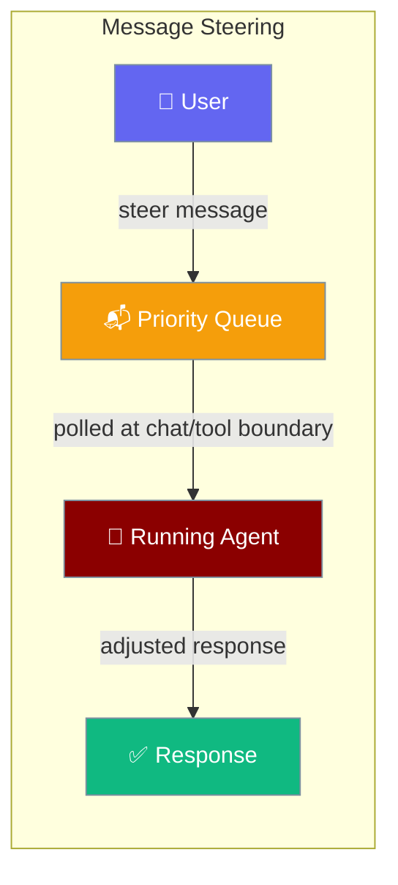
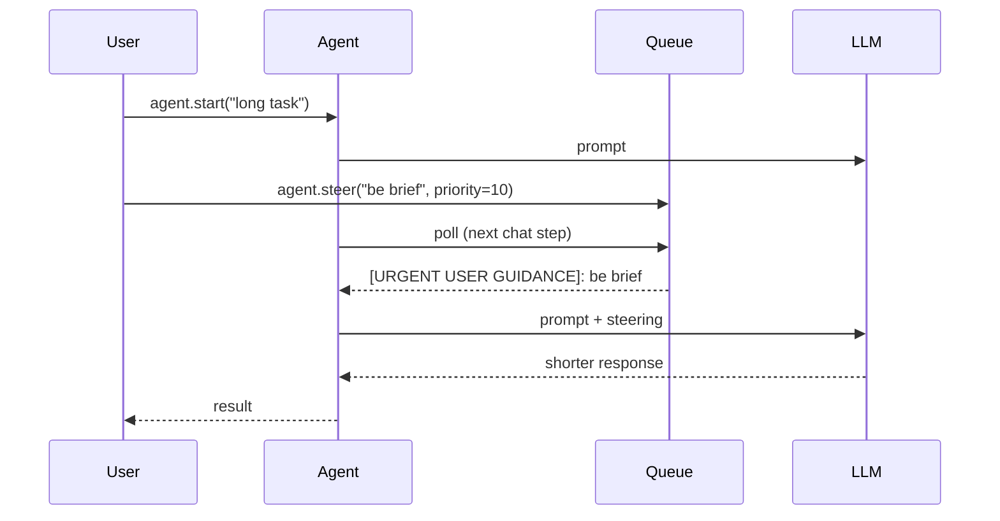
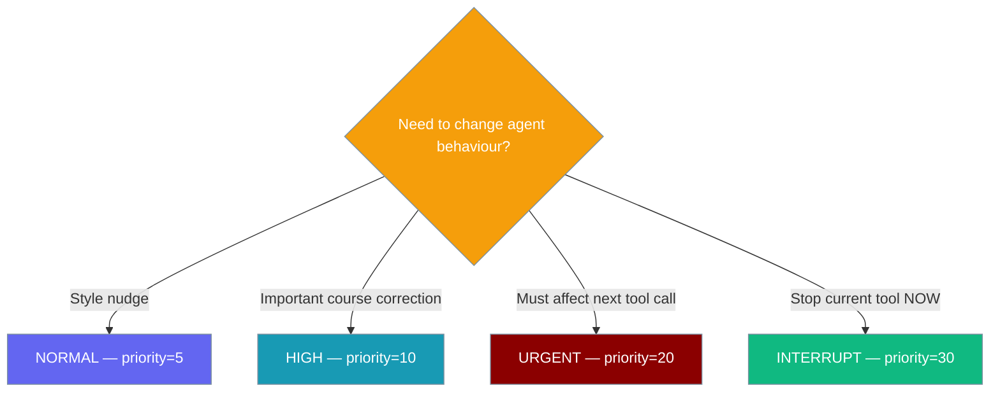

Message Steering lets you send guidance to a running agent without restarting it.



## Quick Start

<Steps>
<Step title="Simple Usage">
Enable with `message_steering=True` and use `agent.steer()` to send guidance.

```python
from praisonaiagents import Agent

agent = Agent(
    name="researcher",
    instructions="You are a research assistant",
    message_steering=True,
    llm="gpt-4o-mini",
)

agent.steer("Focus on business impact, keep under 200 words", priority=10)

agent.start("Summarise the latest AI trends")
```
</Step>

<Step title="Threaded Pattern">
Send steering messages while the agent is actively running.

```python
import threading, time
from praisonaiagents import Agent

agent = Agent(name="writer", instructions="You write articles", message_steering=True)

def run():
    return agent.start("Write a comprehensive article about quantum computing")

t = threading.Thread(target=run); t.start()

time.sleep(0.5); agent.steer("Make it beginner-friendly")
time.sleep(1.0); agent.steer("Include practical applications", priority=15)
time.sleep(1.5); agent.steer("Keep under 300 words total", priority=20)

t.join()
```
</Step>

<Step title="Async Pattern">
Use async execution with real-time steering.

```python
import asyncio
from praisonaiagents import Agent

async def main():
    agent = Agent(name="analyst", instructions="You analyse data", message_steering=True)
    task = asyncio.create_task(agent.astart("Analyse impact of AI on job markets"))

    await asyncio.sleep(0.3); agent.steer("Focus on positive opportunities")
    await asyncio.sleep(0.7); agent.steer("Include specific examples", priority=12)

    print(await task)

asyncio.run(main())
```
</Step>
</Steps>

---

## How It Works



Message steering injects guidance at chat and tool execution boundaries without interrupting the agent's workflow.

---

## Priority Levels



| Priority | Int value | Behaviour |
|----------|-----------|-----------|
| LOW | 1 | Whispered guidance |
| NORMAL | 5 | Default priority |
| HIGH | 10 | Acknowledged urgently in next chat step |
| URGENT | 20 | Can interrupt tool execution |
| INTERRUPT | 30 | Bypasses rate limiting; immediate stop of current tool |

---

## CLI Usage

Enable message steering from command line:

```bash
praisonai --message-steering "Write a detailed report about AI trends"
```

The `--message-steering` flag sets `message_steering=True` on the agent.

---

## YAML Usage

Enable steering per role in YAML configuration:

```yaml
framework: praisonai
roles:
  researcher:
    role: Research Assistant
    goal: Conduct thorough research
    message_steering: true   # Enable per-role
    tasks:
      research_task:
        description: Research AI trends and write report
        expected_output: Comprehensive research report
```

---

## Configuration Options

| Option | Type | Default | Description |
|--------|------|---------|-------------|
| `message_steering` | `bool` \| `MessageSteeringProtocol` | `False` | Enable steering |
| `max_messages` | `int` | `50` | Queue capacity (in constructor) |
| `check_interval` | `float` | `0.1` | Poll interval in seconds |

When `message_steering=False` (default), there's zero overhead - the feature has no performance impact when disabled.

---

## Agent Methods

| Method | Signature | Description |
|--------|-----------|-------------|
| `steer` | `agent.steer(message: str, priority: int = 5) -> str` | Queue a steering message. Returns tracking ID. |
| `get_steering_status` | `agent.get_steering_status() -> Dict[str, Any]` | Returns `{enabled, pending_count, has_pending}` |
| `message_steering_enabled` (property) | `agent.message_steering_enabled -> bool` | Whether steering is active |

---

## Custom Steering Backends

Implement `MessageSteeringProtocol` to plug custom backends:

```python
from praisonaiagents import Agent, MessageSteeringProtocol, SteeringMessage, SteeringPriority

class RedisSteering:  # Implements MessageSteeringProtocol structurally
    def queue_message(self, message: str, priority: int = 5) -> str: ...
    def get_pending_messages(self): ...
    def process_steering(self, context=None) -> bool: ...
    def clear_messages(self) -> int: ...
    def has_pending_messages(self) -> bool: ...
    @property
    def enabled(self) -> bool: ...

agent = Agent(name="bg", message_steering=RedisSteering())
```

---

## Best Practices

<AccordionGroup>
<Accordion title="Use threading for long-running tasks">
Start agents in background threads to enable concurrent steering. The threaded pattern is the primary use case for message steering.
</Accordion>

<Accordion title="Choose appropriate priorities">
Use NORMAL (5) for style guidance, HIGH (10) for course corrections, URGENT (20) to interrupt tools, and INTERRUPT (30) only for immediate stops.
</Accordion>

<Accordion title="Keep messages concise">
Steering messages are injected into prompts. Keep them brief and actionable for best results.
</Accordion>

<Accordion title="Monitor steering status">
Use `get_steering_status()` to check pending messages and ensure your guidance is being processed.
</Accordion>
</AccordionGroup>

---

## Related

<Note>
When wrapping a steering-enabled agent in a chat bot, set the bot's `busy_mode="steer"` to surface this capability to end users. See [Bot Run Control](/docs/features/bot-run-control).
</Note>

<CardGroup cols={2}>
  <Card icon="webhook" href="/docs/concepts/hooks">Pre/post execution hooks (compile-time interception)</Card>
  <Card icon="keyboard" href="/docs/concepts/input-handling">Interactive input vs background steering</Card>
  <Card icon="octagon-pause" href="/docs/features/bot-run-control">Bot Run Control — wire steer mode to chat bots</Card>
</CardGroup>