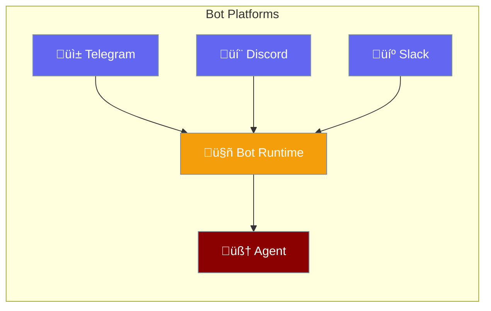

Messaging Bots enable your AI agents to interact with users on popular messaging platforms like Telegram, Discord, and Slack.



## Quick Start

<Steps>

<Step title="Configure Bot">
```python
from praisonaiagents import BotConfig

config = BotConfig(
    token="your-bot-token",
    command_prefix="/",
    typing_indicator=True
)
```
</Step>

<Step title="Start Bot via CLI">
```bash
# Telegram
praisonai bot telegram --token $TELEGRAM_BOT_TOKEN

# Discord
praisonai bot discord --token $DISCORD_BOT_TOKEN

# Slack (requires both bot token AND app token for Socket Mode)
praisonai bot slack --token $SLACK_BOT_TOKEN --app-token $SLACK_APP_TOKEN
```
</Step>

<Step title="Connect Agent">
```python
from praisonaiagents import Agent

agent = Agent(
    name="assistant",
    instructions="Help users with their questions"
)

# Bot routes messages to agent
```
</Step>

</Steps>

---

## How It Works


| Component | Role |
|-----------|------|
| **Platform** | Telegram, Discord, or Slack |
| **Bot** | Message router and formatter |
| **Agent** | AI processing and response |
| **User** | End user on messaging app |

---

## Configuration Options

```python
from praisonaiagents import BotConfig

config = BotConfig(
    token="bot-token",              # Bot authentication token
    webhook_url=None,               # Webhook URL (optional)
    command_prefix="/",             # Command prefix
    mention_required=True,          # Require @mention in groups
    typing_indicator=True,          # Show typing indicator
    max_message_length=4096,        # Max message length
    allowed_users=[],               # Allowed user IDs (empty = all)
    allowed_channels=[],            # Allowed channel IDs
    reply_in_thread=False,          # Reply in threads (default: inline)
    thread_threshold=500,           # Auto-thread if response > N chars (0 = disabled)
)
```

| Option | Type | Default | Description |
|--------|------|---------|-------------|
| `token` | `str` | `""` | Bot authentication token |
| `webhook_url` | `str` | `None` | Webhook URL for webhook mode |
| `command_prefix` | `str` | `"/"` | Prefix for bot commands |
| `mention_required` | `bool` | `True` | Require @mention in channels (DMs never require mention) |
| `typing_indicator` | `bool` | `True` | Show typing indicator |
| `max_message_length` | `int` | `4096` | Max message length |
| `allowed_users` | `list` | `[]` | Allowed user IDs |
| `allowed_channels` | `list` | `[]` | Allowed channel IDs |
| `timeout` | `int` | `30` | Request timeout |
| `reply_in_thread` | `bool` | `False` | Always reply in threads |
| `thread_threshold` | `int` | `500` | Auto-thread responses longer than N chars (0 = disabled) |

<Note>
**Reply behavior:**
- **Default**: Inline replies in the channel
- **Auto-thread**: Responses > 500 chars are automatically threaded
- **Force thread**: Set `reply_in_thread=True` to always use threads
</Note>

---

## Platform Setup

<Tabs>
<Tab title="Telegram">
1. Message [@BotFather](https://t.me/BotFather) on Telegram
2. Send `/newbot` and follow prompts
3. Copy the bot token

```bash
export TELEGRAM_BOT_TOKEN="123456:ABC-DEF..."
praisonai bot telegram --token $TELEGRAM_BOT_TOKEN
```
</Tab>

<Tab title="Discord">
1. Go to [Discord Developer Portal](https://discord.com/developers/applications)
2. Create new application → Bot → Reset Token
3. Enable Message Content Intent
4. Invite bot to server with proper permissions

```bash
export DISCORD_BOT_TOKEN="MTIz..."
praisonai bot discord --token $DISCORD_BOT_TOKEN
```
</Tab>

<Tab title="Slack">
1. Go to [Slack API](https://api.slack.com/apps)
2. Create new app → **OAuth & Permissions**
3. Add Bot Token Scopes: `chat:write`, `app_mentions:read`, `im:history`, `channels:history`
4. Install to workspace and copy **Bot Token** (`xoxb-...`)
5. Go to **Socket Mode** → Enable Socket Mode
6. Go to **Basic Information** → **App-Level Tokens** → Generate Token
7. Add scope: `connections:write` and copy **App Token** (`xapp-...`)

```bash
export SLACK_BOT_TOKEN="xoxb-..."   # Bot User OAuth Token
export SLACK_APP_TOKEN="xapp-..."   # App-Level Token for Socket Mode
praisonai bot slack --token $SLACK_BOT_TOKEN --app-token $SLACK_APP_TOKEN
```

<Warning>
**Without `--app-token`**, the bot will start but **will NOT receive messages** via Socket Mode.
</Warning>
</Tab>
</Tabs>

---

## Bot Commands

Built-in commands users can send:

| Command | Description |
|---------|-------------|
| `/help` | Show available commands |
| `/status` | Check bot status |
| `/reset` | Reset conversation |
| `/model` | Show current model |

Custom commands are automatically created from agent tools.

---

## Common Patterns

<Tabs>
<Tab title="Restricted Access">
```python
from praisonaiagents import BotConfig

config = BotConfig(
    token="your-token",
    allowed_users=["user123", "user456"],
    allowed_channels=["channel789"]
)
```
</Tab>

<Tab title="Webhook Mode">
```python
from praisonaiagents import BotConfig

config = BotConfig(
    token="your-token",
    webhook_url="https://your-domain.com/webhook",
    webhook_path="/telegram/webhook"
)
```
</Tab>

<Tab title="Group Settings">
```python
from praisonaiagents import BotConfig

config = BotConfig(
    token="your-token",
    mention_required=True,   # Only respond when @mentioned
    command_prefix="!",      # Use ! for commands
)
```
</Tab>
</Tabs>

---

## CLI Commands

```bash
# Start Telegram bot
praisonai bot telegram --token $TOKEN

# Start Discord bot
praisonai bot discord --token $TOKEN

# Start Slack bot  
praisonai bot slack --token $TOKEN --app-token $APP_TOKEN

# With agent configuration
praisonai bot telegram --token $TOKEN --agent agents.yaml
```

<Note>
The Slack bot uses [Slack Bolt](https://slack.dev/bolt-python/), Slack's official Python framework.
When running, you'll see "⚡️ Bolt app is running!" - this confirms the bot is connected and listening.
</Note>

---

## Best Practices

<AccordionGroup>
  <Accordion title="Secure your bot token">
    Never commit bot tokens to version control. Use environment variables or secure secret management.
  </Accordion>
  
  <Accordion title="Use allowlists in production">
    Set `allowed_users` and `allowed_channels` to prevent unauthorized access to your bot.
  </Accordion>
  
  <Accordion title="Enable mention requirement for groups">
    Set `mention_required=True` to prevent the bot from responding to every message in group chats.
  </Accordion>
  
  <Accordion title="Handle rate limits gracefully">
    Configure `retry_attempts` and implement exponential backoff for API rate limits.
  </Accordion>
</AccordionGroup>

---

## Related

<CardGroup cols={2}>
  <Card title="Gateway" icon="tower-broadcast" href="/features/gateway">
    Multi-agent coordination
  </Card>
  <Card title="Webhooks" icon="webhook" href="/features/webhooks">
    Event-driven integrations
  </Card>
</CardGroup>
