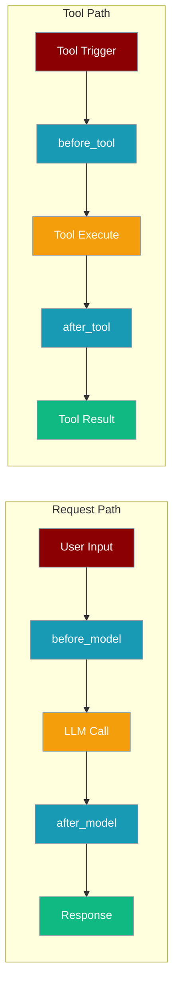
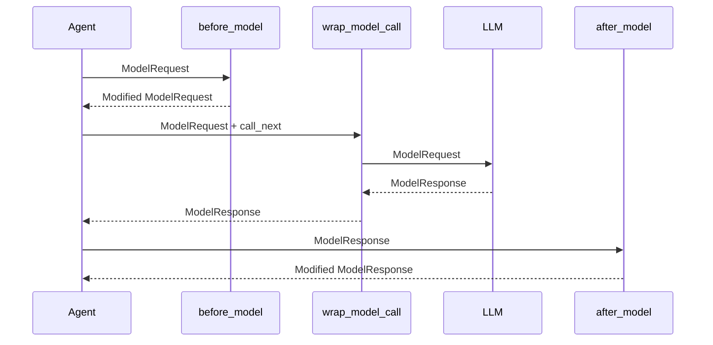

Middleware lets your agent intercept every LLM call and every tool call — log them, modify inputs, retry on failure, or block execution entirely.



## Quick Start

<Steps>
<Step title="Add a logging middleware">

```python
from praisonaiagents import Agent
from praisonaiagents.hooks import before_model, after_model

@before_model
def log_request(request):
    print(f"Calling model: {request.model}")
    return request

@after_model
def log_response(response):
    print(f"Model replied: {response.content[:80]}")
    return response

agent = Agent(
    name="Assistant",
    instructions="Answer questions helpfully.",
    hooks=[log_request, log_response]
)

result = agent.start("What is 2 + 2?")
```

</Step>

<Step title="Wrap calls for retry logic">

```python
from praisonaiagents import Agent
from praisonaiagents.hooks import wrap_model_call, wrap_tool_call

@wrap_model_call
def retry_model(request, call_next):
    for attempt in range(3):
        try:
            return call_next(request)
        except Exception as exc:
            if attempt == 2:
                raise
    return call_next(request)

@wrap_tool_call
def retry_tool(request, call_next):
    for attempt in range(3):
        try:
            return call_next(request)
        except Exception as exc:
            if attempt == 2:
                raise

agent = Agent(
    name="RobustBot",
    instructions="Answer questions with retry protection.",
    hooks=[retry_model, retry_tool]
)

result = agent.start("Search for today's news.")
```

</Step>
</Steps>

---

## How It Works



Execution order for a model call:
1. All `before_model` hooks run in registration order
2. `wrap_model_call` middleware chain wraps the actual LLM call
3. The real LLM call executes
4. All `after_model` hooks run in **reverse** registration order

The same order applies for tool calls with `before_tool`, `wrap_tool_call`, and `after_tool`.

| Decorator | Receives | Returns | Use for |
|-----------|----------|---------|---------|
| `@before_model` | `ModelRequest` | `ModelRequest` | Inject context, modify messages |
| `@after_model` | `ModelResponse` | `ModelResponse` | Log, transform, or redact output |
| `@wrap_model_call` | `(ModelRequest, call_next)` | `ModelResponse` | Retry, caching, circuit-breaking |
| `@before_tool` | `ToolRequest` | `ToolRequest` | Validate arguments, add auth |
| `@after_tool` | `ToolResponse` | `ToolResponse` | Sanitize results, log usage |
| `@wrap_tool_call` | `(ToolRequest, call_next)` | `ToolResponse` | Retry flaky tools, mock in tests |

---

## Configuration Options

Pass middleware as a flat list to `Agent(hooks=[...])`. Mix decorator types freely.

```python
agent = Agent(
    name="MyAgent",
    instructions="...",
    hooks=[log_request, retry_model, validate_tools]  # order matters
)
```

**Data types available:**

```python
from praisonaiagents.hooks import (
    ModelRequest,    # messages, model, temperature, context, tools, extra
    ModelResponse,   # content, model, usage, context, tool_calls, extra
    ToolRequest,     # tool_name, arguments, context, extra
    ToolResponse,    # tool_name, result, error, context, extra
    InvocationContext,  # agent_id, run_id, session_id, tool_name, model_name, metadata
)
```

<Card title="Middleware API Reference" icon="code" href="/docs/sdk/reference/typescript/classes/HooksConfig">
  TypeScript middleware configuration
</Card>
<Card title="Hooks Rust Reference" icon="code" href="/docs/sdk/reference/rust/classes/HookRegistry">
  Rust hooks configuration
</Card>

---

## Common Patterns

**Inject a system prompt on every call:**

```python
from praisonaiagents.hooks import before_model

@before_model
def add_safety_prompt(request):
    safety = {"role": "system", "content": "Always be safe and helpful."}
    if safety not in request.messages:
        request.messages.insert(0, safety)
    return request
```

**Block a specific tool:**

```python
from praisonaiagents.hooks import before_tool, ToolRequest

@before_tool
def block_delete(request: ToolRequest):
    if request.tool_name == "delete_file":
        raise PermissionError("delete_file is disabled in this environment.")
    return request
```

**Cache expensive tool results:**

```python
import hashlib, json
from praisonaiagents.hooks import wrap_tool_call

_cache = {}

@wrap_tool_call
def cache_results(request, call_next):
    key = hashlib.md5(json.dumps(request.arguments, sort_keys=True).encode()).hexdigest()
    if key in _cache:
        return _cache[key]
    result = call_next(request)
    _cache[key] = result
    return result
```

---

## Best Practices

<AccordionGroup>
<Accordion title="Always return the request/response object">
  Every `before_*` and `after_*` hook must return the (possibly modified) object. Returning `None` breaks the chain and raises a runtime error.
</Accordion>

<Accordion title="Use wrap_* for retry and circuit-breaking">
  `wrap_model_call` and `wrap_tool_call` give you full control over whether `call_next` is called — perfect for retries, timeouts, and feature flags. `before_*`/`after_*` hooks cannot short-circuit the call.
</Accordion>

<Accordion title="Keep hooks stateless or use thread-local state">
  Agents can run concurrently. Avoid mutable global state in hooks. If you need per-request state, use `request.context.metadata` or Python's `contextvars`.
</Accordion>

<Accordion title="Zero overhead when hooks are empty">
  The middleware manager checks for registered hooks before executing any code. When `hooks=[]` (the default), the fast path skips all hook processing entirely.
</Accordion>
</AccordionGroup>

---

## Related

<CardGroup cols={2}>
<Card title="Hooks" icon="code-branch" href="/docs/features/hooks">
  Event-based hooks for agent lifecycle events
</Card>
<Card title="Callbacks" icon="bell" href="/docs/features/callbacks">
  UI-focused callbacks for display and streaming events
</Card>
</CardGroup>
