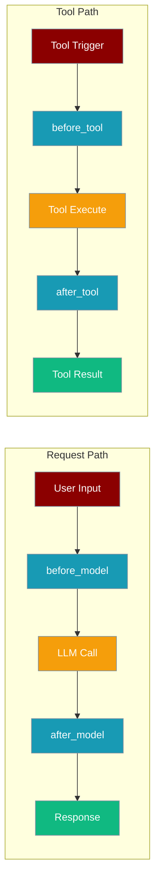
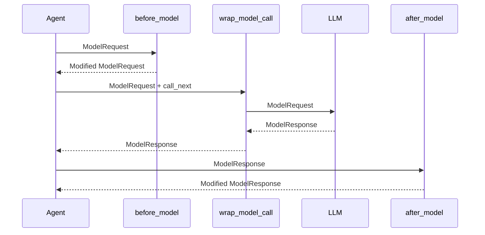
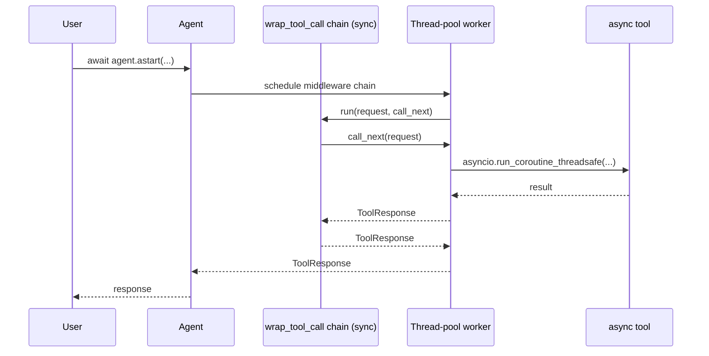

Middleware lets your agent intercept every LLM call and every tool call — log them, modify inputs, retry on failure, or block execution entirely.

<Note>
As of PraisonAI [#4334](https://github.com/MervinPraison/PraisonAI/pull/4334) (2026-08-25), model middleware (`@before_model` / `@after_model` / `@wrap_model_call`) now fires on every model call for both sync (`agent.start`, `agent.chat`) and async (`agent.astart`, `agent.achat`) paths. Prior to this fix only tool hooks were wired — model hooks registered but never ran. If you defined model hooks that "seemed to do nothing" before, they will now execute. Zero-overhead fast path preserved: agents with no model hooks bypass the middleware chain entirely.
</Note>

<Note>
As of PraisonAI [#3086](https://github.com/MervinPraison/PraisonAI/pull/3086) (2026-07-16), tool middleware (`before_tool` / `after_tool` / `wrap_tool_call`) gates **async** tool calls as well — the same hooks fire around `agent.astart(...)` and `execute_tool_async(...)`. No API change; existing hooks work unmodified.
</Note>

```python
from praisonaiagents import Agent
from praisonaiagents.hooks import before_model

@before_model
def log_request(event):
    print(f"Model call: {len(event.messages)} messages")

agent = Agent(name="Guarded", instructions="Answer helpfully.")
agent.start("Explain middleware in one paragraph.")
```

The user adds hooks or wrap decorators; middleware runs on every model and tool call in the agent loop.


```mermaid
graph LR
    subgraph "Request Path"
        A[User Input] --> B[before_model]
        B --> C[LLM Call]
        C --> D[after_model]
        D --> E[Response]
    end
    subgraph "Tool Path"
        F[Tool Trigger] --> G[before_tool]
        G --> H[Tool Execute]
        H --> I[after_tool]
        I --> J[Tool Result]
    end

    classDef input fill:#8B0000,stroke:#7C90A0,color:#fff
    classDef middleware fill:#189AB4,stroke:#7C90A0,color:#fff
    classDef process fill:#F59E0B,stroke:#7C90A0,color:#fff
    classDef output fill:#10B981,stroke:#7C90A0,color:#fff

    class A,F input
    class B,G,D,I middleware
    class C,H process
    class E,J output
```

## Quick Start

<Steps>
<Step title="Add a logging middleware">

```python
from praisonaiagents import Agent
from praisonaiagents.hooks import before_model, after_model

@before_model
def log_request(request):
    print(f"Calling model: {request.model}")
    return request

@after_model
def log_response(response):
    print(f"Model replied: {response.content[:80]}")
    return response

agent = Agent(
    name="Assistant",
    instructions="Answer questions helpfully.",
    hooks=[log_request, log_response]
)

result = agent.start("What is 2 + 2?")
```

</Step>

<Step title="Wrap calls for retry logic">

```python
from praisonaiagents import Agent
from praisonaiagents.hooks import wrap_model_call, wrap_tool_call

@wrap_model_call
def retry_model(request, call_next):
    for attempt in range(3):
        try:
            return call_next(request)
        except Exception as exc:
            if attempt == 2:
                raise
    return call_next(request)

@wrap_tool_call
def retry_tool(request, call_next):
    for attempt in range(3):
        try:
            return call_next(request)
        except Exception as exc:
            if attempt == 2:
                raise

agent = Agent(
    name="RobustBot",
    instructions="Answer questions with retry protection.",
    hooks=[retry_model, retry_tool]
)

result = agent.start("Search for today's news.")
```

</Step>

<Step title="Async parity">

The same hooks gate async tool calls — write them once and they fire for both `agent.start(...)` and `agent.astart(...)`.

```python
import asyncio
from praisonaiagents import Agent
from praisonaiagents.hooks import before_tool, ToolRequest

@before_tool
def audit(request: ToolRequest):
    print(f"[audit] {request.tool_name}({request.arguments})")
    return request

agent = Agent(name="AsyncAudited", instructions="Answer with tools.", hooks=[audit])

async def main():
    await agent.astart("Look up the weather in Paris.")

asyncio.run(main())
```

Under the hood the synchronous `wrap_tool_call` chain runs in a thread-pool worker and the actual async tool execution is scheduled back on the event loop — so you write hooks the same way for sync and async.

</Step>
</Steps>

---

## How It Works


```mermaid
sequenceDiagram
    participant Agent
    participant before_model
    participant wrap_model_call
    participant LLM
    participant after_model

    Agent->>before_model: ModelRequest
    before_model-->>Agent: Modified ModelRequest
    Agent->>wrap_model_call: ModelRequest + call_next
    wrap_model_call->>LLM: ModelRequest
    LLM-->>wrap_model_call: ModelResponse
    wrap_model_call-->>Agent: ModelResponse
    Agent->>after_model: ModelResponse
    after_model-->>Agent: Modified ModelResponse
```

Execution order for a model call:
1. All `before_model` hooks run in registration order
2. `wrap_model_call` middleware chain wraps the actual LLM call
3. The real LLM call executes
4. All `after_model` hooks run in **reverse** registration order

Under the hood:
- `_chat_completion_with_retry` / `_achat_completion_with_retry` build a `ModelRequest` (with `InvocationContext`), pass it through `MiddlewareManager.execute_model_call`, and unwrap the returned `ModelResponse` back to the agent's expected return shape.
- The retry/backoff logic is the **final handler** of the middleware chain — so if a hook wraps `call_next`, it wraps the retry loop.
- `before_model` / `wrap_model_call` mutations to `request.messages`, `request.temperature`, and `request.tools` are threaded into the retry core.
- `after_model` / `wrap_model_call` edits to `response.content` win over the raw provider payload; unchanged content passes the original object through untouched.
- The async path runs the sync middleware chain in an executor and bridges back to the async retry core via `asyncio.run_coroutine_threadsafe` — hooks are written the same way for sync and async.

The same order applies for tool calls with `before_tool`, `wrap_tool_call`, and `after_tool` — including **async** tool calls:


```mermaid
sequenceDiagram
    participant User
    participant Agent
    participant Middleware as wrap_tool_call chain (sync)
    participant Worker as Thread-pool worker
    participant Tool as async tool

    User->>Agent: await agent.astart(...)
    Agent->>Worker: schedule middleware chain
    Worker->>Middleware: run(request, call_next)
    Middleware->>Worker: call_next(request)
    Worker->>Tool: asyncio.run_coroutine_threadsafe(...)
    Tool-->>Worker: result
    Worker-->>Middleware: ToolResponse
    Middleware-->>Worker: ToolResponse
    Worker-->>Agent: ToolResponse
    Agent-->>User: response
```

| Decorator | Receives | Returns | Use for |
|-----------|----------|---------|---------|
| `@before_model` | `ModelRequest` | `ModelRequest` | Inject context, modify messages |
| `@after_model` | `ModelResponse` | `ModelResponse` | Log, transform, or redact output |
| `@wrap_model_call` | `(ModelRequest, call_next)` | `ModelResponse` | Retry, caching, circuit-breaking |
| `@before_tool` | `ToolRequest` | `ToolRequest` | Validate arguments, add auth |
| `@after_tool` | `ToolResponse` | `ToolResponse` | Sanitize results, log usage |
| `@wrap_tool_call` | `(ToolRequest, call_next)` | `ToolResponse` | Retry flaky tools, mock in tests |

---

## Configuration Options

Pass middleware as a flat list to `Agent(hooks=[...])`. Mix decorator types freely.

```python
agent = Agent(
    name="MyAgent",
    instructions="...",
    hooks=[log_request, retry_model, validate_tools]  # order matters
)
```

**Data types available:**

```python
from praisonaiagents.hooks import (
    ModelRequest,    # messages, model, temperature, context, tools, extra
    ModelResponse,   # content, model, usage, context, tool_calls, extra
    ToolRequest,     # tool_name, arguments, context, extra
    ToolResponse,    # tool_name, result, error, context, extra
    InvocationContext,  # agent_id, run_id, session_id, tool_name, model_name, metadata
)
```

<Card title="Middleware API Reference" icon="code" href="/sdk/reference/typescript/classes/HooksConfig">
  TypeScript middleware configuration
</Card>
<Card title="Hooks Rust Reference" icon="code" href="/sdk/reference/rust/classes/HookRegistry">
  Rust hooks configuration
</Card>

---

## Common Patterns

**Short-circuit the model with a cached response:**

```python
from praisonaiagents import Agent
from praisonaiagents.hooks import wrap_model_call, ModelResponse

_cache = {}

@wrap_model_call
def cache_model(request, call_next):
    key = (request.model, tuple((m["role"], m["content"]) for m in request.messages))
    if key in _cache:
        return _cache[key]
    response = call_next(request)
    _cache[key] = response
    return response

agent = Agent(name="Cached", instructions="Answer briefly.", hooks=[cache_model])
agent.start("What is 2+2?")   # hits the LLM
agent.start("What is 2+2?")   # served from cache
```

**Inject a system prompt on every call:**

```python
from praisonaiagents.hooks import before_model

@before_model
def add_safety_prompt(request):
    safety = {"role": "system", "content": "Always be safe and helpful."}
    if safety not in request.messages:
        request.messages.insert(0, safety)
    return request
```

**Block a specific tool:**

```python
from praisonaiagents.hooks import before_tool, ToolRequest

@before_tool
def block_delete(request: ToolRequest):
    if request.tool_name == "delete_file":
        raise PermissionError("delete_file is disabled in this environment.")
    return request
```

**Cache expensive tool results:**

```python
import hashlib, json
from praisonaiagents.hooks import wrap_tool_call

_cache = {}

@wrap_tool_call
def cache_results(request, call_next):
    key = hashlib.md5(json.dumps(request.arguments, sort_keys=True).encode()).hexdigest()
    if key in _cache:
        return _cache[key]
    result = call_next(request)
    _cache[key] = result
    return result
```

**Gate a tool through an external policy engine:**

```python
from praisonaiagents.hooks import wrap_tool_call, ToolResponse

@wrap_tool_call
def guard_shell(request, call_next):
    if request.tool_name != "run_shell":
        return call_next(request)
    if is_command_allowed(request.arguments.get("command", "")):
        return call_next(request)
    return ToolResponse(
        tool_name=request.tool_name,
        result="Blocked by policy.",
        error="Blocked by policy.",
        context=request.context,
    )
```

See [HOL Guard Tool Policy](/features/hol-guard-tool-policy) for a complete fail-closed integration with an external security engine.

---

## Best Practices

<AccordionGroup>
<Accordion title="Always return the request/response object">
  Every `before_*` and `after_*` hook must return the (possibly modified) object. Returning `None` breaks the chain and raises a runtime error.
</Accordion>

<Accordion title="Use wrap_* for retry and circuit-breaking">
  `wrap_model_call` and `wrap_tool_call` give you full control over whether `call_next` is called — perfect for retries, timeouts, and feature flags. `before_*`/`after_*` hooks cannot short-circuit the call.
</Accordion>

<Accordion title="Keep hooks stateless or use thread-local state">
  Agents can run concurrently. Avoid mutable global state in hooks. If you need per-request state, use `request.context.metadata` or Python's `contextvars`.
</Accordion>

<Accordion title="Zero overhead when hooks are empty">
  The middleware manager checks for registered hooks before executing any code. When `hooks=[]` (the default), the fast path skips all hook processing entirely — for both model calls (`_chat_completion_with_retry` / `_achat_completion_with_retry`) and tool calls (sync `execute_tool` and async `execute_tool_async`). Agents with no model hooks call the retry core directly, and the async path only spins up the thread-pool middleware worker when hooks are actually registered.
</Accordion>
</AccordionGroup>

---

## Related

<CardGroup cols={2}>
<Card title="Hooks" icon="code-branch" href="/features/hooks">
  Event-based hooks for agent lifecycle events
</Card>
<Card title="Callbacks" icon="bell" href="/features/callbacks">
  UI-focused callbacks for display and streaming events
</Card>
</CardGroup>
