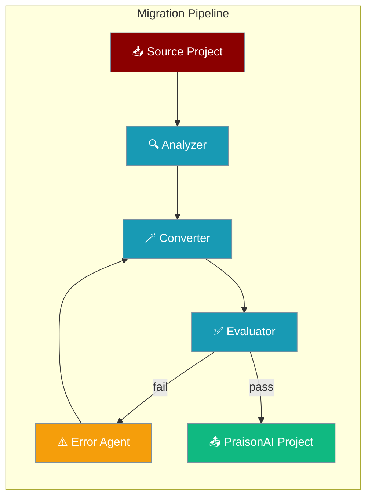
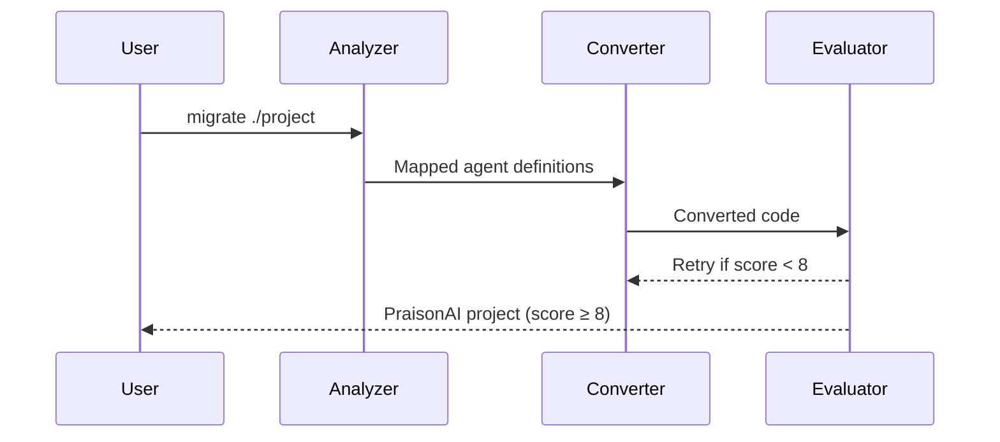
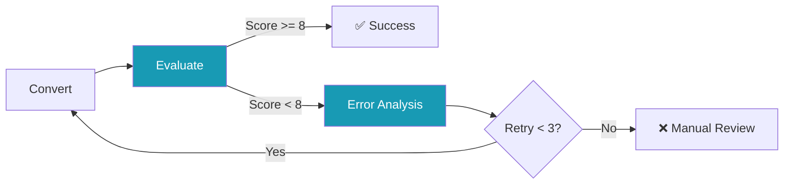
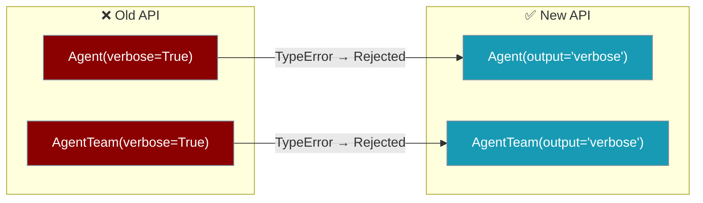
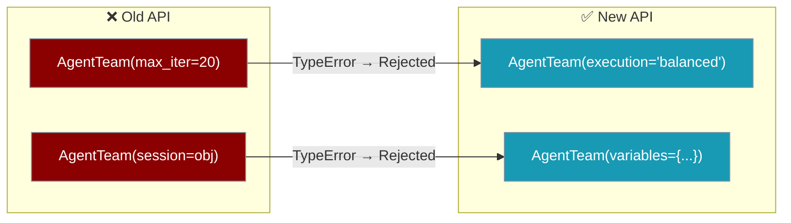
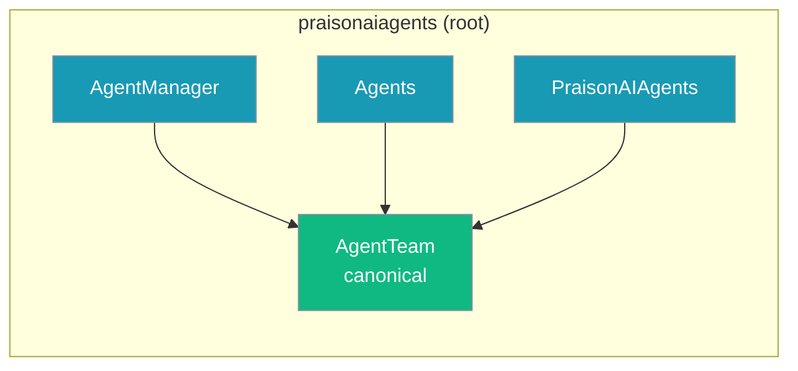

Migrate your existing agent projects to PraisonAI using an AI-driven workflow that analyzes, converts, and validates your codebase automatically.

```python
from praisonaiagents import Agent

agent = Agent(name="migration-helper", instructions="Help migrate from older PraisonAI versions.")
agent.start("Migrate my agents.yaml from v1 format to v2 format.")
```


```mermaid
graph LR
    subgraph "Migration Pipeline"
        SRC[📥 Source Project] --> AN[🔍 Analyzer]
        AN --> CV[🪄 Converter]
        CV --> EV[✅ Evaluator]
        EV -->|fail| ER[⚠️ Error Agent]
        ER --> CV
        EV -->|pass| OUT[📤 PraisonAI Project]
    end

    classDef input fill:#8B0000,stroke:#7C90A0,color:#fff
    classDef agent fill:#189AB4,stroke:#7C90A0,color:#fff
    classDef retry fill:#F59E0B,stroke:#7C90A0,color:#fff
    classDef output fill:#10B981,stroke:#7C90A0,color:#fff

    class SRC input
    class AN,CV,EV agent
    class ER retry
    class OUT output
```

## How It Works

The user points the CLI at a project; AgentFlow runs four agents in sequence — Analyzer reads the codebase, Converter transforms it, Evaluator scores the result (1–10), and Error Agent diagnoses failures and retries up to 3 times.


```mermaid
sequenceDiagram
    participant User
    participant Analyzer
    participant Converter
    participant Evaluator

    User->>Analyzer: migrate ./project
    Analyzer->>Converter: Mapped agent definitions
    Converter->>Evaluator: Converted code
    Evaluator-->>Converter: Retry if score < 8
    Evaluator-->>User: PraisonAI project (score ≥ 8)
```

| Agent | Role |
|-------|------|
| **Analyzer** | Reads all files, maps agent definitions, task dependencies, and import structures |
| **Converter** | Transforms code using a feature spec that maps source patterns to PraisonAI equivalents |
| **Evaluator** | LLM-as-Judge scoring — a score of 8+ means successful migration |
| **Error Agent** | Diagnoses evaluation failures and feeds corrections back to the Converter |

## Quick Start

<Steps>
  <Step title="Point to Your Project">
    ```bash
    praisonai migrate ./my-agent-project
    ```
  </Step>
  <Step title="AI Analyzes All Files">
    The Analyzer Agent reads your entire codebase to understand relationships between files.
  </Step>
  <Step title="Intelligent Conversion">
    The Converter Agent transforms your code using learned patterns.
  </Step>
  <Step title="Automatic Validation">
    The Evaluator Agent tests the converted code. If issues are found, the Error Agent analyzes and retries (up to 3 times).
  </Step>
</Steps>

## The Migration Agents

<CardGroup cols={2}>
  <Card title="Analyzer Agent" icon="magnifying-glass">
    Scans all files in your project to understand:
    - Agent definitions and their relationships
    - Task dependencies
    - Workflow patterns
    - Import structures
  </Card>
  <Card title="Converter Agent" icon="wand-magic-sparkles">
    Transforms your code using a **feature spec**:
    - Maps parameters to PraisonAI equivalents
    - Preserves logic and behavior
    - Handles multi-file dependencies
  </Card>
  <Card title="Evaluator Agent" icon="check-double">
    Uses **LLM-as-Judge** to verify:
    - Syntax correctness
    - Functional equivalence
    - Import completeness
  </Card>
  <Card title="Error Agent" icon="bug">
    When evaluation fails:
    - Analyzes the error
    - Identifies root cause
    - Triggers retry with fixes
  </Card>
</CardGroup>

## CLI Reference

```bash
praisonai migrate <path> [options]
```

<ParamField path="path" type="string" required>
  Path to file or directory to migrate
</ParamField>

<ParamField path="--output" type="string">
  Output directory for converted files
</ParamField>

<ParamField path="--apply" type="flag">
  Apply changes (default is dry-run preview)
</ParamField>

<ParamField path="--max-retries" type="integer" default="3">
  Maximum retry attempts on evaluation failure
</ParamField>

## Feature Mapping

The migration uses a **feature specification** to map patterns:

<Accordion title="Agent Parameters">
| Source Pattern | PraisonAI Equivalent |
|----------------|---------------------|
| `agent = CrewAgent(role=...)` | `agent = Agent(name=..., role=...)` |
| `@tool` decorator | `tools=[function_name]` |
| `Task(description=...)` | `Task(description=..., agent=agent)` |
| `Crew(agents=..., tasks=...)` | `AgentTeam(agents=..., tasks=...)` — `PraisonAIAgents` also works as a silent alias, see [Back-compat class aliases](#back-compat-class-aliases) |
</Accordion>

## Evaluation Loop


```mermaid
flowchart LR
    A[Convert] --> B[Evaluate]
    B -->|Score >= 8| C[✅ Success]
    B -->|Score < 8| D[Error Analysis]
    D --> E{Retry < 3?}
    E -->|Yes| A
    E -->|No| F[❌ Manual Review]
    
    style B fill:#189AB4,color:#fff
    style D fill:#189AB4,color:#fff
```

<Note>
The Evaluator uses **LLM-as-Judge** scoring (1-10). A score of 8+ indicates successful migration.
</Note>

## Programmatic API

```python
from praisonai.cli.features.migrate import MigrationFlow

# Create migration flow
flow = MigrationFlow(
    source_path="./my-project",
    output_path="./converted",
    max_retries=3
)

# Run the agent-driven migration
result = flow.run()

if result.success:
    print(f"Migration complete: {result.files_converted} files")
else:
    print(f"Issues found: {result.errors}")
```

## Migration Tips

<Tip>
**Multi-file projects**: The migration analyzes ALL files before converting, ensuring cross-file dependencies are handled correctly.
</Tip>

<Warning>
**Always use version control**: Commit your code before running migration with `--apply`.
</Warning>

<Check>
**Review the output**: Even with AI validation, review the converted code to ensure it meets your requirements.
</Check>

## Troubleshooting

<AccordionGroup>
  <Accordion title="Migration keeps retrying">
    The Evaluator may be finding issues. Check the error analysis output for specific problems. You may need to manually adjust complex patterns.
  </Accordion>
  <Accordion title="Some files not converted">
    Files without recognizable agent patterns are skipped. The Analyzer Agent only processes files with detectable patterns.
  </Accordion>
  <Accordion title="Import errors after migration">
    Ensure you have `praisonaiagents` installed. Some source-specific tools may need manual replacement.
  </Accordion>
</AccordionGroup>

---

## API Migration: verbose= to output=

The `verbose=` parameter has been consolidated into the `output=` parameter across all PraisonAI components.


```mermaid
flowchart LR
    subgraph Old["❌ Old API"]
        A["Agent(verbose=True)"]
        B["AgentTeam(verbose=True)"]
    end

    subgraph New["✅ New API"]
        C["Agent(output='verbose')"]
        D["AgentTeam(output='verbose')"]
    end

    A -->|"TypeError → Rejected"| C
    B -->|"TypeError → Rejected"| D

    classDef old fill:#8B0000,stroke:#7C90A0,color:#fff
    classDef new fill:#189AB4,stroke:#7C90A0,color:#fff

    class A,B old
    class C,D new
```

### Quick Migration

<Tabs>
  <Tab title="Agent">
    ```python
    # ❌ Old (raises TypeError)
    agent = Agent(instructions="...", verbose=True)
    
    # ✅ New
    agent = Agent(instructions="...", output="verbose")
    ```
  </Tab>
  <Tab title="AgentTeam">
    ```python
    # ❌ Old (raises TypeError)
    team = AgentTeam(agents=[...], tasks=[...], verbose=True)
    
    # ✅ New
    team = AgentTeam(agents=[...], tasks=[...], output="verbose")
    ```
  </Tab>
  <Tab title="Process">
    ```python
    # ⚠️ Old (still works, backward compat)
    process = Process(tasks={...}, agents=[...], verbose=True)
    
    # ✅ New (preferred)
    process = Process(tasks={...}, agents=[...], output="verbose")
    ```
  </Tab>
</Tabs>

### What the error looks like

Since PraisonAI 1.x (PR #4347), the error message names the supported replacement. If you already pass one of the removed kwargs, the traceback tells you exactly what to change:

```text
TypeError: Agent.__init__() got unexpected keyword argument(s): stream, verbose
  stream: streaming moved into output=; use output=OutputConfig(stream=True).
  verbose: verbosity moved into output=; use output='verbose' (or output=OutputConfig(verbose=True)).
```

Unknown kwargs are still rejected outright rather than silently swallowed — this is intentional so a typo can never disable the behaviour it was meant to configure. The hint is added only for the two names people reach for most (they are accepted by six sibling classes in PraisonAI, and by CrewAI and LangChain).

### Output Presets

| Preset | Description |
|--------|-------------|
| `"silent"` | No output (default) |
| `"verbose"` | Rich panels with markdown |
| `"status"` | Tool calls + response |
| `"trace"` | Full trace with timestamps |
| `"stream"` | Real-time token streaming |
| `"json"` | JSONL events |

### Component Status

| Component | `verbose=` | `output=` | Notes |
|-----------|-----------|----------|-------|
| **Agent** | ❌ Rejected | ✅ Required | Use `output="verbose"` |
| **AgentTeam** | ❌ Rejected  | ✅ Required   | Raises `TypeError` — use `output="verbose"` |
| **Process** | ⚠️ Backward compat | ✅ Preferred | Both work, prefer `output=` |
| **Workflow** | ⚠️ Internal only | ✅ Preferred | Use `output=` in constructor |
| **Eval** | ✅ Intentional | N/A | Keep `verbose=` for eval logging |

<Warning>
**Breaking Change**: `Agent(verbose=True)` raises `TypeError`. Update to `Agent(output="verbose")`.
</Warning>

## API Migration: max_iter= / session=

`AgentTeam` also removed the `max_iter=` and `session=` kwargs. Both now raise `TypeError` — use `execution=` for iteration limits and `variables=` for session state.


```mermaid
flowchart LR
    subgraph Old["❌ Old API"]
        M["AgentTeam(max_iter=20)"]
        S["AgentTeam(session=obj)"]
    end

    subgraph New["✅ New API"]
        E["AgentTeam(execution='balanced')"]
        V["AgentTeam(variables={...})"]
    end

    M -->|"TypeError → Rejected"| E
    S -->|"TypeError → Rejected"| V

    classDef old fill:#8B0000,stroke:#7C90A0,color:#fff
    classDef new fill:#189AB4,stroke:#7C90A0,color:#fff

    class M,S old
    class E,V new
```

### max_iter= → execution=

Replace `max_iter=` with an `execution=` preset (`"fast"` sets `max_iter=10`, `"balanced"` sets `max_iter=20`) or pass an explicit value.

<Tabs>
  <Tab title="Preset">
    ```python
    from praisonaiagents import Agent, Task, AgentTeam

    # ❌ Old (raises TypeError)
    # team = AgentTeam(agents=[...], tasks=[...], max_iter=20)

    # ✅ New — preset ("fast"=10 | "balanced"=20)
    team = AgentTeam(
        agents=[Agent(name="Analyst", instructions="Analyse the input")],
        tasks=[Task(description="Analyse Q3 metrics", expected_output="Insights")],
        execution="balanced",
    )
    team.start()
    ```
  </Tab>
  <Tab title="Explicit max_iter">
    ```python
    from praisonaiagents import Agent, Task, AgentTeam

    # ❌ Old (raises TypeError)
    # team = AgentTeam(agents=[...], tasks=[...], max_iter=30)

    # ✅ New — explicit value via dict
    team = AgentTeam(
        agents=[Agent(name="Analyst", instructions="Analyse the input")],
        tasks=[Task(description="Analyse Q3 metrics", expected_output="Insights")],
        execution={"max_iter": 30},
    )
    team.start()
    ```
  </Tab>
</Tabs>

### session= → variables=

The `session=` kwarg is gone. Pass session state through `variables=` and call `session.save()` explicitly.

```python
from praisonaiagents import Agent, Task, AgentTeam

# ❌ Old (raises TypeError)
# team = AgentTeam(agents=[...], tasks=[...], session=my_session)

# ✅ New — session state via variables=
team = AgentTeam(
    agents=[Agent(name="Writer", instructions="Personalise the response")],
    tasks=[Task(description="Greet {{user}} about {{topic}}", expected_output="Message")],
    variables={"user": "Alice", "topic": "PraisonAI"},
)
team.start()

# Persist session state explicitly when you need it
# my_session.save()
```

### Removed kwargs at a glance

| Removed kwarg | Runtime behaviour | Replacement |
|---------------|-------------------|-------------|
| `verbose=` | Raises `TypeError` | `output="silent" \| "minimal" \| "verbose"` |
| `max_iter=` | Raises `TypeError` | `execution="fast" \| "balanced"` or `execution={"max_iter": N}` |
| `session=` | Raises `TypeError` | `variables={...}` + `session.save()` |

<Warning>
**Breaking Change**: `AgentTeam(max_iter=…)` and `AgentTeam(session=…)` raise `TypeError`. Use `execution=` and `variables=`.
</Warning>

## Back-compat class aliases

`AgentTeam` is the canonical multi-agent class in v1.0+. The SDK also exposes three silent aliases that resolve to the same class, so old snippets, older docs, and downstream integrations keep working unchanged.

<Note>
All four names resolve to the **same class object** — the aliases are not deprecated and there is no plan to remove them. Prefer `AgentTeam` for new code; keep any of the aliases you already have in existing code.
</Note>


```mermaid
graph LR
    subgraph "praisonaiagents (root)"
        A[AgentTeam<br/>canonical]
        B[AgentManager]
        C[Agents]
        D[PraisonAIAgents]
    end
    B --> A
    C --> A
    D --> A

    classDef canonical fill:#10B981,stroke:#7C90A0,color:#fff
    classDef alias fill:#189AB4,stroke:#7C90A0,color:#fff
    class A canonical
    class B,C,D alias
```

All four are importable from the package root and point to the same object:

```python
from praisonaiagents import AgentTeam, AgentManager, Agents, PraisonAIAgents

assert AgentTeam is AgentManager is Agents is PraisonAIAgents   # True
```

| Name | Status | Use in |
|------|--------|--------|
| `AgentTeam` | ✅ Canonical (v1.0+) | New code |
| `AgentManager` | 🟰 Silent alias | Legacy integrations |
| `Agents` | 🟰 Silent alias | Pre-v1.0 tutorials |
| `PraisonAIAgents` | 🟰 Silent alias | Pre-1.0 code, downstream integrations that guard `from praisonaiagents import PraisonAIAgents` |

<Warning>
`PraisonAIAgents` was missing from the root `__all__` in a recent release; upgrade to `praisonaiagents ≥ 1.6.162` (PraisonAI PR #3675) if `from praisonaiagents import PraisonAIAgents` raises `ImportError`.
</Warning>

## Best Practices

<AccordionGroup>
  <Accordion title="Migrate a copy, not your working tree">
    The migration pipeline rewrites source files as it converts patterns. Point it at a clean checkout or branch so you can diff the result and roll back if the Evaluator score is low. Version control makes reviewing the Converter's changes straightforward.
  </Accordion>

  <Accordion title="Trust the 8+ score gate">
    The Evaluator uses LLM-as-Judge scoring from 1–10 and treats 8+ as a successful migration. Don't ship a converted project that scores below that threshold — let the Error Agent's retries (up to 3) run, then review any file the Evaluator still flags.
  </Accordion>

  <Accordion title="Update verbose= to output= first">
    `Agent(verbose=True)` now raises `TypeError`. Replace it with `Agent(output="verbose")` before migrating, and prefer `output=` over the deprecated `verbose=` on `AgentTeam`, `Process`, and `Workflow` too. This clears the most common breaking change up front.
  </Accordion>

  <Accordion title="Review imports after conversion">
    The Analyzer maps import structures, but confirm the converted project uses friendly top-level imports (`from praisonaiagents import Agent, Task, AgentTeam`) and that any custom tools resolve. A quick smoke run catches missed dependencies the Evaluator can't see.
  </Accordion>
</AccordionGroup>

## Related

<CardGroup cols={2}>
  <Card icon="terminal" href="/features/cli">
    Run and validate migrated agents from the command line.
  </Card>
  <Card icon="file-code" href="/features/config-file">
    Set project-wide defaults for your migrated agents.
  </Card>
</CardGroup>
