Migrate your existing agent projects to PraisonAI using an **AI-driven workflow** that understands your entire codebase and converts it intelligently.

<Info>
The migrate feature uses **AgentFlow** - a multi-agent workflow that analyzes, converts, evaluates, and validates your code automatically.
</Info>

## How It Works

```mermaid
flowchart TB
    subgraph Input["📁 Your Project"]
        A[All Python Files]
        B[Config Files]
    end
    
    subgraph AgentFlow["🤖 Migration AgentFlow"]
        C[Analyzer Agent]
        D[Converter Agent]
        E[Evaluator Agent]
        F[Error Agent]
    end
    
    subgraph Output["✨ PraisonAI Project"]
        G[Converted Code]
        H[Working Agents]
    end
    
    A --> C
    B --> C
    C --> D
    D --> E
    E -->|Pass| G
    E -->|Fail| F
    F -->|Retry max 3| C
    G --> H
    
    style A fill:#8B0000,color:#fff
    style B fill:#8B0000,color:#fff
    style C fill:#189AB4,color:#fff
    style D fill:#189AB4,color:#fff
    style E fill:#189AB4,color:#fff
    style F fill:#189AB4,color:#fff
    style G fill:#8B0000,color:#fff
    style H fill:#8B0000,color:#fff
```



## Quick Start

<Steps>
  <Step title="Point to Your Project">
    ```bash
    praisonai migrate ./my-agent-project
    ```
  </Step>
  <Step title="AI Analyzes All Files">
    The Analyzer Agent reads your entire codebase to understand relationships between files.
  </Step>
  <Step title="Intelligent Conversion">
    The Converter Agent transforms your code using learned patterns.
  </Step>
  <Step title="Automatic Validation">
    The Evaluator Agent tests the converted code. If issues are found, the Error Agent analyzes and retries (up to 3 times).
  </Step>
</Steps>

## The Migration Agents

<CardGroup cols={2}>
  <Card title="Analyzer Agent" icon="magnifying-glass">
    Scans all files in your project to understand:
    - Agent definitions and their relationships
    - Task dependencies
    - Workflow patterns
    - Import structures
  </Card>
  <Card title="Converter Agent" icon="wand-magic-sparkles">
    Transforms your code using a **feature spec**:
    - Maps parameters to PraisonAI equivalents
    - Preserves logic and behavior
    - Handles multi-file dependencies
  </Card>
  <Card title="Evaluator Agent" icon="check-double">
    Uses **LLM-as-Judge** to verify:
    - Syntax correctness
    - Functional equivalence
    - Import completeness
  </Card>
  <Card title="Error Agent" icon="bug">
    When evaluation fails:
    - Analyzes the error
    - Identifies root cause
    - Triggers retry with fixes
  </Card>
</CardGroup>

## CLI Reference

```bash
praisonai migrate <path> [options]
```

<ParamField path="path" type="string" required>
  Path to file or directory to migrate
</ParamField>

<ParamField path="--output" type="string">
  Output directory for converted files
</ParamField>

<ParamField path="--apply" type="flag">
  Apply changes (default is dry-run preview)
</ParamField>

<ParamField path="--max-retries" type="integer" default="3">
  Maximum retry attempts on evaluation failure
</ParamField>

## Feature Mapping

The migration uses a **feature specification** to map patterns:

<Accordion title="Agent Parameters">
| Source Pattern | PraisonAI Equivalent |
|---------------|---------------------|
| `role` | `role` |
| `goal` | `goal` |
| `backstory` | `backstory` |
| `instructions` | `instructions` |
| `name` | `name` |
| `model=...` | `llm="provider/model"` |
| `tools=[...]` | `tools=[...]` |
</Accordion>

<Accordion title="Team/Orchestrator">
| Source Pattern | PraisonAI Equivalent |
|---------------|---------------------|
| Team class | `AgentTeam` |
| `members=[...]` | `agents=[...]` |
| `.kickoff()` | `.start()` |
| `.run()` | `.start()` |
</Accordion>

<Accordion title="Workflow">
| Source Pattern | PraisonAI Equivalent |
|---------------|---------------------|
| Workflow class | `AgentFlow` |
| Step class | `Task` |
| Sequential steps | Sequential process |
</Accordion>

## Evaluation Loop

```mermaid
flowchart LR
    A[Convert] --> B[Evaluate]
    B -->|Score >= 8| C[✅ Success]
    B -->|Score < 8| D[Error Analysis]
    D --> E{Retry < 3?}
    E -->|Yes| A
    E -->|No| F[❌ Manual Review]
    
    style A fill:#189AB4,color:#fff
    style B fill:#189AB4,color:#fff
    style C fill:#8B0000,color:#fff
    style D fill:#189AB4,color:#fff
    style F fill:#8B0000,color:#fff
```



<Note>
The Evaluator uses **LLM-as-Judge** scoring (1-10). A score of 8+ indicates successful migration.
</Note>

## Programmatic API

```python
from praisonai.cli.features.migrate import MigrationFlow

# Create migration flow
flow = MigrationFlow(
    source_path="./my-project",
    output_path="./converted",
    max_retries=3
)

# Run the agent-driven migration
result = flow.run()

if result.success:
    print(f"Migration complete: {result.files_converted} files")
else:
    print(f"Issues found: {result.errors}")
```

## Best Practices

<Tip>
**Multi-file projects**: The migration analyzes ALL files before converting, ensuring cross-file dependencies are handled correctly.
</Tip>

<Warning>
**Always use version control**: Commit your code before running migration with `--apply`.
</Warning>

<Check>
**Review the output**: Even with AI validation, review the converted code to ensure it meets your requirements.
</Check>

## Troubleshooting

<AccordionGroup>
  <Accordion title="Migration keeps retrying">
    The Evaluator may be finding issues. Check the error analysis output for specific problems. You may need to manually adjust complex patterns.
  </Accordion>
  <Accordion title="Some files not converted">
    Files without recognizable agent patterns are skipped. The Analyzer Agent only processes files with detectable patterns.
  </Accordion>
  <Accordion title="Import errors after migration">
    Ensure you have `praisonaiagents` installed. Some source-specific tools may need manual replacement.
  </Accordion>
</AccordionGroup>

---

## API Migration: verbose= to output=

The `verbose=` parameter has been consolidated into the `output=` parameter across all PraisonAI components.


### Quick Migration

<Tabs>
  <Tab title="Agent">
    ```python
    # ❌ Old (raises TypeError)
    agent = Agent(instructions="...", verbose=True)
    
    # ✅ New
    agent = Agent(instructions="...", output="verbose")
    ```
  </Tab>
  <Tab title="AgentTeam">
    ```python
    # ❌ Old (deprecated)
    team = AgentTeam(agents=[...], tasks=[...], verbose=True)
    
    # ✅ New
    team = AgentTeam(agents=[...], tasks=[...], output="verbose")
    ```
  </Tab>
  <Tab title="Process">
    ```python
    # ⚠️ Old (still works, backward compat)
    process = Process(tasks={...}, agents=[...], verbose=True)
    
    # ✅ New (preferred)
    process = Process(tasks={...}, agents=[...], output="verbose")
    ```
  </Tab>
</Tabs>

### Output Presets

| Preset | Description |
|--------|-------------|
| `"silent"` | No output (default) |
| `"verbose"` | Rich panels with markdown |
| `"status"` | Tool calls + response |
| `"trace"` | Full trace with timestamps |
| `"stream"` | Real-time token streaming |
| `"json"` | JSONL events |

### Component Status

| Component | `verbose=` | `output=` | Notes |
|-----------|-----------|----------|-------|
| **Agent** | ❌ Rejected | ✅ Required | Use `output="verbose"` |
| **AgentTeam** | ⚠️ Deprecated | ✅ Preferred | Migrate to `output=` |
| **Process** | ⚠️ Backward compat | ✅ Preferred | Both work, prefer `output=` |
| **Workflow** | ⚠️ Internal only | ✅ Preferred | Use `output=` in constructor |
| **Eval** | ✅ Intentional | N/A | Keep `verbose=` for eval logging |

<Warning>
**Breaking Change**: `Agent(verbose=True)` raises `TypeError`. Update to `Agent(output="verbose")`.
</Warning>
