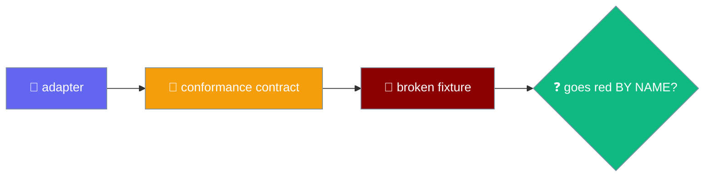
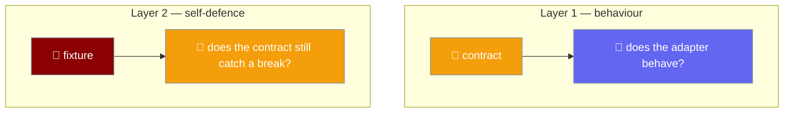

A conformance contract asserts an adapter behaves; a fixture asserts the contract still contains those assertions.



## Quick Start

<Steps>
<Step title="Run the contracts against your adapter">
Each port ships a runnable contract. Register your adapter and both the fake and the shipping adapter are held to the same cases.

```ts
import { describeSecretsContract } from "praisonai-mobile/adapters/conformance/secrets-contract";

describeSecretsContract("my adapter", () => createMyAdapter());
```
</Step>

<Step title="Prove the contract can still fail">
The fixture spawns the real contract against a deliberately broken adapter, one break at a time. It takes a single mode string.

```bash
node adapters/src/conformance/contract-fixture.ts <mode>
```

The six break modes plus the `none` control:

```
secrets_slot_only
secrets_empty_is_absent
storage_missing_is_undefined
storage_namespaces_collide
time_every_fires_once
time_clear_does_nothing
none
```
</Step>

<Step title="Check the floor and the control">
`contracts.test.ts` counts passing cases from a real `none` run and asserts a floor per contract: secrets ≥ 9, storage ≥ 11, time ≥ 8. The `none` control must pass green, so a fixture that failed for an unrelated reason cannot masquerade as proof.
</Step>
</Steps>

<Note>
This runs automatically inside `contracts.test.ts` under `npm test`. There is no flag to enable and no opt-in.
</Note>

---

## Why Two Layers

The contracts assert on adapter behaviour; the fixture asserts the contracts still contain those assertions.



A contract with no broken-implementation test is documentation with a `test()` around it. Deleting `assert.ok(fired >= 2)` from the time contract — the one assertion that catches `setInterval` becoming `setTimeout`, which stops every polling loop in the app after a single tick — left the suite at **1035 pass, 0 fail**. Fourteen assertions across all four contracts could be deleted for free.

---

## The Six Break Modes

Each mode breaks the adapter in one named way, and the matching contract case must go red by name.

| break mode | must redden the case named |
|---|---|
| `secrets_slot_only` | `two ACCOUNTS in one slot are two different secrets` |
| `secrets_empty_is_absent` | `an empty string is a stored value, not an absence` |
| `storage_missing_is_undefined` | `a missing key reads as null, never undefined` |
| `storage_namespaces_collide` | `namespaces are isolated` |
| `time_every_fires_once` | `every() repeats, rather than firing once` |
| `time_clear_does_nothing` | `a cleared timer does not fire` |

A `none` control runs unbroken, so a fixture that failed for an unrelated reason — a syntax error, a missing import — cannot masquerade as proof.

---

## The Shrink Floor

A case with no break mode could still be deleted, so `contracts.test.ts` counts passing cases from a **real** run of the fixture — not a regex over source text — and asserts a floor.

| contract | floor |
|---|---|
| secrets | ≥ 9 cases |
| storage | ≥ 11 cases |
| time | ≥ 8 cases |

Raise these numbers when you add cases. A drop means a contract lost coverage, and that is exactly the event worth a red build.

<Warning>
Node 22 emits TAP when stdout is a pipe; Node 24 emits the spec reporter. The fixture is spawned with `--test-reporter=tap` so a test grepping for `not ok` behaves the same on both.
</Warning>

---

## Why The Fixture Builds Broken Adapters Inline

`adapters` may not import `testing` — enforced by `tools/depgraph.mjs` — so the fixture builds its broken adapters inline, the same way `engines/src/contract-fixture.ts` does.

```ts
function secrets(): SecretsPort {
  const store = new Map<string, string>();
  // The defect: keying by slot alone, so two accounts share one credential.
  const key = (ref: { slot: string; account: string }): string =>
    mode === "secrets_slot_only" ? ref.slot : `${ref.slot}:${ref.account}`;
  // ...
}
```

---

## Adding A New Case Or Break Mode

<Steps>
<Step title="Add the contract case with a stable name">
The name is matched by regex, so keep it stable once other code depends on it.
</Step>

<Step title="Add the break mode in contract-fixture.ts">
Guard the defect behind a `mode === "..."` branch.

```ts
const key = (ref: { namespace: string; id: string }): string =>
  mode === "storage_namespaces_collide" ? ref.id : `${ref.namespace}/${ref.id}`;
```
</Step>

<Step title="Add the pair to the ADAPTER_BREAKS table">
`contracts.test.ts` maps each mode to the case name it must redden.

```ts
{ mode: "storage_namespaces_collide", expects: /namespaces are isolated/ },
```
</Step>

<Step title="Bump the shrink floor for that contract by one">
A new case raises the floor by one, so a later deletion is caught.
</Step>
</Steps>

---

## Best Practices

<AccordionGroup>
<Accordion title="Pin every contract with a break mode, not just a re-implemented assertion">
An inline broken adapter that re-implements the assertion proves an assertion of that shape would catch the defect — not that the contract still contains it. Spawn the real contract instead.
</Accordion>

<Accordion title="Keep the none control green">
Without the unbroken control, a fixture that failed everything — a syntax error, a runner that cannot start — would satisfy every break mode while proving nothing.
</Accordion>

<Accordion title="Count the floor from a real run, not from source text">
A regex over `test(` is satisfied by a case that asserts nothing. Counting passing cases from a real `none` run pins behaviour, not shape.
</Accordion>

<Accordion title="Force the reporter">
Spawn the fixture with `--test-reporter=tap` so a test grepping for `not ok` behaves identically on Node 22 and Node 24.
</Accordion>
</AccordionGroup>

---

## Related

<CardGroup cols={2}>
<Card title="Storage & Secrets" icon="database" href="/features/mobile/storage-and-secrets">
  The two ports the secrets and storage break modes pin.
</Card>
<Card title="Time & Pacing" icon="clock" href="/features/mobile/time-and-pacing">
  The port the two time break modes pin.
</Card>
<Card title="Shell & Adapters" icon="mobile-button" href="/features/mobile/shell-and-adapters">
  The shell contract that sits in the same file.
</Card>
<Card title="Mobile Engines" icon="plug" href="/features/mobile/engines">
  The parallel fixture pattern one directory over.
</Card>
</CardGroup>
