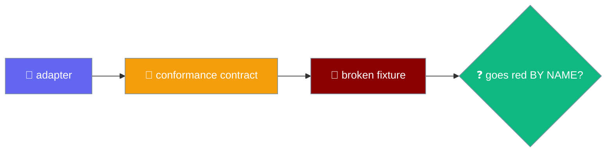
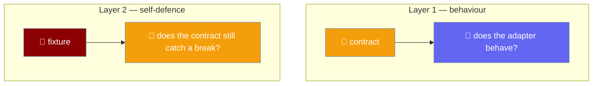

A conformance contract asserts an adapter behaves; a fixture asserts the contract still contains those assertions.



## Quick Start

<Steps>
<Step title="Run the contracts against your adapter">
Each port ships a runnable contract. Register your adapter and both the fake and the shipping adapter are held to the same cases.

```ts
import { describeSecretsContract } from "praisonai-mobile/adapters/conformance/secrets-contract";

describeSecretsContract("my adapter", () => createMyAdapter());
```
</Step>

<Step title="Prove the contract can still fail">
The fixture spawns the real contract against a deliberately broken adapter, one break at a time. It takes a single mode string.

```bash
node adapters/src/conformance/contract-fixture.ts <mode>
```

The ten break modes plus the `none` control:

```
secrets_slot_only
secrets_empty_is_absent
storage_missing_is_undefined
storage_namespaces_collide
storage_empty_is_absent
time_every_fires_once
time_clear_does_nothing
time_unsubscribe_does_nothing
shell_scheme_case_sensitive
shell_negative_insets
none
```
</Step>

<Step title="Check the floor and the control">
`contracts.test.ts` counts passing cases from a real `none` run and asserts a floor per contract: secrets ≥ 9, storage ≥ 11, time ≥ 8, shell ≥ 35. The `none` control must pass green, so a fixture that failed for an unrelated reason cannot masquerade as proof.
</Step>
</Steps>

<Note>
This runs automatically inside `contracts.test.ts` under `npm test`. There is no flag to enable and no opt-in.
</Note>

---

## Why Two Layers

The contracts assert on adapter behaviour; the fixture asserts the contracts still contain those assertions.



A contract with no broken-implementation test is documentation with a `test()` around it. Deleting `assert.ok(fired >= 2)` from the time contract — the one assertion that catches `setInterval` becoming `setTimeout`, which stops every polling loop in the app after a single tick — left the suite at **1035 pass, 0 fail**. Fourteen assertions across all four contracts could be deleted for free.

### Layer 3 — the hollowed case

A break-mode table catches a case that has been **deleted**. It does not catch a case that still runs and asserts nothing. Seven assertions across the conformance suites could be gutted to assert nothing and the build stayed green — a deletion guard never fires when the `test()` block is still there.

One break mode per hollowable case is what closes that, because a break mode reddens the case *by name*. The order of defence is behaviour → contract → break mode per hollowable case: the contract asserts the adapter behaves, the fixture asserts the contract still catches a break, and the break mode ties each named case to a defect that must redden it.

---

## The Shell Reads What It Forwarded

The shell contract now asserts on the value the adapter handed the OS, not just whether the promise settled.

`ShellHarness` carries `forwarded(): readonly string[]` — the URLs `openExternal` actually handed the OS, in order. A shell can validate one string and forward another, and `doesNotReject` cannot see the difference, so the harness surfaces the forwarded value and the contract reads it. `forwarded()` is **required, not optional**, so a shell cannot opt out of being checked.

```ts
export interface ShellHarness {
  readonly shell: ShellPort;
  // ...
  forwarded(): readonly string[]; // required — every real shell supplies it
}
```

A padded-URL case then reads it directly: a URL that passes the allowlist must reach the OS trimmed (`"https://ok.example"`, never the padded input), and a padded `javascript:` must still be refused before anything is forwarded.

---

## The Ten Break Modes

Each mode breaks an adapter in one named way, and the matching contract case must go red by name. Two of the modes are shell modes — the shell contract now spawns its own break modes, on top of the case-count floor that still complements them.

| break mode | must redden the case named |
|---|---|
| `secrets_slot_only` | `two ACCOUNTS in one slot are two different secrets` |
| `secrets_empty_is_absent` | `an empty string is a stored value, not an absence` |
| `storage_missing_is_undefined` | `a missing key reads as null, never undefined` |
| `storage_namespaces_collide` | `namespaces are isolated` |
| `storage_empty_is_absent` | `an empty string is a value, not an absence` |
| `time_every_fires_once` | `every() repeats, rather than firing once` |
| `time_clear_does_nothing` | `a cleared timer does not fire` |
| `time_unsubscribe_does_nothing` | `the unsubscribe actually stops it` |
| `shell_scheme_case_sensitive` | `an uppercase JAVASCRIPT: URL is refused` |
| `shell_negative_insets` | `no inset is negative` |

A `none` control runs unbroken, so a fixture that failed for an unrelated reason — a syntax error, a missing import — cannot masquerade as proof.

---

## The Shrink Floor

A case with no break mode could still be deleted, so `contracts.test.ts` counts passing cases from a **real** run of the fixture — not a regex over source text — and asserts a floor.

| contract | floor |
|---|---|
| secrets | ≥ 9 cases |
| storage | ≥ 11 cases |
| time | ≥ 8 cases |
| shell | ≥ 35 cases |

Raise these numbers when you add cases. A drop means a contract lost coverage, and that is exactly the event worth a red build. Re-derive each per-contract floor from a real `none` run rather than adding by hand — a new break mode targets an existing case in some contracts and a fresh case in others.

A separate guard pins the break-mode table itself: `ADAPTER_BREAKS.length >= 13`, raised from `>= 9` when the four new modes landed. This counts break-mode rows, not passing cases per contract, so it moves independently of the per-contract floors above.

The shell contract now carries its own spawned break modes (`shell_scheme_case_sensitive`, `shell_negative_insets`) as well as this case-count floor, so the [Ten Break Modes](#the-ten-break-modes) table above covers every contract, shell included.

<Warning>
Node 22 emits TAP when stdout is a pipe; Node 24 emits the spec reporter. The fixture is spawned with `--test-reporter=tap` so a test grepping for `not ok` behaves the same on both.
</Warning>

---

## Why The Fixture Builds Broken Adapters Inline

`adapters` may not import `testing` — enforced by `tools/depgraph.mjs` — so the fixture builds its broken adapters inline, the same way `engines/src/contract-fixture.ts` does.

<Note>
The parallel engines fixture carries its own break modes for the `AgentEnginePort` contract — `no_start`, `start_only`, `tool_failure_as_ok`, `empty_is_fine`, `decide_always_true`, and `abort_ignored`. `start_only` opens a run and then stops with no terminal event; it is caught by *"a run emits start first and exactly one terminal event last"*. `abort_ignored` never consults the abort signal, caught by *"aborting the signal stops the stream"*. See [Mobile Engines → Conformance](/features/mobile/engines).
</Note>

```ts
function secrets(): SecretsPort {
  const store = new Map<string, string>();
  // The defect: keying by slot alone, so two accounts share one credential.
  const key = (ref: { slot: string; account: string }): string =>
    mode === "secrets_slot_only" ? ref.slot : `${ref.slot}:${ref.account}`;
  // ...
}
```

---

## Adding A New Case Or Break Mode

<Steps>
<Step title="Add the contract case with a stable name">
The name is matched by regex, so keep it stable once other code depends on it.
</Step>

<Step title="Add the break mode in contract-fixture.ts">
Guard the defect behind a `mode === "..."` branch.

```ts
const key = (ref: { namespace: string; id: string }): string =>
  mode === "storage_namespaces_collide" ? ref.id : `${ref.namespace}/${ref.id}`;
```
</Step>

<Step title="Add the pair to the ADAPTER_BREAKS table">
`contracts.test.ts` maps each mode to the case name it must redden.

```ts
{ mode: "storage_namespaces_collide", expects: /namespaces are isolated/ },
```
</Step>

<Step title="Bump the shrink floor for that contract by one">
A new case raises the floor by one, so a later deletion is caught.
</Step>
</Steps>

---

## Testing utilities — the fake HTTP transport

The `testing/` package ships the fakes engine and adapter tests drive against, and two of `createFakeHttp`'s behaviours are load-bearing enough that engine tests silently depend on them.

```ts
import { createFakeHttp, streamOf } from "praisonai-mobile/testing/fake-http";

const http = createFakeHttp({
  "/chat":  () => ({ status: 200, body: "chat" }),
  "/chats": () => ({ status: 200, body: "chats" }),
});
```

| Behaviour | Contract |
|---|---|
| Longest matching suffix wins | The route table picks the **longest** matching suffix, so `/chats` does not shadow `/chat`. Inverting it silently mis-routes a test to the wrong handler while the test still passes. |
| Unmatched routes are a 404 | A path no route matches returns `status: 404`, never a stray handler. |
| `http.sent` is ordered | The recorded requests appear in the order they were sent. |
| `streamOf` chunks deliberately | `streamOf(text, size?)` chunks a body at exactly `size` (`7` by default) and emits **no zero-length chunks** — a frame split across chunks is the normal case on a real network, and the SSE reader's pending-CR logic is sensitive to where boundaries fall. |
| `streamOf` reassembles byte-for-byte | Concatenating the chunks returns the input exactly. |

<Note>
`streamOf` never emits an empty chunk. A zero-length chunk would let a bug in the SSE reader's pending-CR handling pass unnoticed, so the fake refuses to produce one. Pinned in the new `fake-http.test.ts`.
</Note>

---

## Best Practices

<AccordionGroup>
<Accordion title="Pin every contract with a break mode, not just a re-implemented assertion">
An inline broken adapter that re-implements the assertion proves an assertion of that shape would catch the defect — not that the contract still contains it. Spawn the real contract instead.
</Accordion>

<Accordion title="Keep the none control green">
Without the unbroken control, a fixture that failed everything — a syntax error, a runner that cannot start — would satisfy every break mode while proving nothing.
</Accordion>

<Accordion title="Count the floor from a real run, not from source text">
A regex over `test(` is satisfied by a case that asserts nothing. Counting passing cases from a real `none` run pins behaviour, not shape.
</Accordion>

<Accordion title="Force the reporter">
Spawn the fixture with `--test-reporter=tap` so a test grepping for `not ok` behaves identically on Node 22 and Node 24.
</Accordion>

<Accordion title="A contract asserts only what every implementation owes">
Behaviour that one adapter alone owes — the Tauri shell deduping identical safe-area payloads, for instance — needs its own test in that adapter's suite, not the shared contract: the fake and web shells republish, so a shared "does not republish" assertion fails two of three. And a shared harness whose `emitInsets` takes a full `SafeAreaInsets` cannot express a *partial* payload, so the guard for partial payloads is unreachable from the shared harness and its test lives in the Tauri suite. Write it in the shared contract first, and move it the moment the harness cannot carry the input.
</Accordion>
</AccordionGroup>

---

## Related

<CardGroup cols={2}>
<Card title="Storage & Secrets" icon="database" href="/features/mobile/storage-and-secrets">
  The two ports the secrets and storage break modes pin.
</Card>
<Card title="Time & Pacing" icon="clock" href="/features/mobile/time-and-pacing">
  The port the two time break modes pin.
</Card>
<Card title="Shell & Adapters" icon="mobile-button" href="/features/mobile/shell-and-adapters">
  The shell contract that sits in the same file.
</Card>
<Card title="Mobile Engines" icon="plug" href="/features/mobile/engines">
  The parallel fixture pattern one directory over.
</Card>
</CardGroup>
