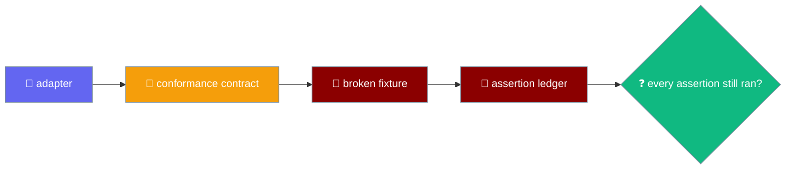
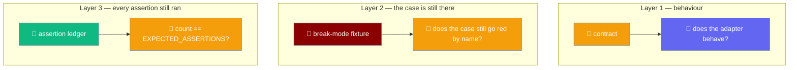

A conformance contract asserts an adapter behaves; a fixture asserts the contract still contains those assertions; a ledger asserts every one of those assertions still ran.



## Quick Start

<Steps>
<Step title="Run the contracts against your adapter">
Each port ships a runnable contract. Register your adapter and both the fake and the shipping adapter are held to the same cases.

```ts
import { describeSecretsContract } from "praisonai-mobile/adapters/conformance/secrets-contract";

describeSecretsContract("my adapter", () => createMyAdapter());
```
</Step>

<Step title="Prove the contract can still fail">
The fixture spawns the real contract against a deliberately broken adapter, one break at a time. It takes a single mode string.

```bash
node adapters/src/conformance/contract-fixture.ts <mode>
```

The break modes plus the `none` control:

```
secrets_slot_only
secrets_empty_is_absent
storage_missing_is_undefined
storage_namespaces_collide
storage_empty_is_absent
storage_torn_write
storage_forgets_on_relaunch
time_every_fires_once
time_clear_does_nothing
time_unsubscribe_does_nothing
shell_scheme_case_sensitive
shell_negative_insets
none
```
</Step>

<Step title="Check the floor and the control">
`contracts.test.ts` counts passing cases from a real `none` run and asserts a floor per contract: secrets ≥ 9, storage ≥ 15, time ≥ 8, shell ≥ 35. The `none` control must pass green, so a fixture that failed for an unrelated reason cannot masquerade as proof.
</Step>

<Step title="Wire the assertion ledger">
Each contract counts every assertion it makes and checks the exact total in its last case, so a deleted assertion turns the run red by name.

```ts
import test from "node:test";
import rawAssert from "node:assert/strict";
import { ledger, type Ledger } from "./assert-ledger.ts";

// Update this deliberately when you add or remove an assertion below.
const EXPECTED_ASSERTIONS = 16;

export function describeSecretsContract(name, make) {
  const counting = ledger();
  const assert: Ledger["assert"] = counting.assert;
  const made = counting.made;

  test(`${name}: … your case …`, async () => {
    // use `assert.equal(...)`, `assert.deepEqual(...)`, etc. as usual
  });

  // Registered LAST — every case above has already run by the time it does.
  test(`${name}: this contract made every assertion it is supposed to make`, () => {
    rawAssert.equal(made(), EXPECTED_ASSERTIONS,
      `${name}: ran ${made()} assertions, not ${EXPECTED_ASSERTIONS}. …`);
  });
}
```

<Note>
Declare `assert` with an explicit `Ledger["assert"]` type rather than destructuring — `assert` carries `asserts` signatures and TS2775 refuses those through a binding pattern. Register the count case **last** so every case above has already run, and use `EXPECTED_ASSERTIONS + (realClock ? REAL_CLOCK_ASSERTIONS : 0)` where a branch adds assertions.
</Note>
</Step>
</Steps>

<Note>
This runs automatically inside `contracts.test.ts` under `npm test`. There is no flag to enable and no opt-in.
</Note>

---

## Why Three Layers

The contract asserts the adapter behaves; the fixture asserts the contract still catches a break; the ledger asserts every assertion still ran.



A contract with no broken-implementation test is documentation with a `test()` around it. Deleting `assert.ok(fired >= 2)` from the time contract — the one assertion that catches `setInterval` becoming `setTimeout`, which stops every polling loop in the app after a single tick — left the suite at **1035 pass, 0 fail**. Fourteen assertions across all four contracts could be deleted for free.

### The hollowed case

A break-mode table catches a case that has been **deleted**. It does not catch a case that still runs and asserts nothing. Seven assertions across the conformance suites could be gutted to assert nothing and the build stayed green — a deletion guard never fires when the `test()` block is still there.

One break mode per hollowable case is what closes that, because a break mode reddens the case *by name*. The order of defence is behaviour → contract → break mode per hollowable case: the contract asserts the adapter behaves, the fixture asserts the contract still catches a break, and the break mode ties each named case to a defect that must redden it.

### The in-case hole the ledger closes

The break-mode fixture protects **exactly one** assertion per case — the first one to trip. Sweeping the four contracts one assertion at a time, **62 of 73 could be deleted with a fully green run**: thirteen break modes were protecting only eleven assertions. The ledger closes that hole with a counting proxy over `node:assert/strict` and an exact count checked in the contract's last case. Exact rather than a floor: a floor lets an assertion be swapped for a weaker one at the same arity, which is the same hollowing wearing a different hat.

The ledger does **not** claim an assertion still asserts something *useful* — only that it is still there and still ran. `contract-fixture.ts` remains the thing that proves an assertion has teeth. The two are complementary; neither subsumes the other.

| | before | after |
|---|---|---|
| assertions deletable with a **green** run | **62 / 73** | **0 / 73** |
| break modes | 13 | 13 |
| assertions actually protected | 11 | 73 |

---

## The Shell Reads What It Forwarded

The shell contract now asserts on the value the adapter handed the OS, not just whether the promise settled.

`ShellHarness` carries `forwarded(): readonly string[]` — the URLs `openExternal` actually handed the OS, in order. A shell can validate one string and forward another, and `doesNotReject` cannot see the difference, so the harness surfaces the forwarded value and the contract reads it. `forwarded()` is **required, not optional**, so a shell cannot opt out of being checked.

```ts
export interface ShellHarness {
  readonly shell: ShellPort;
  // ...
  forwarded(): readonly string[]; // required — every real shell supplies it
}
```

A padded-URL case then reads it directly: a URL that passes the allowlist must reach the OS trimmed (`"https://ok.example"`, never the padded input), and a padded `javascript:` must still be refused before anything is forwarded.

---

## Host presence is part of conformance

An adapter that detects its host — the Tauri bridge's `isPresent()` in `adapters/src/tauri/bridge.ts` — must apply a **both, not either** discipline: it reads present **only** when every function the host contract requires is present, and absent when any one is missing.

| `__TAURI_INTERNALS__` carries | `isPresent()` |
|---|---|
| both `invoke` **and** `transformCallback` | `true` |
| only one of the two | `false` (half-present = absent) |

A half-present global read as present makes `listen` call a missing `transformCallback`, which throws, is caught, and turns every subscription into a silent no-op — so any future adapter with a "detect the host" step owes the same rule. Pinned by `"a HALF-present Tauri global is treated as absent"` and its pair `"a FULLY present Tauri global is treated as present -- the pair"`. See [Native Shell → Presence detection](/features/mobile/native-shell#presence-detection-both-not-either).

---

## Keyboard height

Two cases pin the Tauri shell's two-source keyboard model: the viewport fallback, and the single-writer handover to the native event.

The tests live at the tail of `adapters/src/conformance/contracts.test.ts` and drive `createTauriShell({ view })` with a `createFakeWindow()`.

```ts
import { createFakeWindow } from "praisonai-mobile/adapters/web/fake-window";
import { createTauriShell } from "praisonai-mobile/adapters/tauri";

const window = createFakeWindow();
const shell = createTauriShell({ bridge: probe.bridge, view: window.window });

window.setKeyboardHeight(320);
// shell.keyboardHeightPx === 320 — reported without any native event

probe.emit("keyboard-height", 291);
window.setKeyboardHeight(400);
// shell.keyboardHeightPx === 291 — native wins, the viewport no longer fights it
```

| Test | Asserts |
|---|---|
| `"the TAURI shell reports the keyboard height, without any native event"` | The viewport fallback reports the height and fires subscribers exactly once, on open and on close. |
| `"a native keyboard height takes over from the viewport reading"` | The first native height becomes authoritative and the viewport listener is dropped, so the two sources never race. |

See [Shell & Adapters → The two-source keyboard model](/features/mobile/shell-and-adapters#the-two-source-keyboard-model).

---

## The Break Modes

Each mode breaks an adapter in one named way, and the matching contract case must go red by name. Two of the modes are shell modes — the shell contract now spawns its own break modes, on top of the case-count floor that still complements them.

| break mode | must redden the case named |
|---|---|
| `secrets_slot_only` | `two ACCOUNTS in one slot are two different secrets` |
| `secrets_empty_is_absent` | `an empty string is a stored value, not an absence` |
| `storage_missing_is_undefined` | `a missing key reads as null, never undefined` |
| `storage_namespaces_collide` | `namespaces are isolated` |
| `storage_empty_is_absent` | `an empty string is a value, not an absence` |
| `storage_torn_write` | `a concurrent read never sees a torn value` |
| `storage_forgets_on_relaunch` | `a written value survives a relaunch` |
| `time_every_fires_once` | `every() repeats, rather than firing once` |
| `time_clear_does_nothing` | `a cleared timer does not fire` |
| `time_unsubscribe_does_nothing` | `the unsubscribe actually stops it` |
| `shell_scheme_case_sensitive` | `an uppercase JAVASCRIPT: URL is refused` |
| `shell_negative_insets` | `no inset is negative` |

A `none` control runs unbroken, so a fixture that failed for an unrelated reason — a syntax error, a missing import — cannot masquerade as proof.

---

## The storage contract now has atomicity and relaunch cases

The two new storage break modes have teeth because the contract itself grew two new dimensions (`adapters/src/conformance/storage-contract.ts`):

| Break mode | What it does | The case it must redden |
|---|---|---|
| `storage_torn_write` | Truncate → yield → fill — exactly what `fs::write` does | `a concurrent read never sees a torn value` |
| `storage_forgets_on_relaunch` | The store loses all data across a "relaunch" | `a written value survives a relaunch` |

- **Atomicity.** Concurrent writers against a live reader; every observation must be a whole payload or absent, never a prefix. This is what a durable adapter must pass to be **drop-in for the web adapter**. A control assertion requires the reader to have observed *something* — a reader that saw nothing would report no tearing while proving nothing.
- **Relaunch.** Three cases — a value, the chat list, and a deletion each survive a **second port over the same backing store**, supplied by an optional `reopen`. A store that persisted writes but forgot deletes would resurrect a conversation the user deliberately removed, which is worse than losing one. This is what a durable adapter must pass to be **durable**. The in-memory fake does not claim durability, so it is not asked to reopen.

The ledger count follows `time-contract.ts`'s conditional-branch precedent: `EXPECTED_ASSERTIONS = 17`, plus `DURABLE_ASSERTIONS = 3` **when the adapter supplies `reopen`** — `17 + 3 when durable`, up from `15`. A contract cannot quietly shrink: the last case asserts the exact total and reddens by name if an assertion is deleted.

<Note>
The three relaunch cases are why the `crash-recovery.test.ts` relaunch proof one layer up means anything — they decide, at the adapter level, that "Your conversations are saved" is not a lie. See [Chat Recovery → What a relaunch preserves](/features/mobile/chat-recovery#what-a-relaunch-preserves).
</Note>

---

## The Tauri storage adapter {#the-tauri-storage-adapter}

`createTauriStorage` is run against the **same** `StoragePort` conformance contract as the web adapter, through a **strict** stand-in host that throws on an unknown command or a missing argument. That proves the *adapter* — command names, argument names, reply handling, namespacing — and **not** that the filesystem is atomic. The filesystem is `store.rs`'s own tests, where there is a real disk to interrupt.

| Proved by the contract (a stubbed strict host) | Proved by `store.rs` tests (a real disk) |
|---|---|
| A written value reads back exactly; `listIds` returns only its own namespace | The four-step atomic write path, torn-write behaviour, relaunch durability |
| The five command names and argument names agree across the seam (`tools/storage-seam.test.mjs`) | Id encoding, namespace allowlist, case-insensitive-filesystem safety |

A native host stores chats in the **native** store, not `localStorage` — pinned by `a native host stores chats in the NATIVE store, not localStorage`, and by the paired `tauri storage: a written value reads back exactly` with `listIds returns only its own namespace`.

---

## The Shrink Floor

A case with no break mode could still be deleted, so `contracts.test.ts` counts passing cases from a **real** run of the fixture — not a regex over source text — and asserts a floor.

| contract | floor |
|---|---|
| secrets | ≥ 9 cases |
| storage | ≥ 15 cases |
| time | ≥ 8 cases |
| shell | ≥ 35 cases |

Raise these numbers when you add cases. A drop means a contract lost coverage, and that is exactly the event worth a red build. Re-derive each per-contract floor from a real `none` run rather than adding by hand — a new break mode targets an existing case in some contracts and a fresh case in others.

A separate guard pins the break-mode table itself: `ADAPTER_BREAKS.length >= 15`, raised as new modes land (`>= 13` before the two storage durability modes). This counts break-mode rows, not passing cases per contract, so it moves independently of the per-contract floors above.

The shell contract now carries its own spawned break modes (`shell_scheme_case_sensitive`, `shell_negative_insets`) as well as this case-count floor, so the [Break Modes](#the-break-modes) table above covers every contract, shell included.

<Warning>
Node 22 emits TAP when stdout is a pipe; Node 24 emits the spec reporter. The fixture is spawned with `--test-reporter=tap` so a test grepping for `not ok` behaves the same on both.
</Warning>

---

## The Assertion Ledger

Where the shrink floor pins the number of **cases**, the ledger pins the number of **assertions**, so an assertion deleted inside a surviving case still turns the run red.

Each `describeXContract` takes its own `ledger()` and uses `counting.assert` in place of the bare `node:assert/strict`. The contract's last registered case reads `made()` and checks it against `EXPECTED_ASSERTIONS`. Delete one assertion → the count is short and the case fails by name. Add one → the constant must be updated deliberately, which is where you notice the new assertion probably also wants a break mode in `contract-fixture.ts`.

| contract | expected assertions | notes |
|---|---|---|
| secrets | 16 | — |
| storage | 17 (+ 3 when durable) | A durable adapter (one that supplies `reopen`) adds three relaunch assertions: a value, the chat list, and a deletion each survive a second port |
| time    | 8 (+ 2 real-clock) | Real-clock adapters add two: `nowMs !== epochMs`-shaped cases |
| shell   | 69 | — |

Two contracts branch on a capability. The time contract's `realClock` branch adds two assertions (`REAL_CLOCK_ASSERTIONS = 2`); the storage contract's durable branch adds three (`DURABLE_ASSERTIONS = 3`), each checking `EXPECTED_ASSERTIONS + (capable ? EXTRA : 0)`.

### The ledger defends itself

The ledger's own `rawAssert.equal(made(), expected)` is now the single point of failure, so `contracts.test.ts` proves it fails when it should.

- Four tests, one per ledgered contract (`secrets`, `storage`, `time`, `shell`), read the contract file, remove its first single-line assertion, spawn `runAdapterFixture("none")`, and require it to go red **on the ledger** — matched by `/made every assertion it is supposed to make/`, not incidentally — then restore the file byte-for-byte in a `finally`.
- A paired test asserts the untouched `none` run is green, so a runner that failed regardless could not masquerade as proof.

<Warning>
Two alternatives were tried and rejected. A temp tree breaks the contracts' relative `../../../core` imports — a "failure" would prove only that the file never loaded. A dynamic `import()` of a probe module needs top-level await, which the boundary scanner's esbuild (iife) pass refuses — and loosening a gate to make a test **of** a gate work is the wrong direction.
</Warning>

---

## Why The Fixture Builds Broken Adapters Inline

`adapters` may not import `testing` — enforced by `tools/depgraph.mjs` — so the fixture builds its broken adapters inline, the same way `engines/src/contract-fixture.ts` does.

<Note>
The parallel engines fixture carries its own break modes for the `AgentEnginePort` contract — `no_start`, `start_only`, `tool_failure_as_ok`, `empty_is_fine`, `decide_always_true`, and `abort_ignored`. `start_only` opens a run and then stops with no terminal event; it is caught by *"a run emits start first and exactly one terminal event last"*. `abort_ignored` never consults the abort signal, caught by *"aborting the signal stops the stream"*. See [Mobile Engines → Conformance](/features/mobile/engines).
</Note>

```ts
function secrets(): SecretsPort {
  const store = new Map<string, string>();
  // The defect: keying by slot alone, so two accounts share one credential.
  const key = (ref: { slot: string; account: string }): string =>
    mode === "secrets_slot_only" ? ref.slot : `${ref.slot}:${ref.account}`;
  // ...
}
```

---

## Adding A New Case Or Break Mode

<Steps>
<Step title="Add the contract case with a stable name">
The name is matched by regex, so keep it stable once other code depends on it.
</Step>

<Step title="Add the break mode in contract-fixture.ts">
Guard the defect behind a `mode === "..."` branch.

```ts
const key = (ref: { namespace: string; id: string }): string =>
  mode === "storage_namespaces_collide" ? ref.id : `${ref.namespace}/${ref.id}`;
```
</Step>

<Step title="Add the pair to the ADAPTER_BREAKS table">
`contracts.test.ts` maps each mode to the case name it must redden.

```ts
{ mode: "storage_namespaces_collide", expects: /namespaces are isolated/ },
```
</Step>

<Step title="Bump the shrink floor for that contract by one">
A new case raises the floor by one, so a later deletion is caught.
</Step>

<Step title="Update EXPECTED_ASSERTIONS by the number of assert.* calls you added">
Do it deliberately. The count is where you notice the new assertion probably also needs a break mode in `contract-fixture.ts` — the ledger only proves the assertion still runs; the break mode is what proves it has teeth.
</Step>
</Steps>

---

## Testing utilities — the fake HTTP transport

The `testing/` package ships the fakes engine and adapter tests drive against, and two of `createFakeHttp`'s behaviours are load-bearing enough that engine tests silently depend on them.

```ts
import { createFakeHttp, streamOf } from "praisonai-mobile/testing/fake-http";

const http = createFakeHttp({
  "/chat":  () => ({ status: 200, body: "chat" }),
  "/chats": () => ({ status: 200, body: "chats" }),
});
```

| Behaviour | Contract |
|---|---|
| Longest matching suffix wins | The route table picks the **longest** matching suffix, so `/chats` does not shadow `/chat`. Inverting it silently mis-routes a test to the wrong handler while the test still passes. |
| Unmatched routes are a 404 | A path no route matches returns `status: 404`, never a stray handler. |
| `http.sent` is ordered | The recorded requests appear in the order they were sent. |
| `streamOf` chunks deliberately | `streamOf(text, size?)` chunks a body at exactly `size` (`7` by default) and emits **no zero-length chunks** — a frame split across chunks is the normal case on a real network, and the SSE reader's pending-CR logic is sensitive to where boundaries fall. |
| `streamOf` reassembles byte-for-byte | Concatenating the chunks returns the input exactly. |

<Note>
`streamOf` never emits an empty chunk. A zero-length chunk would let a bug in the SSE reader's pending-CR handling pass unnoticed, so the fake refuses to produce one. Pinned in the new `fake-http.test.ts`.
</Note>

---

## Best Practices

<AccordionGroup>
<Accordion title="Pin every contract with a break mode, not just a re-implemented assertion">
An inline broken adapter that re-implements the assertion proves an assertion of that shape would catch the defect — not that the contract still contains it. Spawn the real contract instead.
</Accordion>

<Accordion title="Keep the none control green">
Without the unbroken control, a fixture that failed everything — a syntax error, a runner that cannot start — would satisfy every break mode while proving nothing.
</Accordion>

<Accordion title="Count the floor from a real run, not from source text">
A regex over `test(` is satisfied by a case that asserts nothing. Counting passing cases from a real `none` run pins behaviour, not shape.
</Accordion>

<Accordion title="Force the reporter">
Spawn the fixture with `--test-reporter=tap` so a test grepping for `not ok` behaves identically on Node 22 and Node 24.
</Accordion>

<Accordion title="Prefer an exact assertion count over a floor">
A floor lets an assertion be swapped for a weaker one at the same arity — the same hollowing wearing a different hat. Update `EXPECTED_ASSERTIONS` deliberately when you add or remove an assertion, and while you're there, decide whether the new one also needs a break mode in `contract-fixture.ts`.
</Accordion>

<Accordion title="A contract asserts only what every implementation owes">
Behaviour that one adapter alone owes — the Tauri shell deduping identical safe-area payloads, for instance — needs its own test in that adapter's suite, not the shared contract: the fake and web shells republish, so a shared "does not republish" assertion fails two of three. And a shared harness whose `emitInsets` takes a full `SafeAreaInsets` cannot express a *partial* payload, so the guard for partial payloads is unreachable from the shared harness and its test lives in the Tauri suite. Write it in the shared contract first, and move it the moment the harness cannot carry the input.
</Accordion>
</AccordionGroup>

---

## Related

<CardGroup cols={2}>
<Card title="Storage & Secrets" icon="database" href="/features/mobile/storage-and-secrets">
  The two ports the secrets and storage break modes pin.
</Card>
<Card title="Time & Pacing" icon="clock" href="/features/mobile/time-and-pacing">
  The port the two time break modes pin.
</Card>
<Card title="Shell & Adapters" icon="mobile-button" href="/features/mobile/shell-and-adapters">
  The shell contract that sits in the same file.
</Card>
<Card title="Mobile Engines" icon="plug" href="/features/mobile/engines">
  The parallel fixture pattern one directory over.
</Card>
</CardGroup>
