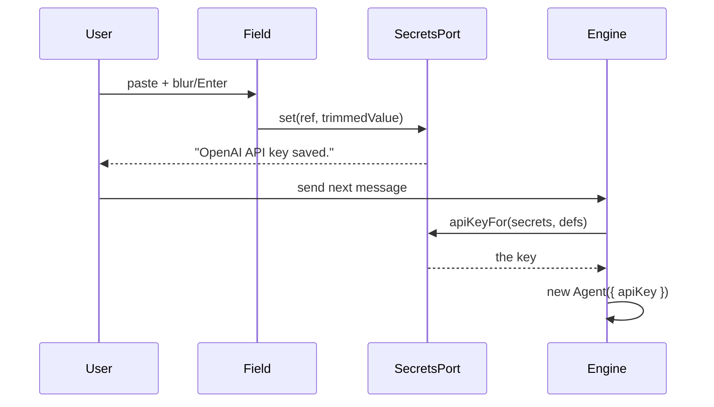

Paste an OpenAI key into the Settings screen and the in-process engine picks it up on the very next message — no relaunch, and the key never touches the settings file.

<Note>
**Your key now survives an app restart.** On iOS 16+ and Android API 26+ the pasted key is written to the platform keychain, so closing and reopening the app no longer shows **Not set** — you enter it once. Before this, `createWebSecrets()` (a module-scoped `Map`) was handed to the phone too, so the key was gone on every launch.
</Note>


## How a new user finds out a key is needed

First-launch "no key" guidance now happens on the chat screen, before any message is sent.

Before this, opening the app on a fresh install rendered a blank rectangle, and the only "no key" signal was the raw provider prose `The OPENAI_API_KEY environment variable is missing or empty`, shown **after** the user tapped Send.

The chat screen now shows an **"Add an API key to start"** panel with an **"Open settings"** button before any message is sent — see [Empty Chat](/features/mobile/empty-chat).

| Rule | Behaviour |
|------|-----------|
| The panel appears only on a definite absence | It shows when the engine in force needs a key **and** `SecretsPort.has()` has definitely returned `false`. |
| An in-flight lookup reads as the neutral welcome | A keychain lookup in flight is `KeyPresence.unknown` (a three-value type), which resolves to the welcome copy, not "missing" — see the [Empty Chat page](/features/mobile/empty-chat#rule-3-an-unresolved-key-check-reads-as-fine-not-as-missing). |
| The remote engine is never told to get a key | It authenticates at its own server, so it never shows the "add a key" panel. |

---

## Quick Start

<Steps>
<Step title="Open Settings and find the OpenAI API key row">
Under the **Engine** section, the **OpenAI API key** row shows **Not set**, a masked field, and a **Remove** button. On a platform without a hardware keychain (the web adapter, where `isHardwareBacked === false`), a warning above the rows says secrets are kept in app memory.
</Step>

<Step title="Paste your key">
Paste the key into the masked field and blur it or press Enter. The row flips to **Configured**, the field returns to its placeholder, and nothing is echoed back.
</Step>

<Step title="Send the very next message">
No relaunch. The in-process engine reads the key on every turn, so the next message you send is authenticated.

```
Ask anything — the first reply arrives.
```
</Step>

<Step title="Rotate or revoke">
To rotate, paste a new value over the old one — the replacement also survives a restart. To revoke, press **Remove** — the row returns to **Not set** and the keychain entry is gone.
</Step>
</Steps>

---

## How It Works

A pasted key is committed as a `set-secret` intent, written straight to `SecretsPort`, and read back by the engine on the next turn.



The field carries `data-action="set-secret"` and its key; a root-delegated `change` listener decodes it through `intentFrom` and calls `facade.setSecret(ref, value)`. On the next turn, `createInProcessEngine` calls `apiKeyFor(secrets, settings.defs())` and builds the agent with the key it finds.

Where `set(ref, value)` lands depends on the platform, both reached through `src-tauri/plugins/secrets`:

| Platform | Write goes to | How |
|----------|---------------|-----|
| iOS / macOS | The system **Keychain** | `SecItemAdd` (`kSecClassGenericPassword`) via the `security-framework` crate — the value is held by the keychain daemon, not the app sandbox. Source: `src-tauri/plugins/secrets/src/lib.rs`, `apple` module. |
| Android | `EncryptedSharedPreferences` | Values AES256-GCM, keys AES256-SIV, master key generated in `AndroidKeyStore` and never extractable. Source: `android/src/main/java/ai/praison/mobile/secrets/SecretsPlugin.kt`. |
| Any other host | **Refuses** | A desktop dev build has no hardware store, so the plugin refuses rather than writing a file. |

---

## What the field does and does NOT do

The masked field is governed by three rules from `secretControls` in `app/src/main.ts`, and each has a broken version that looks completely normal on screen.

| Rule | Why |
|------|-----|
| The field value is **never assigned** from storage | `SettingsFacade` has no secret getter — there is nothing to echo. A masked stand-in like `sk-…abcd` would still put the value in the render tree, where a screenshot, crash report or accessibility dump could reach it. |
| `type="password"`, `autocomplete="off"`, `autocapitalize="off"`, `autocorrect="off"`, `spellcheck="false"` | Dots for a shoulder-surfer or a screen recording; no browser autofill, and no unrecognised token shipped off to a spellchecker. |
| Presence is a separate node, starting at **UNKNOWN** | `hasSecret` is async and the paint is not. Rendering the in-flight check as "Not set" tells someone their key is missing while it sits in the keychain — which is how a working key gets pasted twice. |

---

## Configuration Options

The row is declared by one `SettingDef` in `SETTING_DEFS` (source: `app/src/registry.ts`).

```ts
{
  key: "openaiApiKey",
  default: "",
  label: "OpenAI API key",
  help: "Used by the in-process engine. Kept in the platform secret store, never in the settings file, and never shown back to you.",
  section: "Engine",
  secret: true,
  secretRef: { slot: "openai", account: "default" },
}
```

| Field | Value | Notes |
|-------|-------|-------|
| `secret` | `true` | Routes the value to `SecretsPort` and never to the settings file. |
| `secretRef` | `{ slot: "openai", account: "default" }` | Where the key lives in the keychain. |
| `default` | `""` | Required by `SettingDef.default`'s type, but never stored and never shown — a secret def has no value row at all. |

<Note>
**One slot, not five.** `createInProcessEngine` builds exactly one kind of agent, routed through `OpenAIService`, so `openai` is the only slot with a reader. The other four slots — `anthropic`, `google`, `openrouter`, `custom` — stay available for the commit that adds a provider setting **and** the code that honours it, in that order. An `anthropic` row today would be a declared-but-unread setting (the [#4636](https://github.com/MervinPraison/PraisonAI/pull/4636) defect).
</Note>

---

## Common Patterns

**An empty commit is refused, and the value is trimmed** — from `intentFrom` in `app/src/intents.ts`.

```ts
// A cleared field on blur does NOT delete the key:
intentFrom([{ dataset: { action: "set-secret", settingKey: "openaiApiKey" }, value: "   " }]);
// → null  (raw.trim() === "" is refused)

// Removing a credential must be asked for by name, via the Remove button:
intentFrom([{ dataset: { action: "clear-secret", settingKey: "openaiApiKey" } }]);
// → { kind: "clear-secret", key: "openaiApiKey" }
```

**The engine reads the key on every turn, not at boot** — from `createInProcessEngine` in `app/src/main.ts`.

```ts
const apiKey = await apiKeyFor(secrets, settings.defs());
return new Agent({
  instructions: "You are a helpful assistant.",
  llm: "gpt-4o-mini",
  // Omitted, never passed as "" or null, when unset:
  ...(apiKey === null ? {} : { apiKey }),
});
```

The engine is built once and held for the session, so a construction-time read would need a force-quit to pick up a pasted key. `enginesFor` already learned this with `baseUrl`, and it is worse for a credential — the failure it produces is the same missing-key error the user was trying to clear.

---

## Best Practices

<AccordionGroup>
<Accordion title="Rotate through Settings, not by editing files">
The key lives in the iOS keychain or Android keystore, never in the plaintext settings file. Paste a new value over the old one to rotate; press **Remove** to revoke.
</Accordion>

<Accordion title="Trust the presence label, not the field">
The field is empty on every paint — `syncSecret` empties it again after every commit. **Configured** / **Not set** on the presence node is the truth about whether a key is stored; the field only ever holds what you are typing right now.
</Accordion>

<Accordion title="A masked echo would lie — that is why there is none">
Showing dots for a stored key would read as "a key is already here", which is what the presence label is for. The field paints empty precisely so it never claims a key is present when it may not be.
</Accordion>

<Accordion title="An absent key is omitted, not sent as empty">
When no key is set, `apiKey` is left off the agent config rather than passed as `null` or `""`. Upstream treats a falsy `apiKey` as "fall back to the environment", and a phone has no `process.env` — so the honest shape for "no key" is an absent field and the provider's own missing-credential error.
</Accordion>

<Accordion title="What if my key is gone after an Android backup restore?">
Enter it once more and it sticks. Google's auto-backup copies the encrypted preferences file onto a new device, but the `AndroidKeyStore` master key that decrypts it is device-local and does not travel — so the old file cannot be read. The plugin catches that `KeyStoreException`, deletes the unreadable file with `deleteSharedPreferences`, and recreates the store empty, so the settings screen is never bricked. Any pre-restore secrets are lost and re-entered once, exactly like a fresh install. Source: `SecretsPlugin.kt`, `store()` / `discard()`.
</Accordion>
</AccordionGroup>

---

## Related

<CardGroup cols={2}>
<Card title="Settings Screen" icon="sliders" href="/features/mobile/settings-screen#secret-rows">
  How a secret row renders, commits, and refreshes its presence.
</Card>
<Card title="Storage & Secrets" icon="database" href="/features/mobile/storage-and-secrets#how-a-setting-reaches-the-keychain">
  `SecretsPort`, `readSecretSetting`, and the `isHardwareBacked` warning.
</Card>
<Card title="Native Secrets" icon="shield-keyhole" href="/features/mobile/native-secrets">
  The keychain plugin behind this row, and why it refuses on an unsupported platform.
</Card>
<Card title="Engines" icon="plug" href="/features/mobile/engines#how-the-in-process-engine-authenticates">
  How the in-process engine reads its key on every turn.
</Card>
<Card title="i18n & A11y" icon="globe" href="/features/mobile/i18n-and-a11y#secret-rows">
  How the four secret strings are announced.
</Card>
<Card title="Empty Chat" icon="message-square-dashed" href="/features/mobile/empty-chat">
  The first-screen "Add an API key to start" panel, shown before any Send.
</Card>
</CardGroup>
