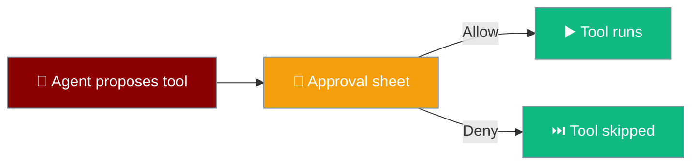
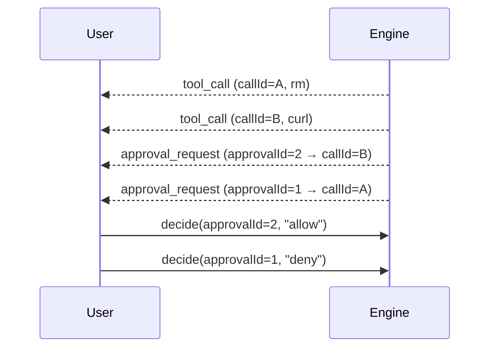
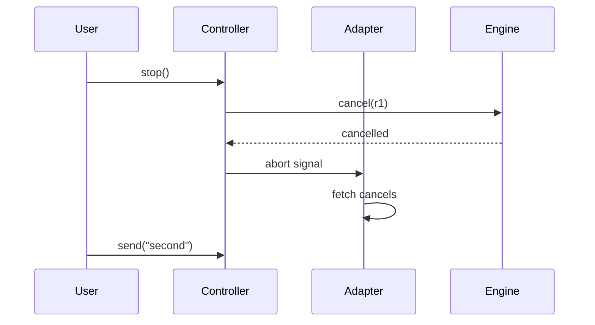
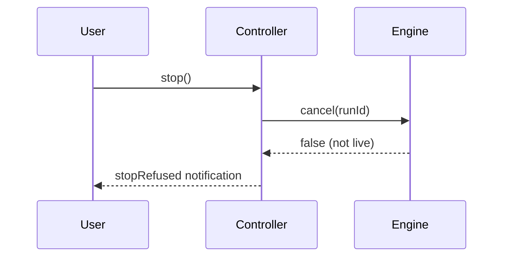

The agent proposes a tool; the phone asks; the user decides.

```ts
await controller.decide(approvalId, "allow");
await controller.stop();
```



## Quick Start

<Steps>
<Step title="Answer an approval">
```ts
await controller.decide(approvalId, "allow");
```
`decide` resolves only once the engine has recorded the decision, so the UI never shows "Allowed" before the request landed. The moment you tap, the row's buttons disable themselves, so a double tap on a shaky connection cannot send the same decision twice.
</Step>

<Step title="Cancel a live run">
```ts
await controller.stop();
```
The run is cancelled by `runId`, delivered on the `start` event. `cancelled` is announced, never inferred from a stream that ends.
</Step>
</Steps>

---

## Approval Choices

An `approval_request` carries `approvalId`, `callId`, `name`, and `args`.

| Choice | Effect |
|--------|--------|
| `allow` | Run the tool this once. |
| `always` | Run it and stop asking for this tool. |
| `deny` | Skip the tool. |

The decision is sent back with `approvalId`. `callId` only says which tool row to attach the prompt to.

---

## The Two-Approval Case

When two approvals are outstanding, the prompts arrive in the opposite order to their tool rows. Routing by position authorises the wrong command.



<Warning>
Bind each prompt to its row by `callId`, and send the decision back with `approvalId`. Zipping the two lists by index crosses `rm` with `curl` — the exact bug the `approvalId` design exists to prevent.
</Warning>

---

## Cancellation & Queued Prompts

`runId` arrives on `start` and is the only handle `cancel` accepts.

```ts
const stopped = await controller.stop();
```

`stop` returns `true` when it cancelled a live run and `false` when there was nothing to cancel or the engine refused. Stop cancels the network request too: the controller aborts the same signal it handed to `fetch`, so a request already in flight is dropped rather than left generating tokens after you tapped the button.



If you switch apps or lock the phone mid-answer, the run is cancelled — you won't come back to a burning credit meter.

### When Stop is refused

The app tells you when a stop did not land, instead of going quiet as though it worked.

When the engine refuses a stop — `controller.stop()` returns `false` because the run was not live, or the underlying stop call rejects — the user sees a notification carrying the `stopRefused` string ("The engine did not accept the stop. It may still be running."). A button that quietly confirms a cancellation that never happened is worse than one that reports it could not.



<Note>
A cancelled turn is never persisted, so it has no `end` and no `usage`, yet it stays on screen — which is why its index cannot be computed client-side.
</Note>

---

## Best Practices

<AccordionGroup>
<Accordion title="Never derive an approval from a row position">
Position holds only while exactly one approval is outstanding; the moment a second appears it silently authorises the wrong command.
</Accordion>

<Accordion title="Cancel by runId only">
`cancel` returns `false` when the run was not live — a Stop button that confirms a cancellation that never happened is worse than one that reports it could not.
</Accordion>

<Accordion title="Stop and flush on background">
Backgrounding stops the run loop and flushes the transcript, because iOS may kill the suspended app with no further callback. The lifecycle handler wired at boot calls `controller.stop()` the moment the app enters the `background` phase.
</Accordion>

<Accordion title="A pending decision disables the row">
The approval buttons disable themselves as soon as a decision is in flight and stay disabled while it is pending — the row is drawn with `disabled = !actionable`. A user hitting Allow twice on a shaky connection cannot send two decisions for the same approval.
</Accordion>
</AccordionGroup>

---

## Related

<CardGroup cols={2}>
<Card title="The 11 Events" icon="network-wired" href="/features/mobile/protocol">
  Where approval_request and cancelled are defined.
</Card>
<Card title="Agent Engine Port" icon="plug" href="/features/mobile/engines">
  The decide and cancel methods.
</Card>
</CardGroup>
