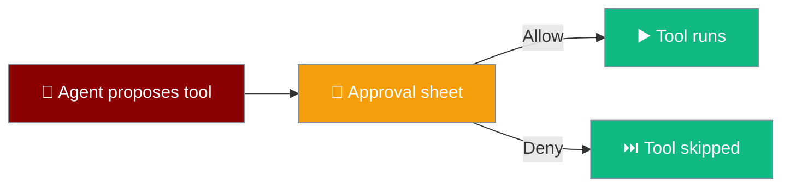
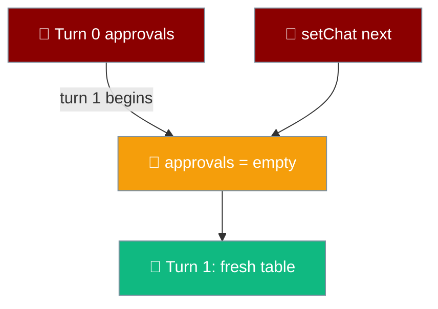
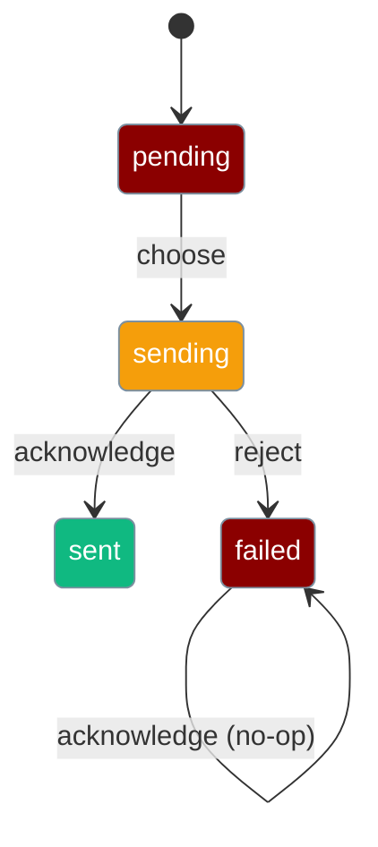
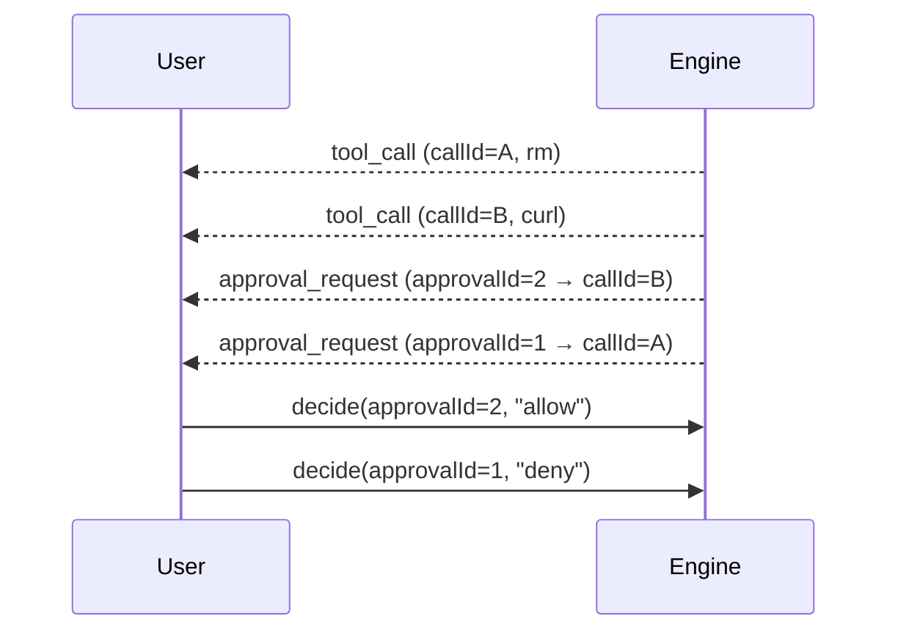
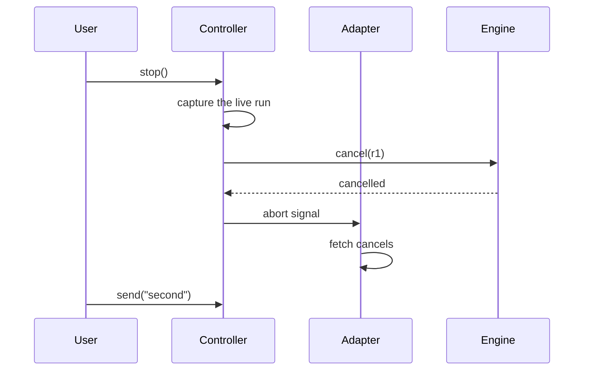
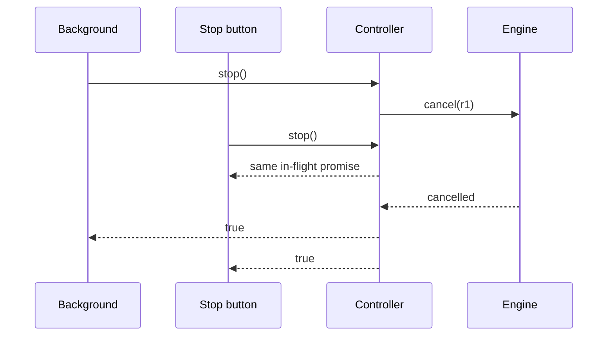
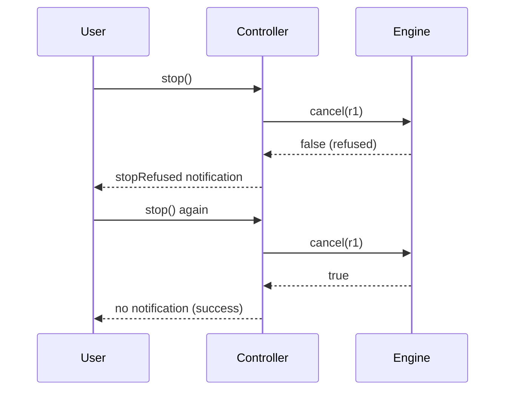
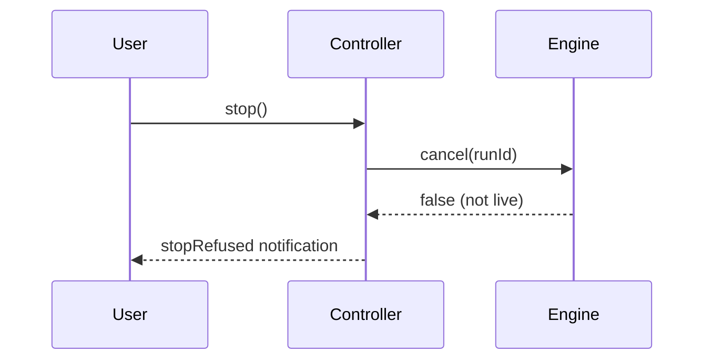

The agent proposes a tool; the phone asks; the user decides.

```ts
await controller.decide(approvalId, "allow");
await controller.stop();
```



## Quick Start

<Steps>
<Step title="Answer an approval">
```ts
await controller.decide(approvalId, "allow");
```
`decide` resolves only once the engine has recorded the decision, so the UI never shows "Allowed" before the request landed. The moment you tap, the row's buttons disable themselves, so a double tap on a shaky connection cannot send the same decision twice.
</Step>

<Step title="Cancel a live run">
```ts
await controller.stop();
```
The run is cancelled by `runId`, delivered on the `start` event. `cancelled` is announced, never inferred from a stream that ends.
</Step>
</Steps>

---

## Approval Choices

An `approval_request` carries `approvalId`, `callId`, `name`, and `args`.

| Choice | Effect |
|--------|--------|
| `allow` | Run the tool this once. |
| `always` | Run it and stop asking for this tool. |
| `deny` | Skip the tool. |

The decision is sent back with `approvalId`. `callId` only says which tool row to attach the prompt to.

<Note>
If the `decide` call itself throws — a socket closed mid-send — the row renders as **failed** and carries the reason (e.g. `"socket closed"`). It is never quietly acknowledged as sent, because the engine may not have received the decision at all.
</Note>

---

## Approvals are per turn

The approval table is cleared at the start of every turn and again when `setChat()` switches conversations, so a new prompt is never confused with an answered one.

An engine may number `approvalId` per run — the protocol only guarantees uniqueness within a single run. Reusing an id across turns once shadowed the new request behind the previous turn's answered entry: turn 1's prompt rendered as `sent/allow` with dead buttons, still carrying turn 0's `args`. A user could be shown `rm -rf /` as already-allowed because an earlier `ls` reused the id.

```ts
// At the start of each turn AND inside setChat(next):
approvals = emptyApprovals;
```

The within-turn rule is unchanged: the same `approvalId` twice inside one run is still the engine repeating itself — one prompt, not two.



---

## Refused decisions stay refused

A decision is `sending` until the engine confirms it, and only then `sent`. If the engine **refuses** the decision, `acknowledge` never promotes it.



| Rule | Behaviour |
|------|-----------|
| `acknowledge` on a `failed` decision | Stays `failed`. Only `sending` is promoted to `sent`. |
| `isActionable` for a `failed` decision | Remains `true`, so the user can retry. |
| `acknowledge` on a `sending` decision | Promoted to `sent`. This is the only transition into `sent`. |

<Warning>
Before this fix, a refused decision was marked "sent": the buttons went dead, the outstanding count dropped to zero, and the run stayed blocked until its 300-second timeout — silence read as success. A refused decision now stays actionable so the user can answer again.
</Warning>

---

## The Two-Approval Case

When two approvals are outstanding, the prompts arrive in the opposite order to their tool rows. Routing by position authorises the wrong command.



<Warning>
Bind each prompt to its row by `callId`, and send the decision back with `approvalId`. Zipping the two lists by index crosses `rm` with `curl` — the exact bug the `approvalId` design exists to prevent.
</Warning>

---

## Cancellation & Queued Prompts

`runId` arrives on `start` and is the only handle `cancel` accepts.

```ts
const stopped = await controller.stop();
```

`stop` returns `true` when it cancelled a live run and `false` when there was nothing to cancel. Stop cancels the network request too: the controller aborts the same signal it handed to `fetch`, so a request already in flight is dropped rather than left generating tokens after you tapped the button.

`stop()` captures the run when tapped. It no longer re-reads `live` after awaiting the engine, so tapping Stop just as the last token lands cannot throw a `TypeError` that blanks the whole screen when the queue is empty, nor cancel the queued follow-up instead of the finished run.



If you switch apps or lock the phone mid-answer, the run is cancelled — you won't come back to a burning credit meter.

### Stop is idempotent and race-safe

Stop is safe to call more than once, and two overlapping stops share a single cancel.

A second tap reports `true`, not a refusal: the controller short-circuits on an already-aborted run instead of asking the engine again. The background → dispose path calls `stop()` twice by design, so the second call must not read as a failure.

Two stops that overlap — the background handler and the user's Stop button, say — both receive the same in-flight promise. The engine is asked exactly once, and both callers get the true result. This removes the false "the engine did not accept the stop" notice that once fired for a stop that did happen.

Idempotence never invents a cancellation: `stop()` still returns `false` when there was nothing to stop.



### A refused stop is retryable

A `false` from the engine leaves the run alive and does **not** short-circuit the next tap.

When the engine answers `cancel(runId) === false`, `stop()` clears `run.cancelling` and never calls `run.abort.abort()`. Two things follow: the reader stays attached to a run the engine says is still running, and `aborted` stays unset, so the **next** tap reaches the engine again rather than hitting the idempotence guard.

```ts
// controller.ts — abort ONLY when the engine confirms.
const stopped = await deps.engine.cancel(run.runId);
if (stopped) {
  run.abort.abort();          // accepted: idempotent from here
} else {
  run.cancelling = undefined; // refused: retry re-asks the engine
}
return stopped;
```



A second `true` reaches the user as silence — `stopNotice` defines an accepted stop as no notification. A second `false` shows the refusal again. Before this, the idempotence guard aborted the reader even on a refusal, so the retry short-circuited to `true` without asking the engine, and the run kept generating and billing while the user was told nothing.

<Note>
The two guarantees are a pair: an **accepted** stop is idempotent (a repeat tap does not re-ask the engine), and a **refused** stop is retryable (a repeat tap does re-ask). See [Stop is idempotent and race-safe](#stop-is-idempotent-and-race-safe) above.
</Note>

### When Stop is refused

The app tells you when a stop did not land, instead of going quiet as though it worked.

When the engine genuinely refuses a stop — `controller.stop()` returns `false` because the run was not live, or the underlying stop call rejects — the user sees a notification carrying the `stopRefused` string ("The engine did not accept the stop. It may still be running."). A button that quietly confirms a cancellation that never happened is worse than one that reports it could not.



<Note>
**New chat is a stop.** Tapping New chat calls `controller.stop()` before it clears the transcript, so starting a fresh conversation cancels any live run. See [New chat semantics](/features/mobile/overview#new-chat).
</Note>

<Note>
A cancelled turn is never persisted, so it has no `end` and no `usage`, yet it stays on screen — which is why its index cannot be computed client-side.
</Note>

---

## Best Practices

<AccordionGroup>
<Accordion title="Never derive an approval from a row position">
Position holds only while exactly one approval is outstanding; the moment a second appears it silently authorises the wrong command.
</Accordion>

<Accordion title="Cancel by runId only">
`cancel` returns `false` when the run was not live — a Stop button that confirms a cancellation that never happened is worse than one that reports it could not.
</Accordion>

<Accordion title="A new turn starts a new approval table">
The same `approvalId` on a later turn is a fresh request, never a repeat of the answered one. Switching chats also clears the pending prompts, so a different conversation cannot inherit the last one's approvals.
</Accordion>

<Accordion title="An accepted stop is safe to call twice">
Once the engine confirms, the run is aborted and a second tap short-circuits to `true` without re-asking. The guard applies **only after the engine confirms**.
</Accordion>

<Accordion title="A refused stop is safe to retry">
A `false` from the engine does not set `aborted`, so the next tap reaches the engine again instead of short-circuiting. Retrying a refused stop actually re-asks; a second acceptance is silent, a second refusal shows the notice again.
</Accordion>

<Accordion title="Overlapping stops share one cancel">
The background dispose and the Stop button both report the real outcome, so a real cancellation is never surfaced as a refusal.
</Accordion>

<Accordion title="Stop and flush on background">
Backgrounding stops the run loop and flushes the transcript, because iOS may kill the suspended app with no further callback. The lifecycle handler wired at boot calls `controller.stop()` the moment the app enters the `background` phase.
</Accordion>

<Accordion title="A pending decision disables the row">
The approval buttons disable themselves as soon as a decision is in flight and stay disabled while it is pending — the row is drawn with `disabled = !actionable`. A user hitting Allow twice on a shaky connection cannot send two decisions for the same approval.
</Accordion>
</AccordionGroup>

---

## Related

<CardGroup cols={2}>
<Card title="The 11 Events" icon="network-wired" href="/features/mobile/protocol">
  Where approval_request and cancelled are defined.
</Card>
<Card title="Agent Engine Port" icon="plug" href="/features/mobile/engines">
  The decide and cancel methods.
</Card>
</CardGroup>
