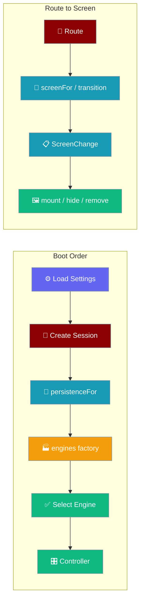
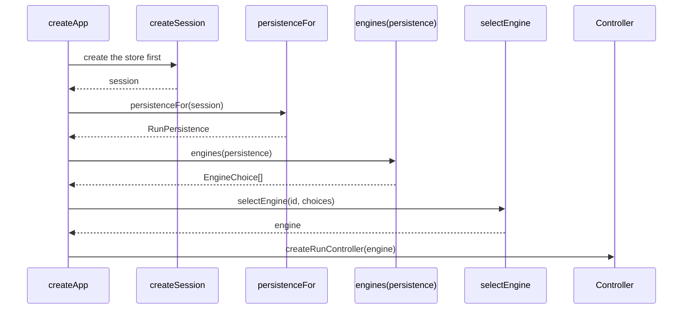
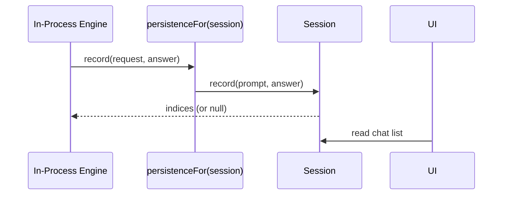

The mobile app boots in a fixed order so the engine that records a turn and the chat the screen reads are the same store. Navigation then splits into a pure decision layer and a thin DOM layer so the part worth testing has no browser in it. Native platform integration — safe-area insets, keyboard height, lifecycle, and the back gesture — is provided by the [Native Shell (Tauri)](/features/mobile/native-shell).



## Quick Start

<Steps>
<Step title="The composition root builds everything concrete">
`createApp` takes its adapters injected, so the whole boot runs under test against fakes.

```ts
const booted = await createApp({
  storage: platform.storage,
  secrets: platform.secrets,
  time: platform.time,
  shell: platform.shell,
  // A FACTORY, not an array: the engine list is built FROM the session.
  engines: (persistence) => enginesFor({ settings: facadeStub(), http: platform.http, persistence }),
  settingDefs: SETTING_DEFS,
  engineId: "remote-http",
  onPublish: publish,
  now: () => Date.now(),
  newChatId: () => globalThis.crypto.randomUUID(),
});
```
</Step>

<Step title="The session is bridged to the engine with persistenceFor">
`boot.ts` builds the session first, then hands it to the engine factory through the named adapter `persistenceFor`.

```ts
const session = createSession({ storage, engineId, now, newChatId });
const selection = await selectEngine(engineId, deps.engines(persistenceFor(session)));
```
</Step>

<Step title="Decide what changes (pure)">
`screenFor(route)` maps a route to a `ScreenId`, and `transition(from, to, live)` returns a `ScreenChange` describing what to mount, hide, and remove. No DOM is touched here, so the decision is tested without a browser.
</Step>

<Step title="Apply it to the page (thin)">
`createScreens(host).apply(change)` mounts, hides, and removes nodes according to the `ScreenChange`. It mounts the next screen before hiding the current one, so there is never a blank frame.
</Step>
</Steps>

---

## Boot Order

The boot sequence runs in one order, and that order exists because the in-process engine writes through the session.



| Step | What happens | Why here |
|------|--------------|----------|
| 1. Load settings | `createSettingsStore(...).load()` | The engine choice and credentials come from settings; building first means rebuilding. |
| 2. Create session | `createSession(...)` | The in-process engine writes through it, so it must exist first. |
| 3. Bridge | `persistenceFor(session)` | Adapts `Session.record(prompt, answer)` to `RunPersistence.record(request, answer)`. |
| 4. Build engines | `deps.engines(persistenceFor(session))` | The factory receives the thing engines write through. |
| 5. Select engine | `selectEngine(engineId, choices)` | A protocol mismatch stops the boot here, with a name, not mid-answer. |
| 6. Controller | `createRunController({ engine, ... })` | Everything above the seam, none of it naming a concrete adapter. |

---

## The Route→Screen Seam

Navigation splits into a pure half and a thin half so the part worth testing has no DOM in it.

| Layer | File | Responsibility |
|-------|------|----------------|
| Decision (pure) | `ui/src/screens.ts` | `screenFor`, `transition`, `RETAINED` — returns a description of what should change |
| DOM (thin) | `app/src/mount.ts` | Appends, hides, and removes nodes per the description |

A `ScreenChange` carries the plan: `show`, `mount`, `unmount`, `hide`, and `noop`. A retained screen appears in `hide`, never `unmount` — its nodes stay so scroll position and streaming survive.

<Note>
A chat-to-chat move is a **content** change, not a screen change — `transition` returns `noop: true` so the transcript is not rebuilt on navigation within the same screen.
</Note>

---

## The Persistence Seam

The engine writes a completed turn through the same session the UI reads, joined at one named adapter.



`persistenceFor(session)` in `core/src/chat/session.ts` is the one place the engine's `RunPersistence` vocabulary and the `Session` vocabulary meet. The engine calls `record(request, answer)`; the adapter forwards `request.prompt` to `session.record(prompt, answer)`. Naming the adapter — rather than inlining a lambda at the call site — keeps this seam findable.

The wiring is enforced by the type: `AppDeps.engines` is a factory `(persistence) => EngineChoice[]`, built **from** the session. There is no way to obtain the engine list without being handed the store engines write through.

<Warning>
`end.userIndex === null` means the turn was **not** written to disk — the write failed, so the UI withholds Fork and Delete. Index `0` is valid, so a falsy check is a trap.
</Warning>

---

## Why a Factory, Not an Array

`AppDeps.engines` is a factory whose type refuses a pre-built list.

```ts
readonly engines: (persistence: RunPersistence) => readonly EngineChoice[];
```

A pre-built array was the original bug: the session existed, the engine's `persistence` port existed, and nothing connected them — so `record()` never ran in a real turn and no conversation was ever saved. Taking a factory makes that impossible to express: there is no way to obtain the engine list without being handed the thing engines write through. The wiring is enforced by the type, not by a comment.

<Note>
`persistenceFor(session)` is a **named** adapter in `core/src/chat/session.ts`, not an inline lambda. It is the one place the two vocabularies meet — `Session.record(prompt, answer)` versus `RunPersistence.record(request, answer)` — and a lambda buried in composition is a seam nobody can find later.
</Note>

---

## Common Patterns

Boot fails loud when an engine cannot hold the contract.

```ts
if (!booted.ok) {
  renderFatal(root, strings.bootFailed(booted.detail));
  return null;
}
```

Teardown runs in reverse and is idempotent.

```ts
async dispose() {
  if (disposed) return;
  disposed = true;
  for (const off of subscriptions.splice(0)) off();
  await controller.stop();
  await engine.dispose();
}
```

---

## Best Practices

<AccordionGroup>
<Accordion title="Build the session before the engine list">
The in-process engine writes through the session, so a pre-built engine list cannot carry a live persistence. Always call `createSession` first, then `deps.engines(persistenceFor(session))`.
</Accordion>

<Accordion title="Name the bridge, do not inline it">
`persistenceFor` is exported by name. Inlining the adapter as a lambda at the call site hides the one seam where the session and the engine vocabularies meet.
</Accordion>

<Accordion title="Keep the composition root injectable">
`createApp` takes every adapter as a parameter. A composition root that constructs its own dependencies is the one part of an app that can never be tested — and it is where ordering bugs live.
</Accordion>

<Accordion title="Keep decisions out of the DOM layer">
Anything that decides what to keep or destroy belongs in `screens.ts` as a pure function. `mount.ts` only carries out the plan, so a test can inspect the plan without a browser.
</Accordion>

<Accordion title="Mount before hide">
Always mount the next screen before hiding the current one. The reverse order shows a blank page for one frame on every navigation.
</Accordion>

<Accordion title="Trust the persisted index, not the screen">
A cancelled or errored turn stays on screen but is never written, so screen position and disk position diverge. Read the index the writer reports in `end`, and treat `null` as "not on disk".
</Accordion>
</AccordionGroup>

---

## Related

<CardGroup cols={2}>
<Card title="Overview" icon="mobile" href="/features/mobile/overview">
  Retained chat and native navigation.
</Card>
<Card title="Engines" icon="microchip" href="/features/mobile/engines">
  Which engine owns the write, and why only one does.
</Card>
<Card title="Shell & Adapters" icon="mobile-screen" href="/features/mobile/shell-and-adapters">
  The keyboard snapshot and the pinch-zoom guard.
</Card>
<Card title="Capabilities & Gaps" icon="list-check" href="/features/mobile/capabilities-and-gaps">
  What each engine can and cannot report.
</Card>
<Card title="Native Shell" icon="mobile-button" href="/features/mobile/native-shell">
  The Tauri shell — safe-area, keyboard, lifecycle, and back-gesture arbitration.
</Card>
</CardGroup>
