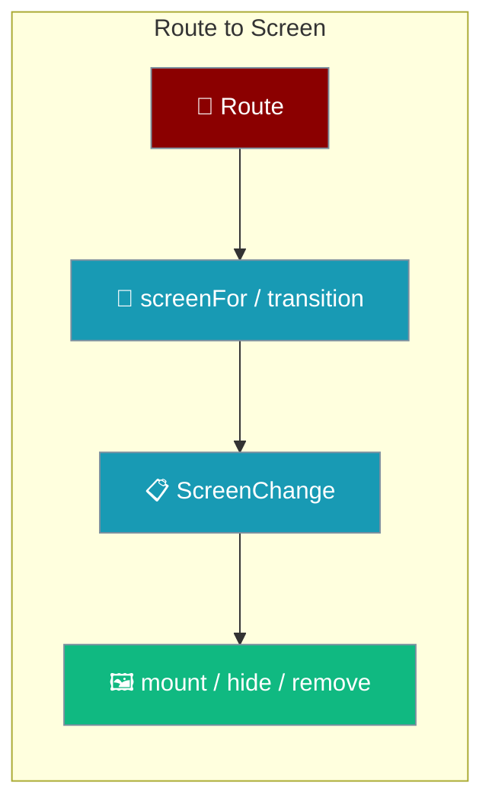
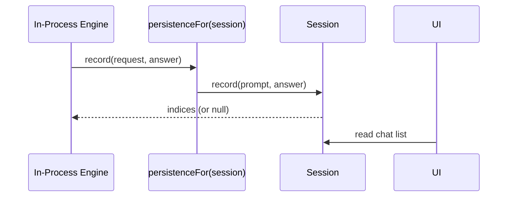

A route becomes a screen through a pure decision layer and a thin DOM layer, and a completed turn is joined to persistence at one named seam.

## Quick Start

<Steps>
<Step title="Decide what changes (pure)">
`screenFor(route)` maps a route to a `ScreenId`, and `transition(from, to, live)` returns a `ScreenChange` describing what to mount, hide, and remove. No DOM is touched here, so the decision is tested without a browser.
</Step>

<Step title="Apply it to the page (thin)">
`createScreens(host).apply(change)` mounts, hides, and removes nodes according to the `ScreenChange`. It mounts the next screen before hiding the current one, so there is never a blank frame.
</Step>
</Steps>

---

## The route→screen seam

Navigation splits into a pure half and a thin half so the part worth testing has no DOM in it.

| Layer | File | Responsibility |
|-------|------|----------------|
| Decision (pure) | `ui/src/screens.ts` | `screenFor`, `transition`, `RETAINED` — returns a description of what should change |
| DOM (thin) | `app/src/mount.ts` | Appends, hides, and removes nodes per the description |

A `ScreenChange` carries the plan: `show`, `mount`, `unmount`, `hide`, and `noop`. A retained screen appears in `hide`, never `unmount` — its nodes stay so scroll position and streaming survive.

<Note>
A chat-to-chat move is a **content** change, not a screen change — `transition` returns `noop: true` so the transcript is not rebuilt on navigation within the same screen.
</Note>

---

## The persistence seam

The engine writes a completed turn through the same session the UI reads, joined at one named adapter.

`persistenceFor(session)` in `core/src/chat/session.ts` is the one place the engine's `RunPersistence` vocabulary and the `Session` vocabulary meet. The engine calls `record(request, answer)`; the adapter forwards `request.prompt` to `session.record(prompt, answer)`. Naming the adapter — rather than inlining a lambda at the call site — keeps this seam findable.

The wiring is enforced by the type: `AppDeps.engines` is a factory `(persistence) => EngineChoice[]`, built **from** the session. There is no way to obtain the engine list without being handed the store engines write through.

<Warning>
`end.userIndex === null` means the turn was **not** written to disk — the write failed, so the UI withholds Fork and Delete. Index `0` is valid, so a falsy check is a trap.
</Warning>

---

## Best Practices

<AccordionGroup>
<Accordion title="Keep decisions out of the DOM layer">
Anything that decides what to keep or destroy belongs in `screens.ts` as a pure function. `mount.ts` only carries out the plan, so a test can inspect the plan without a browser.
</Accordion>

<Accordion title="Mount before hide">
Always mount the next screen before hiding the current one. The reverse order shows a blank page for one frame on every navigation.
</Accordion>

<Accordion title="Trust the persisted index, not the screen">
A cancelled or errored turn stays on screen but is never written, so screen position and disk position diverge. Read the index the writer reports in `end`, and treat `null` as "not on disk".
</Accordion>
</AccordionGroup>

---

## Related

<CardGroup cols={2}>
<Card title="Overview" icon="mobile" href="/features/mobile/overview">
Retained chat and native navigation.
</Card>
<Card title="Engines" icon="plug" href="/features/mobile/engines">
Which engine persists, and which one does not.
</Card>
</CardGroup>
