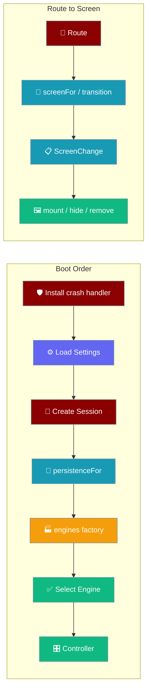
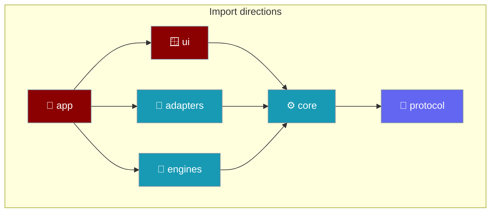
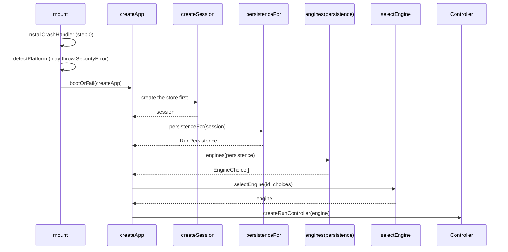
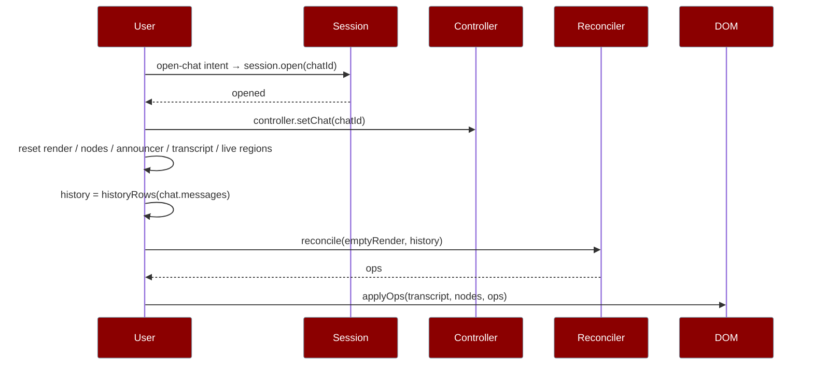
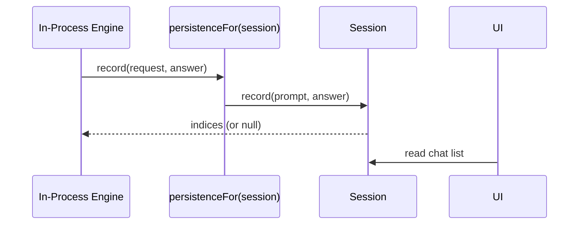
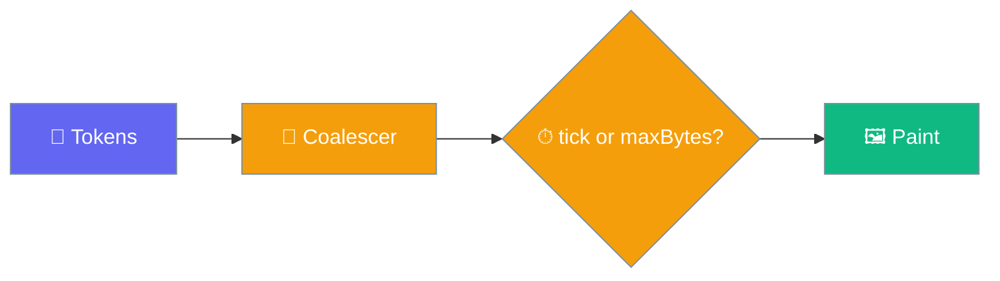
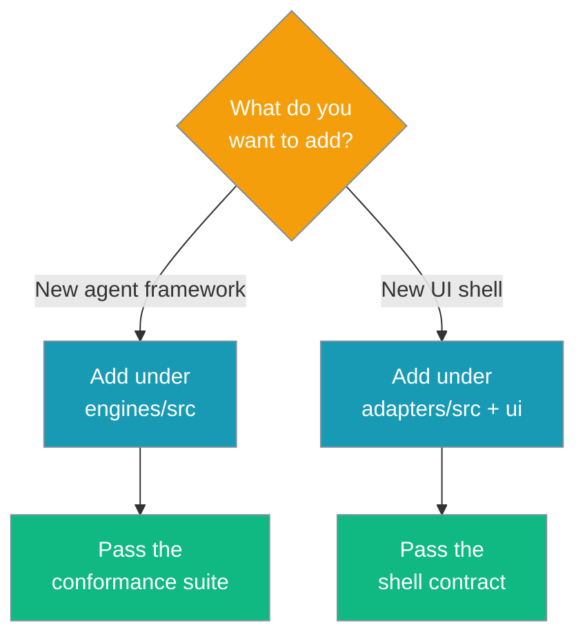

A route becomes a screen through a pure decision layer and a thin DOM layer, and a completed turn is joined to persistence at one named seam. Two enforced seams — one for the agent framework, one for the UI shell — keep engines and shells swappable.

```ts
import { enginesFor } from "praisonai-mobile/app/registry";

const engines = enginesFor({ settings, http });
```





## Quick Start

<Steps>
<Step title="The composition root builds everything concrete">
`createApp` takes its adapters injected, so the whole boot runs under test against fakes.

```ts
const booted = await createApp({
  storage: platform.storage,
  secrets: platform.secrets,
  time: platform.time,
  shell: platform.shell,
  // A FACTORY, not an array: the engine list is built FROM the session.
  engines: (persistence) => enginesFor({ settings: facadeStub(), http: platform.http, persistence }),
  settingDefs: SETTING_DEFS,
  engineId: "remote-http",
  onPublish: publish,
  now: () => Date.now(),
  newChatId: () => globalThis.crypto.randomUUID(),
});
```
</Step>

<Step title="The session is bridged to the engine with persistenceFor">
`boot.ts` builds the session first, then hands it to the engine factory through the named adapter `persistenceFor`.

```ts
const session = createSession({ storage, engineId, now, newChatId });
const selection = await selectEngine(engineId, deps.engines(persistenceFor(session)));
```
</Step>

<Step title="Decide what changes (pure)">
`screenFor(route)` maps a route to a `ScreenId`, and `transition(from, to, live)` returns a `ScreenChange` describing what to mount, hide, and remove. No DOM is touched here, so the decision is tested without a browser.
</Step>

<Step title="Apply it to the page (thin)">
`createScreens(host).apply(change)` mounts, hides, and removes nodes according to the `ScreenChange`. It mounts the next screen before hiding the current one, so there is never a blank frame.
</Step>

<Step title="Read the layer graph">
```bash
cat tools/boundaries.json
```
The graph is data, not convention.
</Step>

<Step title="Check the boundaries">
```bash
npm run boundaries
```
`tools/depgraph.mjs` reports every import that crosses a line it should not. The file walk lives in `depgraph.mjs` as `sourceFilesUnder(base, roots)` and covers both `.ts` and `.mjs`, so `tools/` — which is entirely `.mjs` — is no longer walked past. It is testable: `"the walk collects .mjs files as well as .ts"` calls it directly.
</Step>
</Steps>

---

## Boot Order

The boot sequence runs in one order, and that order exists because the in-process engine writes through the session.



| Step | What happens | Why here |
|------|--------------|----------|
| 0. Install crash handler | `installCrashHandler({...})` in `mount()` | Installed before anything else can throw — including `detectPlatform`, which reads `window.localStorage` and raises `SecurityError` in a WKWebView with site data blocked. Running it second left a blank white page on a device nobody can debug. |
| 1. Load settings | `createSettingsStore(...).load()` | The engine choice and credentials come from settings; building first means rebuilding. |
| 2. Create session | `createSession(...)` | The in-process engine writes through it, so it must exist first. |
| 3. Bridge | `persistenceFor(session)` | Adapts `Session.record(prompt, answer)` to `RunPersistence.record(request, answer)`. |
| 4. Build engines | `deps.engines(persistenceFor(session))` → `appEngines(...)` | The factory receives the thing engines write through; `appEngines` is the single seam where praisonai-ts's lazy module load lives, so the `praisonai` graph never touches this path. |
| 5. Select engine | `selectEngine(engineId, choices)` | A protocol mismatch stops the boot here, with a name, not mid-answer. |
| 6. Controller | `createRunController({ engine, ... })` | Everything above the seam, none of it naming a concrete adapter. |

`newChatId` is injected into `createApp` for the **first** conversation's id. Every **subsequent** chat mints its own id at the `new-chat` intent handler in `main.ts` — `controller.setChat(mintChatId())` — so no two conversations share `chat_id: "unassigned"`. See [New chat semantics](/features/mobile/overview#new-chat).

<Note>
The wiring landed in [PR #4572](https://github.com/MervinPraison/praisonai/pull/4572); before that, `controller` was constructed without a `chatId` and defaulted to the literal `"unassigned"`, so the first conversation on every launch went to the engine under one shared id.
</Note>

<Note>
`createApp` returns a typed `BootResult` for the failures it anticipates. It can also **throw** — an unguarded `settingsStore.load()` propagates a `StoragePort` failure — so `mount()` wraps it in `bootOrFail`, turning a throw into `{ ok: false, reason: "storage_unavailable" }`. See [Boot Failures](/features/mobile/boot-failures).
</Note>

---

## The Route→Screen Seam

Navigation splits into a pure half and a thin half so the part worth testing has no DOM in it.

| Layer | File | Responsibility |
|-------|------|----------------|
| Decision (pure) | `ui/src/screens.ts` | `screenFor`, `transition`, `RETAINED` — returns a description of what should change |
| DOM (thin) | `app/src/mount.ts` | Appends, hides, and removes nodes per the description |

A `ScreenChange` carries the plan: `show`, `mount`, `unmount`, `hide`, and `noop`. A retained screen appears in `hide`, never `unmount` — its nodes stay so scroll position and streaming survive.

<Note>
A chat-to-chat move is a **content** change, not a screen change — `transition` returns `noop: true` so the transcript is not rebuilt on navigation within the same screen.
</Note>

### The chat screen is registered as already-live

`main.ts` builds the chat screen up front and registers it with `screens.nodes.set("chat", screen)`, so `transition` treats it as live and never tries to build a second one.

```ts
// main.ts — register the pre-built chat screen so transition retains it.
screens.nodes.set("chat", screen);
```

The router's default root is `chats`, but the app opens on the chat screen. `main.ts` `replace`s the root with `{ name: "chat", chatId: "" }` at boot — otherwise pushing `chats` later would be swallowed as a push of the route already on top, and the chat list would never open.

```ts
// main.ts — align the router root with the screen the app opens on.
app.router.replace({ name: "chat", chatId: "" });
```

<Note>
The `replace` at boot also seeds the depth counter that tells a push from a pop. `previousDepth` starts at `1`, so the first real navigation classifies correctly. See [Route Focus](/features/mobile/route-focus#navigation-is-classified-by-stack-depth).
</Note>

---

## The Reopen Flow

Reopening a stored conversation resets the live render state, then seeds the reconciler with the history before any new turn arrives.



`history: readonly Row[]` lives in the mount closure and is **prepended to every reconcile** in `publish`, so a follow-up turn's rows land below it and a reconcile never emits `remove` for history it did not know about. New chat resets `history = []`.

```ts
// publish() — history first, then the live turn.
const rows = history.length === 0 ? built.rows : [...history, ...built.rows];
const diff = reconcile(render, rows);
```

<Note>
Full detail — including why history row ids carry a `history:{index}:{role}` prefix and the bug the reconciler-seeded restore replaces — is on [History & Reopen](/features/mobile/history-and-reopen).
</Note>

---

## The Persistence Seam

The engine writes a completed turn through the same session the UI reads, joined at one named adapter.



`persistenceFor(session)` in `core/src/chat/session.ts` is the one place the engine's `RunPersistence` vocabulary and the `Session` vocabulary meet. The engine calls `record(request, answer)`; the adapter forwards `request.prompt` to `session.record(prompt, answer)`. Naming the adapter — rather than inlining a lambda at the call site — keeps this seam findable.

The wiring is enforced by the type: `AppDeps.engines` is a factory `(persistence) => EngineChoice[]`, built **from** the session. There is no way to obtain the engine list without being handed the store engines write through.

The shipping composition root exports `appEngines(deps)` — the function `mount` delegates to — and this function is what wires the `createInProcess` factory into `enginesFor`. Extracting it (rather than inlining it in `mount`) is what lets `main.test.ts` assert *the engine is offered*, per the package's rule of asserting the extracted expression, not that it appears in source. `appEngines` is also the single seam where praisonai-ts's lazy module load lives, so the `praisonai` graph never touches the boot path.

<Warning>
`end.userIndex === null` means the turn was **not** written to disk — the write failed, so the UI withholds Fork and Delete. Index `0` is valid, so a falsy check is a trap.
</Warning>

---

## The Reconciler Contract

The reconciler turns a row list into DOM operations without touching the DOM, and two guarantees hold.

The reconciler (`ui/render/reconcile.ts`) diffs the previous row list against the next one and emits `insert` / `remove` / `move` / `update` ops. `app/dom.ts` applies them.

- **Minimal ops.** An unchanged list emits zero ops; appending one row is one `insert`. A "rebuilding" reconciler that happened to render the right order by re-writing everything would fail this.
- **Target order.** After the ops apply, the DOM matches the target order exactly — including cases where an insert precedes a reorder.

A `move` op names an index into the *current* DOM (the list as it will look after this pass), not into the previous list minus removals. That coordinate-system distinction is what lets an insert-then-reorder sequence like `[a,b,c] → [d,e,b,c,a]` land correctly; `applyOps` reads `children[index]` before detaching the node, so the placement is relative to a real sibling.

---

## Streaming Pacing

Tokens flow through a coalescer that flushes either when it has enough bytes or after a short delay, so short answers still paint incrementally.



The coalescer paints on whichever bound is hit first. The tick that fires the delay bound is driven by [the TimePort](/features/mobile/time-and-pacing) — a fake that never fires the tick makes short answers arrive in one lump.

| Bound | Default | Meaning |
|-------|---------|---------|
| `maxBytes` | `256` | Flush once this many buffered characters accumulate. |
| `maxDelayMs` | `16` | Flush this long after the first buffered byte, however few arrived. |

<Warning>
If the periodic tick is not wired, only the byte cap can flush — so a 130-character answer produces zero intermediate paints and arrives in one lump when the run ends. The delay bound is what makes a short answer stream at all; that is why the pacing design matters, not merely how fast it is.
</Warning>

---

## The Publish Gate

A second pacing mechanism, the publish gate, is wired into the controller but almost never runs at real streaming speeds.

`core/src/pacing/publish-gate.ts` is a verbatim port of the desktop's stream-pacing, with two constants tightened for mobile.

| Constant | Value | Meaning |
|----------|-------|---------|
| `MAX_HELD_CHARS` | `96` | Characters allowed to accumulate before the gate opens a paint. |
| `UNPAINTED_REOPEN_MS` | `200` | How long the gate holds before forcing a paint anyway. |

The gate is called — `controller.ts` runs `if (frames.length > 0 && gate(streamed)) publish()` — but the coalescer's flush tick drains the buffer every `maxDelayMs` first, so `push()` usually returns `[]` by the time a delta arrives and the gate is never consulted. The tick's own publish is ungated by design, because that frame exists precisely when nothing has painted recently.

Driving the real controller with a virtual clock and counting whether the gate is consulted even once shows it only fires at very high token rates:

| tokens/sec | publishes for 2000 tokens | gate consulted |
|-----------:|--------------------------:|:---------------|
| 20 | 2004 | no |
| 60 | 2004 | no |
| 150 | 670 | no |
| 400 | 289 | no |
| 1600 | 80 | no |
| 3200 | 42 | YES |
| 8000 | 42 | YES |

The threshold is where 256 bytes land inside a single 16ms window. Real model streaming runs 20–150 tokens/sec, so the gate is unreachable in practice.

<Note>
This is not a current defect. Paints stay bounded by time (20–38/sec observed) and per-publish view work stays under 9% of a frame even in the worst measured case. It is documented because two things follow: there is no backpressure path — the gate is the mechanism that would notice the renderer falling behind, and it never runs — and a module with its own tuned constants that never executes reads as load-bearing to the next person who changes pacing.
</Note>

The resolution is a design decision: wire the tick's publish through the gate, or delete the module and its constants. Do not leave it looking wired.

---

## How It Works

Each layer declares what it may import. `app` sits at the top and wires everything; `protocol` sits at the bottom and imports nothing.

| Layer | May import | Purpose |
|-------|-----------|---------|
| `protocol` | — | The wire contract and the 11 events. |
| `core` | `protocol` | Ports, run controller, transcript, chat, settings. |
| `engines` | `protocol`, `core` | Agent-framework implementations. |
| `adapters` | `protocol`, `core` | UI-shell implementations. |
| `ui` | `protocol`, `core` | Framework-free render logic. |
| `app` | all of the above | The composition root. |

---

## Why a Factory, Not an Array

`AppDeps.engines` is a factory whose type refuses a pre-built list.

```ts
readonly engines: (persistence: RunPersistence) => readonly EngineChoice[];
```

A pre-built array was the original bug: the session existed, the engine's `persistence` port existed, and nothing connected them — so `record()` never ran in a real turn and no conversation was ever saved. Taking a factory makes that impossible to express: there is no way to obtain the engine list without being handed the thing engines write through. The wiring is enforced by the type, not by a comment.

<Note>
`persistenceFor(session)` is a **named** adapter in `core/src/chat/session.ts`, not an inline lambda. It is the one place the two vocabularies meet — `Session.record(prompt, answer)` versus `RunPersistence.record(request, answer)` — and a lambda buried in composition is a seam nobody can find later.
</Note>

---

## Why Build-Enforced

A rule enforced only by review stops being enforced. `tools/depgraph.mjs` runs in CI (`.github/workflows/mobile.yml`) and fails the build on any crossing.

```jsonc
"externals": {
  "praisonai": ["engines/src/praisonai-ts"],
  "@tauri-apps/api": ["adapters/src/tauri/bridge.ts"],
  "@tauri-apps/plugin-*": ["adapters/src/tauri"]
}
```

Only `engines/src/praisonai-ts` may import `praisonai`. Only `adapters/src/tauri` may import `@tauri-apps/*`. Everything above the seams is written against ports and cannot tell one implementation from another.

---

## Choose Your Extension Point

Which directory you touch depends on what you are adding.



---

## Common Patterns

Boot fails loud when an engine cannot hold the contract.

```ts
if (!booted.ok) {
  renderFatal(root, strings.bootFailed(booted.detail));
  return null;
}
```

Teardown runs in reverse and is idempotent.

```ts
async dispose() {
  if (disposed) return;
  disposed = true;
  for (const off of subscriptions.splice(0)) off();
  await controller.stop();
  await engine.dispose();
}
```

---

## Best Practices

<AccordionGroup>
<Accordion title="Build the session before the engine list">
The in-process engine writes through the session, so a pre-built engine list cannot carry a live persistence. Always call `createSession` first, then `deps.engines(persistenceFor(session))`.
</Accordion>

<Accordion title="Name the bridge, do not inline it">
`persistenceFor` is exported by name. Inlining the adapter as a lambda at the call site hides the one seam where the session and the engine vocabularies meet.
</Accordion>

<Accordion title="Keep the composition root injectable">
`createApp` takes every adapter as a parameter. A composition root that constructs its own dependencies is the one part of an app that can never be tested — and it is where ordering bugs live.
</Accordion>

<Accordion title="Keep decisions out of the DOM layer">
Anything that decides what to keep or destroy belongs in `screens.ts` as a pure function. `mount.ts` only carries out the plan, so a test can inspect the plan without a browser.
</Accordion>

<Accordion title="Mount before hide">
Always mount the next screen before hiding the current one. The reverse order shows a blank page for one frame on every navigation.
</Accordion>

<Accordion title="Trust the persisted index, not the screen">
A cancelled or errored turn stays on screen but is never written, so screen position and disk position diverge. Read the index the writer reports in `end`, and treat `null` as "not on disk".
</Accordion>

<Accordion title="Add, never reach across">
A new framework is a directory under `engines/src` plus a conformance run — never an edit above the seam.
</Accordion>

<Accordion title="Keep ui/ framework-free">
`ui/` returns descriptions of what to render, so a React Native port reimplements only the renderer and reuses everything else.
</Accordion>

<Accordion title="Let CI hold the line">
Run `npm run boundaries` locally; the same gate runs on every push and PR.
</Accordion>
</AccordionGroup>

---

## Related

<CardGroup cols={2}>
<Card title="Overview" icon="mobile" href="/features/mobile/overview">
  Retained chat and native navigation.
</Card>
<Card title="Engines" icon="microchip" href="/features/mobile/engines">
  Which engine owns the write, and why only one does.
</Card>
<Card title="Shell & Adapters" icon="mobile-screen" href="/features/mobile/shell-and-adapters">
  The keyboard snapshot and the pinch-zoom guard.
</Card>
<Card title="Capabilities & Gaps" icon="list-check" href="/features/mobile/capabilities-and-gaps">
  What each engine can and cannot report.
</Card>
<Card title="Native Shell" icon="mobile-button" href="/features/mobile/native-shell">
  The Tauri shell — safe-area, keyboard, lifecycle, and back-gesture arbitration.
</Card>
<Card title="Shell & Adapters" icon="mobile-button" href="/features/mobile/shell-and-adapters">
The UI-shell seam in detail.
</Card>
<Card title="Protocol" icon="network-wired" href="/features/mobile/protocol">
The 11 events every engine speaks.
</Card>
<Card title="Boot Failures" icon="bug" href="/features/mobile/boot-failures">
What each `BootResult.reason` renders on the crash screen.
</Card>
<Card icon="clock" href="/features/mobile/time-and-pacing">
  The two clocks and the schedulers pacing is built on.
</Card>
<Card title="History & Reopen" icon="clock-rotate-left" href="/features/mobile/history-and-reopen">
  Reopening a stored conversation through the reconciler.
</Card>
<Card title="Route Focus" icon="crosshairs" href="/features/mobile/route-focus">
  Focus and announcements on every route change.
</Card>
</CardGroup>
