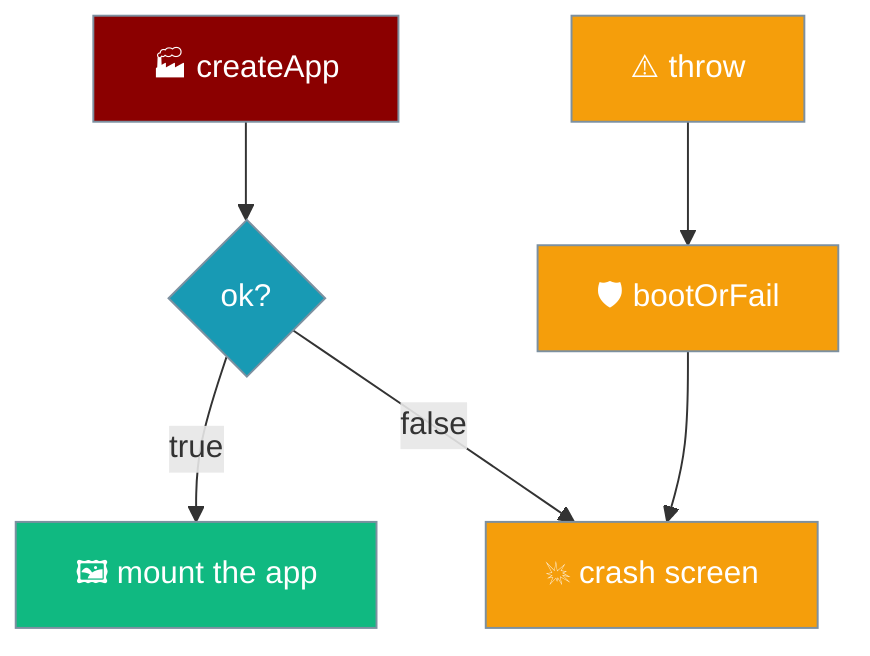
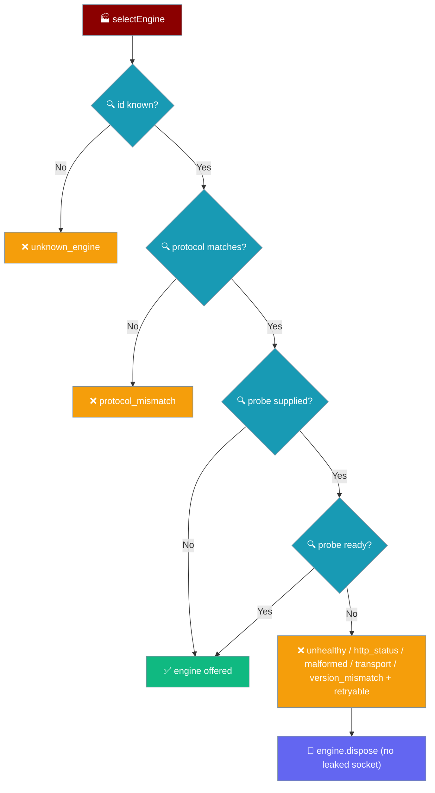

`createApp` returns a typed `BootResult`. A failure is a named `{ ok: false, reason, detail }`, and `mount()` renders it on the crash screen instead of leaving a blank or dead app. Every anticipated failure has a reason; a *thrown* failure is caught and given one too. A failure from a boot-time health probe also carries a `retryable` flag, so a caller can poll a still-starting engine instead of giving up.

```ts
import { createApp, type BootResult } from "praisonai-mobile/app/boot";

const booted: BootResult = await createApp(deps);
if (!booted.ok) {
  renderFatal(root, strings.bootFailed(booted.detail)); // reason + real detail
}
```

The failure branch carries an optional `retryable`, set only when a health probe refused an engine that might answer on a retry.

```ts
export type BootResult =
  | { readonly ok: true; readonly app: App }
  | {
      readonly ok: false;
      readonly reason: string;
      readonly detail: string;
      /** Set only when the failure came from a health probe that might
       *  succeed on a retry -- a still-starting engine, a transient
       *  transport error. A permanent refusal leaves it unset. */
      readonly retryable?: boolean;
    };
```



## Quick Start

<Steps>
<Step title="Handle a failed boot">
`mount()` checks `booted.ok` and renders the crash screen with the detail. There is nothing to configure — a named failure always reaches the screen.

```ts
if (!booted.ok) {
  renderFatal(root, strings.bootFailed(booted.detail));
  return null;
}
```
</Step>

<Step title="Handle a retryable boot failure">
A health-probe failure with `retryable: true` — a still-starting engine or a transient transport error — is worth polling with backoff before giving up. A permanent refusal (a version mismatch) leaves `retryable` unset.

```ts
if (!booted.ok && booted.retryable === true) {
  // A still-starting engine or a transient transport error.
  // Poll with backoff before giving up; a permanent refusal leaves retryable unset.
  await schedulePoll(() => createApp(deps));
}
```
</Step>

<Step title="Turn a throw into a reason">
`bootOrFail` wraps `createApp` so an unanticipated throw — a `StoragePort` failure at `settingsStore.load()` — becomes the same typed shape rather than an uncaught rejection.

```ts
try {
  return await createApp(options);
} catch (error) {
  return { ok: false, reason: "storage_unavailable", detail: String(error) };
}
```
</Step>
</Steps>

---

## What the crash screen guarantees

The fatal screen carries three properties, each pinned by a test.

- **It announces.** The fatal element is `role="alert"`, not `role="status"`, so a screen reader speaks it the moment it mounts.
- **It names the real failure.** The message is `booted.detail`, the actual failure detail — never a generic "something went wrong".
- **It replaces the chrome.** `root.textContent = ""` runs first, so the dead app UI is gone; the fatal element is not appended under the corpse of the send button.

---

## Every `BootResult.reason`

| `reason` | Source | When it fires | `retryable` |
|----------|--------|---------------|-------------|
| `unknown_engine` | `selectEngine` — no engine with that id, or an engine reporting a different id than it registered under | A settings `engineId` naming an engine that is not built | unset |
| `protocol_mismatch` | `selectEngine` — the engine speaks a different `PROTOCOL_VERSION` than this build | An engine adapter upgraded out of step with the app | unset |
| `storage_unavailable` | `bootOrFail` — a throw from `createApp`, caught and named | `SecurityError` (site data blocked) or `QuotaExceededError` at `settingsStore.load()` | unset |
| `unhealthy` | `selectEngine` — probe classified a `200 {"ok": false}` response | Remote engine is up but reporting itself not ready (still binding, dependency down) | **`true`** |
| `http_status` | `selectEngine` — probe got a non-200 (including 404, 5xx, and any sub-200) | Wrong `baseUrl`, endpoint not routed, proxy misconfigured | **`true`** |
| `malformed` | `selectEngine` — probe reached something whose body is not our engine's shape | A captive portal, a proxy error page, a different service on the port | **`true`** |
| `transport` | `selectEngine` — probe request or body read threw, aborted, or timed out after `PROBE_TIMEOUT_MS` (5s) | Engine unreachable, still binding its socket, or a hanging endpoint / black-hole proxy | **`true`** |
| `version_mismatch` | `selectEngine` — probe response reported a `version` this build cannot speak | Server upgraded incompatibly | unset |

<Note>
`unknown_engine` and `protocol_mismatch` are the two failures `selectEngine` *anticipates* without any I/O. The five probe reasons (`unhealthy`, `http_status`, `malformed`, `transport`, `version_mismatch`) come from the health probe running at selection. `storage_unavailable` is different in kind: it is a **throw** the boot never expected, turned into the same shape by `bootOrFail` so it renders the same way.
</Note>

---

## Boot-time health probe

When an `EngineChoice` supplies a `probe`, `selectEngine` runs it *after* the cheap protocol check and refuses the engine here — with a named reason — rather than letting the failure surface as a mid-turn transport error on the user's first message.

The probe reasons split on whether a retry can help. `unhealthy`, `http_status`, `malformed`, and `transport` all carry `retryable: true`: a still-starting engine, a transient socket error, or a proxy still routing is worth polling. Only `version_mismatch` is permanent — a build that cannot speak the server's protocol will not fix itself on a retry, so it leaves `retryable` unset.



<Note>
A refused probe **disposes** the engine before returning, exactly as a protocol mismatch does. The probe opened a socket to ask the question; leaving that engine holding it is a leak that only shows up as a second failure.
</Note>

---

## How a throw becomes a typed failure

`createApp` calls `settingsStore.load()` without a guard, so a `StoragePort` failure propagates as an exception. The chrome is already appended by the time boot runs, so an unhandled rejection would skip both the crash screen and the listener registrations — leaving a fully rendered app in which nothing happened. `bootOrFail` closes that gap.

```mermaid
sequenceDiagram
    participant Mount as mount
    participant BootOrFail as bootOrFail
    participant Create as createApp
    Mount->>BootOrFail: bootOrFail(options)
    BootOrFail->>Create: createApp(options)
    Create--xBootOrFail: throw (StoragePort failed)
    BootOrFail-->>Mount: { ok: false, reason: "storage_unavailable", detail }
    Mount->>Mount: renderFatal(detail)
```

<Warning>
The crash handler is installed in `mount()` **before** `detectPlatform()`, because `detectPlatform` reads `window.localStorage` and can itself throw `SecurityError`. See [Architecture → Boot Order](/features/mobile/architecture#boot-order) for the full ordering.
</Warning>

---

## Related

<CardGroup cols={2}>
<Card title="Architecture" icon="sitemap" href="/features/mobile/architecture">
  Boot order and where the crash handler is installed.
</Card>
<Card title="Storage & Secrets" icon="database" href="/features/mobile/storage-and-secrets">
  When the `StoragePort` is unavailable at boot.
</Card>
<Card title="Errors & Recovery" icon="triangle-exclamation" href="/features/mobile/errors-and-recovery">
  Failures that happen inside a turn, not at boot.
</Card>
<Card title="Engines" icon="plug" href="/features/mobile/engines">
  Where `unknown_engine` and `protocol_mismatch` come from.
</Card>
<Card title="Readiness body rules" icon="heart-pulse" href="/features/mobile/engines#readiness-body-rules">
  How the probe classifies a `/health` response into the reasons above.
</Card>
</CardGroup>
